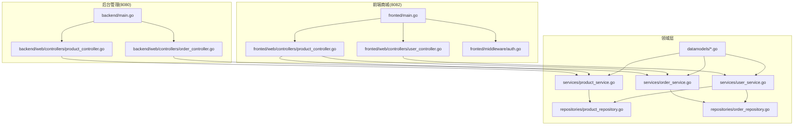
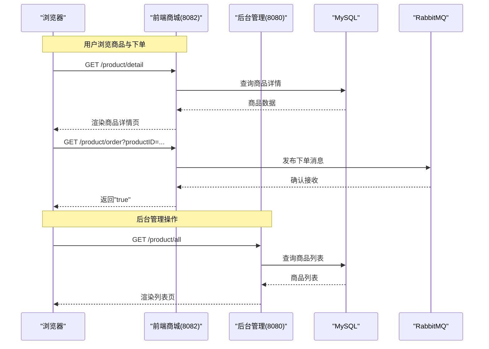
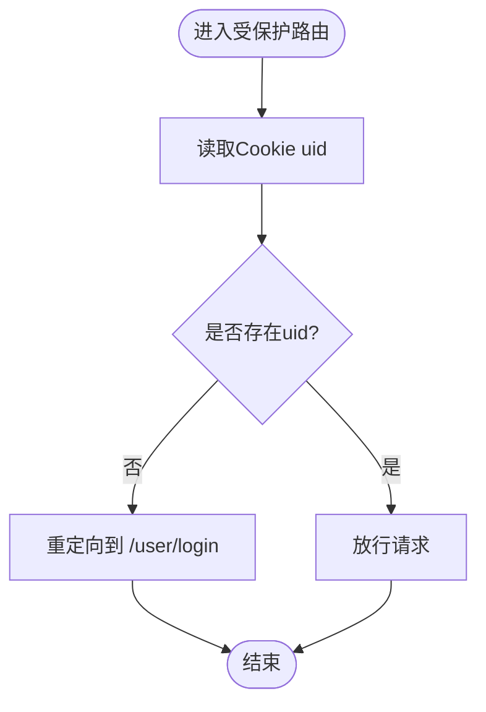
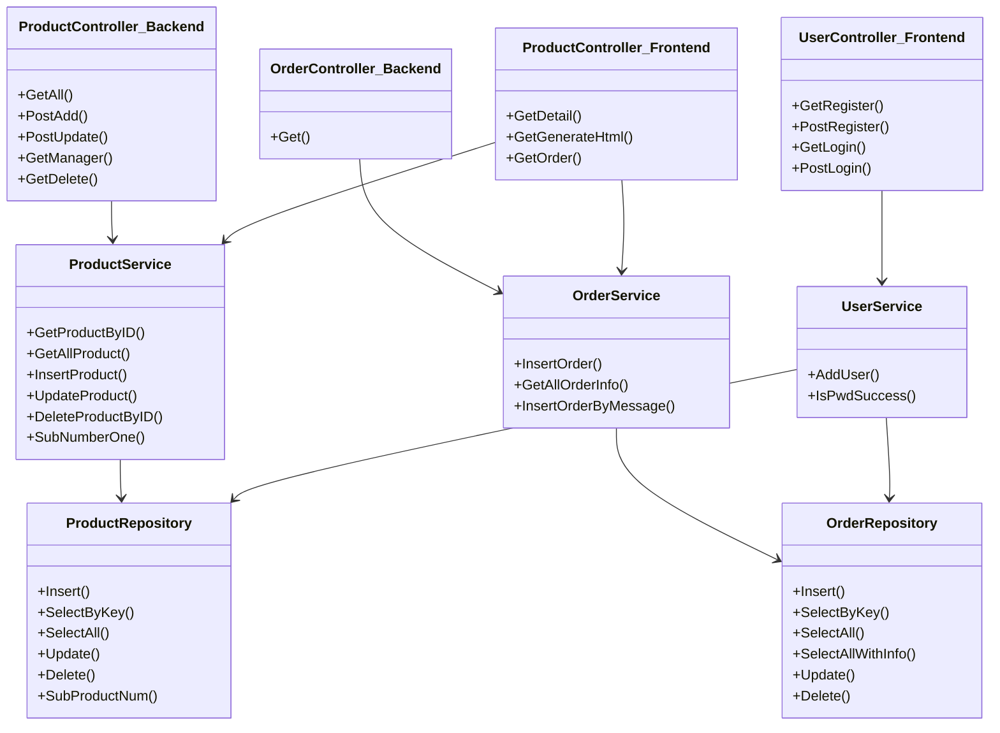

# API接口文档

<cite>
**本文引用的文件**   
- [backend/main.go](file://backend/main.go)
- [fronted/main.go](file://fronted/main.go)
- [backend/web/controllers/product_controller.go](file://backend/web/controllers/product_controller.go)
- [backend/web/controllers/order_controller.go](file://backend/web/controllers/order_controller.go)
- [fronted/web/controllers/user_controller.go](file://fronted/web/controllers/user_controller.go)
- [fronted/web/controllers/product_controller.go](file://fronted/web/controllers/product_controller.go)
- [fronted/middleware/auth.go](file://fronted/middleware/auth.go)
- [datamodels/product.go](file://datamodels/product.go)
- [datamodels/order.go](file://datamodels/order.go)
- [datamodels/user.go](file://datamodels/user.go)
- [services/product_service.go](file://services/product_service.go)
- [services/order_service.go](file://services/order_service.go)
- [services/user_service.go](file://services/user_service.go)
- [repositories/product_repository.go](file://repositories/product_repository.go)
- [repositories/order_repository.go](file://repositories/order_repository.go)
</cite>

## 目录
1. [简介](#简介)
2. [项目结构](#项目结构)
3. [核心组件](#核心组件)
4. [架构总览](#架构总览)
5. [详细组件分析](#详细组件分析)
6. [依赖关系分析](#依赖关系分析)
7. [性能与扩展性](#性能与扩展性)
8. [故障排查指南](#故障排查指南)
9. [结论](#结论)
10. [附录](#附录)

## 简介
本文件为电商系统的API接口参考文档，覆盖商品、订单、用户相关的前后端端点。系统采用前后端分离的双服务架构：
- 后台管理端（端口8080）：提供商品与订单的Web页面与表单操作能力，基于MVC控制器渲染视图。
- 前端商城端（端口8082）：提供用户注册/登录、商品展示、静态页生成以及异步下单（RabbitMQ）。

说明：
- 当前实现以“服务端渲染+表单提交”为主，部分端点返回纯文本或JSON片段；未使用统一的RESTful JSON API规范。
- 认证通过Cookie完成，前端对受保护路由使用中间件校验登录态。
- 下单流程通过消息队列异步处理，提升高并发场景下的吞吐能力。

## 项目结构
- 后端服务（后台管理）
  - 入口：backend/main.go
  - 控制器：backend/web/controllers/*
  - 数据模型：datamodels/*
  - 服务层：services/*
  - 仓储层：repositories/*
- 前端服务（商城）
  - 入口：fronted/main.go
  - 控制器：fronted/web/controllers/*
  - 中间件：fronted/middleware/*
  - 消息队列：rabbitmq/rabbitmq.go（引用）

图表来源
- [backend/main.go:14-59](file://backend/main.go#L14-L59)
- [fronted/main.go:16-66](file://fronted/main.go#L16-L66)
- [backend/web/controllers/product_controller.go:12-94](file://backend/web/controllers/product_controller.go#L12-L94)
- [backend/web/controllers/order_controller.go:9-27](file://backend/web/controllers/order_controller.go#L9-L27)
- [fronted/web/controllers/user_controller.go:17-87](file://fronted/web/controllers/user_controller.go#L17-L87)
- [fronted/web/controllers/product_controller.go:17-162](file://fronted/web/controllers/product_controller.go#L17-L162)
- [fronted/middleware/auth.go:5-15](file://fronted/middleware/auth.go#L5-L15)
- [services/product_service.go:8-48](file://services/product_service.go#L8-L48)
- [services/order_service.go:8-64](file://services/order_service.go#L8-L64)
- [services/user_service.go:10-58](file://services/user_service.go#L10-L58)
- [repositories/product_repository.go:12-165](file://repositories/product_repository.go#L12-L165)
- [repositories/order_repository.go:10-146](file://repositories/order_repository.go#L10-L146)

章节来源
- [backend/main.go:14-59](file://backend/main.go#L14-L59)
- [fronted/main.go:16-66](file://fronted/main.go#L16-L66)

## 核心组件
- 控制器层
  - 后台商品控制器：负责商品列表、新增、编辑、删除等页面渲染与表单处理。
  - 后台订单控制器：负责订单列表页面渲染。
  - 前端用户控制器：负责用户注册、登录，设置Cookie。
  - 前端商品控制器：负责商品详情、静态页生成、下单（发布消息到RabbitMQ）。
- 服务层
  - 商品服务：封装CRUD与库存扣减逻辑。
  - 订单服务：封装订单CRUD及从消息创建订单。
  - 用户服务：密码加密/校验、用户注册。
- 仓储层
  - 商品仓储：MySQL CRUD与库存扣减SQL。
  - 订单仓储：MySQL CRUD与关联查询。
- 数据模型
  - Product、Order、User 结构体定义字段与标签。

章节来源
- [backend/web/controllers/product_controller.go:12-94](file://backend/web/controllers/product_controller.go#L12-L94)
- [backend/web/controllers/order_controller.go:9-27](file://backend/web/controllers/order_controller.go#L9-L27)
- [fronted/web/controllers/user_controller.go:17-87](file://fronted/web/controllers/user_controller.go#L17-L87)
- [fronted/web/controllers/product_controller.go:17-162](file://fronted/web/controllers/product_controller.go#L17-L162)
- [services/product_service.go:8-48](file://services/product_service.go#L8-L48)
- [services/order_service.go:8-64](file://services/order_service.go#L8-L64)
- [services/user_service.go:10-58](file://services/user_service.go#L10-L58)
- [repositories/product_repository.go:12-165](file://repositories/product_repository.go#L12-L165)
- [repositories/order_repository.go:10-146](file://repositories/order_repository.go#L10-L146)
- [datamodels/product.go:3-9](file://datamodels/product.go#L3-L9)
- [datamodels/order.go:3-14](file://datamodels/order.go#L3-L14)
- [datamodels/user.go:3-8](file://datamodels/user.go#L3-L8)

## 架构总览
系统由两个独立进程组成，分别监听不同端口，共享同一数据库。前端商城在访问受保护资源前会校验Cookie中的用户标识，并通过RabbitMQ异步下单。

图表来源
- [fronted/web/controllers/product_controller.go:80-120](file://fronted/web/controllers/product_controller.go#L80-L120)
- [backend/web/controllers/product_controller.go:17-25](file://backend/web/controllers/product_controller.go#L17-L25)
- [repositories/product_repository.go:128-151](file://repositories/product_repository.go#L128-L151)

## 详细组件分析

### 认证与权限控制
- 机制
  - 登录成功后，服务端将用户ID写入Cookie（uid），并附加一个加密签名（sign）。
  - 前端对受保护路由使用中间件检查Cookie中的uid，未登录则重定向至登录页。
- 关键路径
  - 登录：POST /user/login（表单提交）
  - 注册：POST /user/register（表单提交）
  - 受保护路由：/product/*（前端）需携带有效Cookie

图表来源
- [fronted/middleware/auth.go:5-15](file://fronted/middleware/auth.go#L5-L15)
- [fronted/web/controllers/user_controller.go:59-87](file://fronted/web/controllers/user_controller.go#L59-L87)

章节来源
- [fronted/middleware/auth.go:5-15](file://fronted/middleware/auth.go#L5-L15)
- [fronted/web/controllers/user_controller.go:29-87](file://fronted/web/controllers/user_controller.go#L29-L87)

### 用户模块API
- 注册
  - 方法：POST
  - URL：/user/register
  - 内容类型：application/x-www-form-urlencoded
  - 请求参数
    - nickName：昵称
    - userName：用户名
    - password：密码（明文，服务端进行bcrypt哈希存储）
  - 响应
    - 成功：重定向至 /user/login
    - 失败：重定向至 /user/error
- 登录
  - 方法：POST
  - URL：/user/login
  - 内容类型：application/x-www-form-urlencoded
  - 请求参数
    - userName：用户名
    - password：密码
  - 响应
    - 成功：设置Cookie（uid、sign），重定向至 /product/
    - 失败：重定向回 /user/login

示例（表单提交）
- 注册
  - 请求：POST /user/register
  - 表单字段：nickName=张三&userName=zhangsan&password=123456
  - 响应：302 Location=/user/login
- 登录
  - 请求：POST /user/login
  - 表单字段：userName=zhangsan&password=123456
  - 响应：302 Location=/product/，Set-Cookie: uid=..., sign=...

章节来源
- [fronted/web/controllers/user_controller.go:29-51](file://fronted/web/controllers/user_controller.go#L29-L51)
- [fronted/web/controllers/user_controller.go:59-87](file://fronted/web/controllers/user_controller.go#L59-L87)
- [services/user_service.go:23-45](file://services/user_service.go#L23-L45)

### 商品模块API（前端商城）
- 商品详情
  - 方法：GET
  - URL：/product/detail
  - 响应：渲染商品详情页面（包含商品基本信息）
- 生成静态HTML
  - 方法：GET
  - URL：/product/generateHtml?productID={id}
  - 行为：根据模板与商品数据生成静态HTML文件
- 下单（异步）
  - 方法：GET
  - URL：/product/order?productID={id}
  - 前置条件：已登录（Cookie中uid存在）
  - 行为：构造消息并发布到RabbitMQ，返回纯文本"true"

示例
- 获取详情
  - 请求：GET /product/detail
  - 响应：HTML页面
- 生成静态页
  - 请求：GET /product/generateHtml?productID=1
  - 响应：无直接响应体（生成文件）
- 下单
  - 请求：GET /product/order?productID=1
  - 响应：200 文本 "true"

章节来源
- [fronted/web/controllers/product_controller.go:32-54](file://fronted/web/controllers/product_controller.go#L32-L54)
- [fronted/web/controllers/product_controller.go:80-93](file://fronted/web/controllers/product_controller.go#L80-L93)
- [fronted/web/controllers/product_controller.go:95-120](file://fronted/web/controllers/product_controller.go#L95-L120)

### 商品模块API（后台管理）
- 商品列表
  - 方法：GET
  - URL：/product/all
  - 响应：渲染商品列表页面
- 新增商品
  - 方法：POST
  - URL：/product/add
  - 内容类型：application/x-www-form-urlencoded
  - 请求参数
    - ProductName：商品名称
    - ProductNum：库存数量
    - ProductImage：图片URL
    - ProductUrl：链接地址
  - 响应：重定向至 /product/all
- 编辑商品
  - 方法：POST
  - URL：/product/update
  - 内容类型：application/x-www-form-urlencoded
  - 请求参数
    - ID：商品ID
    - ProductName：商品名称
    - ProductNum：库存数量
    - ProductImage：图片URL
    - ProductUrl：链接地址
  - 响应：重定向至 /product/all
- 查看管理页（按ID）
  - 方法：GET
  - URL：/product/manager/{id}
  - 响应：渲染管理页面（含商品信息）
- 删除商品
  - 方法：GET
  - URL：/product/delete/{id}
  - 响应：重定向至 /product/all

示例
- 新增商品
  - 请求：POST /product/add
  - 表单字段：ProductName=手机&ProductNum=100&ProductImage=http://img&ProductUrl=http://url
  - 响应：302 Location=/product/all
- 删除商品
  - 请求：GET /product/delete/1
  - 响应：302 Location=/product/all

章节来源
- [backend/web/controllers/product_controller.go:17-25](file://backend/web/controllers/product_controller.go#L17-L25)
- [backend/web/controllers/product_controller.go:28-40](file://backend/web/controllers/product_controller.go#L28-L40)
- [backend/web/controllers/product_controller.go:42-60](file://backend/web/controllers/product_controller.go#L42-L60)
- [backend/web/controllers/product_controller.go:62-79](file://backend/web/controllers/product_controller.go#L62-L79)
- [backend/web/controllers/product_controller.go:81-94](file://backend/web/controllers/product_controller.go#L81-L94)

### 订单模块API（后台管理）
- 订单列表
  - 方法：GET
  - URL：/order
  - 响应：渲染订单列表页面（包含订单与商品名称等信息）

示例
- 请求：GET /order
- 响应：HTML页面

章节来源
- [backend/web/controllers/order_controller.go:14-27](file://backend/web/controllers/order_controller.go#L14-L27)

### 数据模型
- 商品（Product）
  - 字段：id、ProductName、ProductNum、ProductImage、ProductUrl
- 订单（Order）
  - 字段：ID、UserId、ProductId、OrderStatus
  - 状态常量：等待、成功、失败
- 用户（User）
  - 字段：id、nickName、userName、HashPassword（不对外暴露）

章节来源
- [datamodels/product.go:3-9](file://datamodels/product.go#L3-L9)
- [datamodels/order.go:3-14](file://datamodels/order.go#L3-L14)
- [datamodels/user.go:3-8](file://datamodels/user.go#L3-L8)

## 依赖关系分析
- 控制器依赖服务层，服务层依赖仓储层，仓储层访问MySQL。
- 前端商品控制器依赖RabbitMQ客户端进行异步下单。
- 认证中间件依赖Cookie校验登录态。

图表来源
- [backend/web/controllers/product_controller.go:12-94](file://backend/web/controllers/product_controller.go#L12-L94)
- [backend/web/controllers/order_controller.go:9-27](file://backend/web/controllers/order_controller.go#L9-L27)
- [fronted/web/controllers/user_controller.go:17-87](file://fronted/web/controllers/user_controller.go#L17-L87)
- [fronted/web/controllers/product_controller.go:17-162](file://fronted/web/controllers/product_controller.go#L17-L162)
- [services/product_service.go:8-48](file://services/product_service.go#L8-L48)
- [services/order_service.go:8-64](file://services/order_service.go#L8-L64)
- [services/user_service.go:10-58](file://services/user_service.go#L10-L58)
- [repositories/product_repository.go:12-165](file://repositories/product_repository.go#L12-L165)
- [repositories/order_repository.go:10-146](file://repositories/order_repository.go#L10-L146)

章节来源
- [services/product_service.go:8-48](file://services/product_service.go#L8-L48)
- [services/order_service.go:8-64](file://services/order_service.go#L8-L64)
- [services/user_service.go:10-58](file://services/user_service.go#L10-L58)
- [repositories/product_repository.go:12-165](file://repositories/product_repository.go#L12-L165)
- [repositories/order_repository.go:10-146](file://repositories/order_repository.go#L10-L146)

## 性能与扩展性
- 异步下单
  - 通过RabbitMQ解耦下单流程，提高吞吐与容错能力。
- 静态化
  - 支持将商品详情静态化，减轻动态渲染压力。
- 建议
  - 引入连接池与读写分离以提升数据库性能。
  - 增加限流与熔断策略，防止热点接口被滥用。
  - 对敏感接口增加鉴权与审计日志。

[本节为通用指导，不直接分析具体文件]

## 故障排查指南
- 常见问题
  - 未登录访问受保护路由：检查Cookie是否包含uid，确认登录流程是否成功。
  - 下单失败：检查RabbitMQ连接与消息发送是否成功，查看应用日志。
  - 商品/订单数据异常：检查仓储层SQL执行与返回值映射。
- 调试建议
  - 开启Iris调试日志级别，观察请求链路。
  - 使用浏览器开发者工具检查Cookie与网络请求。
  - 检查数据库连接是否正常建立。

章节来源
- [fronted/middleware/auth.go:5-15](file://fronted/middleware/auth.go#L5-L15)
- [fronted/web/controllers/product_controller.go:95-120](file://fronted/web/controllers/product_controller.go#L95-L120)
- [repositories/product_repository.go:47-104](file://repositories/product_repository.go#L47-L104)
- [repositories/order_repository.go:43-90](file://repositories/order_repository.go#L43-L90)

## 结论
本项目实现了基础的电商功能，包括用户认证、商品管理与订单处理，并通过RabbitMQ实现异步下单。当前API以服务端渲染与表单交互为主，尚未统一为RESTful JSON风格。建议在后续迭代中：
- 统一API风格（JSON）、增加版本管理。
- 完善错误码与错误响应格式。
- 增强安全特性（限流、鉴权、审计）。
- 补充自动化测试与接口文档（OpenAPI/Swagger）。

[本节为总结性内容，不直接分析具体文件]

## 附录

### API清单与示例
- 用户
  - POST /user/register
    - 表单字段：nickName、userName、password
    - 成功：302 -> /user/login
    - 失败：302 -> /user/error
  - POST /user/login
    - 表单字段：userName、password
    - 成功：302 -> /product/，Set-Cookie: uid、sign
    - 失败：302 -> /user/login
- 商品（前端）
  - GET /product/detail
    - 响应：HTML
  - GET /product/generateHtml?productID={id}
    - 响应：无（生成静态文件）
  - GET /product/order?productID={id}
    - 前置：已登录
    - 响应：200 文本 "true"
- 商品（后台）
  - GET /product/all
    - 响应：HTML
  - POST /product/add
    - 表单字段：ProductName、ProductNum、ProductImage、ProductUrl
    - 响应：302 -> /product/all
  - POST /product/update
    - 表单字段：ID、ProductName、ProductNum、ProductImage、ProductUrl
    - 响应：302 -> /product/all
  - GET /product/manager/{id}
    - 响应：HTML
  - GET /product/delete/{id}
    - 响应：302 -> /product/all
- 订单（后台）
  - GET /order
    - 响应：HTML

### 安全与合规
- 认证
  - Cookie-based认证，登录成功后设置uid与加密签名。
- 权限
  - 前端受保护路由通过中间件校验登录态。
- 限流
  - 当前未实现；建议在高并发场景下引入令牌桶或滑动窗口限流。
- 向后兼容
  - 当前无版本化策略；建议未来引入URL版本前缀（如/api/v1）或Header版本控制。

[本节为通用指导，不直接分析具体文件]