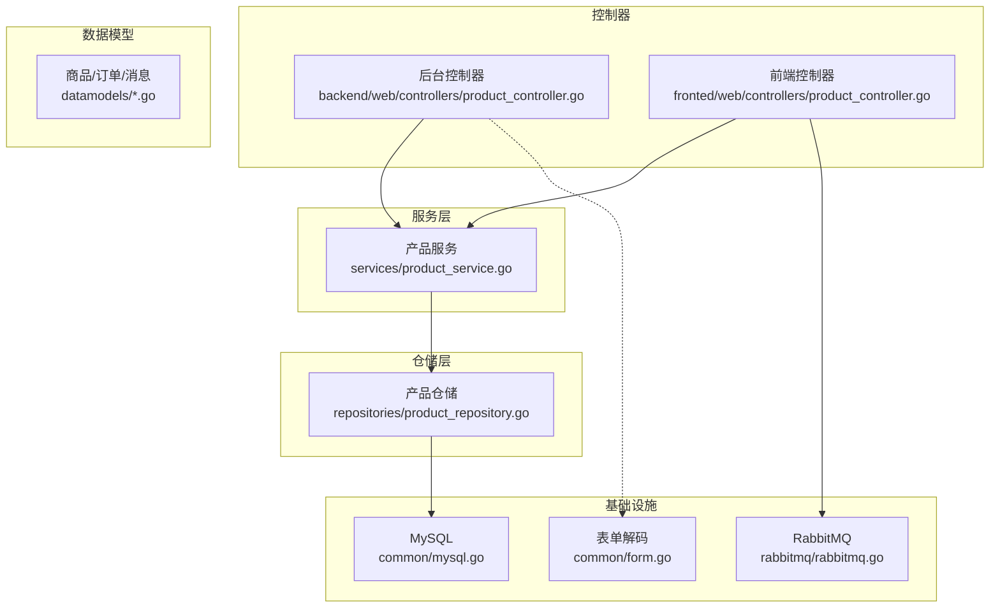
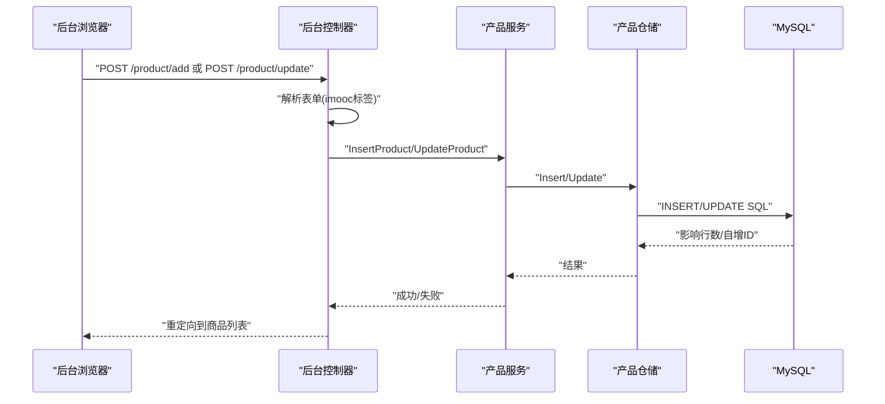
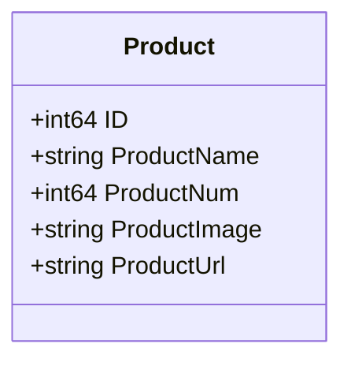
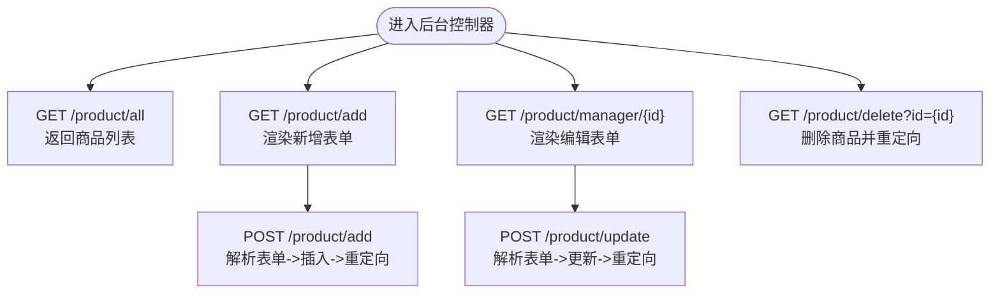
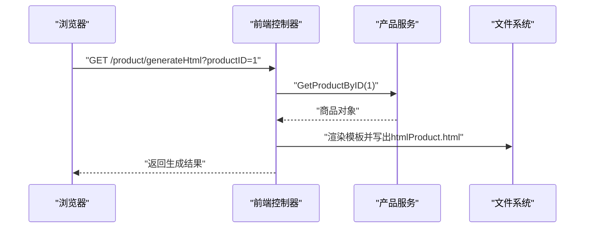
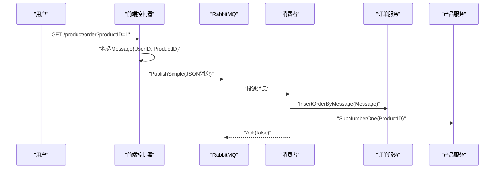
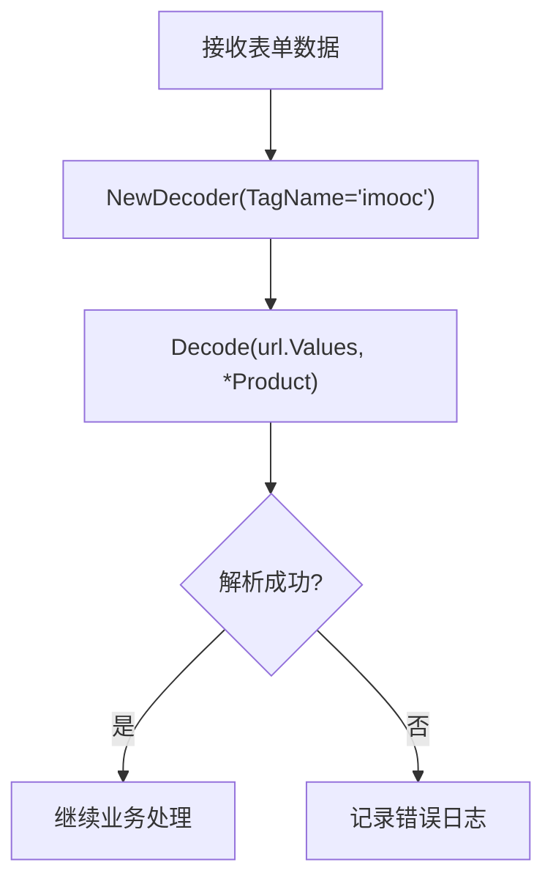
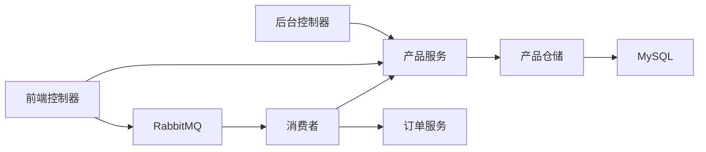

# 商品相关API

<cite>
**本文引用的文件**   
- [product.go](file://datamodels/product.go)
- [product_service.go](file://services/product_service.go)
- [product_repository.go](file://repositories/product_repository.go)
- [backend product_controller.go](file://backend/web/controllers/product_controller.go)
- [fronted product_controller.go](file://fronted/web/controllers/product_controller.go)
- [form.go](file://common/form.go)
- [mysql.go](file://common/mysql.go)
- [message.go](file://datamodels/message.go)
- [order.go](file://datamodels/order.go)
- [rabbitmq.go](file://rabbitmq/rabbitmq.go)
</cite>

## 目录
1. [简介](#简介)
2. [项目结构](#项目结构)
3. [核心组件](#核心组件)
4. [架构总览](#架构总览)
5. [详细组件分析](#详细组件分析)
6. [依赖关系分析](#依赖关系分析)
7. [性能与并发特性](#性能与并发特性)
8. [故障排查指南](#故障排查指南)
9. [结论](#结论)
10. [附录：接口清单与示例](#附录接口清单与示例)

## 简介
本文件面向“商品”模块，系统化梳理后端提供的商品增删改查、分类管理（当前未实现）、图片上传（当前未实现）等能力；同时说明商品数据模型、字段含义与校验规则，以及库存扣减与状态流转逻辑。文档还包含关键流程的时序图与流程图，便于快速理解调用链路与数据流向。

## 项目结构
围绕商品能力的代码主要分布在以下层次：
- 数据模型层：定义商品、订单、消息等数据结构
- 服务层：封装业务逻辑（CRUD、库存扣减）
- 仓储层：对接数据库（MySQL），提供持久化操作
- 控制器层：
  - 后台管理端控制器：负责表单解析、渲染页面、跳转
  - 前端展示控制器：负责静态页生成、下单入口（通过消息队列异步处理）
- 公共工具：表单解码、MySQL连接与结果集转换
- 消息队列：RabbitMQ 生产者/消费者，用于削峰与异步下单

图表来源
- [backend product_controller.go:17-94](file://backend/web/controllers/product_controller.go#L17-L94)
- [fronted product_controller.go:32-120](file://fronted/web/controllers/product_controller.go#L32-L120)
- [product_service.go:8-48](file://services/product_service.go#L8-L48)
- [product_repository.go:12-165](file://repositories/product_repository.go#L12-L165)
- [mysql.go:9-66](file://common/mysql.go#L9-L66)
- [rabbitmq.go:68-181](file://rabbitmq/rabbitmq.go#L68-L181)
- [form.go:124-160](file://common/form.go#L124-L160)

章节来源
- [backend product_controller.go:17-94](file://backend/web/controllers/product_controller.go#L17-L94)
- [fronted product_controller.go:32-120](file://fronted/web/controllers/product_controller.go#L32-L120)
- [product_service.go:8-48](file://services/product_service.go#L8-L48)
- [product_repository.go:12-165](file://repositories/product_repository.go#L12-L165)
- [mysql.go:9-66](file://common/mysql.go#L9-L66)
- [rabbitmq.go:68-181](file://rabbitmq/rabbitmq.go#L68-L181)
- [form.go:124-160](file://common/form.go#L124-L160)

## 核心组件
- 商品数据模型：包含ID、名称、数量、图片URL、链接等字段
- 产品服务：对外暴露商品查询、新增、更新、删除、库存扣减等能力
- 产品仓储：基于SQL语句完成商品数据的持久化操作
- 后台控制器：处理商品列表、新增、编辑、删除等管理端请求
- 前端控制器：提供商品详情展示、静态页生成、下单入口（消息队列）
- RabbitMQ：异步消费下单消息，执行创建订单与扣减库存

章节来源
- [product.go:3-9](file://datamodels/product.go#L3-L9)
- [product_service.go:8-48](file://services/product_service.go#L8-L48)
- [product_repository.go:12-165](file://repositories/product_repository.go#L12-L165)
- [backend product_controller.go:17-94](file://backend/web/controllers/product_controller.go#L17-L94)
- [fronted product_controller.go:32-120](file://fronted/web/controllers/product_controller.go#L32-L120)
- [rabbitmq.go:104-181](file://rabbitmq/rabbitmq.go#L104-L181)

## 架构总览
商品管理的整体调用链路如下：
- 后台管理端：浏览器提交表单 -> 后台控制器解析表单 -> 调用产品服务 -> 仓储层写入数据库
- 前端展示端：用户访问商品详情或下单 -> 前端控制器获取商品详情或发送下单消息 -> RabbitMQ 消费者异步处理下单与扣库存

图表来源
- [backend product_controller.go:48-60](file://backend/web/controllers/product_controller.go#L48-L60)
- [backend product_controller.go:28-40](file://backend/web/controllers/product_controller.go#L28-L40)
- [product_service.go:38-44](file://services/product_service.go#L38-L44)
- [product_repository.go:48-104](file://repositories/product_repository.go#L48-L104)
- [mysql.go:9-66](file://common/mysql.go#L9-L66)

## 详细组件分析

### 商品数据模型与字段语义
- 商品表字段映射
  - ID：主键，自增
  - ProductName：商品名称
  - ProductNum：库存数量
  - ProductImage：商品图片URL
  - ProductUrl：商品详情页链接
- 字段类型与JSON序列化标签由数据模型定义
- 仓储层使用sql标签进行列名映射

图表来源
- [product.go:3-9](file://datamodels/product.go#L3-L9)

章节来源
- [product.go:3-9](file://datamodels/product.go#L3-L9)
- [product_repository.go:48-104](file://repositories/product_repository.go#L48-L104)

### 商品CRUD接口（后台管理端）
- 列出所有商品
  - 方法：GET
  - 路径：/product/all
  - 行为：返回商品列表视图
- 新增商品
  - 方法：POST
  - 路径：/product/add
  - 行为：解析表单，插入商品，重定向至列表
- 编辑商品
  - 方法：GET
  - 路径：/product/manager/{id}
  - 行为：根据ID查询商品并渲染编辑页
- 更新商品
  - 方法：POST
  - 路径：/product/update
  - 行为：解析表单，更新商品，重定向至列表
- 删除商品
  - 方法：GET
  - 路径：/product/delete?id={id}
  - 行为：根据ID删除商品，重定向至列表

图表来源
- [backend product_controller.go:17-94](file://backend/web/controllers/product_controller.go#L17-L94)

章节来源
- [backend product_controller.go:17-94](file://backend/web/controllers/product_controller.go#L17-L94)

### 商品详情与静态页生成（前端展示端）
- 商品详情
  - 方法：GET
  - 路径：/product/detail
  - 行为：根据固定ID查询商品并渲染详情视图
- 生成静态HTML
  - 方法：GET
  - 路径：/product/generateHtml?productID={id}
  - 行为：读取模板、渲染商品数据、输出静态HTML文件

图表来源
- [fronted product_controller.go:32-54](file://fronted/web/controllers/product_controller.go#L32-L54)
- [fronted product_controller.go:57-72](file://fronted/web/controllers/product_controller.go#L57-L72)

章节来源
- [fronted product_controller.go:32-72](file://fronted/web/controllers/product_controller.go#L32-L72)

### 下单与库存扣减（消息队列异步处理）
- 下单入口
  - 方法：GET
  - 路径：/product/order?productID={id}
  - 行为：从Cookie中获取用户ID，构造消息体，发布到RabbitMQ
- 消费者处理
  - 行为：消费消息，创建订单，扣减库存，手动ACK确认

图表来源
- [fronted product_controller.go:95-120](file://fronted/web/controllers/product_controller.go#L95-L120)
- [rabbitmq.go:104-181](file://rabbitmq/rabbitmq.go#L104-L181)
- [message.go:4-12](file://datamodels/message.go#L4-L12)

章节来源
- [fronted product_controller.go:95-120](file://fronted/web/controllers/product_controller.go#L95-L120)
- [rabbitmq.go:104-181](file://rabbitmq/rabbitmq.go#L104-L181)
- [message.go:4-12](file://datamodels/message.go#L4-L12)

### 表单解析与验证
- 后台控制器使用自定义Decoder，以“imooc”作为结构体标签名，将表单值映射到结构体字段
- 支持基础类型（字符串、整数、浮点、布尔、时间、URL等）自动解析
- 错误信息统一包装为Error类型，便于日志记录

图表来源
- [backend product_controller.go:28-40](file://backend/web/controllers/product_controller.go#L28-L40)
- [backend product_controller.go:48-60](file://backend/web/controllers/product_controller.go#L48-L60)
- [form.go:124-160](file://common/form.go#L124-L160)

章节来源
- [backend product_controller.go:28-40](file://backend/web/controllers/product_controller.go#L28-L40)
- [backend product_controller.go:48-60](file://backend/web/controllers/product_controller.go#L48-L60)
- [form.go:124-160](file://common/form.go#L124-L160)

### 数据库连接与结果集转换
- MySQL连接：使用默认Dsn连接本地数据库
- 结果集转换：提供单行与多行的通用转换函数，配合sql标签将列名映射到结构体字段

章节来源
- [mysql.go:9-66](file://common/mysql.go#L9-L66)
- [product_repository.go:107-151](file://repositories/product_repository.go#L107-L151)

## 依赖关系分析
- 控制器依赖服务层接口，服务层依赖仓储层接口，仓储层直接操作数据库
- 前端控制器依赖消息队列，消费者依赖订单服务与产品服务
- 表单解码器在后台控制器中被复用

图表来源
- [backend product_controller.go:17-94](file://backend/web/controllers/product_controller.go#L17-L94)
- [fronted product_controller.go:32-120](file://fronted/web/controllers/product_controller.go#L32-L120)
- [product_service.go:8-48](file://services/product_service.go#L8-L48)
- [product_repository.go:12-165](file://repositories/product_repository.go#L12-L165)
- [rabbitmq.go:104-181](file://rabbitmq/rabbitmq.go#L104-L181)

章节来源
- [backend product_controller.go:17-94](file://backend/web/controllers/product_controller.go#L17-L94)
- [fronted product_controller.go:32-120](file://fronted/web/controllers/product_controller.go#L32-L120)
- [product_service.go:8-48](file://services/product_service.go#L8-L48)
- [product_repository.go:12-165](file://repositories/product_repository.go#L12-L165)
- [rabbitmq.go:104-181](file://rabbitmq/rabbitmq.go#L104-L181)

## 性能与并发特性
- 下单采用消息队列异步处理，降低同步阻塞，提升吞吐
- 消费者侧对channel进行QoS限流，避免背压
- 库存扣减在消费者中执行，结合订单创建保证一致性
- 注意：当前库存扣减为简单原子更新，未加分布式锁；在高并发场景建议引入分布式锁或乐观锁机制

章节来源
- [rabbitmq.go:104-181](file://rabbitmq/rabbitmq.go#L104-L181)
- [product_repository.go:154-165](file://repositories/product_repository.go#L154-L165)

## 故障排查指南
- 表单解析失败
  - 检查结构体字段是否使用正确的“imooc”标签
  - 查看控制台日志中的解码错误信息
- 数据库连接异常
  - 检查MySQL连接参数与网络连通性
  - 确认表结构与字段映射一致
- 消息队列问题
  - 检查RabbitMQ连接配置与队列声明
  - 确认消费者是否正确ACK
- 库存扣减异常
  - 检查消费者日志与订单创建结果
  - 关注并发竞争条件，必要时引入锁机制

章节来源
- [backend product_controller.go:28-40](file://backend/web/controllers/product_controller.go#L28-L40)
- [mysql.go:9-66](file://common/mysql.go#L9-L66)
- [rabbitmq.go:68-181](file://rabbitmq/rabbitmq.go#L68-L181)

## 结论
本项目实现了商品的基础CRUD、详情展示、静态页生成与基于消息队列的下单流程。当前尚未实现商品分类管理与图片上传功能，建议在后续迭代中补充分类实体与图片存储能力，并在库存扣减处引入更严格的并发控制策略。

## 附录：接口清单与示例

### 接口清单
- 列出所有商品
  - 方法：GET
  - 路径：/product/all
  - 响应：商品列表视图
- 新增商品
  - 方法：POST
  - 路径：/product/add
  - 请求体：表单（字段映射见数据模型）
  - 响应：重定向至商品列表
- 编辑商品
  - 方法：GET
  - 路径：/product/manager/{id}
  - 响应：编辑表单视图
- 更新商品
  - 方法：POST
  - 路径：/product/update
  - 请求体：表单（字段映射见数据模型）
  - 响应：重定向至商品列表
- 删除商品
  - 方法：GET
  - 路径：/product/delete?id={id}
  - 响应：重定向至商品列表
- 商品详情
  - 方法：GET
  - 路径：/product/detail
  - 响应：商品详情视图
- 生成静态HTML
  - 方法：GET
  - 路径：/product/generateHtml?productID={id}
  - 响应：生成静态HTML文件
- 下单入口
  - 方法：GET
  - 路径：/product/order?productID={id}
  - Cookie：uid（用户ID）
  - 响应：true（表示消息已入队）

章节来源
- [backend product_controller.go:17-94](file://backend/web/controllers/product_controller.go#L17-L94)
- [fronted product_controller.go:32-120](file://fronted/web/controllers/product_controller.go#L32-L120)

### 表单提交示例（后台管理端）
- 新增商品
  - 表单字段：ProductName、ProductNum、ProductImage、ProductUrl
  - 标签：结构体字段需使用“imooc”标签对应表单键名
  - 提交后：服务端解析表单并插入商品，随后重定向至列表
- 更新商品
  - 表单字段：同上，且必须包含ID
  - 提交后：服务端解析表单并更新商品，随后重定向至列表

章节来源
- [backend product_controller.go:28-40](file://backend/web/controllers/product_controller.go#L28-L40)
- [backend product_controller.go:48-60](file://backend/web/controllers/product_controller.go#L48-L60)
- [form.go:124-160](file://common/form.go#L124-L160)

### 图片上传说明
- 当前代码未实现图片上传接口与存储逻辑
- 建议在后续版本中增加：
  - 图片上传接口（支持multipart/form-data）
  - 图片存储（本地或对象存储）
  - 返回图片URL并写入商品ProductImage字段

[本节为概念性说明，不直接分析具体文件]

### 分类管理说明
- 当前代码未实现商品分类实体与管理接口
- 建议在后续版本中扩展：
  - 分类数据模型与仓储
  - 分类CRUD接口
  - 商品与分类的关联关系

[本节为概念性说明，不直接分析具体文件]

### 高级查询（搜索、筛选、排序）
- 当前代码未实现商品的高级查询接口
- 建议在仓储层扩展：
  - 按关键词模糊匹配
  - 按价格区间筛选
  - 按销量或更新时间排序
  - 分页参数支持

[本节为概念性说明，不直接分析具体文件]

### 状态管理与库存处理
- 商品状态
  - 当前模型未包含显式状态字段
  - 可通过ProductNum是否为0推断可售状态
- 库存处理
  - 消费者侧执行库存扣减：SubNumberOne
  - 建议引入分布式锁或乐观锁防止超卖

章节来源
- [rabbitmq.go:104-181](file://rabbitmq/rabbitmq.go#L104-L181)
- [product_repository.go:154-165](file://repositories/product_repository.go#L154-L165)