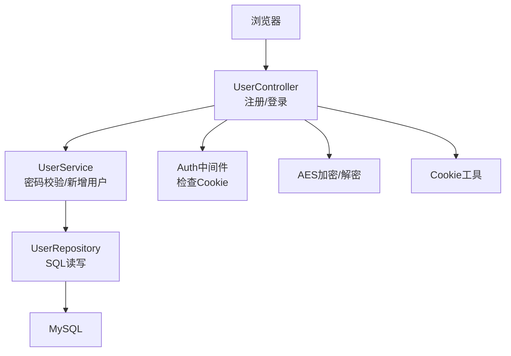
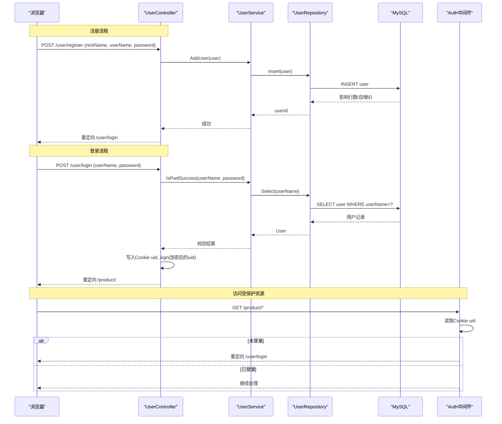
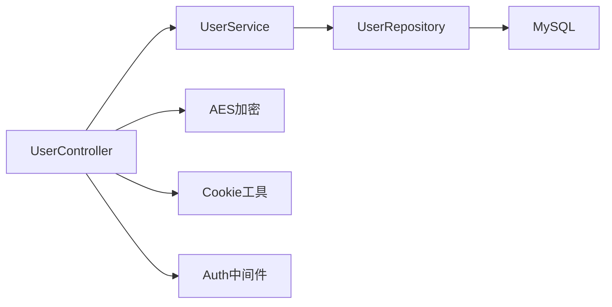

# 用户相关API

<cite>
**本文引用的文件**
- [user_controller.go](file://fronted/web/controllers/user_controller.go)
- [auth.go](file://fronted/middleware/auth.go)
- [user_service.go](file://services/user_service.go)
- [user_repository.go](file://repositories/user_repository.go)
- [user.go](file://datamodels/user.go)
- [cookie.go](file://tool/cookie.go)
- [aes.go](file://encrypt/aes.go)
- [mysql.go](file://common/mysql.go)
- [comm.go](file://common/comm.go)
- [register.html](file://fronted/web/views/user/register.html)
- [login.html](file://fronted/web/views/user/login.html)
</cite>

## 目录
1. [简介](#简介)
2. [项目结构](#项目结构)
3. [核心组件](#核心组件)
4. [架构总览](#架构总览)
5. [详细接口说明](#详细接口说明)
6. [依赖关系分析](#依赖关系分析)
7. [性能与安全](#性能与安全)
8. [故障排查指南](#故障排查指南)
9. [结论](#结论)

## 简介
本文件面向后端与前端开发者，系统化梳理本项目中“用户注册、登录、权限验证”等用户管理相关API。文档涵盖HTTP方法、URL路径、请求参数、响应行为、会话与令牌机制、权限控制策略及安全防护措施，并提供成功与失败场景的示例说明。

## 项目结构
本项目采用分层架构：
- 控制器层（Controller）：接收HTTP请求，调用服务层处理业务逻辑，返回视图或重定向。
- 服务层（Service）：封装用户认证、密码加解密等业务规则。
- 数据访问层（Repository）：负责数据库操作（查询、插入）。
- 模型层（Model）：定义用户数据结构。
- 中间件（Middleware）：实现登录态校验。
- 工具与加密：Cookie设置、AES加密等。

图表来源
- [user_controller.go:17-87](file://fronted/web/controllers/user_controller.go#L17-L87)
- [user_service.go:10-57](file://services/user_service.go#L10-L57)
- [user_repository.go:11-99](file://repositories/user_repository.go#L11-L99)
- [auth.go:5-15](file://fronted/middleware/auth.go#L5-L15)
- [aes.go:40-99](file://encrypt/aes.go#L40-L99)
- [cookie.go:8-11](file://tool/cookie.go#L8-L11)

章节来源
- [user_controller.go:17-87](file://fronted/web/controllers/user_controller.go#L17-L87)
- [user_service.go:10-57](file://services/user_service.go#L10-L57)
- [user_repository.go:11-99](file://repositories/user_repository.go#L11-L99)
- [auth.go:5-15](file://fronted/middleware/auth.go#L5-L15)

## 核心组件
- 用户模型：包含ID、昵称、用户名、哈希密码字段。
- 服务层：提供密码校验与用户新增；使用bcrypt进行密码哈希与比对。
- 仓库层：基于sql.DB执行用户查询与插入；默认表名为user。
- 控制器层：处理注册表单提交、登录表单提交；成功后写入Cookie并跳转。
- 中间件：通过Cookie中的uid判断是否已登录，未登录则重定向到登录页。
- 加密工具：对敏感标识（如用户ID）进行AES加密后存入Cookie。

章节来源
- [user.go:3-8](file://datamodels/user.go#L3-L8)
- [user_service.go:10-57](file://services/user_service.go#L10-L57)
- [user_repository.go:11-99](file://repositories/user_repository.go#L11-L99)
- [user_controller.go:17-87](file://fronted/web/controllers/user_controller.go#L17-L87)
- [auth.go:5-15](file://fronted/middleware/auth.go#L5-L15)
- [aes.go:40-99](file://encrypt/aes.go#L40-L99)

## 架构总览
用户注册与登录的整体流程如下：
- 注册：前端提交表单至注册接口，控制器组装用户对象，服务层生成密码哈希并持久化，成功后重定向到登录页。
- 登录：前端提交表单至登录接口，控制器调用服务层校验用户名与密码，通过后在Cookie中写入用户ID与加密签名，并重定向到产品首页。
- 鉴权：受保护路由前挂载中间件，读取Cookie中的uid，若为空则重定向登录。

图表来源
- [user_controller.go:29-87](file://fronted/web/controllers/user_controller.go#L29-L87)
- [user_service.go:23-45](file://services/user_service.go#L23-L45)
- [user_repository.go:40-80](file://repositories/user_repository.go#L40-L80)
- [auth.go:5-15](file://fronted/middleware/auth.go#L5-L15)

## 详细接口说明

### 注册接口
- HTTP方法：POST
- URL路径：/user/register
- 请求体（表单）：
  - nickName: string，必填
  - userName: string，必填
  - password: string，必填
- 响应行为：
  - 成功：重定向到 /user/login
  - 失败：重定向到 /user/error
- 错误场景：
  - 数据库写入失败或服务异常时，跳转到错误页面。
- 示例
  - 请求示例（表单）：
    - nickName=张三&userName=zhangsan&password=123456
  - 响应示例：
    - 状态码：302
    - Location: /user/login

章节来源
- [user_controller.go:29-51](file://fronted/web/controllers/user_controller.go#L29-L51)
- [register.html:1-12](file://fronted/web/views/user/register.html#L1-L12)

### 登录接口
- HTTP方法：POST
- URL路径：/user/login
- 请求体（表单）：
  - userName: string，必填
  - password: string，必填
- 响应行为：
  - 成功：写入Cookie（uid、sign），重定向到 /product/
  - 失败：重定向回 /user/login
- 错误场景：
  - 用户名不存在或密码错误时，返回登录页。
- 示例
  - 请求示例（表单）：
    - userName=zhangsan&password=123456
  - 响应示例：
    - 状态码：302
    - Set-Cookie: uid=...; Path=/
    - Set-Cookie: sign=...; Path=/
    - Location: /product/

章节来源
- [user_controller.go:53-87](file://fronted/web/controllers/user_controller.go#L53-L87)
- [login.html:1-16](file://fronted/web/views/user/login.html#L1-L16)

### 受保护资源访问（鉴权）
- 适用范围：需要登录才能访问的路由（例如产品相关页面）
- 鉴权方式：中间件检查Cookie中的uid
- 行为：
  - 存在uid：允许继续处理请求
  - 不存在uid：重定向到 /user/login
- 示例
  - 请求：GET /product/...
  - 响应：
    - 已登录：正常返回页面
    - 未登录：302 重定向到 /user/login

章节来源
- [auth.go:5-15](file://fronted/middleware/auth.go#L5-L15)

## 依赖关系分析
- 控制器依赖服务层完成用户新增与密码校验。
- 服务层依赖仓库层进行数据库操作，并使用bcrypt进行密码哈希与比对。
- 仓库层依赖通用MySQL连接与数据映射工具。
- 控制器在登录后使用Cookie工具写入uid，并使用AES加密生成sign。
- 中间件仅依赖Iris上下文读取Cookie进行鉴权。

图表来源
- [user_controller.go:17-87](file://fronted/web/controllers/user_controller.go#L17-L87)
- [user_service.go:10-57](file://services/user_service.go#L10-L57)
- [user_repository.go:11-99](file://repositories/user_repository.go#L11-L99)
- [aes.go:40-99](file://encrypt/aes.go#L40-L99)
- [cookie.go:8-11](file://tool/cookie.go#L8-L11)
- [auth.go:5-15](file://fronted/middleware/auth.go#L5-L15)

章节来源
- [user_controller.go:17-87](file://fronted/web/controllers/user_controller.go#L17-L87)
- [user_service.go:10-57](file://services/user_service.go#L10-L57)
- [user_repository.go:11-99](file://repositories/user_repository.go#L11-L99)
- [auth.go:5-15](file://fronted/middleware/auth.go#L5-L15)

## 性能与安全

### 性能考虑
- 数据库连接复用：仓库层在Conn()中懒初始化并复用sql.DB连接，减少连接开销。
- 查询优化：按用户名精确查询，避免全表扫描。
- 密码哈希成本：使用bcrypt默认成本，兼顾安全与性能。

### 安全策略
- 密码存储：使用bcrypt对密码进行哈希存储，避免明文保存。
- 会话标识：登录成功后在Cookie中写入uid与sign（uid经AES加密），用于后续鉴权。
- 鉴权校验：中间件检查Cookie中的uid，未登录强制重定向到登录页。
- 传输安全建议：生产环境应启用HTTPS，防止Cookie在传输中被窃听。
- 密钥管理：AES密钥硬编码于代码中，建议迁移至环境变量或密钥管理服务，避免泄露。

章节来源
- [user_service.go:47-57](file://services/user_service.go#L47-L57)
- [user_repository.go:26-38](file://repositories/user_repository.go#L26-L38)
- [aes.go:11-15](file://encrypt/aes.go#L11-L15)
- [auth.go:5-15](file://fronted/middleware/auth.go#L5-L15)

## 故障排查指南
- 注册失败
  - 现象：注册后跳转到错误页
  - 可能原因：数据库写入失败、服务层异常
  - 排查要点：查看日志输出、确认数据库连接与表结构
- 登录失败
  - 现象：登录失败回到登录页
  - 可能原因：用户名不存在、密码错误
  - 排查要点：核对数据库中是否存在该用户、密码是否正确
- 无法访问受保护资源
  - 现象：访问产品页面被重定向到登录页
  - 可能原因：Cookie中缺少uid
  - 排查要点：检查登录流程是否成功写入Cookie、浏览器是否接受Cookie
- 数据库连接问题
  - 现象：查询或插入报错
  - 可能原因：MySQL连接配置错误或不可用
  - 排查要点：检查数据库地址、端口、账号密码、字符集

章节来源
- [user_controller.go:29-87](file://fronted/web/controllers/user_controller.go#L29-L87)
- [user_service.go:23-45](file://services/user_service.go#L23-L45)
- [user_repository.go:40-80](file://repositories/user_repository.go#L40-L80)
- [mysql.go:8-12](file://common/mysql.go#L8-L12)

## 结论
本项目实现了基本的用户注册、登录与会话管理功能：
- 注册：表单提交→服务层哈希密码→入库→重定向登录。
- 登录：表单提交→服务层校验→写入Cookie（uid与加密sign）→重定向产品首页。
- 鉴权：中间件检查Cookie中的uid，未登录强制跳转。
建议在后续迭代中增强安全性（如启用HTTPS、改进密钥管理）、完善错误码与统一响应格式、增加输入校验与防暴力破解机制。