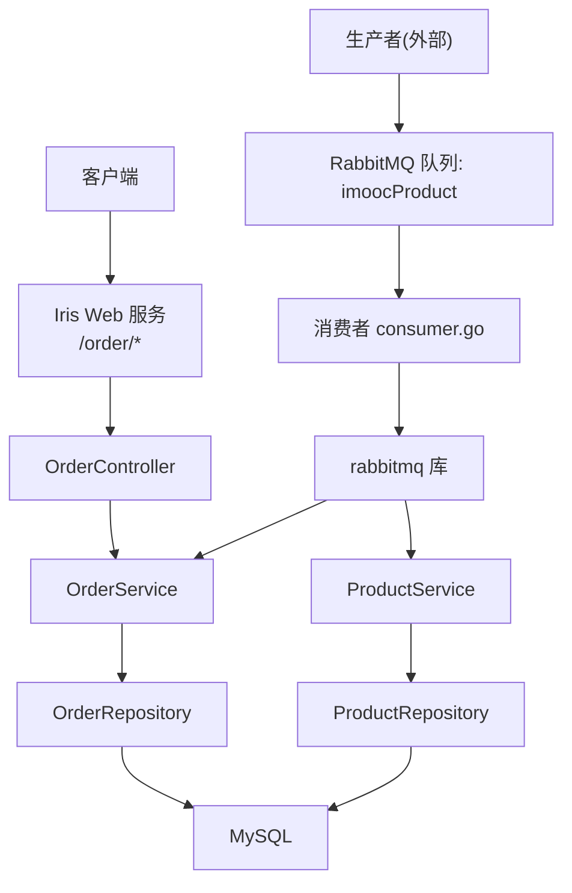
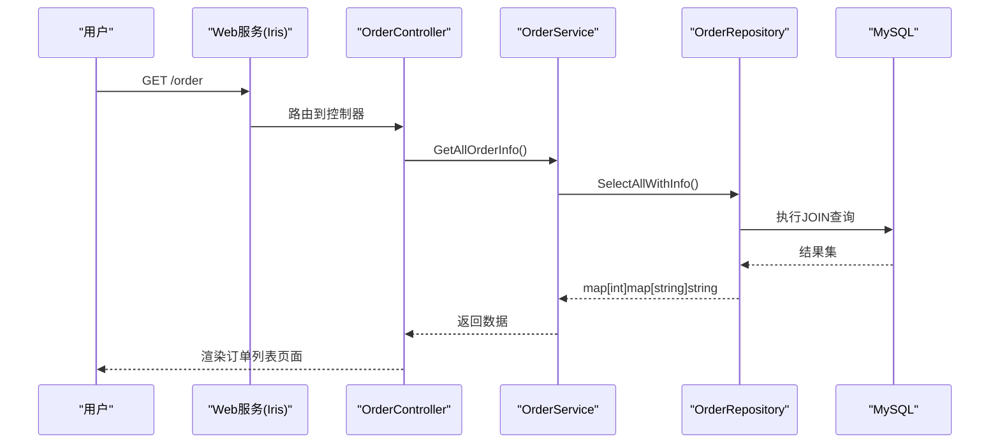
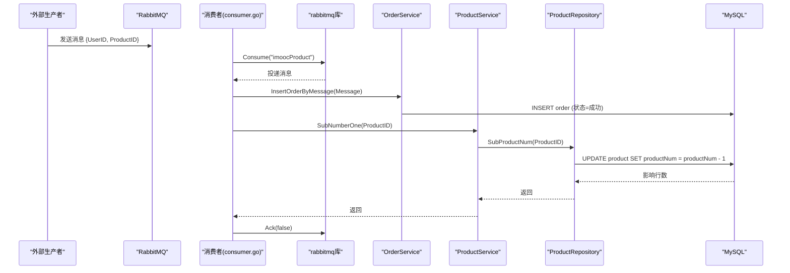
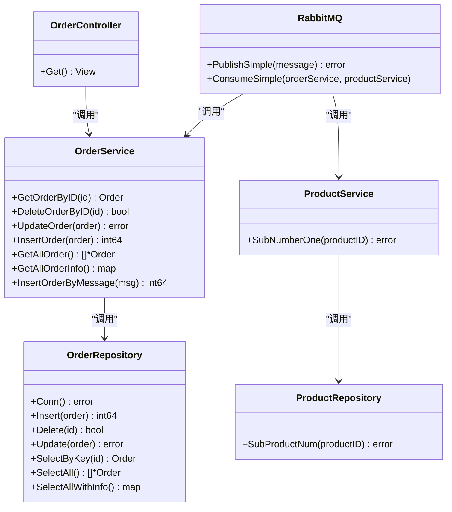

# 订单相关API

<cite>
**本文引用的文件**
- [backend/main.go](file://backend/main.go)
- [backend/web/controllers/order_controller.go](file://backend/web/controllers/order_controller.go)
- [services/order_service.go](file://services/order_service.go)
- [repositories/order_repository.go](file://repositories/order_repository.go)
- [datamodels/order.go](file://datamodels/order.go)
- [rabbitmq/rabbitmq.go](file://rabbitmq/rabbitmq.go)
- [consumer.go](file://consumer.go)
- [common/mysql.go](file://common/mysql.go)
- [common/comm.go](file://common/comm.go)
- [services/product_service.go](file://services/product_service.go)
- [repositories/product_repository.go](file://repositories/product_repository.go)
- [datamodels/product.go](file://datamodels/product.go)
</cite>

## 目录
1. [简介](#简介)
2. [项目结构](#项目结构)
3. [核心组件](#核心组件)
4. [架构总览](#架构总览)
5. [详细组件分析](#详细组件分析)
6. [依赖关系分析](#依赖关系分析)
7. [性能考虑](#性能考虑)
8. [故障排查指南](#故障排查指南)
9. [结论](#结论)
10. [附录](#附录)

## 简介
本文件面向订单相关API与业务流程，覆盖订单创建、状态更新、订单查询等接口；说明订单生成、支付处理、发货管理等环节在当前代码中的实现现状；给出订单状态机设计与转换规则；说明异步消息队列（RabbitMQ）集成方式；阐述数据一致性与事务处理机制；并提供错误处理与异常恢复策略。

## 项目结构
后端采用 MVC 分层：控制器负责HTTP请求路由与视图渲染，服务层封装业务逻辑，仓储层负责数据库访问。订单模块通过 RabbitMQ 消费者异步完成下单与库存扣减。

图表来源
- [backend/main.go:14-51](file://backend/main.go#L14-L51)
- [backend/web/controllers/order_controller.go:9-27](file://backend/web/controllers/order_controller.go#L9-L27)
- [services/order_service.go:8-61](file://services/order_service.go#L8-L61)
- [repositories/order_repository.go:10-145](file://repositories/order_repository.go#L10-L145)
- [rabbitmq/rabbitmq.go:19-181](file://rabbitmq/rabbitmq.go#L19-L181)
- [consumer.go:11-27](file://consumer.go#L11-L27)

章节来源
- [backend/main.go:14-51](file://backend/main.go#L14-L51)
- [backend/web/controllers/order_controller.go:9-27](file://backend/web/controllers/order_controller.go#L9-L27)

## 核心组件
- 控制器：OrderController 提供订单列表页面渲染入口。
- 服务：OrderService 暴露订单CRUD与基于消息的下单能力。
- 仓储：OrderRepository 封装订单表SQL操作。
- 模型：Order 定义订单数据结构与状态常量。
- 消息：Message 定义下单消息体。
- 消费者：consumer.go 启动并消费队列消息，调用 OrderService 与 ProductService。
- 产品：ProductService/ProductRepository 用于库存扣减。

章节来源
- [backend/web/controllers/order_controller.go:9-27](file://backend/web/controllers/order_controller.go#L9-L27)
- [services/order_service.go:8-61](file://services/order_service.go#L8-L61)
- [repositories/order_repository.go:10-145](file://repositories/order_repository.go#L10-L145)
- [datamodels/order.go:1-15](file://datamodels/order.go#L1-L15)
- [datamodels/message.go:1-13](file://datamodels/message.go#L1-L13)
- [consumer.go:11-27](file://consumer.go#L11-L27)
- [services/product_service.go:8-48](file://services/product_service.go#L8-L48)
- [repositories/product_repository.go:10-165](file://repositories/product_repository.go#L10-L165)

## 架构总览
系统包含同步Web请求路径与异步消息处理路径：
- 同步路径：浏览器访问 /order 页面，控制器调用服务获取订单信息并渲染视图。
- 异步路径：外部生产者向 RabbitMQ 发送下单消息，消费者读取消息后创建订单并扣减库存。

图表来源
- [backend/main.go:46-51](file://backend/main.go#L46-L51)
- [backend/web/controllers/order_controller.go:14-27](file://backend/web/controllers/order_controller.go#L14-L27)
- [services/order_service.go:47-49](file://services/order_service.go#L47-L49)
- [repositories/order_repository.go:135-145](file://repositories/order_repository.go#L135-L145)

## 详细组件分析

### 订单控制器（OrderController）
- 职责：接收HTTP请求，调用服务层获取订单信息，渲染模板。
- 关键流程：Get() 调用服务层的 GetAllOrderInfo()，将结果注入视图。
- 错误处理：记录调试日志，不中断渲染。

章节来源
- [backend/web/controllers/order_controller.go:9-27](file://backend/web/controllers/order_controller.go#L9-L27)

### 订单服务（OrderService）
- 职责：聚合订单业务逻辑，包括按ID查询、删除、更新、插入、全量查询、带关联信息查询、基于消息创建订单。
- 关键方法：
  - InsertOrderByMessage：根据消息构造订单对象并插入，初始状态为成功。
  - UpdateOrder：更新订单状态（如发货、取消等）。
  - GetOrderByID/GetAllOrder/GetAllOrderInfo：查询接口。
- 注意：当前实现未包含支付回调、发货等业务分支，仅支持基础CRUD与“直接成功”的下单路径。

章节来源
- [services/order_service.go:8-61](file://services/order_service.go#L8-L61)

### 订单仓储（OrderRepository）
- 职责：封装订单表的增删改查SQL。
- 关键点：
  - Insert：插入订单，设置默认状态。
  - Update：按ID更新订单字段（含状态）。
  - SelectByKey/SelectAll/SelectAllWithInfo：单条、全部、带商品名称的联合查询。
- 连接管理：Conn() 懒加载数据库连接。

章节来源
- [repositories/order_repository.go:10-145](file://repositories/order_repository.go#L10-L145)

### 订单模型与状态（Order, Message）
- Order：包含ID、用户ID、商品ID、订单状态。
- 状态常量：等待、成功、失败。
- Message：下单消息体，包含用户ID与商品ID。

章节来源
- [datamodels/order.go:1-15](file://datamodels/order.go#L1-L15)
- [datamodels/message.go:1-13](file://datamodels/message.go#L1-L13)

### 异步消息队列集成（RabbitMQ）
- 生产者：外部系统向队列 "imoocProduct" 发送JSON消息（包含UserID与ProductID）。
- 消费者：consumer.go 启动消费者，使用 rabbitmq 库订阅队列，解析消息后：
  - 调用 OrderService.InsertOrderByMessage 创建订单。
  - 调用 ProductService.SubNumberOne 扣减库存。
  - 手动确认消息（Ack）。
- 流控：Qos(1) 限制并发消费数量。

图表来源
- [consumer.go:11-27](file://consumer.go#L11-L27)
- [rabbitmq/rabbitmq.go:104-181](file://rabbitmq/rabbitmq.go#L104-L181)
- [services/order_service.go:51-61](file://services/order_service.go#L51-L61)
- [services/product_service.go:46-48](file://services/product_service.go#L46-L48)
- [repositories/product_repository.go:154-165](file://repositories/product_repository.go#L154-L165)

### 订单状态机与转换规则
- 状态集合：等待(OrderWait)、成功(OrderSuccess)、失败(OrderFailed)。
- 当前实现：
  - 通过消息创建的订单初始状态为成功。
  - 提供UpdateOrder接口可更新任意状态字段。
- 建议的业务规则（扩展方向）：
  - 支付前：等待 -> 成功（支付成功）、失败（支付失败）。
  - 发货中：成功 -> 已发货。
  - 已完成：已发货 -> 已完成。
  - 取消：任何非终态均可转为失败或取消。
- 注意：当前代码未内置状态校验与转换约束，需在服务层或仓储层增加合法性检查。

章节来源
- [datamodels/order.go:10-14](file://datamodels/order.go#L10-L14)
- [services/order_service.go:51-61](file://services/order_service.go#L51-L61)
- [repositories/order_repository.go:78-90](file://repositories/order_repository.go#L78-L90)

### 订单业务流程（生成、支付、发货）
- 订单生成：
  - 同步：目前仅提供列表查询，未提供创建接口。
  - 异步：通过RabbitMQ消息触发创建订单，初始状态为成功。
- 支付处理：
  - 当前未实现支付回调与状态流转，可在服务层新增支付回调方法，结合状态机进行更新。
- 发货管理：
  - 可通过UpdateOrder更新订单状态为“已发货”，并在后续流程中追加“已完成”。

章节来源
- [services/order_service.go:51-61](file://services/order_service.go#L51-L61)
- [repositories/order_repository.go:78-90](file://repositories/order_repository.go#L78-L90)

## 依赖关系分析
- 控制器依赖服务接口，服务依赖仓储接口，仓储依赖数据库连接与通用工具。
- 消费者依赖rabbitmq库与服务接口，服务间存在松耦合。

图表来源
- [backend/web/controllers/order_controller.go:9-27](file://backend/web/controllers/order_controller.go#L9-L27)
- [services/order_service.go:8-61](file://services/order_service.go#L8-L61)
- [repositories/order_repository.go:10-145](file://repositories/order_repository.go#L10-L145)
- [rabbitmq/rabbitmq.go:19-181](file://rabbitmq/rabbitmq.go#L19-L181)
- [services/product_service.go:8-48](file://services/product_service.go#L8-L48)
- [repositories/product_repository.go:10-165](file://repositories/product_repository.go#L10-L165)

## 性能考虑
- 数据库连接：仓储层懒加载连接，避免重复初始化开销。
- 查询优化：列表查询使用JOIN一次性获取订单与商品名称，减少多次往返。
- 并发消费：消费者使用Qos(1)限流，防止瞬时压力过大。
- 建议：
  - 对高频查询建立索引（如userID、productID、orderStatus）。
  - 引入缓存层（如Redis）缓存热点订单或商品信息。
  - 批量操作时使用事务减少网络往返。

[本节为通用指导，无需特定文件引用]

## 故障排查指南
- 数据库连接失败：
  - 检查 common.NewMysqlConn 的连接串与权限。
  - 查看后端启动日志中的错误输出。
- 消息消费失败：
  - 检查 RabbitMQ 连接与队列是否存在。
  - 确认消费者是否正确 Ack，避免消息堆积。
  - 关注 JSON 反序列化与业务逻辑抛出的错误。
- 库存扣减异常：
  - 检查 SubProductNum 是否成功执行，确保并发下不会出现负数库存（建议加锁或乐观锁）。
- 订单状态不一致：
  - 当前未使用事务包裹跨表操作，建议在服务层引入事务保证一致性。
  - 在状态更新时加入前置校验，避免非法转换。

章节来源
- [common/mysql.go:9-12](file://common/mysql.go#L9-L12)
- [rabbitmq/rabbitmq.go:104-181](file://rabbitmq/rabbitmq.go#L104-L181)
- [repositories/product_repository.go:154-165](file://repositories/product_repository.go#L154-L165)
- [services/order_service.go:51-61](file://services/order_service.go#L51-L61)

## 结论
当前订单模块提供了基础的订单查询与基于消息的下单能力，并通过RabbitMQ实现了异步解耦。状态机与支付、发货流程尚未完善，建议在服务层补充状态校验与事务控制，增强一致性与可靠性。同时，应完善错误处理与监控告警，提升系统的稳定性与可维护性。

[本节为总结性内容，无需特定文件引用]

## 附录

### API清单与行为说明
- GET /order
  - 功能：渲染订单列表页面。
  - 输入：无。
  - 输出：HTML页面，包含订单与商品名称映射。
  - 依赖：OrderService.GetAllOrderInfo -> OrderRepository.SelectAllWithInfo。

章节来源
- [backend/web/controllers/order_controller.go:14-27](file://backend/web/controllers/order_controller.go#L14-L27)
- [services/order_service.go:47-49](file://services/order_service.go#L47-L49)
- [repositories/order_repository.go:135-145](file://repositories/order_repository.go#L135-L145)

### 数据模型
- Order：ID、用户ID、商品ID、订单状态。
- Message：用户ID、商品ID。
- Product：商品基本信息与库存。

章节来源
- [datamodels/order.go:1-15](file://datamodels/order.go#L1-L15)
- [datamodels/message.go:1-13](file://datamodels/message.go#L1-L13)
- [datamodels/product.go:1-10](file://datamodels/product.go#L1-L10)

### 事务与一致性说明
- 当前实现未在跨表操作中使用事务，订单创建与库存扣减分别独立执行，存在潜在不一致风险。
- 建议：在服务层引入数据库事务，确保订单与库存变更要么都成功，要么都回滚。

章节来源
- [rabbitmq/rabbitmq.go:152-175](file://rabbitmq/rabbitmq.go#L152-L175)
- [services/order_service.go:51-61](file://services/order_service.go#L51-L61)
- [services/product_service.go:46-48](file://services/product_service.go#L46-L48)