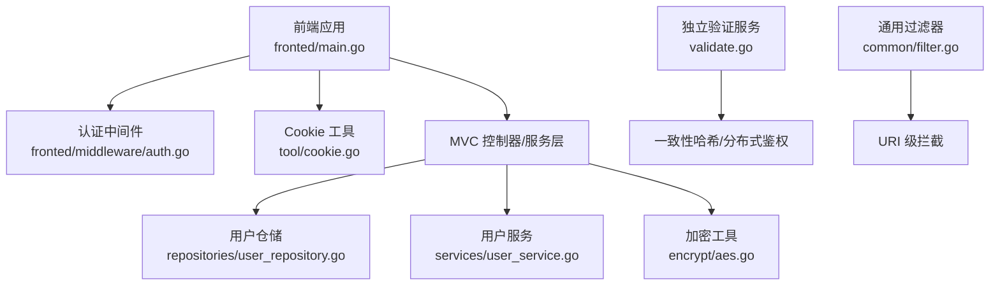
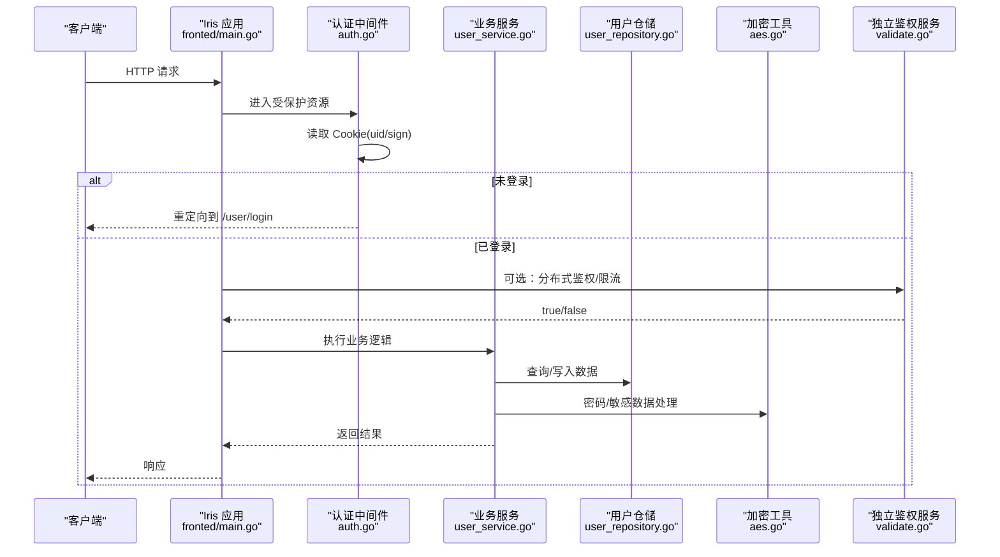
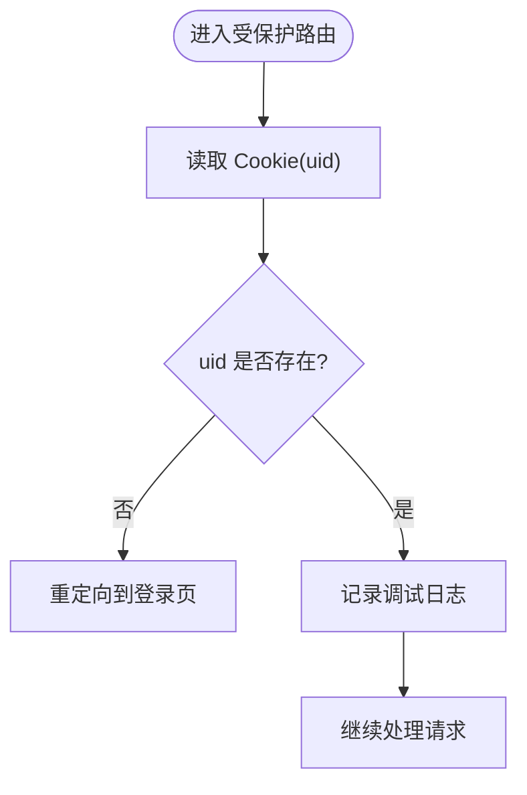
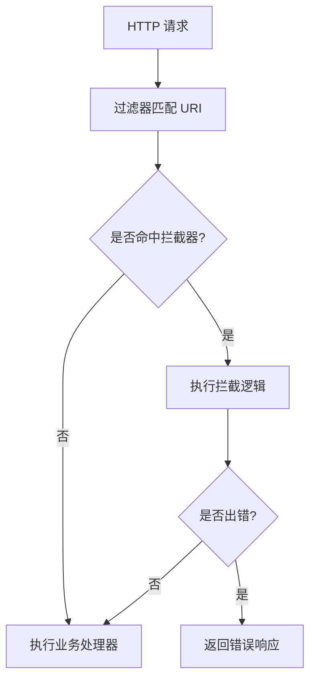
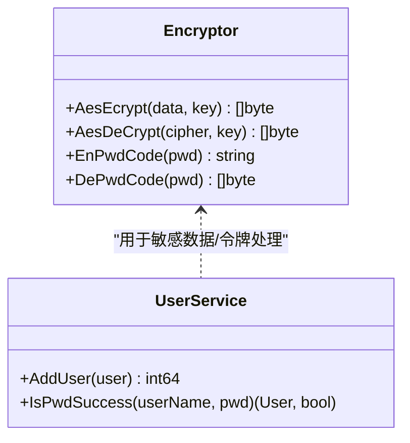
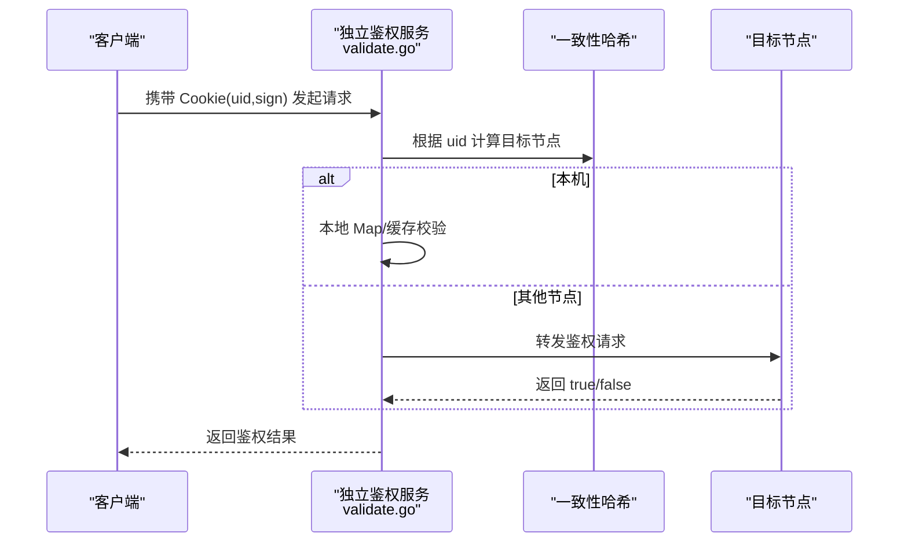
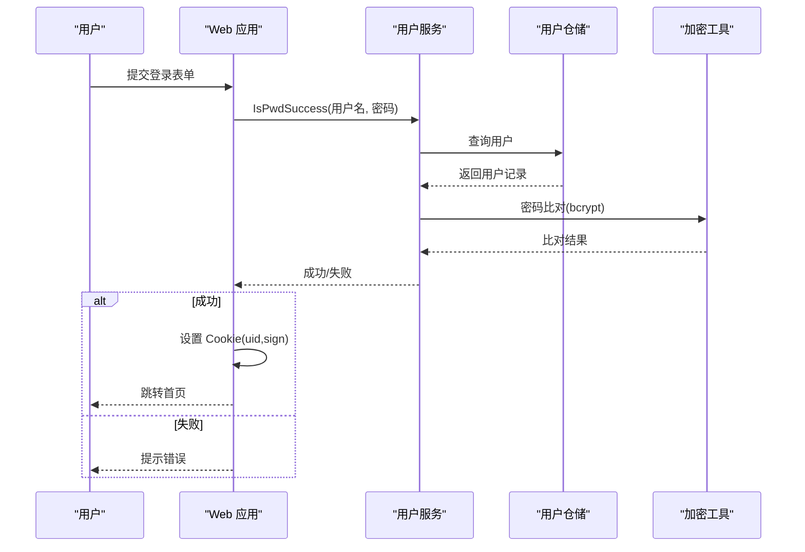
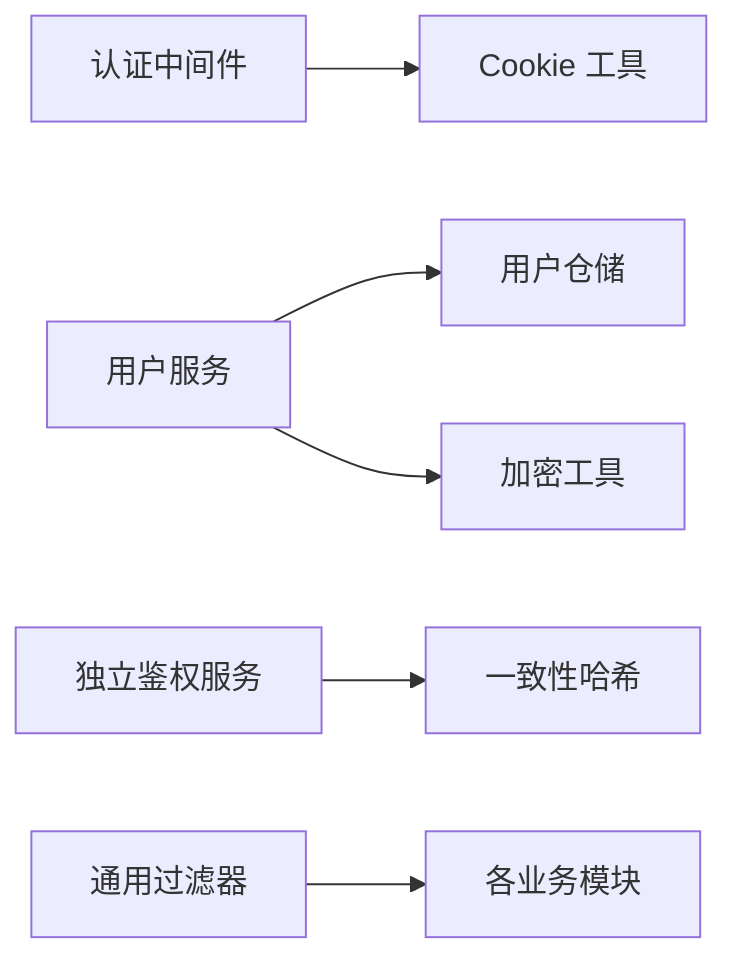

# 中间件与安全

<cite>
**本文引用的文件**
- [fronted/main.go](file://fronted/main.go)
- [fronted/middleware/auth.go](file://fronted/middleware/auth.go)
- [tool/cookie.go](file://tool/cookie.go)
- [validate.go](file://validate.go)
- [encrypt/aes.go](file://encrypt/aes.go)
- [services/user_service.go](file://services/user_service.go)
- [repositories/user_repository.go](file://repositories/user_repository.go)
- [datamodels/user.go](file://datamodels/user.go)
- [common/filter.go](file://common/filter.go)
</cite>

## 目录
1. [简介](#简介)
2. [项目结构](#项目结构)
3. [核心组件](#核心组件)
4. [架构总览](#架构总览)
5. [详细组件分析](#详细组件分析)
6. [依赖关系分析](#依赖关系分析)
7. [性能考虑](#性能考虑)
8. [故障排查指南](#故障排查指南)
9. [结论](#结论)
10. [附录](#附录)

## 简介
本文件围绕“中间件与安全机制”展开，聚焦以下目标：
- 认证中间件的实现原理：用户身份验证、权限检查、会话管理（基于 Cookie）。
- 请求过滤机制：输入校验、XSS 防护、CSRF 保护。
- 加密工具使用：密码加密与数据加解密。
- Cookie 管理与安全配置。
- 安全最佳实践与常见漏洞防护。
- 安全审计与日志记录方案。

## 项目结构
本项目采用分层与模块化组织：
- Web 入口与路由注册在 fronted/main.go，使用 Iris 框架并挂载 MVC 控制器。
- 认证中间件位于 fronted/middleware/auth.go，用于受保护资源的登录态检查。
- Cookie 设置封装于 tool/cookie.go。
- 通用过滤器 common/filter.go 提供按 URI 拦截的能力。
- 独立服务 validate.go 提供基于 Cookie 的鉴权与分布式一致性哈希访问控制。
- 加密模块 encrypt/aes.go 提供 AES CBC 加解密与 Base64 编解码。
- 用户相关的数据模型、仓储与服务分别位于 datamodels、repositories、services。

**图表来源**
- [fronted/main.go:16-66](file://fronted/main.go#L16-L66)
- [fronted/middleware/auth.go:5-15](file://fronted/middleware/auth.go#L5-L15)
- [tool/cookie.go:8-11](file://tool/cookie.go#L8-L11)
- [validate.go:287-317](file://validate.go#L287-L317)
- [common/filter.go:11-53](file://common/filter.go#L11-L53)

**章节来源**
- [fronted/main.go:16-66](file://fronted/main.go#L16-L66)
- [common/filter.go:11-53](file://common/filter.go#L11-L53)

## 核心组件
- 认证中间件：基于 Cookie 的用户登录态检查，未登录时重定向至登录页。
- Cookie 管理：统一设置 Cookie，便于跨页面共享会话标识。
- 通用过滤器：按 URI 注册拦截器，执行前置校验逻辑。
- 独立鉴权服务：结合 Cookie 与一致性哈希，进行分布式权限校验与限流/防超卖等场景。
- 加密工具：AES CBC + PKCS7 填充，Base64 编码；配合 bcrypt 完成密码存储与校验。
- 用户服务：密码生成与比对，用户查询与新增。

**章节来源**
- [fronted/middleware/auth.go:5-15](file://fronted/middleware/auth.go#L5-L15)
- [tool/cookie.go:8-11](file://tool/cookie.go#L8-L11)
- [common/filter.go:11-53](file://common/filter.go#L11-L53)
- [validate.go:240-285](file://validate.go#L240-L285)
- [encrypt/aes.go:17-99](file://encrypt/aes.go#L17-L99)
- [services/user_service.go:23-57](file://services/user_service.go#L23-L57)

## 架构总览
下图展示了从请求进入 Web 到认证、鉴权、业务处理的完整链路，包括中间件、过滤器、服务层与加密模块的协作。

**图表来源**
- [fronted/main.go:44-59](file://fronted/main.go#L44-L59)
- [fronted/middleware/auth.go:5-15](file://fronted/middleware/auth.go#L5-L15)
- [validate.go:62-117](file://validate.go#L62-L117)
- [services/user_service.go:23-57](file://services/user_service.go#L23-L57)
- [repositories/user_repository.go:40-63](file://repositories/user_repository.go#L40-L63)
- [encrypt/aes.go:40-99](file://encrypt/aes.go#L40-L99)

## 详细组件分析

### 认证中间件（登录态检查）
- 功能要点
  - 从 Cookie 中读取 uid，若为空则视为未登录并重定向到登录页。
  - 通过日志记录登录状态，便于审计。
- 集成方式
  - 在 fronted/main.go 中对特定路由组使用 Use 注册中间件，实现全局登录态校验。
- 扩展建议
  - 增加 sign 校验与签名验证，防止伪造 Cookie。
  - 引入 Token/Session 机制，支持多端与会话过期策略。
  - 增加 IP/UA 白名单或风控规则。

**图表来源**
- [fronted/middleware/auth.go:5-15](file://fronted/middleware/auth.go#L5-L15)

**章节来源**
- [fronted/middleware/auth.go:5-15](file://fronted/middleware/auth.go#L5-L15)
- [fronted/main.go:55-59](file://fronted/main.go#L55-L59)

### Cookie 管理机制与安全配置
- 当前实现
  - 提供统一的 Cookie 设置方法，设置 Path 为根路径，便于全站共享。
- 安全风险与建议
  - 当前未设置 HttpOnly、Secure、SameSite，存在 XSS/CSRF 风险。建议：
    - 对会话 Cookie 设置 HttpOnly 与 Secure（HTTPS），SameSite=Strict/Lax。
    - 对敏感 Cookie 设置较短的 Max-Age，并结合服务端 Session 管理。
    - 避免将敏感信息直接放入 Cookie，建议使用签名或加密。
  - 建议引入 CSRF Token 并在表单提交时校验。

**章节来源**
- [tool/cookie.go:8-11](file://tool/cookie.go#L8-L11)

### 请求过滤机制（输入校验、XSS、CSRF）
- 现有能力
  - 通用过滤器 common/filter.go 支持按 URI 注册拦截器，可在进入业务前执行校验。
  - 独立服务 validate.go 提供 Auth 拦截器，读取 Cookie 并进行基础校验。
- 输入校验
  - 建议在过滤器中集中进行参数类型、长度、格式校验，拒绝非法输入。
- XSS 防护
  - 输出侧对用户输入进行 HTML 转义；模板渲染启用自动转义。
  - 限制富文本上传与解析，使用安全的白名单标签。
- CSRF 保护
  - 为所有写操作添加 CSRF Token，服务端校验 Token 与来源站点。
  - 对敏感接口实施 SameSite Cookie 与 Referer/SameOrigin 校验。

**图表来源**
- [common/filter.go:11-53](file://common/filter.go#L11-L53)
- [validate.go:240-248](file://validate.go#L240-L248)

**章节来源**
- [common/filter.go:11-53](file://common/filter.go#L11-L53)
- [validate.go:240-248](file://validate.go#L240-L248)

### 加密工具使用方法（密码加密、数据加密解密）
- 密码加密
  - 使用 bcrypt 生成密码哈希并存储；登录时进行比对。
  - 参考路径：[services/user_service.go:47-57](file://services/user_service.go#L47-L57)
- 数据加解密
  - 使用 AES CBC + PKCS7 填充，Base64 编解码，适用于传输或落盘敏感数据。
  - 参考路径：[encrypt/aes.go:40-99](file://encrypt/aes.go#L40-L99)
- 注意事项
  - 密钥管理：避免硬编码，建议使用环境变量或密钥管理服务。
  - 随机 IV：CBC 模式应使用随机 IV 并与密文一起存储。
  - 完整性校验：建议结合 HMAC 或 AEAD 模式保证密文完整性。

**图表来源**
- [encrypt/aes.go:40-99](file://encrypt/aes.go#L40-L99)
- [services/user_service.go:23-57](file://services/user_service.go#L23-L57)

**章节来源**
- [encrypt/aes.go:17-99](file://encrypt/aes.go#L17-L99)
- [services/user_service.go:23-57](file://services/user_service.go#L23-L57)

### 会话管理与权限检查
- 会话管理
  - 当前以 Cookie 作为会话载体，未登录时重定向登录。
  - 建议引入服务端 Session，绑定设备指纹/IP，设置过期时间。
- 权限检查
  - 独立服务 validate.go 提供基于 Cookie 的鉴权，并通过一致性哈希定位节点，实现分布式权限校验。
  - 可结合角色/资源模型，细化到接口级权限控制。

**图表来源**
- [validate.go:62-117](file://validate.go#L62-L117)

**章节来源**
- [validate.go:62-117](file://validate.go#L62-L117)
- [validate.go:240-285](file://validate.go#L240-L285)

### 用户身份验证流程（登录与校验）
- 登录流程
  - 用户提交用户名与密码，服务端调用服务层进行密码比对。
  - 通过后设置 Cookie（uid/sign），后续请求由中间件校验。
- 校验流程
  - 中间件读取 Cookie，必要时调用独立鉴权服务进行分布式校验。
  - 校验失败则重定向登录或返回错误。

**图表来源**
- [services/user_service.go:23-57](file://services/user_service.go#L23-L57)
- [repositories/user_repository.go:40-63](file://repositories/user_repository.go#L40-L63)
- [encrypt/aes.go:40-99](file://encrypt/aes.go#L40-L99)

**章节来源**
- [services/user_service.go:23-57](file://services/user_service.go#L23-L57)
- [repositories/user_repository.go:40-63](file://repositories/user_repository.go#L40-L63)

## 依赖关系分析
- 中间件依赖 Cookie 工具与日志系统。
- 业务服务依赖仓储与加密工具。
- 独立鉴权服务依赖一致性哈希与网络请求。
- 过滤器为横切关注点，贯穿各模块。

**图表来源**
- [fronted/middleware/auth.go:5-15](file://fronted/middleware/auth.go#L5-L15)
- [tool/cookie.go:8-11](file://tool/cookie.go#L8-L11)
- [services/user_service.go:23-57](file://services/user_service.go#L23-L57)
- [repositories/user_repository.go:40-63](file://repositories/user_repository.go#L40-L63)
- [encrypt/aes.go:40-99](file://encrypt/aes.go#L40-L99)
- [validate.go:62-117](file://validate.go#L62-L117)
- [common/filter.go:11-53](file://common/filter.go#L11-L53)

**章节来源**
- [fronted/middleware/auth.go:5-15](file://fronted/middleware/auth.go#L5-L15)
- [tool/cookie.go:8-11](file://tool/cookie.go#L8-L11)
- [services/user_service.go:23-57](file://services/user_service.go#L23-L57)
- [repositories/user_repository.go:40-63](file://repositories/user_repository.go#L40-L63)
- [encrypt/aes.go:40-99](file://encrypt/aes.go#L40-L99)
- [validate.go:62-117](file://validate.go#L62-L117)
- [common/filter.go:11-53](file://common/filter.go#L11-L53)

## 性能考虑
- 中间件与过滤器应尽量轻量，避免阻塞主流程。
- Cookie 校验与鉴权可结合缓存减少重复计算。
- 数据库查询使用预编译语句与索引优化。
- 加密操作成本较高，建议仅在必要场景使用，并合理设置密钥与算法参数。
- 分布式鉴权注意网络延迟，可采用就近节点与超时重试策略。

## 故障排查指南
- 常见问题
  - 未登录重定向：检查 Cookie 是否设置成功及中间件是否生效。
  - 鉴权失败：核对 sign 与 uid 的一致性，确认加密/解密流程正确。
  - 数据库错误：检查连接与 SQL 拼接，确保参数化查询。
- 日志与审计
  - 使用框架日志记录关键步骤（登录、鉴权、异常）。
  - 对敏感操作记录审计日志（用户、IP、时间、结果）。
  - 建议集中日志收集与分析平台。

**章节来源**
- [fronted/middleware/auth.go:5-15](file://fronted/middleware/auth.go#L5-L15)
- [validate.go:240-285](file://validate.go#L240-L285)
- [repositories/user_repository.go:40-63](file://repositories/user_repository.go#L40-L63)

## 结论
本项目已具备基础的认证中间件、Cookie 管理、过滤器与加密工具，能够满足常见的安全需求。为进一步强化安全性，建议：
- 完善 Cookie 安全属性（HttpOnly、Secure、SameSite）。
- 引入 CSRF 防护与输入校验框架。
- 使用更健壮的会话与权限模型（Token/Session、RBAC）。
- 加强密钥管理与加密强度（AEAD、HMAC）。
- 建立完善的日志与审计体系，支撑安全事件追踪与合规要求。

## 附录
- 安全最佳实践清单
  - 对所有输入进行严格校验与白名单过滤。
  - 输出侧进行 HTML 转义，防止 XSS。
  - 对敏感数据加密存储与传输，使用强算法与随机 IV。
  - 对写操作实施 CSRF 保护。
  - 最小权限原则与接口级鉴权。
  - 定期安全扫描与渗透测试。
- 常见漏洞防护
  - SQL 注入：使用参数化查询与 ORM。
  - XSS：输入校验与输出转义。
  - CSRF：Token 校验与 SameSite Cookie。
  - 会话劫持：HttpOnly、Secure、短生命周期。
  - 暴力破解：限流与验证码。