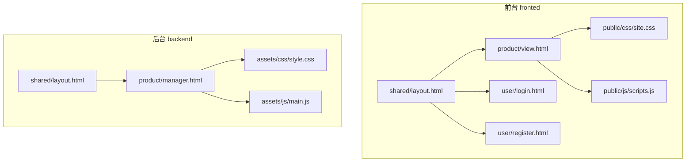
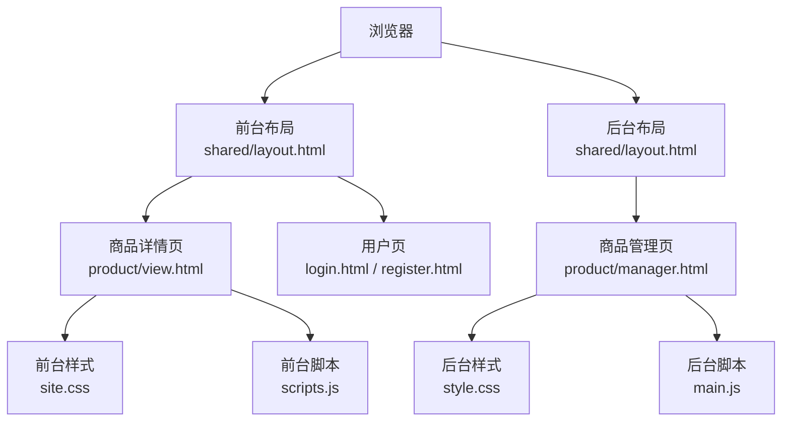
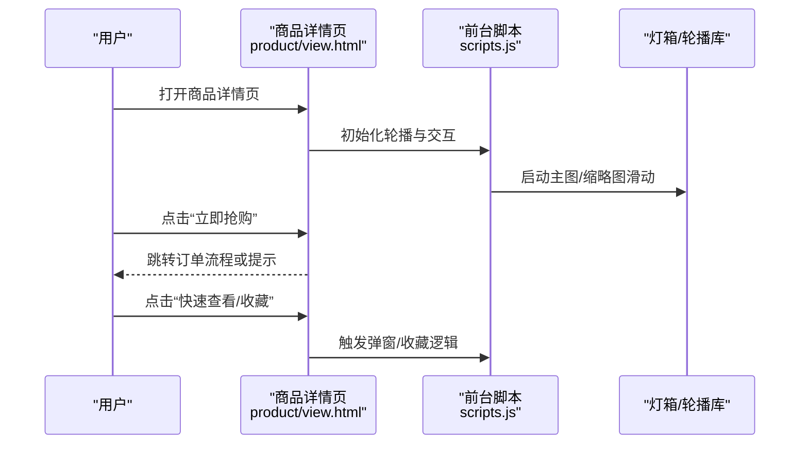
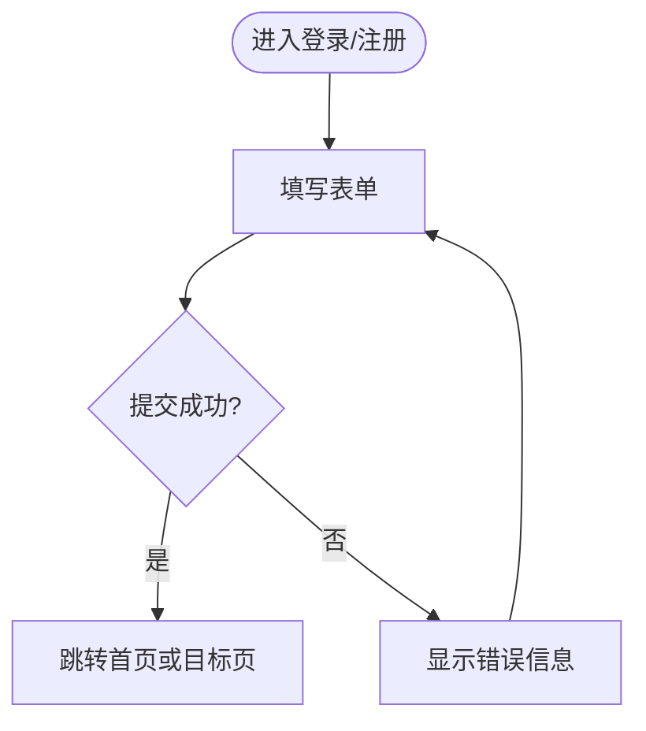
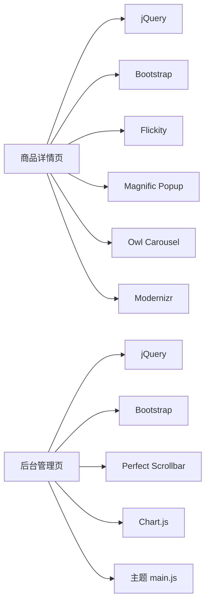

# 前端界面设计

<cite>
**本文引用的文件**
- [fronted/web/views/shared/layout.html](file://fronted/web/views/shared/layout.html)
- [fronted/web/views/product/view.html](file://fronted/web/views/product/view.html)
- [fronted/web/views/user/login.html](file://fronted/web/views/user/login.html)
- [fronted/web/views/user/register.html](file://fronted/web/views/user/register.html)
- [fronted/web/public/css/site.css](file://fronted/web/public/css/site.css)
- [fronted/web/public/js/scripts.js](file://fronted/web/public/js/scripts.js)
- [backend/web/views/shared/layout.html](file://backend/web/views/shared/layout.html)
- [backend/web/views/product/manager.html](file://backend/web/views/product/manager.html)
- [backend/web/assets/css/style.css](file://backend/web/assets/css/style.css)
- [backend/web/assets/js/main.js](file://backend/web/assets/js/main.js)
</cite>

## 目录
1. [简介](#简介)
2. [项目结构](#项目结构)
3. [核心组件](#核心组件)
4. [架构总览](#架构总览)
5. [详细组件分析](#详细组件分析)
6. [依赖关系分析](#依赖关系分析)
7. [性能与优化](#性能与优化)
8. [故障排查指南](#故障排查指南)
9. [结论](#结论)
10. [附录](#附录)

## 简介
本文件面向前端界面设计与实现，覆盖页面布局、模板引擎使用方式（Go HTML 模板）、CSS 样式管理、JavaScript 脚本加载与交互逻辑。重点说明商品展示页、用户登录注册页、管理后台页的功能与交互；并给出响应式设计实现、用户体验优化、浏览器兼容性处理策略，以及静态资源管理与部署建议与性能优化实践。

## 项目结构
前端资源按“业务域 + 公共层”组织：
- 前台站点（fronted）
  - 视图模板：views/shared/layout.html 作为基础布局，product/view.html、user/login.html、user/register.html 为具体页面
  - 静态资源：public/css、public/js、public/img、public/fonts
- 管理后台（backend）
  - 视图模板：backend/web/views/shared/layout.html 作为后台布局，product/manager.html 为商品管理页
  - 静态资源：backend/web/assets/css、assets/js、assets/lib 等



图表来源
- [fronted/web/views/shared/layout.html:1-15](file://fronted/web/views/shared/layout.html#L1-L15)
- [fronted/web/views/product/view.html:1-746](file://fronted/web/views/product/view.html#L1-L746)
- [fronted/web/views/user/login.html:1-16](file://fronted/web/views/user/login.html#L1-L16)
- [fronted/web/views/user/register.html:1-12](file://fronted/web/views/user/register.html#L1-L12)
- [fronted/web/public/css/site.css:1-61](file://fronted/web/public/css/site.css#L1-L61)
- [fronted/web/public/js/scripts.js:1-452](file://fronted/web/public/js/scripts.js#L1-L452)
- [backend/web/views/shared/layout.html:1-354](file://backend/web/views/shared/layout.html#L1-L354)
- [backend/web/views/product/manager.html:1-54](file://backend/web/views/product/manager.html#L1-L54)
- [backend/web/assets/css/style.css:1-800](file://backend/web/assets/css/style.css#L1-L800)
- [backend/web/assets/js/main.js:1-648](file://backend/web/assets/js/main.js#L1-L648)

章节来源
- [fronted/web/views/shared/layout.html:1-15](file://fronted/web/views/shared/layout.html#L1-L15)
- [backend/web/views/shared/layout.html:1-354](file://backend/web/views/shared/layout.html#L1-L354)

## 核心组件
- 模板布局
  - 前台基础布局：fronted/web/views/shared/layout.html，提供统一 HTML 骨架与全局 CSS 引用，并通过 {{yield}} 注入页面内容
  - 后台基础布局：backend/web/views/shared/layout.html，提供顶部导航、左侧菜单、右侧工具栏与内容区，并在底部引入 jQuery、Bootstrap、Chart.js 及主题 JS
- 页面模板
  - 商品详情页：fronted/web/views/product/view.html，包含导航、商品主图轮播、规格选择、购买按钮、相关商品推荐、内联脚本控制抢购行为
  - 登录页：fronted/web/views/user/login.html，提交至 /user/login
  - 注册页：fronted/web/views/user/register.html，提交至 /user/register
  - 管理后台商品管理页：backend/web/views/product/manager.html，表单编辑商品字段并提交至 /product/update
- 样式与脚本
  - 前台样式：fronted/web/public/css/site.css，定义表单、按钮、容器与媒体查询
  - 前台脚本：fronted/web/public/js/scripts.js，封装轮播、手风琴、数量增减、弹窗、滚动等行为
  - 后台样式：backend/web/assets/css/style.css，基于 Bootstrap 与主题样式
  - 后台脚本：backend/web/assets/js/main.js，初始化侧边栏、聊天、滚动条、颜色读取等

章节来源
- [fronted/web/views/product/view.html:1-746](file://fronted/web/views/product/view.html#L1-L746)
- [fronted/web/views/user/login.html:1-16](file://fronted/web/views/user/login.html#L1-L16)
- [fronted/web/views/user/register.html:1-12](file://fronted/web/views/user/register.html#L1-L12)
- [backend/web/views/product/manager.html:1-54](file://backend/web/views/product/manager.html#L1-L54)
- [fronted/web/public/css/site.css:1-61](file://fronted/web/public/css/site.css#L1-L61)
- [fronted/web/public/js/scripts.js:1-452](file://fronted/web/public/js/scripts.js#L1-L452)
- [backend/web/assets/css/style.css:1-800](file://backend/web/assets/css/style.css#L1-L800)
- [backend/web/assets/js/main.js:1-648](file://backend/web/assets/js/main.js#L1-L648)

## 架构总览
前后端通过 Go 模板渲染 HTML，静态资源由 Web 服务器托管。前台以 Bootstrap 栅格与自定义 CSS 构建响应式布局，JS 插件增强交互；后台采用主题布局，集中初始化 UI 行为。



图表来源
- [fronted/web/views/shared/layout.html:1-15](file://fronted/web/views/shared/layout.html#L1-L15)
- [fronted/web/views/product/view.html:1-746](file://fronted/web/views/product/view.html#L1-L746)
- [fronted/web/views/user/login.html:1-16](file://fronted/web/views/user/login.html#L1-L16)
- [fronted/web/views/user/register.html:1-12](file://fronted/web/views/user/register.html#L1-L12)
- [backend/web/views/shared/layout.html:1-354](file://backend/web/views/shared/layout.html#L1-L354)
- [backend/web/views/product/manager.html:1-54](file://backend/web/views/product/manager.html#L1-L54)

## 详细组件分析

### 商品展示页面（产品详情）
- 布局与结构
  - 顶部导航含语言/货币切换、促销信息、登录入口、收藏与购物车下拉
  - 主体分两列：左侧为主图轮播与缩略图，右侧为标题、价格、规格选择、数量、操作按钮与折叠面板（描述/信息/评价）
  - 底部“相关商品”网格展示
- 数据绑定
  - 使用 Go 模板语法插入商品图片、名称、库存等数据
- 交互逻辑
  - 主图与缩略图联动滑动（Flickity），大图支持灯箱查看（Magnific Popup）
  - 数量加减控件、加入购物车/立即购买跳转
  - 内联脚本控制“抢购”按钮的可见性与点击防抖
- 关键路径参考
  - 模板：[fronted/web/views/product/view.html:1-746](file://fronted/web/views/product/view.html#L1-L746)
  - 样式：[fronted/web/public/css/site.css:1-61](file://fronted/web/public/css/site.css#L1-L61)
  - 脚本：[fronted/web/public/js/scripts.js:1-452](file://fronted/web/public/js/scripts.js#L1-L452)



图表来源
- [fronted/web/views/product/view.html:1-746](file://fronted/web/views/product/view.html#L1-L746)
- [fronted/web/public/js/scripts.js:1-452](file://fronted/web/public/js/scripts.js#L1-L452)

章节来源
- [fronted/web/views/product/view.html:1-746](file://fronted/web/views/product/view.html#L1-L746)
- [fronted/web/public/js/scripts.js:1-452](file://fronted/web/public/js/scripts.js#L1-L452)

### 用户登录与注册页面
- 登录页
  - 表单字段：用户名、密码，提交至 /user/login
  - 样式来自 site.css，适配移动端
- 注册页
  - 表单字段：别名、用户名、密码，提交至 /user/register
- 交互
  - 纯表单提交，无额外前端校验逻辑（可在后端或后续扩展前端校验）
- 关键路径参考
  - 登录：[fronted/web/views/user/login.html:1-16](file://fronted/web/views/user/login.html#L1-L16)
  - 注册：[fronted/web/views/user/register.html:1-12](file://fronted/web/views/user/register.html#L1-L12)
  - 样式：[fronted/web/public/css/site.css:1-61](file://fronted/web/public/css/site.css#L1-L61)



章节来源
- [fronted/web/views/user/login.html:1-16](file://fronted/web/views/user/login.html#L1-L16)
- [fronted/web/views/user/register.html:1-12](file://fronted/web/views/user/register.html#L1-L12)
- [fronted/web/public/css/site.css:1-61](file://fronted/web/public/css/site.css#L1-L61)

### 管理后台页面（商品管理）
- 布局
  - 基于后台布局 shared/layout.html，包含顶部用户信息、通知、连接菜单，左侧导航（订单管理、商品管理），右侧可切换的聊天/待办/设置面板
- 商品管理页
  - 表单包含 ID（隐藏）、商品名称、数量、图片地址、访问链接，提交至 /product/update
- 关键路径参考
  - 布局：[backend/web/views/shared/layout.html:1-354](file://backend/web/views/shared/layout.html#L1-L354)
  - 管理页：[backend/web/views/product/manager.html:1-54](file://backend/web/views/product/manager.html#L1-L54)
  - 样式：[backend/web/assets/css/style.css:1-800](file://backend/web/assets/css/style.css#L1-L800)
  - 脚本：[backend/web/assets/js/main.js:1-648](file://backend/web/assets/js/main.js#L1-L648)

```mermaid
classDiagram
class 后台布局 {
+顶部导航
+左侧菜单
+右侧工具栏
+内容区{{yield}}
}
class 商品管理页 {
+表单字段(名称/数量/图片/链接)
+提交到 /product/update
}
后台布局 <|-- 商品管理页 : "嵌入内容"
```

图表来源
- [backend/web/views/shared/layout.html:1-354](file://backend/web/views/shared/layout.html#L1-L354)
- [backend/web/views/product/manager.html:1-54](file://backend/web/views/product/manager.html#L1-L54)

章节来源
- [backend/web/views/shared/layout.html:1-354](file://backend/web/views/shared/layout.html#L1-L354)
- [backend/web/views/product/manager.html:1-54](file://backend/web/views/product/manager.html#L1-L54)
- [backend/web/assets/js/main.js:1-648](file://backend/web/assets/js/main.js#L1-L648)

### 模板引擎与布局复用
- 前台布局使用 {{yield}} 占位，子页面仅填充内容区域，便于统一头部/尾部与全局资源引用
- 后台布局同样使用 {{yield}}，并提供完整的后台框架（导航、侧栏、工具栏）
- 建议在新增页面时继承对应布局，避免重复代码

章节来源
- [fronted/web/views/shared/layout.html:1-15](file://fronted/web/views/shared/layout.html#L1-L15)
- [backend/web/views/shared/layout.html:1-354](file://backend/web/views/shared/layout.html#L1-L354)

### 响应式设计实现
- 使用 Bootstrap 栅格类（如 col-md-6、col-lg-2、col-sm-4）实现多端自适应
- 媒体查询在 site.css 中针对小屏调整布局（如取消浮动、全宽按钮）
- 导航在移动端通过汉堡菜单与侧滑展开，脚本中根据视口宽度切换交互模式

章节来源
- [fronted/web/views/product/view.html:1-746](file://fronted/web/views/product/view.html#L1-L746)
- [fronted/web/public/css/site.css:1-61](file://fronted/web/public/css/site.css#L1-L61)
- [fronted/web/public/js/scripts.js:1-452](file://fronted/web/public/js/scripts.js#L1-L452)

### 用户体验优化
- 预加载与懒加载：轮播配置启用 imagesLoaded 与 lazyLoad，减少首屏压力
- 交互反馈：手风琴、弹窗、滚动回顶、数量加减动画提升易用性
- 无障碍：为关键元素添加 aria-label、role 等属性（如导航开关）

章节来源
- [fronted/web/public/js/scripts.js:1-452](file://fronted/web/public/js/scripts.js#L1-L452)

### 浏览器兼容性处理
- 后台布局引入条件注释用于旧版 IE 的 polyfill
- 前台脚本检测移动设备与 IE，动态添加类名以差异化处理
- 使用现代izr 进行媒体查询能力检测并降级

章节来源
- [backend/web/views/shared/layout.html:1-354](file://backend/web/views/shared/layout.html#L1-L354)
- [fronted/web/public/js/scripts.js:1-452](file://fronted/web/public/js/scripts.js#L1-L452)

## 依赖关系分析
- 前台依赖
  - jQuery、Bootstrap、Flickity、Magnific Popup、Owl Carousel、Modernizr 等库
  - 样式：site.css 与 Bootstrap 样式
  - 脚本：scripts.js 统一管理各插件初始化与事件绑定
- 后台依赖
  - jQuery、Bootstrap、Perfect Scrollbar、Chart.js、主题 main.js
  - 样式：style.css（内置 Bootstrap 与主题）



图表来源
- [fronted/web/public/js/scripts.js:1-452](file://fronted/web/public/js/scripts.js#L1-L452)
- [backend/web/assets/js/main.js:1-648](file://backend/web/assets/js/main.js#L1-L648)
- [backend/web/assets/css/style.css:1-800](file://backend/web/assets/css/style.css#L1-L800)

章节来源
- [fronted/web/public/js/scripts.js:1-452](file://fronted/web/public/js/scripts.js#L1-L452)
- [backend/web/assets/js/main.js:1-648](file://backend/web/assets/js/main.js#L1-L648)

## 性能与优化
- 资源压缩与缓存
  - 已存在 .min 版本（如 style.min.css、main.min.js），生产环境优先使用压缩文件
  - 对静态资源启用浏览器缓存与 CDN 加速
- 按需加载
  - 将非首屏脚本延迟加载，或将大库拆分为独立模块
  - 轮播与图库使用懒加载，减少初始请求
- 样式与脚本合并
  - 合并同页面所需 CSS/JS，减少 HTTP 请求数
- 图片优化
  - 使用合适尺寸与格式（WebP/AVIF），为不同屏幕提供 srcset
- 首屏优化
  - 关键 CSS 内联，非关键 CSS 异步加载
  - 减少阻塞渲染的脚本，必要时 defer/async

[本节为通用指导，不直接分析具体文件]

## 故障排查指南
- 页面空白或样式错乱
  - 检查布局模板是否正确引入 CSS/JS 路径
  - 确认浏览器控制台是否有 404 或跨域错误
- 轮播/弹窗不工作
  - 确认 jQuery 与对应插件已正确加载且无冲突
  - 检查 DOM 节点是否就绪后再初始化
- 表单提交无效
  - 核对 action 与 method，确保后端路由可用
  - 检查必填字段与浏览器默认校验
- 后台侧边栏异常
  - 检查 main.js 初始化顺序与 Perfect Scrollbar 更新时机
  - 窗口 resize 后需调用 scroller update

章节来源
- [backend/web/assets/js/main.js:1-648](file://backend/web/assets/js/main.js#L1-L648)
- [fronted/web/public/js/scripts.js:1-452](file://fronted/web/public/js/scripts.js#L1-L452)

## 结论
本项目以前台与后台两套模板体系为基础，结合 Bootstrap 与丰富的前端库实现了商品展示、用户认证与管理后台功能。通过统一的布局模板与模块化样式/脚本，保证了可维护性与可扩展性。后续可进一步引入组件化与构建工具，完善前端工程化与性能优化。

## 附录
- 静态资源管理建议
  - 按模块划分目录（css、js、img、fonts），避免散乱
  - 使用版本号或哈希命名解决缓存问题
  - 将第三方库放入 lib 目录，业务资源放在 assets 下
- 部署方案建议
  - 将 public 与 assets 目录交由 Nginx/Apache 静态服务
  - 开启 gzip/brotli 压缩与 HTTP/2
  - 配置缓存策略：HTML 短缓存，静态资源长缓存
- 最佳实践
  - 保持模板简洁，复杂逻辑下沉到控制器或服务层
  - 统一错误提示与用户反馈
  - 持续进行跨浏览器与多端测试

[本节为通用指导，不直接分析具体文件]