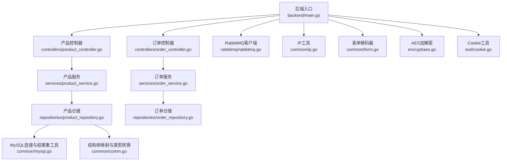
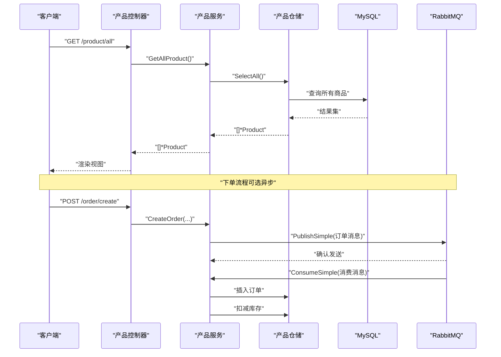
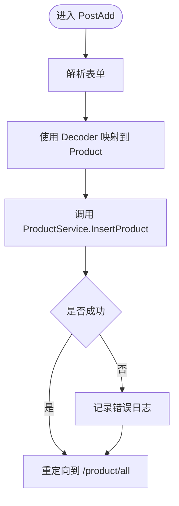
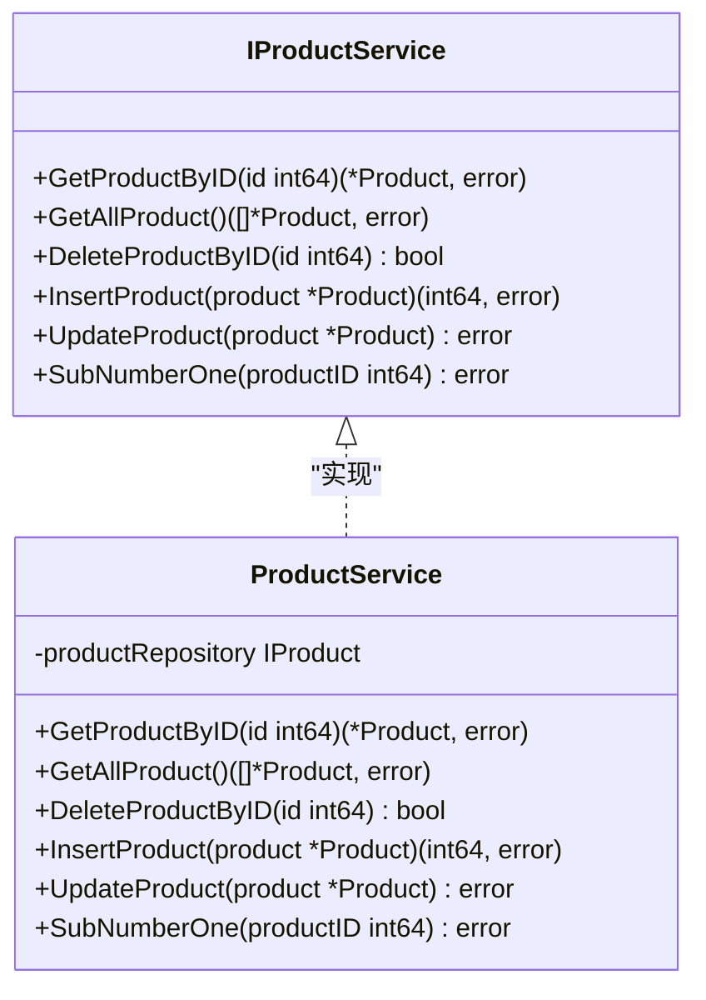
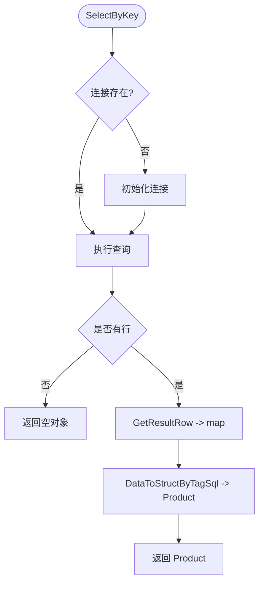
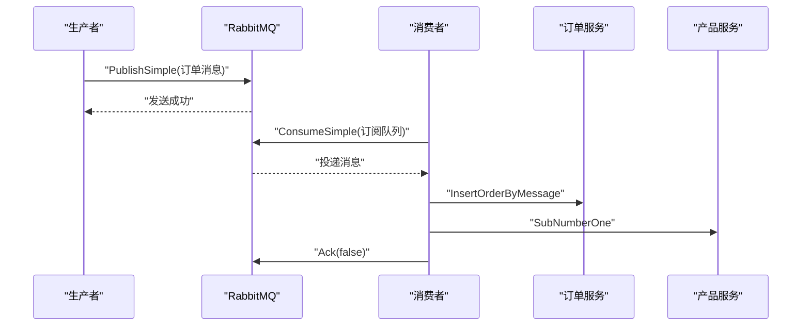
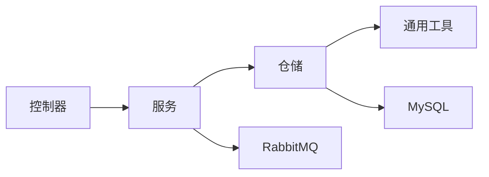

# 开发指南

<cite>
**本文引用的文件**
- [backend/main.go](file://backend/main.go)
- [common/comm.go](file://common/comm.go)
- [common/consistent.go](file://common/consistent.go)
- [common/ip.go](file://common/ip.go)
- [common/mysql.go](file://common/mysql.go)
- [common/form.go](file://common/form.go)
- [datamodels/product.go](file://datamodels/product.go)
- [services/product_service.go](file://services/product_service.go)
- [repositories/product_repository.go](file://repositories/product_repository.go)
- [backend/web/controllers/product_controller.go](file://backend/web/controllers/product_controller.go)
- [encrypt/aes.go](file://encrypt/aes.go)
- [tool/cookie.go](file://tool/cookie.go)
- [fronted/middleware/auth.go](file://fronted/middleware/auth.go)
- [rabbitmq/rabbitmq.go](file://rabbitmq/rabbitmq.go)
</cite>

## 目录
1. [简介](#简介)
2. [项目结构](#项目结构)
3. [核心组件](#核心组件)
4. [架构总览](#架构总览)
5. [详细组件分析](#详细组件分析)
6. [依赖关系分析](#依赖关系分析)
7. [性能考虑](#性能考虑)
8. [故障排查指南](#故障排查指南)
9. [结论](#结论)
10. [附录](#附录)

## 简介
本指南面向本项目（电商网站高并发）的后端开发与维护，目标是帮助开发者快速理解代码规范、常用工具函数、新功能开发最佳实践、代码审查与版本管理策略、调试与性能分析方法，以及扩展与插件机制。文档基于仓库现有实现进行提炼与总结，确保与实际代码一致，并提供可操作的实践建议。

## 项目结构
项目采用分层架构：Web 控制器层、服务层、仓储层、数据模型层、通用工具层、加密与消息队列等基础设施。入口在 backend/main.go，使用 Iris MVC 框架注册路由与服务。

图表来源
- [backend/main.go:14-59](file://backend/main.go#L14-L59)
- [backend/web/controllers/product_controller.go:12-95](file://backend/web/controllers/product_controller.go#L12-L95)
- [services/product_service.go:8-48](file://services/product_service.go#L8-L48)
- [repositories/product_repository.go:10-165](file://repositories/product_repository.go#L10-L165)
- [common/mysql.go:8-67](file://common/mysql.go#L8-L67)
- [common/comm.go:10-69](file://common/comm.go#L10-L69)
- [rabbitmq/rabbitmq.go:18-182](file://rabbitmq/rabbitmq.go#L18-L182)
- [common/ip.go:8-27](file://common/ip.go#L8-L27)
- [common/form.go:72-160](file://common/form.go#L72-L160)
- [encrypt/aes.go:11-100](file://encrypt/aes.go#L11-L100)
- [tool/cookie.go:8-12](file://tool/cookie.go#L8-L12)

章节来源
- [backend/main.go:14-59](file://backend/main.go#L14-L59)

## 核心组件
- Web 控制器层：负责解析请求、调用服务、渲染视图或重定向。示例见产品控制器。
- 服务层：封装业务逻辑，协调多个仓储或外部系统。示例见产品服务。
- 仓储层：封装数据库访问细节，提供统一的数据操作接口。示例见产品仓储。
- 数据模型层：定义领域对象及序列化标签。示例见产品模型。
- 通用工具：
  - MySQL 连接与结果集映射：NewMysqlConn、GetResultRow、GetResultRows。
  - 结构体映射与类型转换：DataToStructByTagSql、TypeConversion。
  - 一致性哈希：Consistent 结构体，用于节点选择与负载均衡。
  - IP 工具：获取非回环 IPv4 地址。
  - 表单解码：Decoder 支持复杂结构、切片、Map、自定义类型。
- 安全与工具：
  - AES 加解密：PKCS7Padding、AesEcrypt、AesDeCrypt、EnPwdCode、DePwdCode。
  - Cookie 工具：设置全局 Cookie。
- 中间件：认证中间件，检查登录状态并重定向。
- 消息队列：RabbitMQ 简单模式生产者与消费者，处理订单创建与库存扣减。

章节来源
- [backend/web/controllers/product_controller.go:12-95](file://backend/web/controllers/product_controller.go#L12-L95)
- [services/product_service.go:8-48](file://services/product_service.go#L8-L48)
- [repositories/product_repository.go:10-165](file://repositories/product_repository.go#L10-L165)
- [datamodels/product.go:1-10](file://datamodels/product.go#L1-L10)
- [common/mysql.go:8-67](file://common/mysql.go#L8-L67)
- [common/comm.go:10-69](file://common/comm.go#L10-L69)
- [common/consistent.go:32-160](file://common/consistent.go#L32-L160)
- [common/ip.go:8-27](file://common/ip.go#L8-L27)
- [common/form.go:72-160](file://common/form.go#L72-L160)
- [encrypt/aes.go:11-100](file://encrypt/aes.go#L11-L100)
- [tool/cookie.go:8-12](file://tool/cookie.go#L8-L12)
- [fronted/middleware/auth.go:5-16](file://fronted/middleware/auth.go#L5-L16)
- [rabbitmq/rabbitmq.go:18-182](file://rabbitmq/rabbitmq.go#L18-L182)

## 架构总览
系统以 Iris MVC 为入口，通过 Party 划分模块路由，注册服务与控制器。服务层依赖仓储层访问 MySQL；可选地通过 RabbitMQ 异步处理订单与库存。通用工具提供数据映射、一致性哈希、IP 获取、表单解码与安全加密能力。

图表来源
- [backend/web/controllers/product_controller.go:17-25](file://backend/web/controllers/product_controller.go#L17-L25)
- [services/product_service.go:30-32](file://services/product_service.go#L30-L32)
- [repositories/product_repository.go:129-152](file://repositories/product_repository.go#L129-L152)
- [common/mysql.go:14-67](file://common/mysql.go#L14-L67)
- [rabbitmq/rabbitmq.go:67-101](file://rabbitmq/rabbitmq.go#L67-L101)
- [rabbitmq/rabbitmq.go:104-182](file://rabbitmq/rabbitmq.go#L104-L182)

## 详细组件分析

### 控制器层（产品）
- 职责：解析表单参数、调用服务、返回视图或重定向。
- 关键点：
  - 使用 common.NewDecoder 将表单数据映射到 datamodels.Product，标签名为 imooc。
  - 错误日志记录与用户友好重定向。
  - URL 参数解析与类型转换。

图表来源
- [backend/web/controllers/product_controller.go:48-60](file://backend/web/controllers/product_controller.go#L48-L60)
- [common/form.go:123-160](file://common/form.go#L123-L160)
- [services/product_service.go:38-40](file://services/product_service.go#L38-L40)

章节来源
- [backend/web/controllers/product_controller.go:12-95](file://backend/web/controllers/product_controller.go#L12-L95)

### 服务层（产品）
- 职责：暴露业务方法，委托仓储执行具体数据操作。
- 关键点：
  - 接口 IProductService 定义清晰，便于测试与替换实现。
  - 方法包括按 ID 查询、全部查询、删除、新增、更新、库存扣减。

图表来源
- [services/product_service.go:8-48](file://services/product_service.go#L8-L48)

章节来源
- [services/product_service.go:8-48](file://services/product_service.go#L8-L48)

### 仓储层（产品）
- 职责：封装 SQL 操作，提供统一的 IProduct 接口。
- 关键点：
  - Conn() 懒加载数据库连接，默认表名 product。
  - 使用 Prepare 语句执行增删改查，避免注入风险。
  - 使用 common.GetResultRow/GetResultRows 将行数据转为 map，再通过 DataToStructByTagSql 映射到结构体。
  - SubProductNum 原子扣减库存（SQL 层面）。

图表来源
- [repositories/product_repository.go:107-126](file://repositories/product_repository.go#L107-L126)
- [common/mysql.go:14-34](file://common/mysql.go#L14-L34)
- [common/comm.go:10-33](file://common/comm.go#L10-L33)

章节来源
- [repositories/product_repository.go:10-165](file://repositories/product_repository.go#L10-L165)

### 数据模型（产品）
- 字段包含 JSON、SQL、imooc 标签，分别用于响应序列化、数据库列映射、表单解码。
- 建议：保持标签命名一致，便于工具链自动映射。

章节来源
- [datamodels/product.go:1-10](file://datamodels/product.go#L1-L10)

### 通用工具
- MySQL 连接与结果集：
  - NewMysqlConn：建立数据库连接。
  - GetResultRow/GetResultRows：将 sql.Rows 转换为 map 或 map 列表。
- 结构体映射与类型转换：
  - DataToStructByTagSql：根据 sql 标签将 map 值映射到结构体字段并做类型转换。
  - TypeConversion：支持 string、time.Time、int、float 等类型转换。
- 一致性哈希：
  - Consistent：维护虚拟节点，提供 Add/Remove/Get，用于节点选择与负载均衡。
- IP 工具：
  - GetIntranceIp：获取非回环 IPv4 地址。
- 表单解码：
  - Decoder：支持复杂结构、切片、Map、自定义类型与 UnmarshalText。

章节来源
- [common/mysql.go:8-67](file://common/mysql.go#L8-L67)
- [common/comm.go:10-69](file://common/comm.go#L10-L69)
- [common/consistent.go:32-160](file://common/consistent.go#L32-L160)
- [common/ip.go:8-27](file://common/ip.go#L8-L27)
- [common/form.go:72-160](file://common/form.go#L72-L160)

### 安全与工具
- AES 加解密：
  - PKCS7Padding/PKCS7UnPadding：填充与去填充。
  - AesEcrypt/AesDeCrypt：CBC 模式加解密。
  - EnPwdCode/DePwdCode：Base64 编码/解码的便捷方法。
- Cookie 工具：
  - GlobalCookie：设置全局 Cookie。

章节来源
- [encrypt/aes.go:11-100](file://encrypt/aes.go#L11-L100)
- [tool/cookie.go:8-12](file://tool/cookie.go#L8-L12)

### 中间件（认证）
- AuthConProduct：检查 Cookie uid，未登录则重定向至登录页。

章节来源
- [fronted/middleware/auth.go:5-16](file://fronted/middleware/auth.go#L5-L16)

### 消息队列（RabbitMQ）
- 简单模式：
  - PublishSimple：声明队列并发送消息。
  - ConsumeSimple：声明队列、设置 QoS、消费消息、手动 Ack。
- 业务集成：
  - 消费者中调用订单服务插入订单与产品服务扣减库存。

图表来源
- [rabbitmq/rabbitmq.go:67-101](file://rabbitmq/rabbitmq.go#L67-L101)
- [rabbitmq/rabbitmq.go:104-182](file://rabbitmq/rabbitmq.go#L104-L182)

章节来源
- [rabbitmq/rabbitmq.go:18-182](file://rabbitmq/rabbitmq.go#L18-L182)

## 依赖关系分析
- 控制器依赖服务，服务依赖仓储，仓储依赖通用工具与数据库。
- 消息队列作为可选异步通道，解耦订单创建与库存扣减。
- 一致性哈希可用于服务发现或缓存节点选择。

图表来源
- [backend/web/controllers/product_controller.go:12-95](file://backend/web/controllers/product_controller.go#L12-L95)
- [services/product_service.go:8-48](file://services/product_service.go#L8-L48)
- [repositories/product_repository.go:10-165](file://repositories/product_repository.go#L10-L165)
- [common/mysql.go:8-67](file://common/mysql.go#L8-L67)
- [rabbitmq/rabbitmq.go:18-182](file://rabbitmq/rabbitmq.go#L18-L182)

章节来源
- [backend/main.go:14-59](file://backend/main.go#L14-L59)
- [repositories/product_repository.go:10-165](file://repositories/product_repository.go#L10-L165)

## 性能考虑
- 数据库连接复用：仓储层懒加载连接，建议在应用启动时初始化并复用连接池。
- 预编译语句：仓储层已使用 Prepare 语句，减少解析开销。
- 批量读取：GetResultRows 适合小结果集；大结果集建议使用流式处理。
- 一致性哈希：虚拟节点数影响均衡性，可根据节点规模调整。
- 消息队列：合理设置 QoS，避免消费者过载；手动 Ack 保证可靠性。
- 模板与静态资源：Iris 已启用热重载与优化选项，生产环境建议关闭热重载。

[本节为通用指导，不直接分析具体文件]

## 故障排查指南
- 数据库连接失败：检查 NewMysqlConn 配置与网络连通性。
- 表单解码错误：确认结构体字段与 imooc 标签匹配，必要时启用 IgnoreUnknownKeys。
- 类型转换异常：检查 DataToStructByTagSql 与 TypeConversion 支持类型。
- 一致性哈希为空：确保至少一个节点已添加，否则 Get 返回错误。
- RabbitMQ 连接失败：检查 MQURL 与权限；failOnErr 会记录并终止进程。
- 中间件重定向循环：检查 Cookie 设置与读取路径是否一致。

章节来源
- [common/mysql.go:8-12](file://common/mysql.go#L8-L12)
- [common/form.go:123-160](file://common/form.go#L123-L160)
- [common/comm.go:35-69](file://common/comm.go#L35-L69)
- [common/consistent.go:144-160](file://common/consistent.go#L144-L160)
- [rabbitmq/rabbitmq.go:44-50](file://rabbitmq/rabbitmq.go#L44-L50)
- [fronted/middleware/auth.go:5-16](file://fronted/middleware/auth.go#L5-L16)

## 结论
本项目采用清晰的分层架构与丰富的通用工具，具备良好的可扩展性与可维护性。建议在后续开发中继续遵循接口优先、仓储抽象、工具复用原则，并结合消息队列实现异步解耦。同时完善单元测试与代码审查流程，保障质量与稳定性。

[本节为总结，不直接分析具体文件]

## 附录

### 代码规范与编程约定
- 命名规范：
  - 包名小写、简洁；文件名与包名一致。
  - 类型与方法首字母大写对外暴露，小写内部使用。
  - 常量使用全大写加下划线。
- 代码结构：
  - 控制器仅负责请求解析与响应组装，业务逻辑下沉至服务层。
  - 服务层通过接口依赖仓储，便于替换与测试。
  - 仓储层专注数据访问，使用预编译语句与统一结果集映射。
- 注释标准：
  - 对外接口需有简要说明；复杂逻辑增加行内注释。
  - 错误分支与边界条件需明确标注。

[本节为通用指导，不直接分析具体文件]

### 常用工具函数使用指南
- 表单解码：
  - 使用 common.NewDecoder 并指定 TagName 为 imooc，将 url.Values 映射到结构体。
  - 支持嵌套结构、切片、Map 与自定义类型。
- 结构体映射：
  - 使用 DataToStructByTagSql 将 map[string]string 映射到结构体，字段需带 sql 标签。
  - TypeConversion 支持常见类型转换。
- 一致性哈希：
  - 使用 NewConsistent 创建实例，Add 添加节点，Get 获取最近节点。
  - VirtualNode 控制虚拟节点数量，平衡分布。
- IP 工具：
  - GetIntranceIp 返回非回环 IPv4 地址，适用于服务注册与发现。
- AES 加解密：
  - EnPwdCode/DePwdCode 用于密码等敏感数据的加解密。
  - 注意密钥管理与轮换。

章节来源
- [common/form.go:123-160](file://common/form.go#L123-L160)
- [common/comm.go:10-69](file://common/comm.go#L10-L69)
- [common/consistent.go:44-160](file://common/consistent.go#L44-L160)
- [common/ip.go:8-27](file://common/ip.go#L8-L27)
- [encrypt/aes.go:11-100](file://encrypt/aes.go#L11-L100)

### 新功能开发最佳实践
- 模块设计：
  - 新增功能先定义接口（如 IProductService），再实现具体逻辑。
  - 控制器只负责路由与参数绑定，业务逻辑集中在服务层。
- 接口定义：
  - 接口应小而精，聚焦单一职责；避免过度抽象。
  - 返回值明确错误信息，便于上层处理。
- 单元测试：
  - 对服务与仓储编写单测，使用 mock 替代真实依赖。
  - 覆盖正常路径与异常路径，验证边界条件。

[本节为通用指导，不直接分析具体文件]

### 代码审查流程与版本管理策略
- 代码审查：
  - 提交前自测通过；关注接口契约、错误处理、日志输出。
  - 审查重点：安全性（SQL 注入、敏感信息）、性能（N+1 查询、锁竞争）、可维护性（命名、注释）。
- 版本管理：
  - 使用语义化版本；分支策略推荐 Git Flow。
  - 提交信息规范：类型 + 简短描述；变更点清晰。

[本节为通用指导，不直接分析具体文件]

### 调试技巧与性能分析方法
- 调试技巧：
  - 使用 Iris 日志级别 debug，定位请求链路。
  - 关键路径打印必要上下文（如 ID、时间戳）。
  - 中间件与控制器断点调试，逐步验证数据流转。
- 性能分析：
  - 使用 pprof 分析 CPU 与内存占用。
  - 数据库慢查询日志与索引优化。
  - 消息队列消费速率与积压监控。

[本节为通用指导，不直接分析具体文件]

### 扩展开发与插件机制
- 插件机制：
  - 通过服务接口扩展新能力，无需修改现有控制器。
  - 仓储层可按领域拆分，新增独立仓储并注册到服务。
- 扩展原则：
  - 开闭原则：对扩展开放，对修改封闭。
  - 依赖倒置：高层模块依赖抽象接口，便于替换与测试。
  - 配置外置：敏感信息与运行时配置通过环境变量或配置文件管理。

[本节为通用指导，不直接分析具体文件]