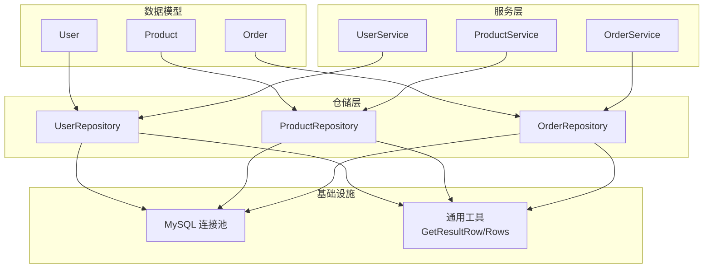
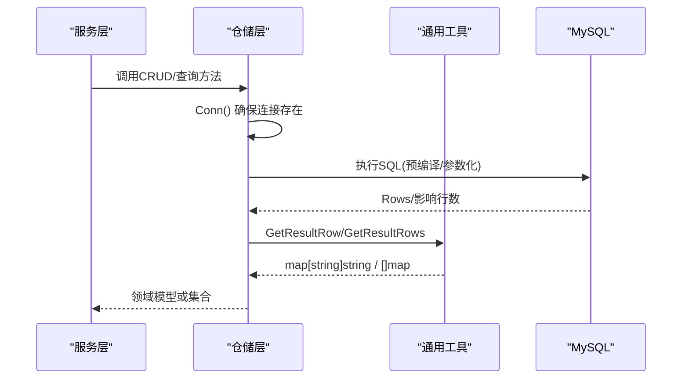
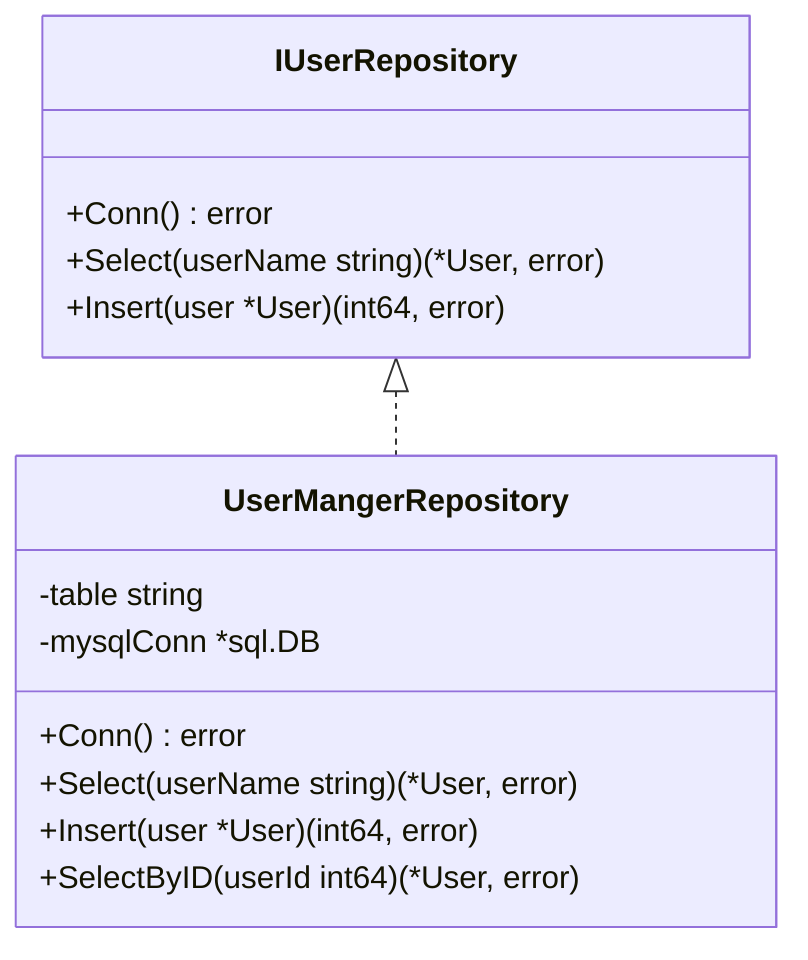
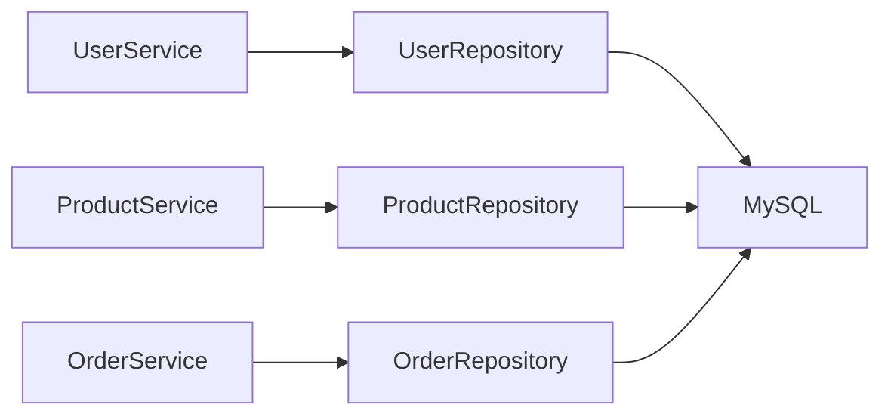
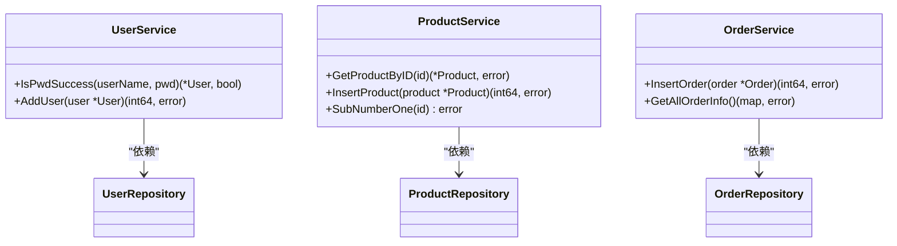
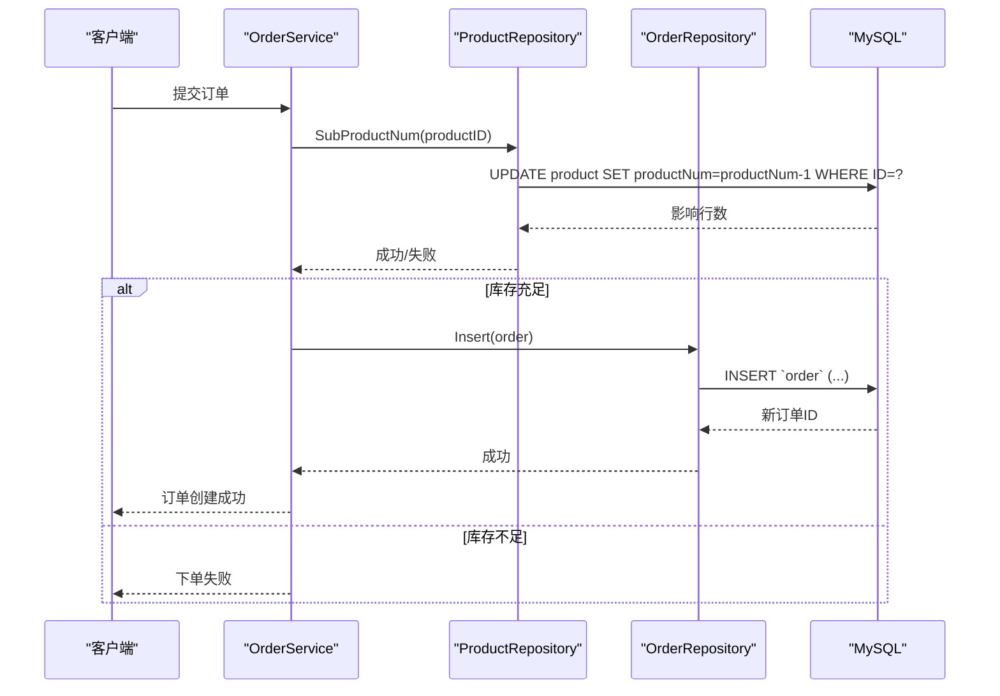
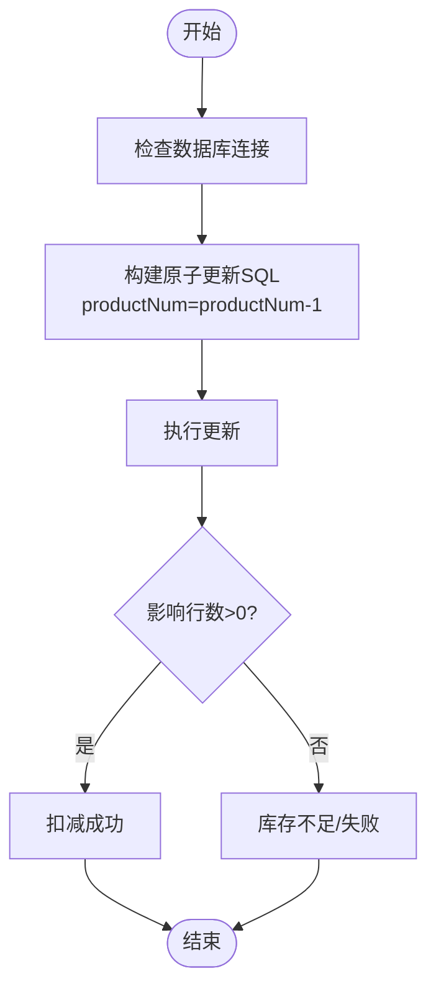

# 数据层设计

<cite>
**本文引用的文件**
- [datamodels/user.go](file://datamodels/user.go)
- [datamodels/product.go](file://datamodels/product.go)
- [datamodels/order.go](file://datamodels/order.go)
- [repositories/user_repository.go](file://repositories/user_repository.go)
- [repositories/product_repository.go](file://repositories/product_repository.go)
- [repositories/order_repository.go](file://repositories/order_repository.go)
- [common/mysql.go](file://common/mysql.go)
- [services/user_service.go](file://services/user_service.go)
- [services/product_service.go](file://services/product_service.go)
- [services/order_service.go](file://services/order_service.go)
</cite>

## 目录
1. [引言](#引言)
2. [项目结构](#项目结构)
3. [核心组件](#核心组件)
4. [架构总览](#架构总览)
5. [详细组件分析](#详细组件分析)
6. [依赖关系分析](#依赖关系分析)
7. [性能考虑](#性能考虑)
8. [故障排查指南](#故障排查指南)
9. [结论](#结论)
10. [附录](#附录)

## 引言
本文件聚焦于电商系统的数据层设计，围绕数据库表结构设计、Repository 模式实现、数据库连接与事务、SQL 优化策略、数据迁移与一致性保障、以及性能调优与监控指标进行系统化说明。文档面向不同技术背景的读者，既提供高层概览，也给出代码级映射与可视化图示，帮助快速理解并落地实践。

## 项目结构
数据层由三层组成：
- 数据模型层（datamodels）：定义用户、商品、订单等实体字段及状态常量。
- 仓储层（repositories）：基于 Repository 模式封装对 MySQL 的访问，提供 CRUD 与查询条件构建能力。
- 服务层（services）：编排业务逻辑，调用仓储完成数据操作，并在必要时组合多个仓储操作。

图表来源
- [datamodels/user.go:1-9](file://datamodels/user.go#L1-L9)
- [datamodels/product.go:1-10](file://datamodels/product.go#L1-L10)
- [datamodels/order.go:1-15](file://datamodels/order.go#L1-L15)
- [repositories/user_repository.go:1-99](file://repositories/user_repository.go#L1-L99)
- [repositories/product_repository.go:1-165](file://repositories/product_repository.go#L1-L165)
- [repositories/order_repository.go:1-146](file://repositories/order_repository.go#L1-L146)
- [common/mysql.go:1-67](file://common/mysql.go#L1-L67)
- [services/user_service.go:1-58](file://services/user_service.go#L1-L58)
- [services/product_service.go:1-48](file://services/product_service.go#L1-L48)
- [services/order_service.go:1-64](file://services/order_service.go#L1-L64)

章节来源
- [datamodels/user.go:1-9](file://datamodels/user.go#L1-L9)
- [datamodels/product.go:1-10](file://datamodels/product.go#L1-L10)
- [datamodels/order.go:1-15](file://datamodels/order.go#L1-L15)
- [repositories/user_repository.go:1-99](file://repositories/user_repository.go#L1-L99)
- [repositories/product_repository.go:1-165](file://repositories/product_repository.go#L1-L165)
- [repositories/order_repository.go:1-146](file://repositories/order_repository.go#L1-L146)
- [common/mysql.go:1-67](file://common/mysql.go#L1-L67)
- [services/user_service.go:1-58](file://services/user_service.go#L1-L58)
- [services/product_service.go:1-48](file://services/product_service.go#L1-L48)
- [services/order_service.go:1-64](file://services/order_service.go#L1-L64)

## 核心组件
- 数据模型
  - 用户：包含标识、昵称、用户名、密码哈希等字段。
  - 商品：包含标识、名称、库存数量、图片、链接等字段。
  - 订单：包含标识、用户ID、商品ID、订单状态；并提供订单状态常量。
- 仓储接口与实现
  - 用户仓储：提供按用户名查询、插入、按ID查询等方法。
  - 商品仓储：提供插入、删除、更新、按ID查询、全量查询、库存扣减等方法。
  - 订单仓储：提供插入、删除、更新、按ID查询、全量查询、带商品信息联查等方法。
- 服务编排
  - 用户服务：密码加盐与校验、新增用户。
  - 商品服务：商品CRUD与库存扣减。
  - 订单服务：订单CRUD与从消息创建订单。

章节来源
- [datamodels/user.go:1-9](file://datamodels/user.go#L1-L9)
- [datamodels/product.go:1-10](file://datamodels/product.go#L1-L10)
- [datamodels/order.go:1-15](file://datamodels/order.go#L1-L15)
- [repositories/user_repository.go:1-99](file://repositories/user_repository.go#L1-L99)
- [repositories/product_repository.go:1-165](file://repositories/product_repository.go#L1-L165)
- [repositories/order_repository.go:1-146](file://repositories/order_repository.go#L1-L146)
- [services/user_service.go:1-58](file://services/user_service.go#L1-L58)
- [services/product_service.go:1-48](file://services/product_service.go#L1-L48)
- [services/order_service.go:1-64](file://services/order_service.go#L1-L64)

## 架构总览
数据访问采用分层架构：服务层通过仓储接口访问数据库，仓储层负责 SQL 拼装、参数绑定、结果集映射到领域模型。数据库连接通过统一工具初始化，结果集读取使用通用方法将行转为键值映射，再映射为结构体。

图表来源
- [repositories/user_repository.go:26-63](file://repositories/user_repository.go#L26-L63)
- [repositories/product_repository.go:33-151](file://repositories/product_repository.go#L33-L151)
- [repositories/order_repository.go:29-145](file://repositories/order_repository.go#L29-L145)
- [common/mysql.go:15-66](file://common/mysql.go#L15-L66)

## 详细组件分析

### 数据库表结构设计
- 用户表（user）
  - 字段：ID、nickName、userName、passWord
  - 主键：ID
  - 索引建议：userName 建立唯一索引以支持登录与查询
  - 约束：passWord 存储哈希值，非空
- 商品表（product）
  - 字段：ID、productName、productNum、productImage、productUrl
  - 主键：ID
  - 索引建议：productName 可建普通索引用于检索；productNum 作为库存字段需保证非负
  - 约束：productNum >= 0
- 订单表（order）
  - 字段：ID、userID、productID、orderStatus
  - 主键：ID
  - 外键建议：userID 引用 user.ID；productID 引用 product.ID
  - 索引建议：userID、productID 分别建立索引以提升按用户/商品查询效率；orderStatus 可按需建索引
  - 约束：orderStatus 取值受限于枚举（等待、成功、失败）

章节来源
- [datamodels/user.go:1-9](file://datamodels/user.go#L1-L9)
- [datamodels/product.go:1-10](file://datamodels/product.go#L1-L10)
- [datamodels/order.go:1-15](file://datamodels/order.go#L1-L15)

### Repository 模式实现
- 抽象与解耦
  - 每个实体对应一个仓储接口，屏蔽底层 SQL 细节，便于替换实现与测试。
- 连接管理
  - Conn() 方法在首次使用时懒加载数据库连接，避免重复创建；默认表名可在构造时注入或回退到约定值。
- CRUD 封装
  - 插入：使用预编译语句与参数绑定，返回自增ID。
  - 更新/删除：按主键定位，参数化防止注入。
  - 查询：单行与多行读取统一通过通用工具转换为 map，再映射为结构体。
- 查询条件构建
  - 通过方法签名限定查询维度（如按ID、按用户名），复杂查询在仓储内组合条件。

图表来源
- [repositories/user_repository.go:11-99](file://repositories/user_repository.go#L11-L99)

章节来源
- [repositories/user_repository.go:1-99](file://repositories/user_repository.go#L1-L99)
- [repositories/product_repository.go:1-165](file://repositories/product_repository.go#L1-L165)
- [repositories/order_repository.go:1-146](file://repositories/order_repository.go#L1-L146)
- [common/mysql.go:1-67](file://common/mysql.go#L1-L67)

### 数据库连接管理
- 连接初始化
  - 通过统一入口创建 MySQL 连接，驱动注册与DSN配置集中管理。
- 连接复用
  - 仓储实例缓存 sql.DB 指针，避免重复 Open；建议在应用启动时全局初始化连接池并注入仓储。
- 资源释放
  - 查询结果集使用 defer 关闭；生产环境应设置连接池最大空闲数、最大连接数、连接超时等参数。

章节来源
- [common/mysql.go:9-12](file://common/mysql.go#L9-L12)
- [repositories/user_repository.go:26-38](file://repositories/user_repository.go#L26-L38)
- [repositories/product_repository.go:33-45](file://repositories/product_repository.go#L33-L45)
- [repositories/order_repository.go:29-41](file://repositories/order_repository.go#L29-L41)

### 事务处理机制
- 现状
  - 当前仓储方法多为单条SQL操作，未显式开启事务。
- 建议方案
  - 在需要跨表一致性的场景（如下单扣库存+写订单）使用数据库事务：
    - 服务层协调多个仓储调用，包裹在同一事务中。
    - 任一步骤失败则回滚，保证数据一致性。
  - 对于高并发扣库存，建议使用原子更新（如 productNum = productNum - 1）配合唯一约束或乐观锁版本号。

章节来源
- [repositories/product_repository.go:154-165](file://repositories/product_repository.go#L154-L165)
- [repositories/order_repository.go:43-60](file://repositories/order_repository.go#L43-L60)
- [services/order_service.go:51-61](file://services/order_service.go#L51-L61)

### SQL 优化策略
- 参数化与预编译
  - 所有写入与关键查询使用预编译与参数绑定，避免SQL注入与重复解析。
- 索引设计
  - 为高频查询列建立合适索引（如 userName、userID、productID）。
  - 复合索引用于多条件查询（如 userID + orderStatus）。
- 查询精简
  - 仅选择必要字段，减少网络传输与内存占用。
- 批量操作
  - 大批量写入使用批量插入；读取分页限制结果集大小。
- 关联查询
  - 联表查询注意索引命中与排序字段；必要时拆分为多次查询后在应用层组装。

章节来源
- [repositories/product_repository.go:48-65](file://repositories/product_repository.go#L48-L65)
- [repositories/order_repository.go:135-145](file://repositories/order_repository.go#L135-L145)
- [repositories/user_repository.go:40-63](file://repositories/user_repository.go#L40-L63)

### 数据迁移方案
- 版本化脚本
  - 使用迁移工具（如 golang-migrate）维护DDL变更历史，按版本号顺序执行。
- 灰度与回滚
  - 先向后兼容变更（如新增列），再逐步替换读取逻辑；必要时保留旧列并行一段时间。
- 幂等性
  - 迁移脚本具备幂等性，支持重试与回滚。

[本节为通用实践说明，不直接引用具体代码文件]

### 数据一致性保证机制
- 强一致
  - 下单流程使用事务：创建订单与扣减库存在同一事务中提交。
- 最终一致
  - 异步消息驱动下单：消费者收到消息后落库订单，结合幂等键与重试机制保证至少一次消费。
- 防超卖
  - 库存扣减使用原子更新与唯一约束；在高并发下结合分布式锁或队列串行化。

章节来源
- [repositories/product_repository.go:154-165](file://repositories/product_repository.go#L154-L165)
- [repositories/order_repository.go:43-60](file://repositories/order_repository.go#L43-L60)
- [services/order_service.go:51-61](file://services/order_service.go#L51-L61)

## 依赖关系分析
仓储与服务之间的依赖清晰，服务层通过接口依赖仓储，降低耦合度。

图表来源
- [services/user_service.go:15-21](file://services/user_service.go#L15-L21)
- [services/product_service.go:17-24](file://services/product_service.go#L17-L24)
- [services/order_service.go:18-24](file://services/order_service.go#L18-L24)
- [repositories/user_repository.go:17-24](file://repositories/user_repository.go#L17-L24)
- [repositories/product_repository.go:23-30](file://repositories/product_repository.go#L23-L30)
- [repositories/order_repository.go:20-27](file://repositories/order_repository.go#L20-L27)

章节来源
- [services/user_service.go:1-58](file://services/user_service.go#L1-L58)
- [services/product_service.go:1-48](file://services/product_service.go#L1-L48)
- [services/order_service.go:1-64](file://services/order_service.go#L1-L64)
- [repositories/user_repository.go:1-99](file://repositories/user_repository.go#L1-L99)
- [repositories/product_repository.go:1-165](file://repositories/product_repository.go#L1-L165)
- [repositories/order_repository.go:1-146](file://repositories/order_repository.go#L1-L146)

## 性能考虑
- 连接池配置
  - 合理设置最大连接数、最大空闲连接数、连接生命周期与超时，避免连接耗尽或频繁创建。
- 查询优化
  - 使用 EXPLAIN 分析慢查询，确保走索引；避免 SELECT *，只取必要列。
- 写入优化
  - 批量插入、减少事务粒度；热点行更新使用原子操作。
- 缓存策略
  - 读多写少的数据（如商品详情）引入缓存层，减轻数据库压力。
- 监控指标
  - 连接池：活跃连接数、等待获取连接数、连接泄漏。
  - 查询：QPS、TP99/TP95延迟、慢查询数量、错误率。
  - 事务：事务提交/回滚比率、长事务数量。
  - 资源：CPU、IO、锁等待时间。

[本节为通用指导，不直接引用具体代码文件]

## 故障排查指南
- 常见问题
  - 连接失败：检查DSN、网络连通性与权限。
  - 查询为空：确认条件参数与索引命中情况。
  - 插入失败：核对字段类型与长度、唯一约束冲突。
- 日志与诊断
  - 记录SQL与参数、耗时与错误堆栈；对慢查询进行采样与分析。
- 恢复策略
  - 重试与熔断：对瞬时错误进行有限重试；持续失败触发熔断降级。
  - 数据修复：基于备份与binlog进行时间点恢复。

章节来源
- [repositories/user_repository.go:40-63](file://repositories/user_repository.go#L40-L63)
- [repositories/product_repository.go:68-104](file://repositories/product_repository.go#L68-L104)
- [repositories/order_repository.go:62-90](file://repositories/order_repository.go#L62-L90)

## 结论
本数据层设计通过清晰的模型定义与 Repository 模式实现了数据访问的解耦与封装，结合统一的连接管理与结果集处理提升了可维护性。针对高并发与一致性需求，建议引入事务、原子更新与缓存策略，并通过完善的监控与排障体系保障稳定性与性能。

## 附录

### 类图：仓储与服务

图表来源
- [services/user_service.go:10-21](file://services/user_service.go#L10-L21)
- [services/product_service.go:8-24](file://services/product_service.go#L8-L24)
- [services/order_service.go:8-24](file://services/order_service.go#L8-L24)
- [repositories/user_repository.go:11-24](file://repositories/user_repository.go#L11-L24)
- [repositories/product_repository.go:12-30](file://repositories/product_repository.go#L12-L30)
- [repositories/order_repository.go:10-27](file://repositories/order_repository.go#L10-L27)

### 序列图：下单流程（含库存扣减）

图表来源
- [repositories/product_repository.go:154-165](file://repositories/product_repository.go#L154-L165)
- [repositories/order_repository.go:43-60](file://repositories/order_repository.go#L43-L60)
- [services/order_service.go:51-61](file://services/order_service.go#L51-L61)

### 流程图：库存扣减算法

图表来源
- [repositories/product_repository.go:154-165](file://repositories/product_repository.go#L154-L165)