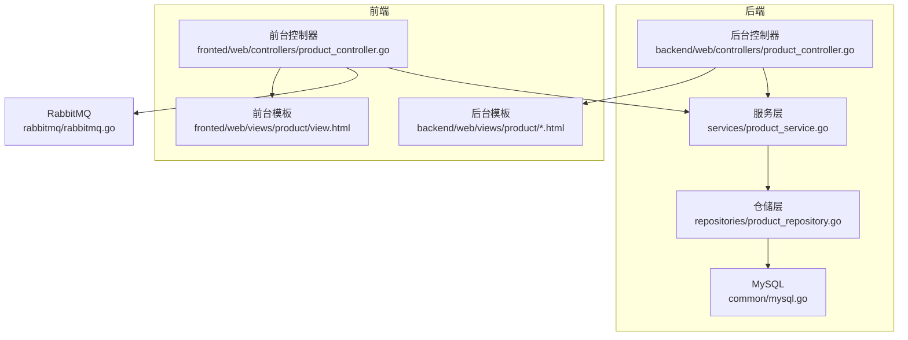
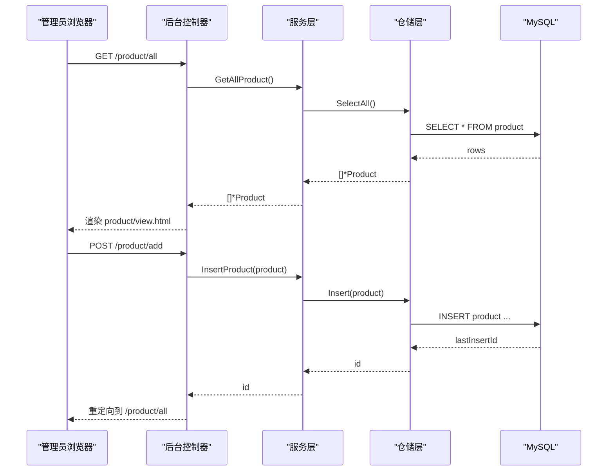
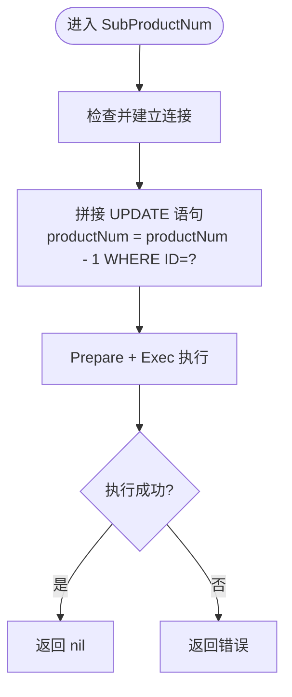
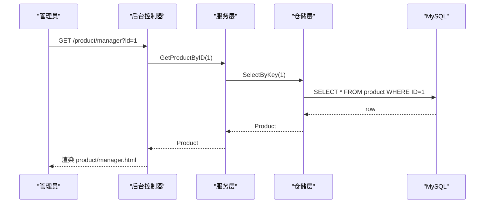
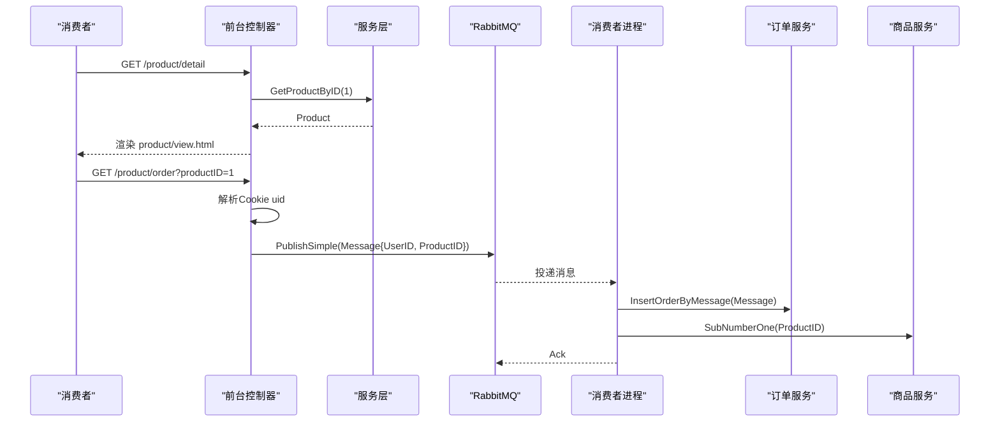
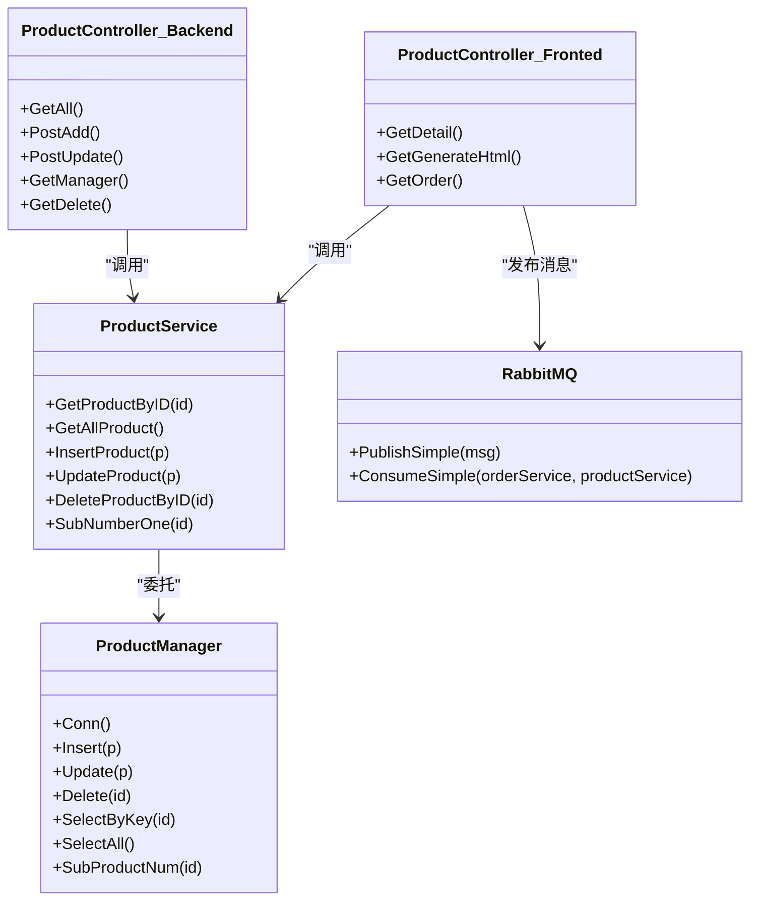

# 商品管理模块

<cite>
**本文引用的文件**   
- [product.go](file://datamodels/product.go)
- [product_service.go](file://services/product_service.go)
- [product_repository.go](file://repositories/product_repository.go)
- [backend product_controller.go](file://backend/web/controllers/product_controller.go)
- [fronted product_controller.go](file://fronted/web/controllers/product_controller.go)
- [backend view.html](file://backend/web/views/product/view.html)
- [backend add.html](file://backend/web/views/product/add.html)
- [backend manager.html](file://backend/web/views/product/manager.html)
- [fronted view.html](file://fronted/web/views/product/view.html)
- [mysql.go](file://common/mysql.go)
- [message.go](file://datamodels/message.go)
- [rabbitmq.go](file://rabbitmq/rabbitmq.go)
</cite>

## 目录
1. [简介](#简介)
2. [项目结构](#项目结构)
3. [核心组件](#核心组件)
4. [架构总览](#架构总览)
5. [详细组件分析](#详细组件分析)
6. [依赖关系分析](#依赖关系分析)
7. [性能与缓存策略](#性能与缓存策略)
8. [API 接口文档](#api-接口文档)
9. [故障排查指南](#故障排查指南)
10. [结论](#结论)

## 简介
本模块为电商系统的“商品管理”子系统，提供商品的增删改查、库存扣减、前端展示与静态页面生成、以及基于消息队列的异步下单流程。后端采用分层架构（控制器-服务-仓储），数据持久化使用 MySQL；前端包含后台管理视图与面向消费者的商品详情页面，支持静态 HTML 预渲染与抢购入口。

## 项目结构
围绕商品管理的代码主要分布在以下目录：
- datamodels: 领域模型定义（商品、消息）
- repositories: 数据访问层（MySQL CRUD）
- services: 业务逻辑层（封装仓储调用）
- backend/web/controllers: 后台管理控制器（MVC 视图渲染）
- fronted/web/controllers: 前台控制器（详情展示、静态页生成、订单消息发布）
- common: 数据库连接与通用工具
- rabbitmq: 消息队列生产者/消费者

图表来源
- [backend product_controller.go:17-94](file://backend/web/controllers/product_controller.go#L17-L94)
- [product_service.go:8-48](file://services/product_service.go#L8-L48)
- [product_repository.go:12-165](file://repositories/product_repository.go#L12-L165)
- [mysql.go:9-67](file://common/mysql.go#L9-L67)
- [fronted product_controller.go:32-120](file://fronted/web/controllers/product_controller.go#L32-L120)
- [rabbitmq.go:68-181](file://rabbitmq/rabbitmq.go#L68-L181)

章节来源
- [backend product_controller.go:17-94](file://backend/web/controllers/product_controller.go#L17-L94)
- [product_service.go:8-48](file://services/product_service.go#L8-L48)
- [product_repository.go:12-165](file://repositories/product_repository.go#L12-L165)
- [mysql.go:9-67](file://common/mysql.go#L9-L67)
- [fronted product_controller.go:32-120](file://fronted/web/controllers/product_controller.go#L32-L120)
- [rabbitmq.go:68-181](file://rabbitmq/rabbitmq.go#L68-L181)

## 核心组件
- 商品数据模型：Product 结构体，包含 ID、名称、数量、图片地址、访问链接等字段。
- 服务层：IProductService 接口与 ProductService 实现，封装仓储操作并提供业务方法（如库存扣减）。
- 仓储层：IProduct 接口与 ProductManager 实现，负责 SQL 构建、参数绑定、结果映射。
- 后台控制器：处理商品列表、新增、编辑、删除等 MVC 请求，渲染后台模板。
- 前台控制器：商品详情展示、静态 HTML 生成、向 RabbitMQ 发送购买消息。
- 数据库工具：MySQL 连接与行/列扫描工具。
- 消息模型与队列：Message 结构与 RabbitMQ 生产/消费封装。

章节来源
- [product.go:3-9](file://datamodels/product.go#L3-L9)
- [product_service.go:8-48](file://services/product_service.go#L8-L48)
- [product_repository.go:12-165](file://repositories/product_repository.go#L12-L165)
- [backend product_controller.go:12-94](file://backend/web/controllers/product_controller.go#L12-L94)
- [fronted product_controller.go:17-120](file://fronted/web/controllers/product_controller.go#L17-L120)
- [mysql.go:9-67](file://common/mysql.go#L9-L67)
- [message.go:4-12](file://datamodels/message.go#L4-L12)
- [rabbitmq.go:19-181](file://rabbitmq/rabbitmq.go#L19-L181)

## 架构总览
系统采用经典的三层架构，结合前后端分离的视图渲染与静态化能力，并通过消息队列解耦下单流程。

图表来源
- [backend product_controller.go:17-60](file://backend/web/controllers/product_controller.go#L17-L60)
- [product_service.go:30-40](file://services/product_service.go#L30-L40)
- [product_repository.go:48-65](file://repositories/product_repository.go#L48-L65)
- [mysql.go:9-67](file://common/mysql.go#L9-L67)

## 详细组件分析

### 数据模型设计
- 商品实体 Product
  - ID: 自增主键
  - ProductName: 商品名称
  - ProductNum: 库存数量
  - ProductImage: 图片 URL
  - ProductUrl: 商品访问链接
- 消息实体 Message
  - UserID: 用户ID
  - ProductID: 商品ID

该模型简洁，适合基础电商场景。若需扩展分类、价格、规格等，可在现有结构上增加字段或引入关联表。

章节来源
- [product.go:3-9](file://datamodels/product.go#L3-L9)
- [message.go:4-12](file://datamodels/message.go#L4-L12)

### 仓储层（Repository）
- IProduct 接口定义了 Conn、Insert、Delete、Update、SelectByKey、SelectAll、SubProductNum 等方法。
- ProductManager 实现：
  - 连接管理：Conn() 懒加载数据库连接，默认表名为 product。
  - 插入/更新/删除：使用 Prepare + Exec 执行 SQL，返回影响结果或错误。
  - 查询：SelectByKey/SelectAll 通过 common.GetResultRow(s) 将行数据映射到 map，再借助 DataToStructByTagSql 填充结构体。
  - 库存扣减：SubProductNum 直接执行原子递减 SQL。

图表来源
- [product_repository.go:154-165](file://repositories/product_repository.go#L154-L165)

章节来源
- [product_repository.go:12-165](file://repositories/product_repository.go#L12-L165)
- [mysql.go:14-67](file://common/mysql.go#L14-L67)

### 服务层（Service）
- IProductService 暴露 GetProductByID、GetAllProduct、DeleteProductByID、InsertProduct、UpdateProduct、SubNumberOne。
- ProductService 仅做薄封装，委托给仓储层。

章节来源
- [product_service.go:8-48](file://services/product_service.go#L8-L48)

### 后台控制器（Backend Controller）
- GetAll: 获取全部商品并渲染 product/view.html。
- PostAdd: 解析表单，调用 InsertProduct，成功后重定向。
- PostUpdate: 解析表单，调用 UpdateProduct，成功后重定向。
- GetManager: 根据 ID 查询商品并渲染 product/manager.html。
- GetDelete: 根据 ID 删除商品并重定向。

图表来源
- [backend product_controller.go:62-79](file://backend/web/controllers/product_controller.go#L62-L79)
- [product_service.go:26-28](file://services/product_service.go#L26-L28)
- [product_repository.go:107-125](file://repositories/product_repository.go#L107-L125)

章节来源
- [backend product_controller.go:17-94](file://backend/web/controllers/product_controller.go#L17-L94)

### 前台控制器（Fronted Controller）
- GetDetail: 获取单个商品并渲染前台产品详情页。
- GetGenerateHtml: 读取模板 product.html，渲染后写入静态文件 htmlProductShow/htmlProduct.html。
- GetOrder: 从 Cookie 中取用户ID，构造 Message，序列化后通过 RabbitMQ 发送简单模式消息。

图表来源
- [fronted product_controller.go:80-120](file://fronted/web/controllers/product_controller.go#L80-L120)
- [rabbitmq.go:68-181](file://rabbitmq/rabbitmq.go#L68-L181)

章节来源
- [fronted product_controller.go:32-120](file://fronted/web/controllers/product_controller.go#L32-L120)
- [rabbitmq.go:68-181](file://rabbitmq/rabbitmq.go#L68-L181)

### 视图模板与渲染逻辑
- 后台列表页 product/view.html
  - 遍历 productArray，展示 ID、图片、名称、链接，并提供“修改/删除”操作按钮。
- 后台新增页 product/add.html
  - 表单字段：ProductName、ProductNum、ProductImage、ProductUrl。
- 后台编辑页 product/manager.html
  - 预填当前商品数据，提交至 /product/update。
- 前台详情页 fronted/web/views/product/view.html
  - 展示商品图片轮播、名称、价格占位、库存显示、抢购按钮（跳转 /product/order）。

章节来源
- [backend view.html:1-44](file://backend/web/views/product/view.html#L1-L44)
- [backend add.html:1-54](file://backend/web/views/product/add.html#L1-L54)
- [backend manager.html:1-54](file://backend/web/views/product/manager.html#L1-L54)
- [fronted view.html:256-373](file://fronted/web/views/product/view.html#L256-L373)

## 依赖关系分析
- 控制器依赖服务层，服务层依赖仓储层，仓储层依赖数据库工具。
- 前台控制器额外依赖消息队列以异步下单。
- 模板引擎使用 Iris MVC 视图机制与 Go text/template 进行静态化。

图表来源
- [backend product_controller.go:12-94](file://backend/web/controllers/product_controller.go#L12-L94)
- [fronted product_controller.go:17-120](file://fronted/web/controllers/product_controller.go#L17-L120)
- [product_service.go:8-48](file://services/product_service.go#L8-L48)
- [product_repository.go:12-165](file://repositories/product_repository.go#L12-L165)
- [rabbitmq.go:68-181](file://rabbitmq/rabbitmq.go#L68-L181)

章节来源
- [backend product_controller.go:12-94](file://backend/web/controllers/product_controller.go#L12-L94)
- [fronted product_controller.go:17-120](file://fronted/web/controllers/product_controller.go#L17-L120)
- [product_service.go:8-48](file://services/product_service.go#L8-L48)
- [product_repository.go:12-165](file://repositories/product_repository.go#L12-L165)
- [rabbitmq.go:68-181](file://rabbitmq/rabbitmq.go#L68-L181)

## 性能与缓存策略
- 数据库层面
  - 使用 Prepare + Exec 减少 SQL 解析开销。
  - 建议在 product 表的 productName、ID 上建立索引以提升查询效率。
- 静态化
  - 前台详情页支持生成静态 HTML，降低动态渲染压力，提升首屏速度。
- 缓存建议
  - 对热门商品详情可引入内存缓存（如 Redis）以减少数据库读放大。
  - 对商品列表可做分页与缓存，避免全量查询。
- 并发与事务
  - 库存扣减建议使用数据库级原子操作（已实现 productNum-1），在高并发场景下配合唯一约束或乐观锁防止超卖。
- 批量操作
  - 批量新增/更新可通过循环调用仓储层实现，但需注意连接池与事务边界；建议封装批量方法并使用事务保证一致性。

[本节为通用优化建议，不直接分析具体文件]

## API 接口文档

### 后台管理接口

- 获取商品列表
  - 路径: GET /product/all
  - 响应: 渲染 product/view.html，数据包含 productArray
  - 错误: 无显式错误码，异常通过日志记录

- 新增商品
  - 路径: POST /product/add
  - 表单字段: ProductName, ProductNum, ProductImage, ProductUrl
  - 响应: 重定向到 /product/all
  - 错误: 解析失败或入库失败时记录日志

- 修改商品
  - 路径: POST /product/update
  - 表单字段: ID, ProductName, ProductNum, ProductImage, ProductUrl
  - 响应: 重定向到 /product/all
  - 错误: 解析失败或更新失败时记录日志

- 查看编辑页
  - 路径: GET /product/manager?id={id}
  - 响应: 渲染 product/manager.html，数据包含 product
  - 错误: 查询失败时记录日志

- 删除商品
  - 路径: GET /product/delete?id={id}
  - 响应: 重定向到 /product/all
  - 错误: 删除失败时记录日志

章节来源
- [backend product_controller.go:17-94](file://backend/web/controllers/product_controller.go#L17-L94)

### 前台接口

- 商品详情
  - 路径: GET /product/detail
  - 响应: 渲染 fronted/web/views/product/view.html，数据包含 product
  - 错误: 查询失败时记录日志

- 生成静态商品页
  - 路径: GET /product/generateHtml?productID={id}
  - 行为: 读取模板 product.html，渲染后写入 ./fronted/web/htmlProductShow/htmlProduct.html
  - 错误: 模板解析或文件写入失败时记录日志

- 下单（消息发布）
  - 路径: GET /product/order?productID={id}
  - 行为: 从 Cookie 读取 uid，构造 Message，序列化后通过 RabbitMQ 发送
  - 响应: 返回字符串 "true"
  - 错误: 解析或发送失败时记录日志

章节来源
- [fronted product_controller.go:32-120](file://fronted/web/controllers/product_controller.go#L32-L120)

## 故障排查指南
- 数据库连接问题
  - 现象: 所有查询/写入失败
  - 排查: 检查 common.NewMysqlConn 的连接串与网络连通性
  - 参考: [mysql.go:9-12](file://common/mysql.go#L9-L12)

- 商品未显示或为空
  - 现象: 列表页无数据
  - 排查: 确认 SelectAll 是否返回空集合，检查数据库表 product 是否有数据
  - 参考: [product_repository.go:129-151](file://repositories/product_repository.go#L129-L151)

- 库存扣减失败
  - 现象: 下单后库存未减少
  - 排查: 检查 SubProductNum 的 SQL 执行与错误日志
  - 参考: [product_repository.go:154-165](file://repositories/product_repository.go#L154-L165)

- 静态页生成失败
  - 现象: 无法生成 htmlProductShow/htmlProduct.html
  - 排查: 检查模板路径与输出目录权限
  - 参考: [fronted product_controller.go:32-72](file://fronted/web/controllers/product_controller.go#L32-L72)

- 消息队列连接失败
  - 现象: 下单消息未投递
  - 排查: 检查 RabbitMQ 连接串与端口连通性
  - 参考: [rabbitmq.go:14-17](file://rabbitmq/rabbitmq.go#L14-L17)

章节来源
- [mysql.go:9-12](file://common/mysql.go#L9-L12)
- [product_repository.go:129-165](file://repositories/product_repository.go#L129-L165)
- [fronted product_controller.go:32-72](file://fronted/web/controllers/product_controller.go#L32-L72)
- [rabbitmq.go:14-17](file://rabbitmq/rabbitmq.go#L14-L17)

## 结论
商品管理模块实现了基础的 CRUD、库存扣减、前后端视图渲染与静态化，并通过 RabbitMQ 完成下单的异步解耦。当前模型较为精简，后续可扩展分类、价格、规格等维度，并结合缓存与索引优化性能。在并发场景下，建议完善事务与幂等控制，确保库存与订单的一致性。