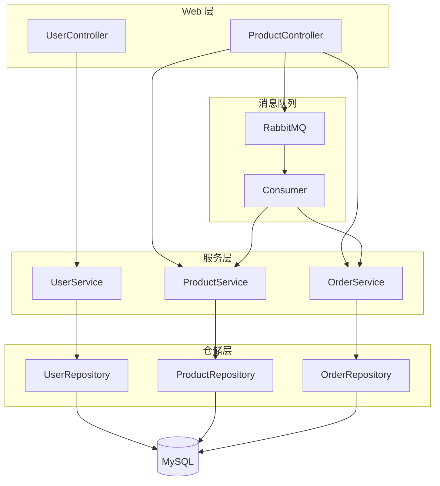
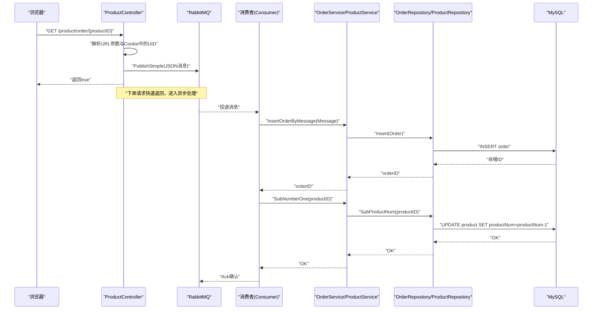
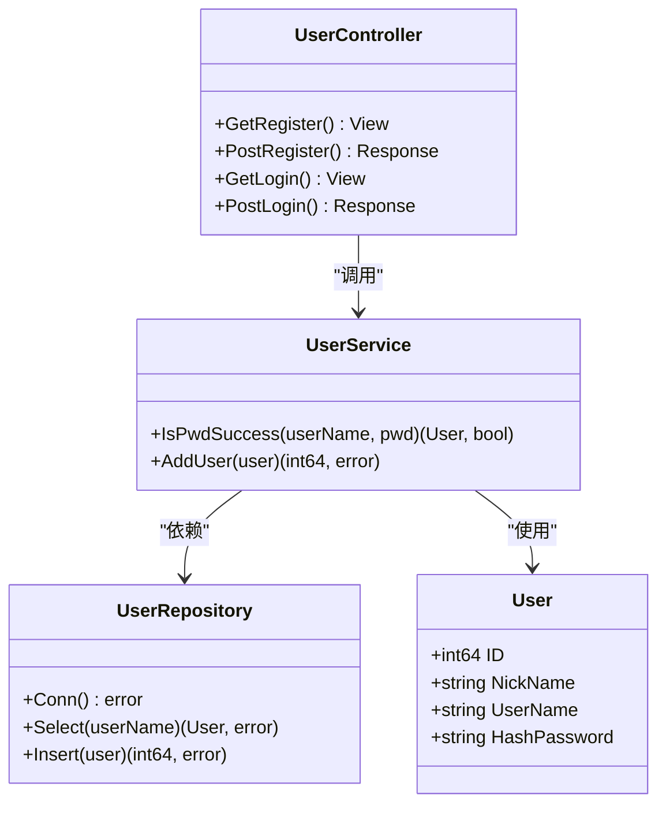
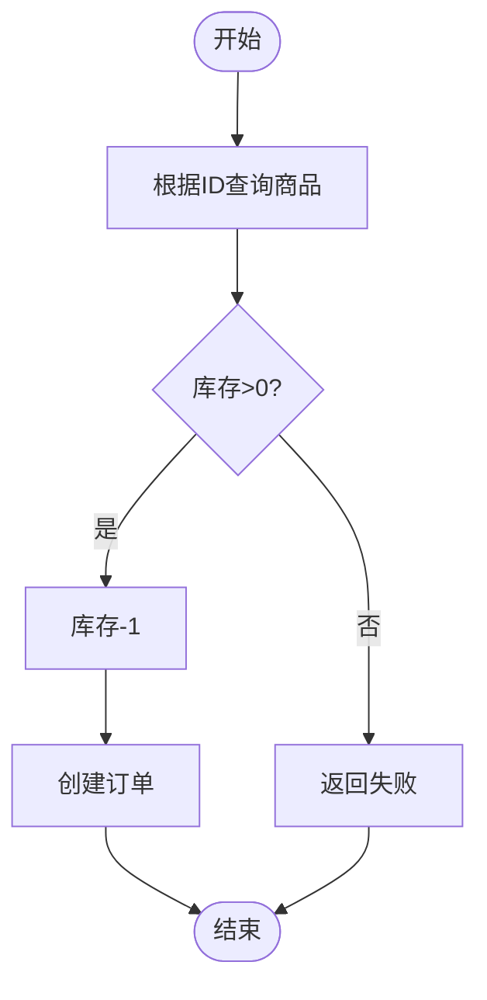
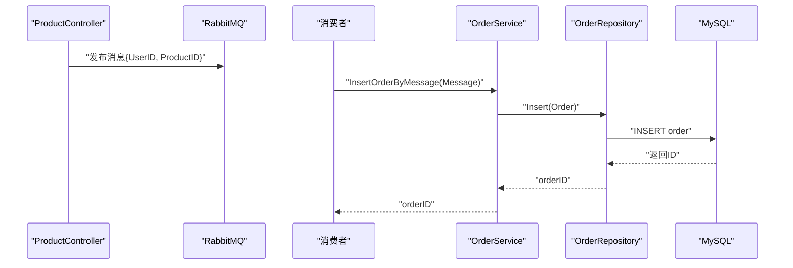
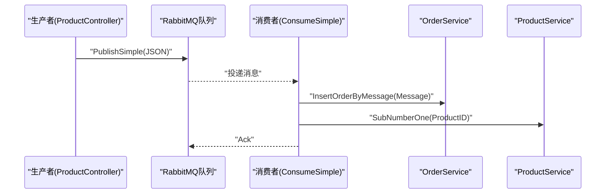
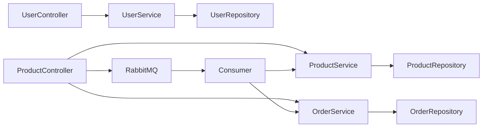

# 核心业务模块

<cite>
**本文引用的文件**
- [datamodels/user.go](file://datamodels/user.go)
- [datamodels/product.go](file://datamodels/product.go)
- [datamodels/order.go](file://datamodels/order.go)
- [datamodels/message.go](file://datamodels/message.go)
- [services/user_service.go](file://services/user_service.go)
- [services/product_service.go](file://services/product_service.go)
- [services/order_service.go](file://services/order_service.go)
- [repositories/user_repository.go](file://repositories/user_repository.go)
- [repositories/product_repository.go](file://repositories/product_repository.go)
- [repositories/order_repository.go](file://repositories/order_repository.go)
- [fronted/web/controllers/user_controller.go](file://fronted/web/controllers/user_controller.go)
- [fronted/web/controllers/product_controller.go](file://fronted/web/controllers/product_controller.go)
- [rabbitmq/rabbitmq.go](file://rabbitmq/rabbitmq.go)
- [consumer.go](file://consumer.go)
</cite>

## 目录
1. [简介](#简介)
2. [项目结构](#项目结构)
3. [核心组件](#核心组件)
4. [架构总览](#架构总览)
5. [详细组件分析](#详细组件分析)
6. [依赖关系分析](#依赖关系分析)
7. [性能考虑](#性能考虑)
8. [故障排查指南](#故障排查指南)
9. [结论](#结论)
10. [附录](#附录)

## 简介
本仓库实现了一个基于 Go 的电商系统核心业务模块，涵盖用户管理、商品管理、订单管理与消息处理四大模块。系统采用分层架构：控制器层（Web 接口）→ 服务层（业务逻辑）→ 仓储层（数据访问）→ 数据库；并通过 RabbitMQ 进行异步解耦，将下单请求转化为消息，由消费者完成订单创建与库存扣减，提升吞吐与稳定性。

## 项目结构
- datamodels：定义用户、商品、订单、消息等数据模型
- services：封装各域的业务逻辑，对外暴露接口
- repositories：封装数据库操作，提供增删改查与复杂查询
- fronted/web/controllers：前端 Web 控制器，处理注册、登录、商品详情、下单等请求
- rabbitmq：RabbitMQ 生产者/消费者封装，支持简单模式
- consumer：消费者主程序入口，启动消费流程

图表来源
- [fronted/web/controllers/user_controller.go:17-88](file://fronted/web/controllers/user_controller.go#L17-L88)
- [fronted/web/controllers/product_controller.go:17-163](file://fronted/web/controllers/product_controller.go#L17-L163)
- [services/user_service.go:10-58](file://services/user_service.go#L10-L58)
- [services/product_service.go:8-48](file://services/product_service.go#L8-L48)
- [services/order_service.go:8-64](file://services/order_service.go#L8-L64)
- [repositories/user_repository.go:11-99](file://repositories/user_repository.go#L11-L99)
- [repositories/product_repository.go:12-165](file://repositories/product_repository.go#L12-L165)
- [repositories/order_repository.go:10-146](file://repositories/order_repository.go#L10-L146)
- [rabbitmq/rabbitmq.go:18-182](file://rabbitmq/rabbitmq.go#L18-L182)
- [consumer.go:11-27](file://consumer.go#L11-L27)

章节来源
- [fronted/web/controllers/user_controller.go:17-88](file://fronted/web/controllers/user_controller.go#L17-L88)
- [fronted/web/controllers/product_controller.go:17-163](file://fronted/web/controllers/product_controller.go#L17-L163)
- [services/user_service.go:10-58](file://services/user_service.go#L10-L58)
- [services/product_service.go:8-48](file://services/product_service.go#L8-L48)
- [services/order_service.go:8-64](file://services/order_service.go#L8-L64)
- [repositories/user_repository.go:11-99](file://repositories/user_repository.go#L11-L99)
- [repositories/product_repository.go:12-165](file://repositories/product_repository.go#L12-L165)
- [repositories/order_repository.go:10-146](file://repositories/order_repository.go#L10-L146)
- [rabbitmq/rabbitmq.go:18-182](file://rabbitmq/rabbitmq.go#L18-L182)
- [consumer.go:11-27](file://consumer.go#L11-L27)

## 核心组件
- 用户管理：负责用户注册、登录校验、密码加密与验证、会话标识写入 Cookie
- 商品管理：提供商品查询、新增、更新、删除与库存扣减能力
- 订单管理：提供订单查询、新增、更新、删除以及按消息创建订单的能力
- 消息处理：通过 RabbitMQ 将下单请求异步化，消费者完成订单落库与库存扣减

章节来源
- [datamodels/user.go:3-9](file://datamodels/user.go#L3-L9)
- [datamodels/product.go:3-10](file://datamodels/product.go#L3-L10)
- [datamodels/order.go:3-15](file://datamodels/order.go#L3-L15)
- [datamodels/message.go:3-13](file://datamodels/message.go#L3-L13)
- [services/user_service.go:10-58](file://services/user_service.go#L10-L58)
- [services/product_service.go:8-48](file://services/product_service.go#L8-L48)
- [services/order_service.go:8-64](file://services/order_service.go#L8-L64)
- [rabbitmq/rabbitmq.go:68-182](file://rabbitmq/rabbitmq.go#L68-L182)

## 架构总览
系统以 MVC + 领域服务 + 仓储的分层设计组织代码，Web 控制器仅做参数绑定与响应编排，业务规则集中在服务层，数据访问在仓储层。下单路径引入 RabbitMQ 进行削峰填谷与解耦，消费者串行处理消息，保证订单与库存的一致性。

图表来源
- [fronted/web/controllers/product_controller.go:95-120](file://fronted/web/controllers/product_controller.go#L95-L120)
- [rabbitmq/rabbitmq.go:68-101](file://rabbitmq/rabbitmq.go#L68-L101)
- [rabbitmq/rabbitmq.go:104-182](file://rabbitmq/rabbitmq.go#L104-L182)
- [services/order_service.go:51-61](file://services/order_service.go#L51-L61)
- [services/product_service.go:46-48](file://services/product_service.go#L46-L48)
- [repositories/order_repository.go:43-60](file://repositories/order_repository.go#L43-L60)
- [repositories/product_repository.go:154-165](file://repositories/product_repository.go#L154-L165)

## 详细组件分析

### 用户管理模块
- 数据模型
  - 用户实体包含 ID、昵称、用户名、哈希密码字段
- 服务层
  - 提供密码校验与用户新增能力；新增时对密码进行安全哈希存储；校验时比对哈希值
- 仓储层
  - 提供按用户名查询与插入用户；连接池复用与表名默认配置
- 控制器层
  - 注册：接收表单并调用服务层新增用户
  - 登录：校验成功后将用户ID写入 Cookie，并生成签名写入 Cookie，重定向至商品页

图表来源
- [datamodels/user.go:3-9](file://datamodels/user.go#L3-L9)
- [services/user_service.go:10-58](file://services/user_service.go#L10-L58)
- [repositories/user_repository.go:11-99](file://repositories/user_repository.go#L11-L99)
- [fronted/web/controllers/user_controller.go:17-88](file://fronted/web/controllers/user_controller.go#L17-L88)

章节来源
- [datamodels/user.go:3-9](file://datamodels/user.go#L3-L9)
- [services/user_service.go:10-58](file://services/user_service.go#L10-L58)
- [repositories/user_repository.go:11-99](file://repositories/user_repository.go#L11-L99)
- [fronted/web/controllers/user_controller.go:17-88](file://fronted/web/controllers/user_controller.go#L17-L88)

### 商品管理模块
- 数据模型
  - 商品实体包含 ID、名称、数量、图片、链接等字段
- 服务层
  - 提供按 ID 查询、全部查询、新增、更新、删除与库存扣减方法
- 仓储层
  - 提供对应 SQL 操作，包括按主键查询、全量查询、更新与库存递减
- 控制器层
  - 商品详情页渲染
  - 静态页面生成（模板渲染到文件）
  - 下单入口：构造消息并发送到队列

图表来源
- [services/product_service.go:26-48](file://services/product_service.go#L26-L48)
- [repositories/product_repository.go:107-165](file://repositories/product_repository.go#L107-L165)
- [fronted/web/controllers/product_controller.go:80-120](file://fronted/web/controllers/product_controller.go#L80-L120)

章节来源
- [datamodels/product.go:3-10](file://datamodels/product.go#L3-L10)
- [services/product_service.go:8-48](file://services/product_service.go#L8-L48)
- [repositories/product_repository.go:12-165](file://repositories/product_repository.go#L12-L165)
- [fronted/web/controllers/product_controller.go:32-120](file://fronted/web/controllers/product_controller.go#L32-L120)

### 订单管理模块
- 数据模型
  - 订单实体包含 ID、用户ID、商品ID、订单状态；定义等待、成功、失败等状态常量
- 服务层
  - 提供订单 CRUD 与“按消息创建订单”的方法；按消息创建时将状态设为成功
- 仓储层
  - 提供订单插入、删除、更新、按 ID 查询、全量查询与带商品信息的联合查询
- 控制器层
  - 订单列表展示（通过服务获取带商品信息的映射）

图表来源
- [datamodels/order.go:3-15](file://datamodels/order.go#L3-L15)
- [services/order_service.go:8-64](file://services/order_service.go#L8-L64)
- [repositories/order_repository.go:10-146](file://repositories/order_repository.go#L10-L146)
- [fronted/web/controllers/product_controller.go:95-120](file://fronted/web/controllers/product_controller.go#L95-L120)
- [rabbitmq/rabbitmq.go:104-182](file://rabbitmq/rabbitmq.go#L104-L182)

章节来源
- [datamodels/order.go:3-15](file://datamodels/order.go#L3-L15)
- [services/order_service.go:8-64](file://services/order_service.go#L8-L64)
- [repositories/order_repository.go:10-146](file://repositories/order_repository.go#L10-L146)
- [fronted/web/controllers/product_controller.go:95-120](file://fronted/web/controllers/product_controller.go#L95-L120)

### 消息处理模块（RabbitMQ）
- 生产者
  - 控制器将下单信息序列化为 JSON 后通过简单模式发送到队列
- 消费者
  - 声明队列、设置 QoS 限流、消费消息；反序列化后调用服务层创建订单并扣减库存，手动 Ack
- 消费者主程序
  - 初始化数据库连接与各仓储与服务，启动消费者

图表来源
- [fronted/web/controllers/product_controller.go:95-120](file://fronted/web/controllers/product_controller.go#L95-L120)
- [rabbitmq/rabbitmq.go:68-182](file://rabbitmq/rabbitmq.go#L68-L182)
- [consumer.go:11-27](file://consumer.go#L11-L27)

章节来源
- [rabbitmq/rabbitmq.go:18-182](file://rabbitmq/rabbitmq.go#L18-L182)
- [consumer.go:11-27](file://consumer.go#L11-L27)
- [fronted/web/controllers/product_controller.go:95-120](file://fronted/web/controllers/product_controller.go#L95-L120)

## 依赖关系分析
- 控制器依赖服务层接口，服务层依赖仓储层接口，仓储层直接操作数据库
- 下单路径中，控制器还依赖 RabbitMQ 客户端；消费者依赖订单与商品服务
- 数据模型在各层之间作为契约传递，避免耦合具体实现

图表来源
- [fronted/web/controllers/user_controller.go:17-88](file://fronted/web/controllers/user_controller.go#L17-L88)
- [fronted/web/controllers/product_controller.go:17-163](file://fronted/web/controllers/product_controller.go#L17-L163)
- [services/user_service.go:10-58](file://services/user_service.go#L10-L58)
- [services/product_service.go:8-48](file://services/product_service.go#L8-L48)
- [services/order_service.go:8-64](file://services/order_service.go#L8-L64)
- [repositories/user_repository.go:11-99](file://repositories/user_repository.go#L11-L99)
- [repositories/product_repository.go:12-165](file://repositories/product_repository.go#L12-L165)
- [repositories/order_repository.go:10-146](file://repositories/order_repository.go#L10-L146)
- [rabbitmq/rabbitmq.go:18-182](file://rabbitmq/rabbitmq.go#L18-L182)
- [consumer.go:11-27](file://consumer.go#L11-L27)

章节来源
- [fronted/web/controllers/user_controller.go:17-88](file://fronted/web/controllers/user_controller.go#L17-L88)
- [fronted/web/controllers/product_controller.go:17-163](file://fronted/web/controllers/product_controller.go#L17-L163)
- [services/user_service.go:10-58](file://services/user_service.go#L10-L58)
- [services/product_service.go:8-48](file://services/product_service.go#L8-L48)
- [services/order_service.go:8-64](file://services/order_service.go#L8-L64)
- [repositories/user_repository.go:11-99](file://repositories/user_repository.go#L11-L99)
- [repositories/product_repository.go:12-165](file://repositories/product_repository.go#L12-L165)
- [repositories/order_repository.go:10-146](file://repositories/order_repository.go#L10-L146)
- [rabbitmq/rabbitmq.go:18-182](file://rabbitmq/rabbitmq.go#L18-L182)
- [consumer.go:11-27](file://consumer.go#L11-L27)

## 性能考虑
- 异步下单：通过 RabbitMQ 将下单请求从同步链路中剥离，降低请求延迟，提高吞吐
- 消费者限流：使用 QoS 限制每次投递的消息数，避免消费者过载
- 连接复用：仓储层懒加载数据库连接，减少重复建立连接的开销
- 批量与索引：建议对高频查询字段（如用户名、商品ID）建立索引；未来可引入批量插入优化
- 幂等性：当前消费者未实现幂等，建议在消息体中加入唯一流水号，避免重复消费导致重复下单或重复扣库存

## 故障排查指南
- 用户不存在或条件为空
  - 现象：查询用户时报错或返回空对象
  - 定位：仓储层 Select 方法中对空条件与无结果的处理
  - 参考路径
    - [repositories/user_repository.go:40-63](file://repositories/user_repository.go#L40-L63)
- 密码校验失败
  - 现象：登录失败，提示密码比对错误
  - 定位：服务层 ValidatePassword 比较哈希值
  - 参考路径
    - [services/user_service.go:51-55](file://services/user_service.go#L51-L55)
- 商品不存在或查询异常
  - 现象：商品详情或下单前查询失败
  - 定位：仓储层 SelectByKey 返回空或错误
  - 参考路径
    - [repositories/product_repository.go:107-125](file://repositories/product_repository.go#L107-L125)
- 库存扣减失败
  - 现象：下单成功但库存未扣减
  - 定位：消费者调用 SubNumberOne 失败
  - 参考路径
    - [rabbitmq/rabbitmq.go:167-171](file://rabbitmq/rabbitmq.go#L167-L171)
    - [repositories/product_repository.go:154-165](file://repositories/product_repository.go#L154-L165)
- 订单创建失败
  - 现象：消费者处理消息时报错
  - 定位：仓储层 Insert 执行失败
  - 参考路径
    - [repositories/order_repository.go:43-60](file://repositories/order_repository.go#L43-L60)
- RabbitMQ 连接与通道错误
  - 现象：生产/消费阶段报错
  - 定位：failOnErr 日志输出
  - 参考路径
    - [rabbitmq/rabbitmq.go:44-50](file://rabbitmq/rabbitmq.go#L44-L50)

章节来源
- [repositories/user_repository.go:40-63](file://repositories/user_repository.go#L40-L63)
- [services/user_service.go:51-55](file://services/user_service.go#L51-L55)
- [repositories/product_repository.go:107-125](file://repositories/product_repository.go#L107-L125)
- [rabbitmq/rabbitmq.go:167-171](file://rabbitmq/rabbitmq.go#L167-L171)
- [repositories/product_repository.go:154-165](file://repositories/product_repository.go#L154-L165)
- [repositories/order_repository.go:43-60](file://repositories/order_repository.go#L43-L60)
- [rabbitmq/rabbitmq.go:44-50](file://rabbitmq/rabbitmq.go#L44-L50)

## 结论
该电商系统通过清晰的分层设计与消息队列实现了高可用与可扩展的核心业务流程。用户、商品、订单三大模块职责明确，消息处理将下单与库存扣减异步化，有效提升了系统吞吐与容错能力。后续可在事务一致性、幂等性、缓存与监控方面进一步增强。

## 附录
- API 概览（基于控制器方法）
  - 用户注册：POST /user/register → 调用服务层新增用户
  - 用户登录：POST /user/login → 校验密码并写入 Cookie
  - 商品详情：GET /product/detail → 渲染商品视图
  - 生成静态页：GET /product/generateHtml/{productID} → 模板渲染到文件
  - 下单：GET /product/order/{productID} → 发送消息到队列
- 数据模型要点
  - 用户：ID、昵称、用户名、哈希密码
  - 商品：ID、名称、数量、图片、链接
  - 订单：ID、用户ID、商品ID、状态（等待/成功/失败）
  - 消息：用户ID、商品ID（用于异步下单）