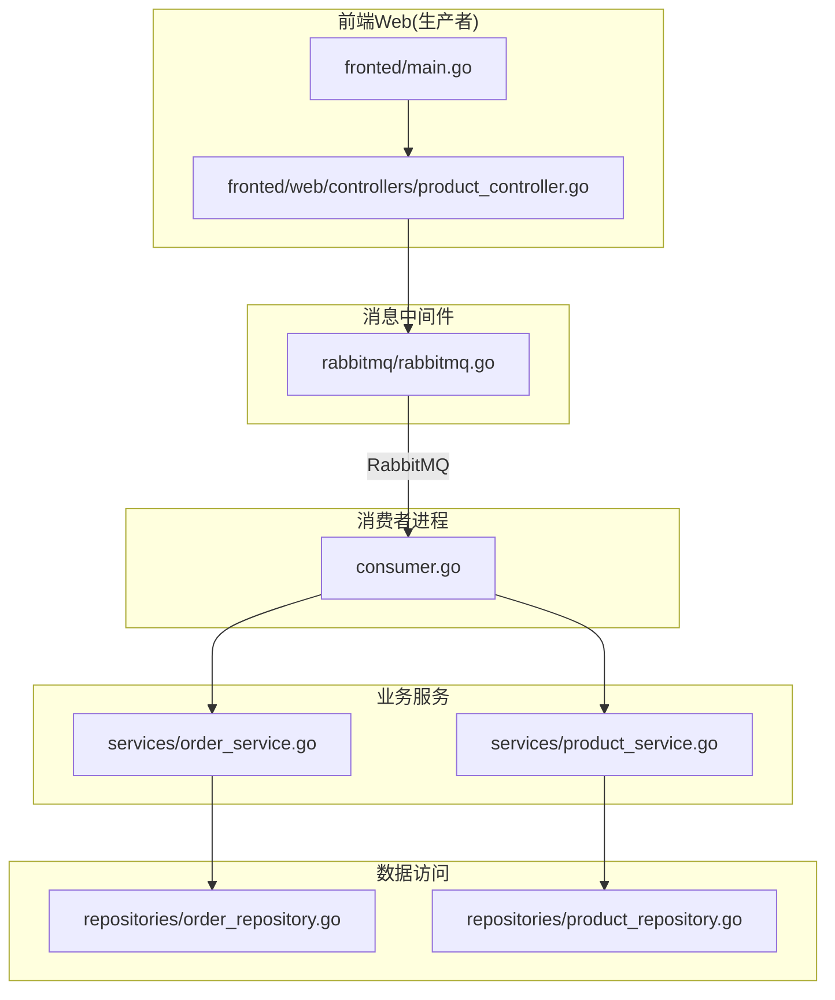
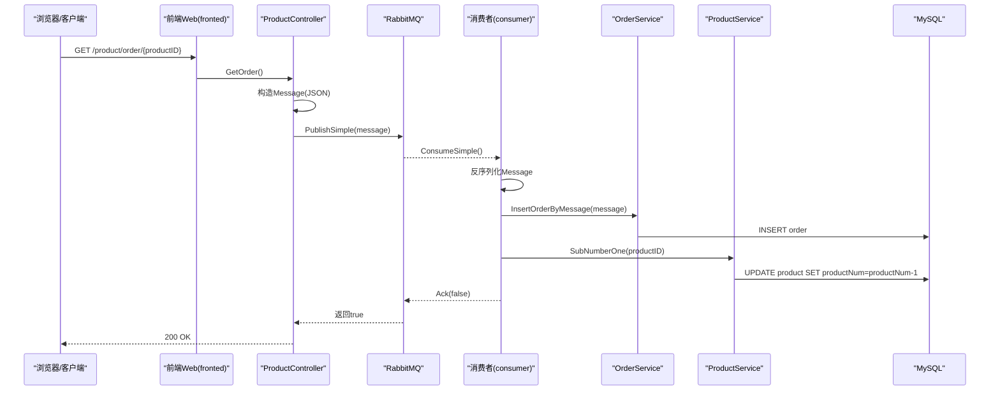
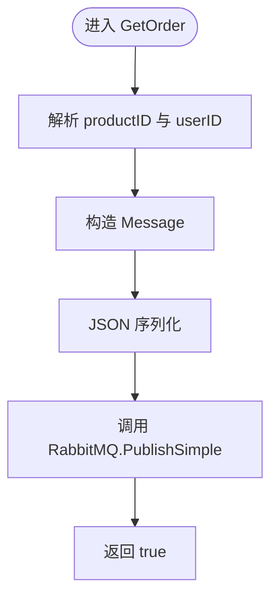
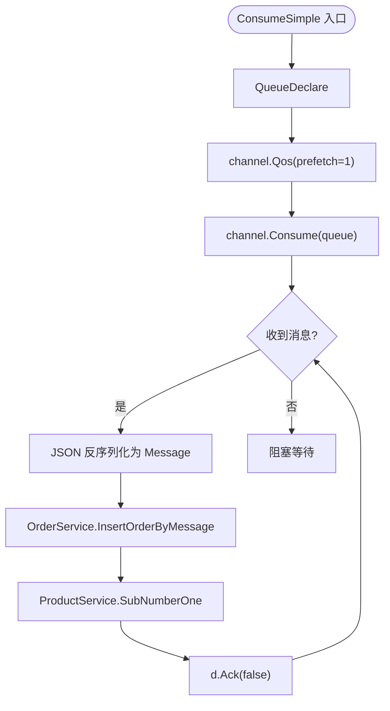
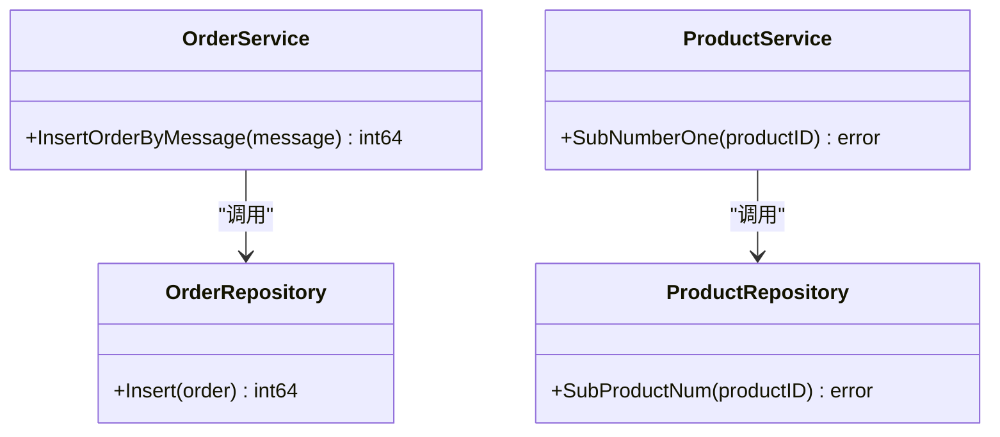
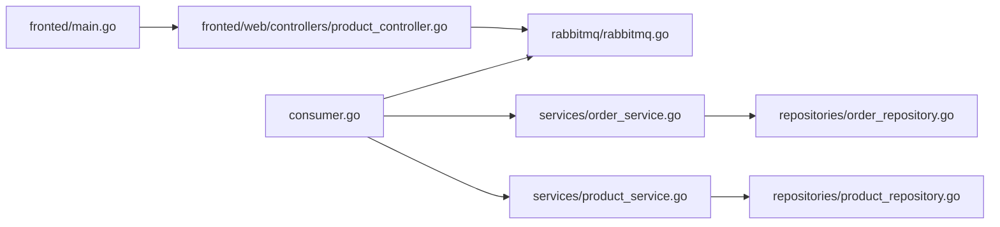

# 消息处理模块

<cite>
**本文引用的文件**   
- [rabbitmq/rabbitmq.go](file://rabbitmq/rabbitmq.go)
- [consumer.go](file://consumer.go)
- [datamodels/message.go](file://datamodels/message.go)
- [services/order_service.go](file://services/order_service.go)
- [services/product_service.go](file://services/product_service.go)
- [repositories/order_repository.go](file://repositories/order_repository.go)
- [repositories/product_repository.go](file://repositories/product_repository.go)
- [fronted/web/controllers/product_controller.go](file://fronted/web/controllers/product_controller.go)
- [fronted/main.go](file://fronted/main.go)
- [backend/main.go](file://backend/main.go)
</cite>

## 目录
1. [引言](#引言)
2. [项目结构](#项目结构)
3. [核心组件](#核心组件)
4. [架构总览](#架构总览)
5. [详细组件分析](#详细组件分析)
6. [依赖关系分析](#依赖关系分析)
7. [性能与高并发](#性能与高并发)
8. [故障恢复与可靠性](#故障恢复与可靠性)
9. [生产环境部署指南](#生产环境部署指南)
10. [常见问题排查](#常见问题排查)
11. [结论](#结论)

## 引言
本模块基于 RabbitMQ 实现电商下单链路中的异步消息处理，将“创建订单”和“扣减库存”两个耗时操作从同步 HTTP 请求中解耦，提升系统吞吐与稳定性。前端服务作为生产者发送消息，独立的消费者进程消费消息并调用订单与商品服务完成业务落库与库存扣减。

## 项目结构
围绕消息处理的关键代码分布如下：
- 消息模型：datamodels/message.go
- 消息队列封装：rabbitmq/rabbitmq.go
- 生产者（HTTP 接口）：fronted/web/controllers/product_controller.go
- 消费者入口：consumer.go
- 业务服务层：services/order_service.go、services/product_service.go
- 数据访问层：repositories/order_repository.go、repositories/product_repository.go
- Web 应用启动：fronted/main.go、backend/main.go

图表来源
- [fronted/main.go:48-59](file://fronted/main.go#L48-L59)
- [fronted/web/controllers/product_controller.go:95-120](file://fronted/web/controllers/product_controller.go#L95-L120)
- [rabbitmq/rabbitmq.go:34-100](file://rabbitmq/rabbitmq.go#L34-L100)
- [consumer.go:11-27](file://consumer.go#L11-L27)
- [services/order_service.go:51-61](file://services/order_service.go#L51-L61)
- [services/product_service.go:46-48](file://services/product_service.go#L46-L48)
- [repositories/order_repository.go:43-60](file://repositories/order_repository.go#L43-L60)
- [repositories/product_repository.go:154-165](file://repositories/product_repository.go#L154-L165)

章节来源
- [fronted/main.go:16-69](file://fronted/main.go#L16-L69)
- [consumer.go:11-27](file://consumer.go#L11-L27)

## 核心组件
- 消息模型：Message，包含用户ID与商品ID，用于跨服务传递下单意图。
- 消息队列封装：RabbitMQ，提供简单模式下的连接管理、声明队列、发布消息与消费消息。
- 生产者控制器：ProductController.GetOrder，组装 Message，序列化为 JSON 后通过 RabbitMQ 发送。
- 消费者：独立进程，订阅队列，反序列化消息，调用 OrderService 创建订单、调用 ProductService 扣减库存，手动确认消息。
- 服务层：IOrderService.InsertOrderByMessage、IProductService.SubNumberOne。
- 仓储层：OrderRepository.Insert、ProductRepository.SubProductNum。

章节来源
- [datamodels/message.go:4-12](file://datamodels/message.go#L4-L12)
- [rabbitmq/rabbitmq.go:19-36](file://rabbitmq/rabbitmq.go#L19-L36)
- [fronted/web/controllers/product_controller.go:95-120](file://fronted/web/controllers/product_controller.go#L95-L120)
- [consumer.go:11-27](file://consumer.go#L11-L27)
- [services/order_service.go:8-16](file://services/order_service.go#L8-L16)
- [services/product_service.go:8-15](file://services/product_service.go#L8-L15)
- [repositories/order_repository.go:10-18](file://repositories/order_repository.go#L10-L18)
- [repositories/product_repository.go:12-21](file://repositories/product_repository.go#L12-L21)

## 架构总览
下图展示一次下单请求的端到端流程：前端控制器生成消息并发送到 RabbitMQ；消费者进程拉取消息，执行业务逻辑并持久化到数据库。

图表来源
- [fronted/web/controllers/product_controller.go:95-120](file://fronted/web/controllers/product_controller.go#L95-L120)
- [rabbitmq/rabbitmq.go:68-100](file://rabbitmq/rabbitmq.go#L68-L100)
- [rabbitmq/rabbitmq.go:104-181](file://rabbitmq/rabbitmq.go#L104-L181)
- [services/order_service.go:51-61](file://services/order_service.go#L51-L61)
- [services/product_service.go:46-48](file://services/product_service.go#L46-L48)
- [repositories/order_repository.go:43-60](file://repositories/order_repository.go#L43-L60)
- [repositories/product_repository.go:154-165](file://repositories/product_repository.go#L154-L165)

## 详细组件分析

### 消息模型与序列化
- 消息体：Message 包含 UserID 与 ProductID，由 NewMessage 构造。
- 序列化：生产者使用 JSON 编码 Message 为字节数组后发送；消费者反序列化为 Message 对象。

章节来源
- [datamodels/message.go:4-12](file://datamodels/message.go#L4-L12)
- [fronted/web/controllers/product_controller.go:107-115](file://fronted/web/controllers/product_controller.go#L107-L115)
- [rabbitmq/rabbitmq.go:156-160](file://rabbitmq/rabbitmq.go#L156-L160)

### 生产者（HTTP 接口）
- 路由注册：fronted/main.go 中将 rabbitmq 实例注入到 ProductController。
- 下单接口：GetOrder 解析参数，构造 Message，JSON 序列化后调用 RabbitMQ.PublishSimple。
- 响应：直接返回成功标识，不等待消费者处理结果。

图表来源
- [fronted/main.go:48-59](file://fronted/main.go#L48-L59)
- [fronted/web/controllers/product_controller.go:95-120](file://fronted/web/controllers/product_controller.go#L95-L120)
- [rabbitmq/rabbitmq.go:68-100](file://rabbitmq/rabbitmq.go#L68-L100)

章节来源
- [fronted/web/controllers/product_controller.go:95-120](file://fronted/web/controllers/product_controller.go#L95-L120)
- [fronted/main.go:48-59](file://fronted/main.go#L48-L59)

### 消费者（消息处理）
- 初始化：consumer.go 建立 MySQL 连接，构建 Product/Order 仓储与服务，创建 RabbitMQ 简单模式实例并启动消费。
- 消费流程：
  - 声明队列（若不存在则创建）。
  - 设置 QoS 限流（prefetch=1）。
  - 订阅队列，开启协程逐个处理消息。
  - 反序列化消息，调用 OrderService 创建订单，调用 ProductService 扣减库存。
  - 手动确认消息（Ack(false)）。

图表来源
- [consumer.go:11-27](file://consumer.go#L11-L27)
- [rabbitmq/rabbitmq.go:104-181](file://rabbitmq/rabbitmq.go#L104-L181)
- [services/order_service.go:51-61](file://services/order_service.go#L51-L61)
- [services/product_service.go:46-48](file://services/product_service.go#L46-L48)

章节来源
- [consumer.go:11-27](file://consumer.go#L11-L27)
- [rabbitmq/rabbitmq.go:104-181](file://rabbitmq/rabbitmq.go#L104-L181)

### 业务服务与数据访问
- OrderService.InsertOrderByMessage：根据 Message 构造 Order 并插入数据库。
- ProductService.SubNumberOne：对指定商品执行库存自减。
- 仓储层：OrderRepository.Insert、ProductRepository.SubProductNum 负责 SQL 执行。

图表来源
- [services/order_service.go:51-61](file://services/order_service.go#L51-L61)
- [services/product_service.go:46-48](file://services/product_service.go#L46-L48)
- [repositories/order_repository.go:43-60](file://repositories/order_repository.go#L43-L60)
- [repositories/product_repository.go:154-165](file://repositories/product_repository.go#L154-L165)

章节来源
- [services/order_service.go:51-61](file://services/order_service.go#L51-L61)
- [services/product_service.go:46-48](file://services/product_service.go#L46-L48)
- [repositories/order_repository.go:43-60](file://repositories/order_repository.go#L43-L60)
- [repositories/product_repository.go:154-165](file://repositories/product_repository.go#L154-L165)

## 依赖关系分析
- 生产者依赖：
  - fronted/web/controllers/product_controller.go 依赖 services 与 datamodels，并通过 DI 注入 rabbitmq.RabbitMQ。
  - fronted/main.go 将 RabbitMQ 实例注册到 MVC 容器。
- 消费者依赖：
  - consumer.go 依赖 repositories 与 services，以及 rabbitmq.RabbitMQ。
- 队列与交换器：
  - 当前使用简单模式（Direct），未显式声明 Exchange，消息直接投递至队列名。
- 数据库依赖：
  - 订单与商品仓储均依赖 MySQL 连接池。

图表来源
- [fronted/web/controllers/product_controller.go:95-120](file://fronted/web/controllers/product_controller.go#L95-L120)
- [fronted/main.go:48-59](file://fronted/main.go#L48-L59)
- [consumer.go:11-27](file://consumer.go#L11-L27)
- [rabbitmq/rabbitmq.go:34-100](file://rabbitmq/rabbitmq.go#L34-L100)

章节来源
- [fronted/main.go:48-59](file://fronted/main.go#L48-L59)
- [consumer.go:11-27](file://consumer.go#L11-L27)

## 性能与高并发
- 消费者限流：
  - 使用 channel.Qos(prefetch=1)，确保同一时刻仅处理一条消息，避免消费者过载。
- 并发处理：
  - 每个消息在独立 goroutine 中处理，具备一定并发能力；但受限于 prefetch=1，整体吞吐受单条处理时长影响。
- 连接与通道：
  - RabbitMQ 连接与 Channel 在 RabbitMQ 实例内复用，减少频繁建连开销。
- 建议优化：
  - 调整 prefetch 值以匹配下游处理能力。
  - 引入批量写入或事务合并，降低数据库压力。
  - 增加消费者实例数进行水平扩展。

章节来源
- [rabbitmq/rabbitmq.go:123-128](file://rabbitmq/rabbitmq.go#L123-L128)
- [rabbitmq/rabbitmq.go:150-176](file://rabbitmq/rabbitmq.go#L150-L176)

## 故障恢复与可靠性
- 消息确认：
  - 消费者采用手动确认（auto-ack=false），在处理成功后调用 d.Ack(false)。
- 错误处理：
  - 连接失败时 failOnErr 会记录日志并 panic，便于快速定位。
  - 业务处理错误仅打印日志，未做重试或死信处理。
- 幂等性：
  - 当前未实现幂等控制，重复消费可能导致重复下单或超卖风险。
- 死信队列：
  - 当前未配置死信交换机与死信队列，无法自动隔离失败消息。
- 建议增强：
  - 引入重试机制（指数退避）与死信队列，保障最终一致性。
  - 为订单创建引入唯一键或幂等令牌，防止重复消费。
  - 将关键错误纳入监控告警，结合日志追踪。

章节来源
- [rabbitmq/rabbitmq.go:44-50](file://rabbitmq/rabbitmq.go#L44-L50)
- [rabbitmq/rabbitmq.go:152-176](file://rabbitmq/rabbitmq.go#L152-L176)

## 生产环境部署指南
- 环境变量与配置
  - RabbitMQ 连接地址：rabbitmq/rabbitmq.go 中 MQURL 常量。
  - 队列名称：imoocProduct（生产者与消费者需一致）。
- 服务启动
  - 前端 Web（生产者）：运行 fronted/main.go，监听端口 8082。
  - 消费者进程：运行 consumer.go，保持常驻。
  - 后端 Web（可选）：运行 backend/main.go，监听端口 8080。
- 资源规划
  - 根据峰值 QPS 调整消费者数量与 prefetch。
  - 数据库连接池大小与慢查询优化。
- 监控与可观测性
  - 接入 RabbitMQ 监控（队列长度、消费速率、ACK 延迟）。
  - 应用日志集中采集，关键路径埋点（下单、入库、扣库存）。

章节来源
- [rabbitmq/rabbitmq.go:14-16](file://rabbitmq/rabbitmq.go#L14-L16)
- [fronted/main.go:61-66](file://fronted/main.go#L61-L66)
- [backend/main.go:54-59](file://backend/main.go#L54-L59)

## 常见问题排查
- 无法连接 RabbitMQ
  - 检查 MQURL 是否正确，网络连通性与认证信息。
  - 查看 failOnErr 日志输出。
- 消息未消费
  - 确认消费者进程是否启动。
  - 核对队列名称是否一致（imoocProduct）。
  - 检查消费者是否被阻塞（如数据库不可用）。
- 重复消费或超卖
  - 当前无幂等保护，建议在订单表加唯一约束或在业务层去重。
- 性能瓶颈
  - 调整 prefetch 值，观察消费速率与数据库负载。
  - 评估是否需要多消费者实例水平扩展。

章节来源
- [rabbitmq/rabbitmq.go:44-50](file://rabbitmq/rabbitmq.go#L44-L50)
- [rabbitmq/rabbitmq.go:104-181](file://rabbitmq/rabbitmq.go#L104-L181)

## 结论
该消息处理模块通过 RabbitMQ 将下单链路异步化，有效解耦了订单创建与库存扣减，提升了系统的可扩展性与容错能力。当前实现简洁可靠，但在幂等性、重试与死信队列方面仍有增强空间。建议在生产环境中完善这些特性，并结合监控与压测持续优化吞吐与稳定性。