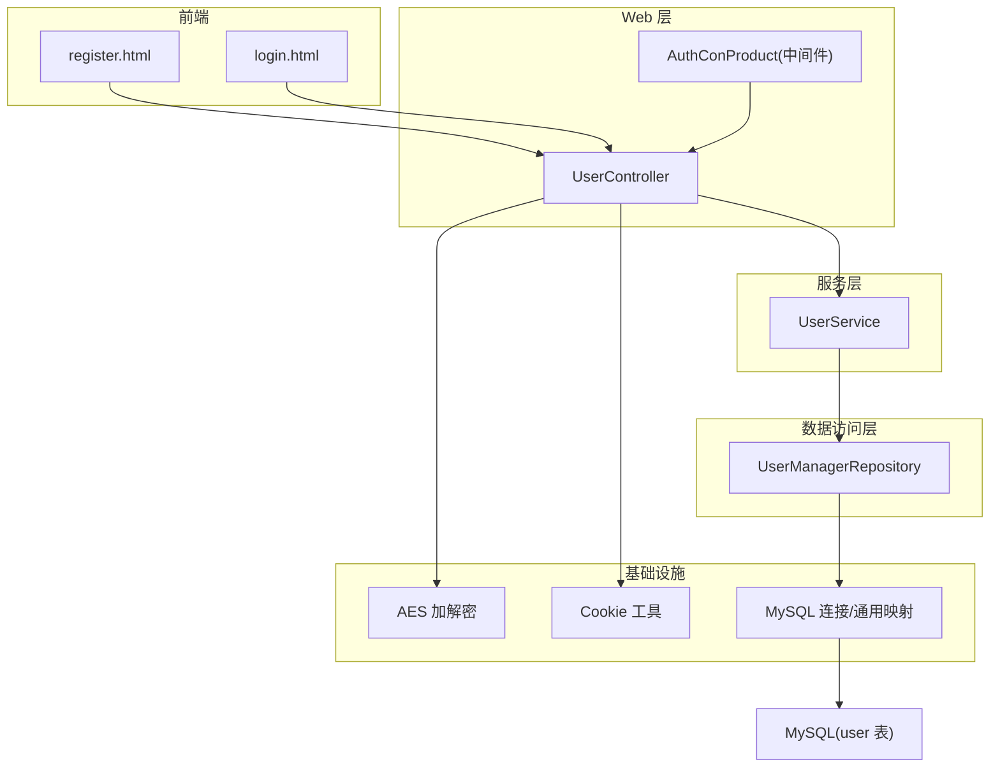
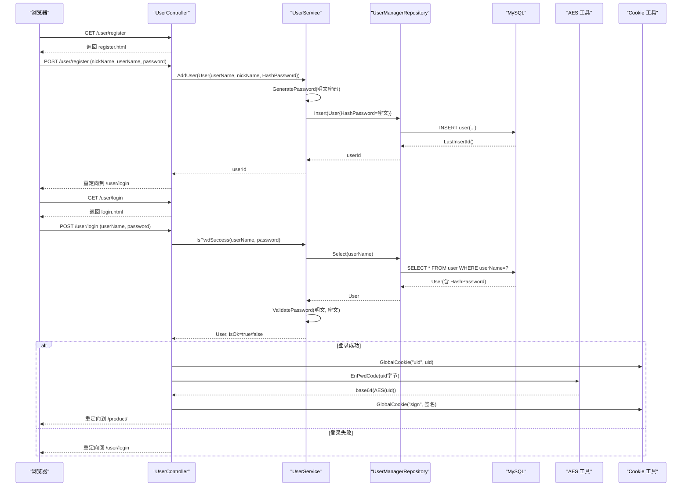
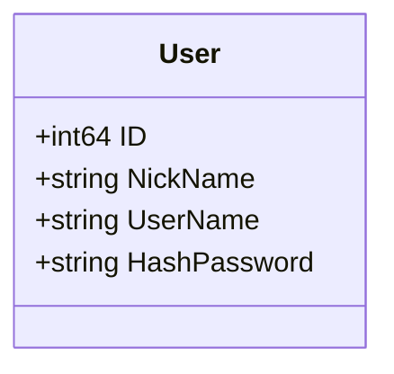
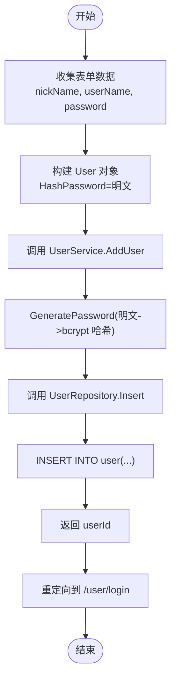
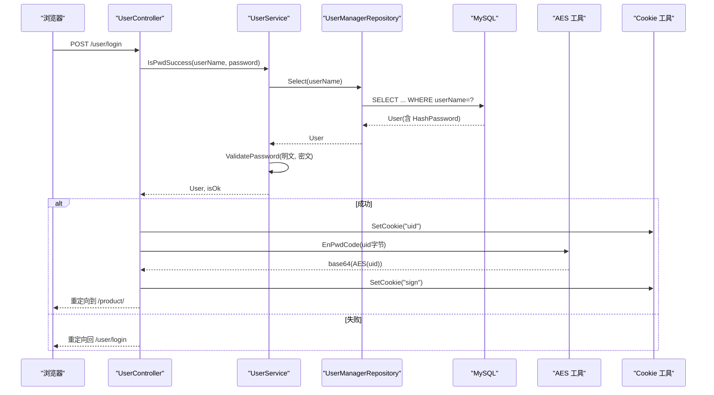
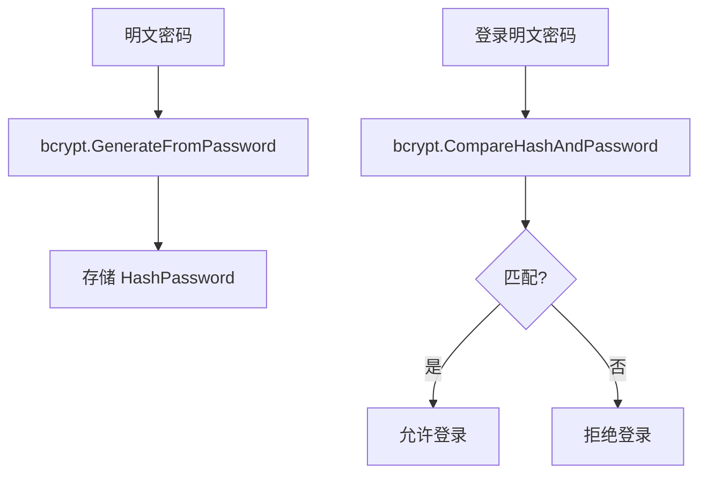
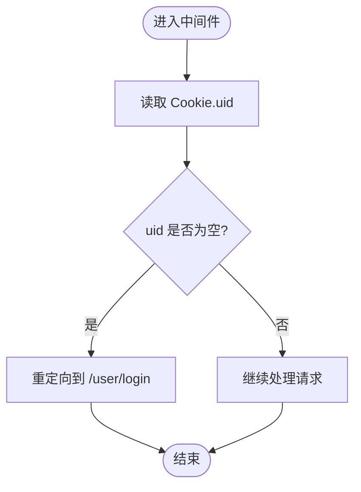
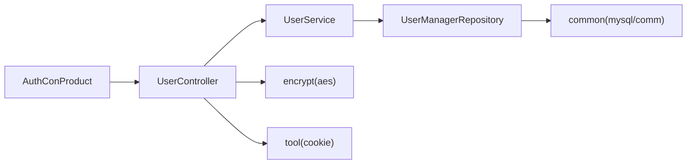

# 用户管理模块

<cite>
**本文引用的文件**   
- [datamodels/user.go](file://datamodels/user.go)
- [services/user_service.go](file://services/user_service.go)
- [repositories/user_repository.go](file://repositories/user_repository.go)
- [fronted/web/controllers/user_controller.go](file://fronted/web/controllers/user_controller.go)
- [fronted/middleware/auth.go](file://fronted/middleware/auth.go)
- [encrypt/aes.go](file://encrypt/aes.go)
- [tool/cookie.go](file://tool/cookie.go)
- [common/mysql.go](file://common/mysql.go)
- [common/comm.go](file://common/comm.go)
- [fronted/web/views/user/register.html](file://fronted/web/views/user/register.html)
- [fronted/web/views/user/login.html](file://fronted/web/views/user/login.html)
</cite>

## 目录
1. [简介](#简介)
2. [项目结构](#项目结构)
3. [核心组件](#核心组件)
4. [架构总览](#架构总览)
5. [详细组件分析](#详细组件分析)
6. [依赖关系分析](#依赖关系分析)
7. [性能与可扩展性](#性能与可扩展性)
8. [故障排查指南](#故障排查指南)
9. [结论](#结论)
10. [附录：CRUD 调用示例与最佳实践](#附录crud-调用示例与最佳实践)

## 简介
本模块为电商系统的用户子系统，涵盖用户数据模型、注册登录流程、密码加密存储、会话管理（Cookie）、基础认证中间件以及数据库访问层。当前实现采用 MVC 分层（控制器-服务-仓储），使用 MySQL 持久化用户信息，密码通过 bcrypt 进行哈希存储，登录成功后以 Cookie 维持会话，并通过自定义中间件对受保护资源进行鉴权。

说明：
- 当前未实现 JWT 令牌机制；认证基于 Cookie + AES 编码的签名值。
- 当前未实现角色与权限系统；仅包含基础登录态校验。

## 项目结构
围绕用户管理的代码主要分布在以下目录：
- datamodels：用户实体定义
- services：用户业务逻辑（注册、登录校验）
- repositories：用户数据访问（查询、插入）
- fronted/web/controllers：HTTP 控制器（注册页面、登录表单处理）
- fronted/middleware：认证中间件（检查登录态）
- encrypt：AES 加解密工具（用于 Cookie 签名）
- tool：Cookie 设置工具
- common：MySQL 连接与通用映射工具
- views：注册/登录前端模板

图表来源
- [fronted/web/controllers/user_controller.go:17-88](file://fronted/web/controllers/user_controller.go#L17-L88)
- [fronted/middleware/auth.go:5-15](file://fronted/middleware/auth.go#L5-L15)
- [services/user_service.go:10-57](file://services/user_service.go#L10-L57)
- [repositories/user_repository.go:11-99](file://repositories/user_repository.go#L11-L99)
- [encrypt/aes.go:15-100](file://encrypt/aes.go#L15-L100)
- [tool/cookie.go:9-11](file://tool/cookie.go#L9-L11)
- [common/mysql.go:9-67](file://common/mysql.go#L9-L67)

章节来源
- [fronted/web/controllers/user_controller.go:17-88](file://fronted/web/controllers/user_controller.go#L17-L88)
- [services/user_service.go:10-57](file://services/user_service.go#L10-L57)
- [repositories/user_repository.go:11-99](file://repositories/user_repository.go#L11-L99)

## 核心组件
- 用户数据模型：定义用户 ID、昵称、用户名、密码哈希字段，并带有 JSON/Form/SQL 标签，便于前后端交互与 ORM 映射。
- 用户服务：封装注册与登录校验逻辑，负责密码哈希生成与比对。
- 用户仓储：封装数据库操作，提供按用户名查询、插入新用户、按 ID 查询等方法。
- Web 控制器：处理注册页面渲染、注册表单提交、登录页面渲染、登录表单提交与会话写入。
- 认证中间件：在访问受保护路由前检查 Cookie 中的 uid，未登录则重定向到登录页。
- 加密工具：提供 AES 加解密与 Base64 编解码，用于对 Cookie 中的签名进行安全编码。
- Cookie 工具：统一设置 Cookie 的方法。
- 通用工具：MySQL 连接创建、结果集读取、结构体与 SQL 字段映射等。

章节来源
- [datamodels/user.go:3-8](file://datamodels/user.go#L3-L8)
- [services/user_service.go:10-57](file://services/user_service.go#L10-L57)
- [repositories/user_repository.go:11-99](file://repositories/user_repository.go#L11-L99)
- [fronted/web/controllers/user_controller.go:17-88](file://fronted/web/controllers/user_controller.go#L17-L88)
- [fronted/middleware/auth.go:5-15](file://fronted/middleware/auth.go#L5-L15)
- [encrypt/aes.go:15-100](file://encrypt/aes.go#L15-L100)
- [tool/cookie.go:9-11](file://tool/cookie.go#L9-L11)
- [common/mysql.go:9-67](file://common/mysql.go#L9-L67)
- [common/comm.go:11-68](file://common/comm.go#L11-L68)

## 架构总览
用户管理模块遵循 MVC 分层与依赖注入风格：
- 控制器接收 HTTP 请求，调用服务完成业务逻辑。
- 服务负责业务规则（如密码哈希、校验）。
- 仓储负责数据访问（SQL 查询与插入）。
- 中间件在路由层拦截未登录请求。
- 加密工具与 Cookie 工具作为横切能力被控制器与服务复用。

图表来源
- [fronted/web/controllers/user_controller.go:23-88](file://fronted/web/controllers/user_controller.go#L23-L88)
- [services/user_service.go:23-57](file://services/user_service.go#L23-L57)
- [repositories/user_repository.go:40-80](file://repositories/user_repository.go#L40-L80)
- [encrypt/aes.go:81-99](file://encrypt/aes.go#L81-L99)
- [tool/cookie.go:9-11](file://tool/cookie.go#L9-L11)

## 详细组件分析

### 用户数据模型设计
- 字段：ID（自增主键）、NickName（昵称）、UserName（用户名）、HashPassword（密码哈希）。
- 标签：JSON/Form/SQL 标签支持序列化、表单绑定与数据库字段映射。
- 安全：不直接暴露密码字段给 JSON 输出，避免敏感信息泄露。

图表来源
- [datamodels/user.go:3-8](file://datamodels/user.go#L3-L8)

章节来源
- [datamodels/user.go:3-8](file://datamodels/user.go#L3-L8)

### 用户注册流程
- 前端表单提交 nickName、userName、password。
- 控制器将明文密码放入 HashPassword 字段后调用服务。
- 服务使用 bcrypt 生成哈希并替换明文密码，再调用仓储插入。
- 仓储执行 INSERT 语句并返回新用户的 ID。

图表来源
- [fronted/web/controllers/user_controller.go:29-51](file://fronted/web/controllers/user_controller.go#L29-L51)
- [services/user_service.go:38-49](file://services/user_service.go#L38-L49)
- [repositories/user_repository.go:65-80](file://repositories/user_repository.go#L65-L80)

章节来源
- [fronted/web/controllers/user_controller.go:29-51](file://fronted/web/controllers/user_controller.go#L29-L51)
- [services/user_service.go:38-49](file://services/user_service.go#L38-L49)
- [repositories/user_repository.go:65-80](file://repositories/user_repository.go#L65-L80)

### 用户登录流程与会话管理
- 前端提交 userName、password。
- 服务根据用户名查询用户记录，并使用 bcrypt 比对密码。
- 登录成功后：
  - 设置 Cookie uid 为用户 ID。
  - 使用 AES 对 uid 进行加密并进行 Base64 编码，得到 sign 写入 Cookie。
- 后续访问受保护路由时，中间件检查 uid 是否存在，不存在则重定向到登录页。

图表来源
- [fronted/web/controllers/user_controller.go:59-88](file://fronted/web/controllers/user_controller.go#L59-L88)
- [services/user_service.go:23-57](file://services/user_service.go#L23-L57)
- [repositories/user_repository.go:40-63](file://repositories/user_repository.go#L40-L63)
- [encrypt/aes.go:81-99](file://encrypt/aes.go#L81-L99)
- [tool/cookie.go:9-11](file://tool/cookie.go#L9-L11)

章节来源
- [fronted/web/controllers/user_controller.go:59-88](file://fronted/web/controllers/user_controller.go#L59-L88)
- [services/user_service.go:23-57](file://services/user_service.go#L23-L57)
- [repositories/user_repository.go:40-63](file://repositories/user_repository.go#L40-L63)
- [encrypt/aes.go:81-99](file://encrypt/aes.go#L81-L99)
- [tool/cookie.go:9-11](file://tool/cookie.go#L9-L11)

### 密码加密存储机制
- 注册时：使用 bcrypt.GenerateFromPassword 将明文密码转换为哈希字符串，存入数据库。
- 登录时：使用 bcrypt.CompareHashAndPassword 比对明文与哈希。
- 优点：抗彩虹表攻击、内置盐值、计算成本可调。

图表来源
- [services/user_service.go:47-57](file://services/user_service.go#L47-L57)

章节来源
- [services/user_service.go:47-57](file://services/user_service.go#L47-L57)

### 用户认证中间件原理
- 中间件 AuthConProduct 检查 Cookie 中是否存在 uid。
- 若不存在，记录日志并重定向到登录页。
- 若存在，放行请求继续处理。

注意：当前中间件仅检查 uid 存在性，未验证 sign 或进行服务端会话校验。

图表来源
- [fronted/middleware/auth.go:5-15](file://fronted/middleware/auth.go#L5-L15)

章节来源
- [fronted/middleware/auth.go:5-15](file://fronted/middleware/auth.go#L5-L15)

### 用户权限控制系统（现状与建议）
- 现状：当前未实现角色与权限控制，仅具备基础登录态校验。
- 建议扩展方向：
  - 引入角色表与用户-角色关联表，支持 RBAC。
  - 在中间件中解析 Cookie 或 Token，加载用户角色与权限集合。
  - 在路由或控制器层进行细粒度授权判断（方法级/资源级）。
  - 可考虑引入 JWT 或 Session 服务器端存储方案，增强安全性与可扩展性。

[本节为概念性内容，不涉及具体源码]

## 依赖关系分析
- 控制器依赖服务接口 IUserService，服务依赖仓储接口 IUserRepository。
- 仓储依赖 common 提供的 MySQL 连接与数据映射工具。
- 控制器依赖工具库 encrypt 与 tool 进行 Cookie 与加密处理。
- 中间件依赖 Iris 上下文进行 Cookie 读写与重定向。

图表来源
- [fronted/web/controllers/user_controller.go:17-88](file://fronted/web/controllers/user_controller.go#L17-L88)
- [services/user_service.go:10-57](file://services/user_service.go#L10-L57)
- [repositories/user_repository.go:11-99](file://repositories/user_repository.go#L11-L99)
- [common/mysql.go:9-67](file://common/mysql.go#L9-L67)
- [common/comm.go:11-68](file://common/comm.go#L11-L68)
- [encrypt/aes.go:15-100](file://encrypt/aes.go#L15-L100)
- [tool/cookie.go:9-11](file://tool/cookie.go#L9-L11)
- [fronted/middleware/auth.go:5-15](file://fronted/middleware/auth.go#L5-L15)

章节来源
- [fronted/web/controllers/user_controller.go:17-88](file://fronted/web/controllers/user_controller.go#L17-L88)
- [services/user_service.go:10-57](file://services/user_service.go#L10-L57)
- [repositories/user_repository.go:11-99](file://repositories/user_repository.go#L11-L99)

## 性能与可扩展性
- bcrypt 成本：默认成本适合一般场景；在高并发下可评估调整成本参数以平衡安全与性能。
- 数据库连接：使用 sql.DB 连接池，建议在生产环境配置最大连接数与空闲连接数。
- 缓存策略：可引入 Redis 缓存用户基本信息与权限集合，减少数据库压力。
- 水平扩展：当前会话基于 Cookie，无状态易扩展；若引入服务端 Session 或 JWT，需考虑分布式一致性。

[本节为通用指导，不涉及具体源码]

## 故障排查指南
- 注册失败：
  - 检查服务层 AddUser 的错误日志与数据库插入是否成功。
  - 确认 bcrypt 哈希生成是否异常。
- 登录失败：
  - 检查 IsPwdSuccess 返回值与 ValidatePassword 错误信息。
  - 确认数据库中 HashPassword 是否正确存储。
- 中间件拦截：
  - 检查 Cookie uid 是否已正确设置。
  - 确认中间件是否挂载到需要保护的分组路由。
- 数据库连接：
  - 检查 common.NewMysqlConn 的连接串与网络连通性。
  - 确认 user 表结构与字段名一致。

章节来源
- [services/user_service.go:23-57](file://services/user_service.go#L23-L57)
- [repositories/user_repository.go:40-80](file://repositories/user_repository.go#L40-L80)
- [fronted/middleware/auth.go:5-15](file://fronted/middleware/auth.go#L5-L15)
- [common/mysql.go:9-12](file://common/mysql.go#L9-L12)

## 结论
该用户管理模块实现了基础的注册、登录、密码安全存储与会话维持，采用清晰的分层架构与工具库封装。当前未实现 JWT 与角色权限体系，建议在后续迭代中引入更完善的认证与授权机制，以提升安全性与可扩展性。

[本节为总结性内容，不涉及具体源码]

## 附录：CRUD 调用示例与最佳实践

### 用户注册（Create）
- 入口：POST /user/register
- 步骤：
  - 控制器从表单获取 nickName、userName、password。
  - 构造 User 对象并调用 UserService.AddUser。
  - 服务层生成 bcrypt 哈希并调用 UserRepository.Insert。
  - 仓储执行 INSERT 并返回 userId。
- 参考路径：
  - [控制器注册处理:29-51](file://fronted/web/controllers/user_controller.go#L29-L51)
  - [服务注册逻辑:38-49](file://services/user_service.go#L38-L49)
  - [仓储插入逻辑:65-80](file://repositories/user_repository.go#L65-L80)

### 用户登录（Read + 会话）
- 入口：POST /user/login
- 步骤：
  - 控制器从表单获取 userName、password。
  - 调用 UserService.IsPwdSuccess 进行校验。
  - 校验通过后设置 Cookie uid 与 sign。
- 参考路径：
  - [控制器登录处理:59-88](file://fronted/web/controllers/user_controller.go#L59-L88)
  - [服务登录校验:23-36](file://services/user_service.go#L23-L36)
  - [仓储按用户名查询:40-63](file://repositories/user_repository.go#L40-L63)

### 用户信息查询（Read by ID）
- 入口：可由控制器调用服务，服务调用仓储 SelectByID。
- 参考路径：
  - [仓储按 ID 查询:82-99](file://repositories/user_repository.go#L82-L99)

### 用户更新（Update）
- 建议新增服务方法与仓储方法：
  - 服务：UpdateUser(userId, fields)
  - 仓储：UpdateById(userId, fields)
- 安全建议：
  - 对敏感字段（如密码）再次使用 bcrypt 哈希。
  - 输入校验与防注入（使用预编译语句）。

### 用户删除（Delete）
- 建议新增服务方法与仓储方法：
  - 服务：DeleteUser(userId)
  - 仓储：DeleteById(userId)
- 安全建议：
  - 增加管理员权限校验。
  - 软删除优先，保留审计痕迹。

### 会话管理与安全最佳实践
- 当前会话：
  - 使用 Cookie uid 标识用户。
  - 使用 AES+Base64 对 uid 进行编码作为 sign。
- 改进建议：
  - 引入服务端 Session 或 JWT，避免客户端篡改。
  - 对 Cookie 启用 HttpOnly、Secure、SameSite 属性。
  - 定期轮换密钥（AES Key）并安全存储。
  - 增加登录失败次数限制与账户锁定机制。
  - 对所有敏感操作进行二次确认与审计日志。

章节来源
- [fronted/web/controllers/user_controller.go:29-88](file://fronted/web/controllers/user_controller.go#L29-L88)
- [services/user_service.go:23-57](file://services/user_service.go#L23-L57)
- [repositories/user_repository.go:40-99](file://repositories/user_repository.go#L40-L99)
- [encrypt/aes.go:15-100](file://encrypt/aes.go#L15-L100)
- [tool/cookie.go:9-11](file://tool/cookie.go#L9-L11)