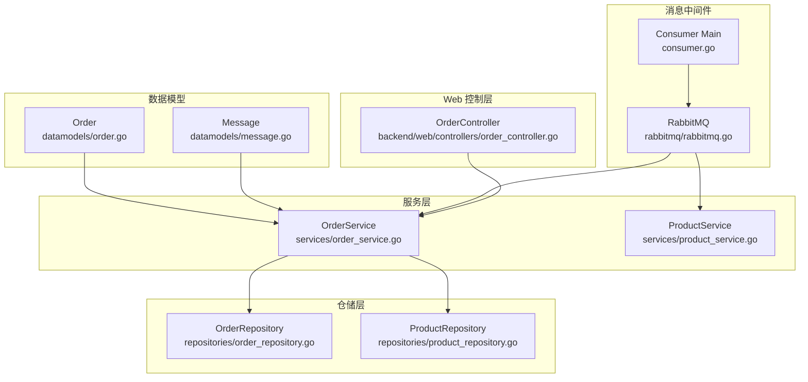
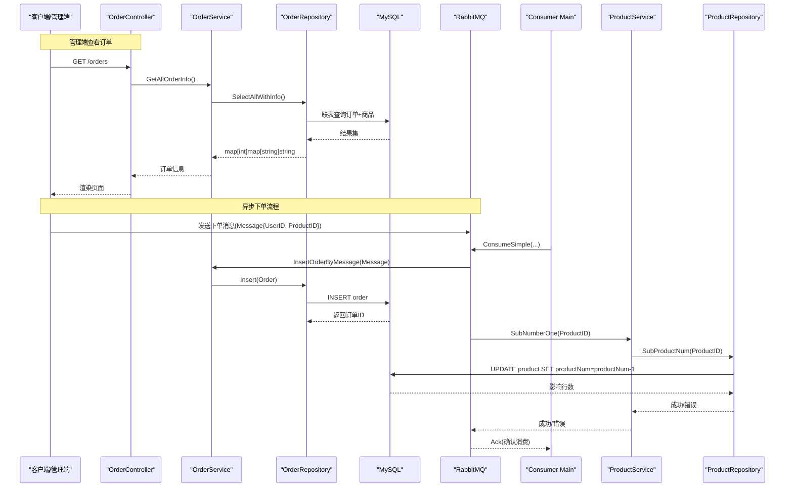
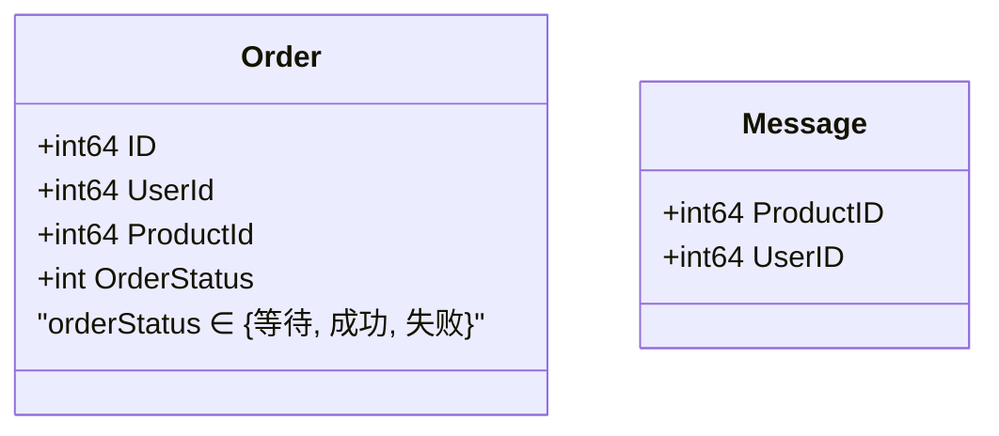
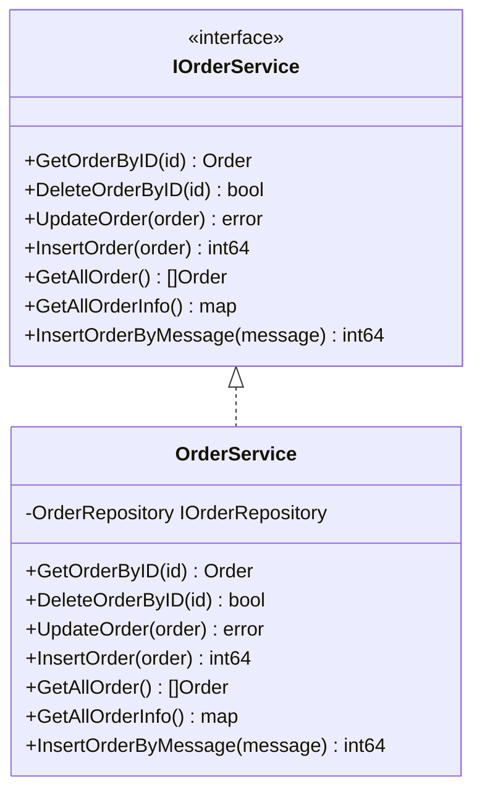
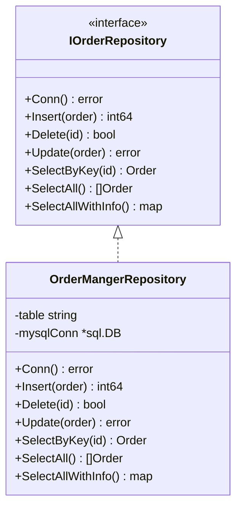
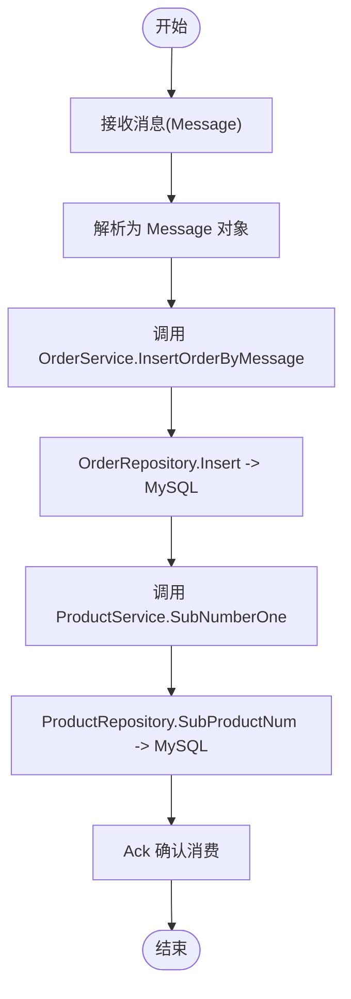
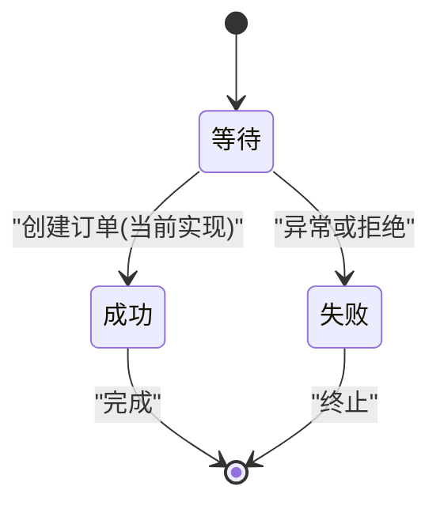
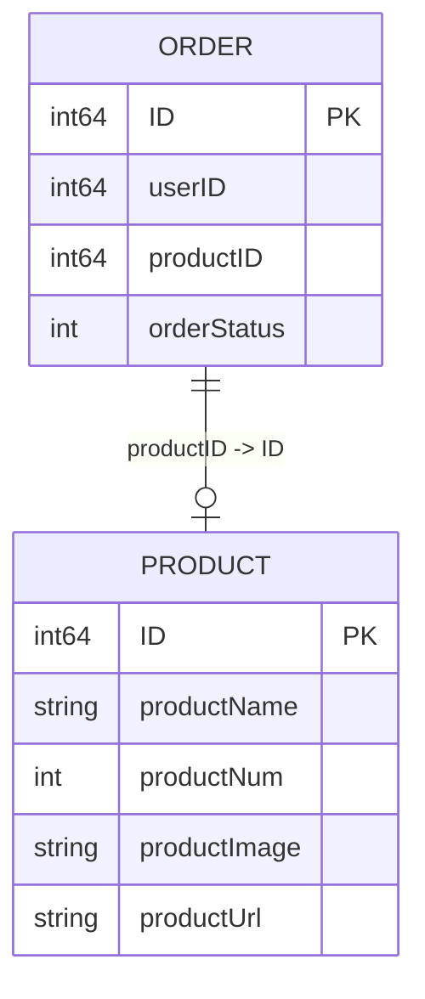
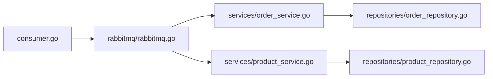

# 订单系统模块

<cite>
**本文引用的文件**   
- [datamodels/order.go](file://datamodels/order.go)
- [datamodels/message.go](file://datamodels/message.go)
- [services/order_service.go](file://services/order_service.go)
- [repositories/order_repository.go](file://repositories/order_repository.go)
- [backend/web/controllers/order_controller.go](file://backend/web/controllers/order_controller.go)
- [rabbitmq/rabbitmq.go](file://rabbitmq/rabbitmq.go)
- [consumer.go](file://consumer.go)
- [services/product_service.go](file://services/product_service.go)
- [repositories/product_repository.go](file://repositories/product_repository.go)
</cite>

## 目录
1. [简介](#简介)
2. [项目结构](#项目结构)
3. [核心组件](#核心组件)
4. [架构总览](#架构总览)
5. [详细组件分析](#详细组件分析)
6. [依赖关系分析](#依赖关系分析)
7. [性能与并发特性](#性能与并发特性)
8. [故障排查指南](#故障排查指南)
9. [结论](#结论)

## 简介
本模块为电商系统的订单子系统，负责订单数据建模、订单持久化、基于消息队列的异步下单流程以及与商品库存扣减的协作。当前实现聚焦于：
- 订单数据模型与状态常量
- 订单服务层接口与实现
- 订单仓储层对 MySQL 的增删改查
- 通过 RabbitMQ 进行异步下单与库存扣减
- 管理端订单查询展示

## 项目结构
围绕订单的核心代码分布在以下包：
- datamodels：定义订单与消息的数据结构
- services：订单服务接口与实现（含基于消息创建订单）
- repositories：订单仓储实现（MySQL CRUD）
- rabbitmq：RabbitMQ 生产者/消费者封装（消费侧处理下单与扣库存）
- consumer：消费者进程入口，装配依赖并启动消费
- backend/web/controllers：管理端订单列表控制器

图表来源
- [datamodels/order.go:3-14](file://datamodels/order.go#L3-L14)
- [datamodels/message.go:4-12](file://datamodels/message.go#L4-L12)
- [services/order_service.go:8-16](file://services/order_service.go#L8-L16)
- [repositories/order_repository.go:10-18](file://repositories/order_repository.go#L10-L18)
- [rabbitmq/rabbitmq.go:19-31](file://rabbitmq/rabbitmq.go#L19-L31)
- [consumer.go:11-26](file://consumer.go#L11-L26)
- [backend/web/controllers/order_controller.go:9-12](file://backend/web/controllers/order_controller.go#L9-L12)

章节来源
- [README.md:1-3](file://README.md#L1-L3)

## 核心组件
- 订单数据模型：包含用户ID、商品ID、订单状态等字段；提供三种状态常量（等待、成功、失败）。
- 订单服务：暴露获取、删除、更新、插入、批量查询、按消息创建订单等方法。
- 订单仓储：封装 MySQL 连接、表名配置与 SQL 操作（插入、删除、更新、按ID查询、全量查询、带商品信息的联表查询）。
- RabbitMQ 消费者：从队列读取消息，反序列化为 Message，调用服务创建订单，并调用产品服务扣减库存。
- 消费者主程序：初始化数据库连接、仓储与服务，启动 RabbitMQ 消费者。
- Web 控制器：提供订单列表页面渲染，调用服务获取订单信息。

章节来源
- [datamodels/order.go:3-14](file://datamodels/order.go#L3-L14)
- [services/order_service.go:8-16](file://services/order_service.go#L8-L16)
- [repositories/order_repository.go:10-18](file://repositories/order_repository.go#L10-L18)
- [rabbitmq/rabbitmq.go:104-181](file://rabbitmq/rabbitmq.go#L104-L181)
- [consumer.go:11-26](file://consumer.go#L11-L26)
- [backend/web/controllers/order_controller.go:14-27](file://backend/web/controllers/order_controller.go#L14-L27)

## 架构总览
订单系统采用分层架构与异步解耦：
- 控制层（可选扩展）：接收请求，调用服务层。
- 服务层：编排业务逻辑，协调仓储与外部系统。
- 仓储层：统一访问数据库。
- 消息队列：将下单动作与库存扣减解耦，提升吞吐与容错能力。

图表来源
- [backend/web/controllers/order_controller.go:14-27](file://backend/web/controllers/order_controller.go#L14-L27)
- [services/order_service.go:47-49](file://services/order_service.go#L47-L49)
- [repositories/order_repository.go:135-145](file://repositories/order_repository.go#L135-L145)
- [rabbitmq/rabbitmq.go:104-181](file://rabbitmq/rabbitmq.go#L104-L181)
- [consumer.go:11-26](file://consumer.go#L11-L26)
- [services/product_service.go:46-48](file://services/product_service.go#L46-L48)
- [repositories/product_repository.go:154-165](file://repositories/product_repository.go#L154-L165)

## 详细组件分析

### 数据模型设计
- Order：包含 ID、UserId、ProductId、OrderStatus。状态常量包括等待、成功、失败。
- Message：用于跨进程传递下单意图，包含 UserID 与 ProductID。

图表来源
- [datamodels/order.go:3-14](file://datamodels/order.go#L3-L14)
- [datamodels/message.go:4-12](file://datamodels/message.go#L4-L12)

章节来源
- [datamodels/order.go:3-14](file://datamodels/order.go#L3-L14)
- [datamodels/message.go:4-12](file://datamodels/message.go#L4-L12)

### 订单服务层
- 接口 IOrderService 定义了订单的查询、删除、更新、插入、全量查询、带信息的全量查询以及基于消息创建订单的能力。
- OrderService 委托 OrderRepository 完成数据访问。
- InsertOrderByMessage 根据消息构造订单对象并持久化，初始状态设置为“成功”。

图表来源
- [services/order_service.go:8-16](file://services/order_service.go#L8-L16)
- [services/order_service.go:18-24](file://services/order_service.go#L18-L24)
- [services/order_service.go:26-61](file://services/order_service.go#L26-L61)

章节来源
- [services/order_service.go:8-61](file://services/order_service.go#L8-L61)

### 订单仓储层
- IOrderRepository 定义了连接、CRUD、全量查询及联表查询接口。
- OrderMangerRepository 实现上述接口，内部维护 sql.DB 连接与表名，默认表名为 order。
- SelectAllWithInfo 使用 LEFT JOIN 关联 product 表，返回订单与商品名称等信息。

图表来源
- [repositories/order_repository.go:10-18](file://repositories/order_repository.go#L10-L18)
- [repositories/order_repository.go:20-27](file://repositories/order_repository.go#L20-L27)
- [repositories/order_repository.go:29-41](file://repositories/order_repository.go#L29-L41)
- [repositories/order_repository.go:43-60](file://repositories/order_repository.go#L43-L60)
- [repositories/order_repository.go:78-90](file://repositories/order_repository.go#L78-L90)
- [repositories/order_repository.go:92-111](file://repositories/order_repository.go#L92-L111)
- [repositories/order_repository.go:113-133](file://repositories/order_repository.go#L113-L133)
- [repositories/order_repository.go:135-145](file://repositories/order_repository.go#L135-L145)

章节来源
- [repositories/order_repository.go:10-145](file://repositories/order_repository.go#L10-L145)

### 订单创建流程（异步）
- 生产者（未在当前仓库中展示）向 RabbitMQ 发送 Message。
- 消费者进程启动后监听队列，收到消息后：
  1) 反序列化为 Message；
  2) 调用 OrderService.InsertOrderByMessage 创建订单；
  3) 调用 ProductService.SubNumberOne 扣减库存；
  4) 手动 ACK 确认消费。

图表来源
- [rabbitmq/rabbitmq.go:152-175](file://rabbitmq/rabbitmq.go#L152-L175)
- [services/order_service.go:52-58](file://services/order_service.go#L52-L58)
- [repositories/order_repository.go:43-60](file://repositories/order_repository.go#L43-L60)
- [services/product_service.go:46-48](file://services/product_service.go#L46-L48)
- [repositories/product_repository.go:154-165](file://repositories/product_repository.go#L154-L165)

章节来源
- [rabbitmq/rabbitmq.go:104-181](file://rabbitmq/rabbitmq.go#L104-L181)
- [services/order_service.go:52-58](file://services/order_service.go#L52-L58)
- [repositories/order_repository.go:43-60](file://repositories/order_repository.go#L43-L60)
- [services/product_service.go:46-48](file://services/product_service.go#L46-L48)
- [repositories/product_repository.go:154-165](file://repositories/product_repository.go#L154-L165)

### 订单状态管理机制
- 当前状态集合：等待、成功、失败。
- 在基于消息创建订单时，订单初始状态直接设为“成功”，未体现更细粒度的状态机流转（如支付、发货、结算等）。
- 如需扩展状态机，建议在 OrderService 中增加状态校验与转换方法，并在仓储层提供按状态更新的原子操作。

图表来源
- [datamodels/order.go:10-14](file://datamodels/order.go#L10-L14)
- [services/order_service.go:52-58](file://services/order_service.go#L52-L58)

章节来源
- [datamodels/order.go:10-14](file://datamodels/order.go#L10-L14)
- [services/order_service.go:52-58](file://services/order_service.go#L52-L58)

### 订单与商品的关系映射
- Order 通过 ProductId 与商品建立关联。
- 仓储层 SelectAllWithInfo 使用 LEFT JOIN 将订单与商品名称关联查询，便于管理端展示。

图表来源
- [datamodels/order.go:3-8](file://datamodels/order.go#L3-L8)
- [repositories/order_repository.go:135-145](file://repositories/order_repository.go#L135-L145)

章节来源
- [datamodels/order.go:3-8](file://datamodels/order.go#L3-L8)
- [repositories/order_repository.go:135-145](file://repositories/order_repository.go#L135-L145)

### Web 控制层（订单列表）
- OrderController.Get 调用 OrderService.GetAllOrderInfo 获取订单与商品信息，渲染视图。
- 若查询失败，记录调试日志。

章节来源
- [backend/web/controllers/order_controller.go:14-27](file://backend/web/controllers/order_controller.go#L14-L27)
- [services/order_service.go:47-49](file://services/order_service.go#L47-L49)
- [repositories/order_repository.go:135-145](file://repositories/order_repository.go#L135-L145)

## 依赖关系分析
- OrderService 依赖 IOrderRepository，实际由 OrderMangerRepository 实现。
- RabbitMQ 消费者同时依赖 OrderService 与 ProductService，分别完成下单与扣库存。
- Consumer Main 负责装配依赖并启动消费者。

图表来源
- [consumer.go:11-26](file://consumer.go#L11-L26)
- [rabbitmq/rabbitmq.go:104-181](file://rabbitmq/rabbitmq.go#L104-L181)
- [services/order_service.go:8-16](file://services/order_service.go#L8-L16)
- [services/product_service.go:8-15](file://services/product_service.go#L8-L15)
- [repositories/order_repository.go:10-18](file://repositories/order_repository.go#L10-L18)
- [repositories/product_repository.go:12-21](file://repositories/product_repository.go#L12-L21)

章节来源
- [consumer.go:11-26](file://consumer.go#L11-L26)
- [rabbitmq/rabbitmq.go:104-181](file://rabbitmq/rabbitmq.go#L104-L181)
- [services/order_service.go:8-16](file://services/order_service.go#L8-L16)
- [services/product_service.go:8-15](file://services/product_service.go#L8-L15)
- [repositories/order_repository.go:10-18](file://repositories/order_repository.go#L10-L18)
- [repositories/product_repository.go:12-21](file://repositories/product_repository.go#L12-L21)

## 性能与并发特性
- 消费者限流：通过 Qos(1, 0, false) 限制每次只投递一条消息给消费者，避免背压。
- 手动 ACK：在处理成功后显式 d.Ack(false)，确保消息可靠性。
- 并发安全：RabbitMQ 实例使用 sync.Mutex 保护连接与 Channel 的并发访问。
- 数据库连接复用：仓储层 Conn() 懒加载 sql.DB，避免重复创建连接。

章节来源
- [rabbitmq/rabbitmq.go:123-128](file://rabbitmq/rabbitmq.go#L123-L128)
- [rabbitmq/rabbitmq.go:172-175](file://rabbitmq/rabbitmq.go#L172-L175)
- [rabbitmq/rabbitmq.go:30-31](file://rabbitmq/rabbitmq.go#L30-L31)
- [repositories/order_repository.go:29-41](file://repositories/order_repository.go#L29-L41)

## 故障排查指南
- 消费者无法消费消息：检查 RabbitMQ 连接地址、队列声明是否一致、权限是否正确。
- 订单创建失败：检查 OrderRepository.Insert 的 SQL 执行与 LastInsertId 返回值。
- 库存扣减失败：检查 ProductRepository.SubProductNum 的 SQL 与影响行数。
- 管理端订单列表为空：确认 SelectAllWithInfo 的联表 SQL 与数据库表结构是否匹配。

章节来源
- [rabbitmq/rabbitmq.go:44-50](file://rabbitmq/rabbitmq.go#L44-L50)
- [rabbitmq/rabbitmq.go:152-175](file://rabbitmq/rabbitmq.go#L152-L175)
- [repositories/order_repository.go:43-60](file://repositories/order_repository.go#L43-L60)
- [repositories/product_repository.go:154-165](file://repositories/product_repository.go#L154-L165)
- [repositories/order_repository.go:135-145](file://repositories/order_repository.go#L135-L145)

## 结论
当前订单模块实现了基础的订单数据建模、持久化与基于 RabbitMQ 的异步下单流程，并通过联表查询支持管理端展示。状态机较为简单，尚未覆盖支付、发货、结算等完整生命周期。建议后续增强：
- 完善订单状态机，引入支付、发货、结算等状态与转换规则；
- 在下单前增加库存预占与价格计算步骤，保证一致性；
- 引入分布式事务或补偿机制，保障订单与库存的最终一致性；
- 增加幂等性与重试策略，提升系统在异常场景下的健壮性。