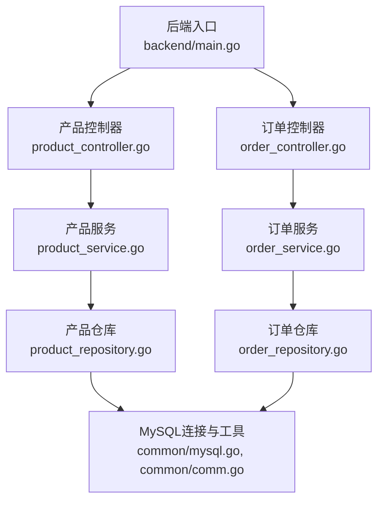
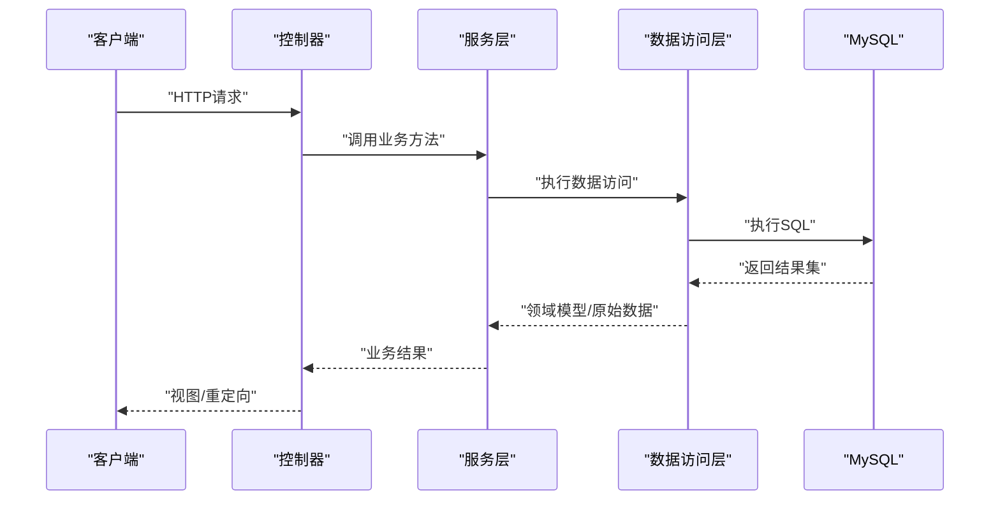
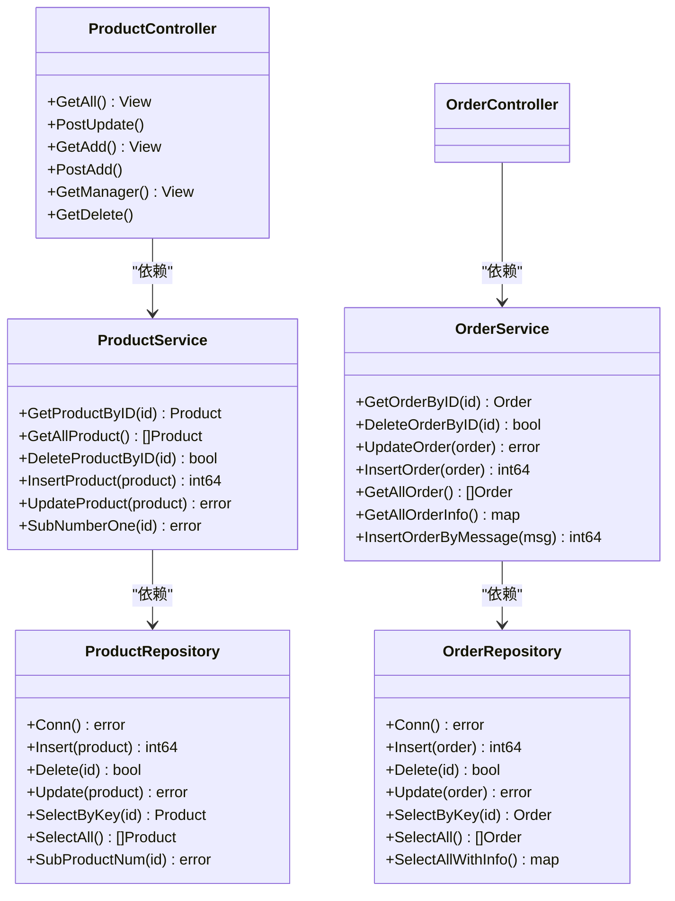
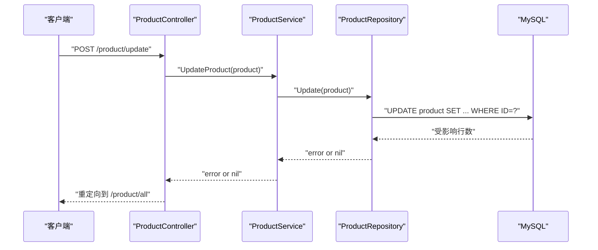

# 分层架构设计

<cite>
**本文引用的文件**
- [backend/main.go](file://backend/main.go)
- [backend/web/controllers/product_controller.go](file://backend/web/controllers/product_controller.go)
- [backend/web/controllers/order_controller.go](file://backend/web/controllers/order_controller.go)
- [services/product_service.go](file://services/product_service.go)
- [services/order_service.go](file://services/order_service.go)
- [repositories/product_repository.go](file://repositories/product_repository.go)
- [repositories/order_repository.go](file://repositories/order_repository.go)
- [datamodels/product.go](file://datamodels/product.go)
- [datamodels/order.go](file://datamodels/order.go)
- [datamodels/message.go](file://datamodels/message.go)
- [common/mysql.go](file://common/mysql.go)
- [common/comm.go](file://common/comm.go)
- [common/filter.go](file://common/filter.go)
</cite>

## 目录
1. [简介](#简介)
2. [项目结构](#项目结构)
3. [核心组件](#核心组件)
4. [架构总览](#架构总览)
5. [详细组件分析](#详细组件分析)
6. [依赖关系分析](#依赖关系分析)
7. [性能考虑](#性能考虑)
8. [故障排查指南](#故障排查指南)
9. [结论](#结论)
10. [附录](#附录)

## 简介
本项目采用典型的分层架构：控制器层（Controller）负责HTTP请求与视图渲染；服务层（Service）封装业务逻辑并协调数据访问；数据访问层（Repository）抽象数据库操作，屏蔽具体SQL实现。通过接口定义与依赖注入，各层之间松耦合、职责清晰，便于测试与维护。

## 项目结构
- 入口与路由注册：后端主程序创建应用实例、注册模板、连接数据库，并按模块划分路由Party，将Service注入到MVC框架中。
- 控制器：按领域划分（产品、订单），仅做参数解析、调用Service、返回视图或重定向。
- 服务层：面向业务场景暴露方法，内部委托给Repository完成数据存取。
- 数据访问层：为每个领域提供统一的数据访问接口，使用通用工具进行结果映射与类型转换。
- 公共库：数据库连接、反射映射、过滤器等通用能力。

图表来源
- [backend/main.go:14-51](file://backend/main.go#L14-L51)
- [backend/web/controllers/product_controller.go:12-95](file://backend/web/controllers/product_controller.go#L12-L95)
- [backend/web/controllers/order_controller.go:9-28](file://backend/web/controllers/order_controller.go#L9-L28)
- [services/product_service.go:8-48](file://services/product_service.go#L8-L48)
- [services/order_service.go:8-64](file://services/order_service.go#L8-L64)
- [repositories/product_repository.go:10-165](file://repositories/product_repository.go#L10-L165)
- [repositories/order_repository.go:10-146](file://repositories/order_repository.go#L10-L146)
- [common/mysql.go:8-67](file://common/mysql.go#L8-L67)
- [common/comm.go:10-69](file://common/comm.go#L10-L69)

章节来源
- [backend/main.go:14-51](file://backend/main.go#L14-L51)

## 核心组件
- 控制器层
  - 产品控制器：处理商品列表、新增、编辑、删除等请求，调用产品服务并返回视图。
  - 订单控制器：获取订单信息并渲染视图。
- 服务层
  - 产品服务：对外暴露商品的CRUD与库存扣减等业务方法，内部委托产品仓库。
  - 订单服务：对外暴露订单的CRUD、批量查询以及基于消息创建订单的业务方法。
- 数据访问层
  - 产品仓库：实现商品数据的增删改查与库存扣减，使用通用工具将行数据映射为领域模型。
  - 订单仓库：实现订单数据的增删改查及关联查询，同样使用通用工具进行映射。
- 公共库
  - MySQL连接：提供数据库连接初始化。
  - 通用映射：基于结构体标签将查询结果映射到Go结构体，支持基础类型转换。
  - 过滤器：提供URI级别的拦截器机制（可选扩展）。

章节来源
- [backend/web/controllers/product_controller.go:12-95](file://backend/web/controllers/product_controller.go#L12-L95)
- [backend/web/controllers/order_controller.go:9-28](file://backend/web/controllers/order_controller.go#L9-L28)
- [services/product_service.go:8-48](file://services/product_service.go#L8-L48)
- [services/order_service.go:8-64](file://services/order_service.go#L8-L64)
- [repositories/product_repository.go:10-165](file://repositories/product_repository.go#L10-L165)
- [repositories/order_repository.go:10-146](file://repositories/order_repository.go#L10-L146)
- [common/mysql.go:8-67](file://common/mysql.go#L8-L67)
- [common/comm.go:10-69](file://common/comm.go#L10-L69)
- [common/filter.go:8-54](file://common/filter.go#L8-L54)

## 架构总览
分层职责与交互：
- 控制器层：接收HTTP请求，解析表单/URL参数，调用服务层，渲染视图或重定向。
- 服务层：封装业务规则（如根据消息创建订单、库存扣减），协调多个仓库或外部系统。
- 数据访问层：定义统一的仓储接口，屏蔽SQL细节，提供领域模型的持久化能力。
- 依赖方向：控制器依赖服务接口；服务依赖仓储接口；仓储依赖数据库与通用工具。通过接口解耦，便于替换实现与单元测试。

图表来源
- [backend/web/controllers/product_controller.go:17-95](file://backend/web/controllers/product_controller.go#L17-L95)
- [services/product_service.go:22-48](file://services/product_service.go#L22-L48)
- [repositories/product_repository.go:47-165](file://repositories/product_repository.go#L47-L165)
- [common/mysql.go:8-67](file://common/mysql.go#L8-L67)

## 详细组件分析

### 控制器层（ProductController / OrderController）
- 职责
  - 解析请求参数（表单、URL参数）。
  - 调用服务层方法执行业务。
  - 返回视图数据或重定向。
- 关键点
  - 使用Iris MVC框架，控制器字段注入服务接口，便于替换与测试。
  - 错误日志记录，简化异常处理流程。
- 示例路径
  - 商品列表、新增、编辑、删除：[product_controller.go:17-95](file://backend/web/controllers/product_controller.go#L17-L95)
  - 订单列表：[order_controller.go:14-28](file://backend/web/controllers/order_controller.go#L14-L28)

章节来源
- [backend/web/controllers/product_controller.go:17-95](file://backend/web/controllers/product_controller.go#L17-L95)
- [backend/web/controllers/order_controller.go:14-28](file://backend/web/controllers/order_controller.go#L14-L28)

### 服务层（ProductService / OrderService）
- 职责
  - 封装业务逻辑，如“根据消息创建订单”、“库存扣减”。
  - 协调多个仓储或外部系统（当前以仓储为主）。
- 关键点
  - 通过接口定义对外能力，内部持有仓储接口，实现依赖倒置。
  - 对复杂业务进行编排（例如从Message构造Order并插入）。
- 示例路径
  - 商品CRUD与库存扣减：[product_service.go:22-48](file://services/product_service.go#L22-L48)
  - 订单CRUD与消息创建订单：[order_service.go:26-64](file://services/order_service.go#L26-L64)

章节来源
- [services/product_service.go:22-48](file://services/product_service.go#L22-L48)
- [services/order_service.go:26-64](file://services/order_service.go#L26-L64)

### 数据访问层（ProductRepository / OrderRepository）
- 职责
  - 实现领域模型的持久化操作（增删改查）。
  - 封装SQL语句与结果映射，向上层暴露稳定的接口。
- 关键点
  - 使用通用工具将查询结果映射为领域模型，减少样板代码。
  - 连接管理：懒加载数据库连接，表名可配置。
- 示例路径
  - 商品仓储：[product_repository.go:47-165](file://repositories/product_repository.go#L47-L165)
  - 订单仓储：[order_repository.go:43-146](file://repositories/order_repository.go#L43-L146)

章节来源
- [repositories/product_repository.go:47-165](file://repositories/product_repository.go#L47-L165)
- [repositories/order_repository.go:43-146](file://repositories/order_repository.go#L43-L146)

### 领域模型（Product / Order / Message）
- 职责
  - 定义业务实体及其字段映射标签，供仓储层进行数据绑定。
- 关键点
  - 使用sql/imooc等标签配合通用映射工具，自动填充字段。
- 示例路径
  - 商品模型：[product.go:3-9](file://datamodels/product.go#L3-L9)
  - 订单模型与状态常量：[order.go:3-14](file://datamodels/order.go#L3-L14)
  - 消息模型：[message.go:4-12](file://datamodels/message.go#L4-L12)

章节来源
- [datamodels/product.go:3-9](file://datamodels/product.go#L3-L9)
- [datamodels/order.go:3-14](file://datamodels/order.go#L3-L14)
- [datamodels/message.go:4-12](file://datamodels/message.go#L4-L12)

### 公共库（MySQL连接与通用映射）
- 职责
  - 提供数据库连接初始化。
  - 提供基于反射的结构体映射与类型转换工具。
- 关键点
  - GetResultRow/GetResultRows将SQL行转换为map，再由DataToStructByTagSql填充到结构体。
  - TypeConversion支持常见数值与时区时间类型转换。
- 示例路径
  - MySQL连接：[mysql.go:8-12](file://common/mysql.go#L8-L12)
  - 结果读取与映射：[mysql.go:14-67](file://common/mysql.go#L14-L67), [comm.go:10-69](file://common/comm.go#L10-L69)

章节来源
- [common/mysql.go:8-67](file://common/mysql.go#L8-L67)
- [common/comm.go:10-69](file://common/comm.go#L10-L69)

### 依赖注入与解耦设计
- 依赖注入
  - 在入口文件中创建仓储与服务实例，并通过MVC框架的Register注入到控制器与服务中。
  - 控制器与服务均通过接口字段持有依赖，便于替换与测试。
- 解耦设计
  - 上层只依赖接口，不感知具体实现；仓储屏蔽SQL细节；服务专注业务编排。
- 示例路径
  - 入口注册与注入：[backend/main.go:38-51](file://backend/main.go#L38-L51)
  - 服务接口与实现：[product_service.go:8-24](file://services/product_service.go#L8-L24), [order_service.go:8-24](file://services/order_service.go#L8-L24)
  - 仓储接口与实现：[product_repository.go:10-30](file://repositories/product_repository.go#L10-L30), [order_repository.go:10-27](file://repositories/order_repository.go#L10-L27)

章节来源
- [backend/main.go:38-51](file://backend/main.go#L38-L51)
- [services/product_service.go:8-24](file://services/product_service.go#L8-L24)
- [services/order_service.go:8-24](file://services/order_service.go#L8-L24)
- [repositories/product_repository.go:10-30](file://repositories/product_repository.go#L10-L30)
- [repositories/order_repository.go:10-27](file://repositories/order_repository.go#L10-L27)

## 依赖关系分析
- 依赖方向
  - 控制器 → 服务接口
  - 服务 → 仓储接口
  - 仓储 → 数据库连接与通用工具
- 内聚性
  - 每层职责单一，变更影响面小。
- 耦合度
  - 通过接口降低耦合，便于替换实现（如Mock仓储进行测试）。
- 循环依赖
  - 未发现循环依赖，层级清晰。

图表来源
- [backend/web/controllers/product_controller.go:12-95](file://backend/web/controllers/product_controller.go#L12-L95)
- [backend/web/controllers/order_controller.go:9-28](file://backend/web/controllers/order_controller.go#L9-L28)
- [services/product_service.go:8-48](file://services/product_service.go#L8-L48)
- [services/order_service.go:8-64](file://services/order_service.go#L8-L64)
- [repositories/product_repository.go:10-165](file://repositories/product_repository.go#L10-L165)
- [repositories/order_repository.go:10-146](file://repositories/order_repository.go#L10-L146)

章节来源
- [backend/web/controllers/product_controller.go:12-95](file://backend/web/controllers/product_controller.go#L12-L95)
- [backend/web/controllers/order_controller.go:9-28](file://backend/web/controllers/order_controller.go#L9-L28)
- [services/product_service.go:8-48](file://services/product_service.go#L8-L48)
- [services/order_service.go:8-64](file://services/order_service.go#L8-L64)
- [repositories/product_repository.go:10-165](file://repositories/product_repository.go#L10-L165)
- [repositories/order_repository.go:10-146](file://repositories/order_repository.go#L10-L146)

## 性能考虑
- 连接复用
  - 仓储层懒加载数据库连接，建议在生产环境改为全局单例连接池以减少重复创建开销。
- SQL优化
  - 避免字符串拼接导致SQL注入风险，建议使用参数化查询（当前部分已使用Prepare，但仍有拼接字段，需审查）。
- 结果集处理
  - 大量数据查询时注意分页与索引，避免全表扫描。
- 模板与静态资源
  - 合理缓存模板与静态资源，提升响应速度。

[本节为通用指导，无需特定文件引用]

## 故障排查指南
- 数据库连接失败
  - 检查连接字符串与网络连通性，确认数据库服务可用。
  - 参考连接初始化位置：[mysql.go:8-12](file://common/mysql.go#L8-L12)
- 数据映射异常
  - 核对结构体sql标签与数据库列名一致，确保类型可转换。
  - 参考映射工具：[comm.go:10-69](file://common/comm.go#L10-L69)
- 业务逻辑错误
  - 查看控制器与服务层的日志输出，定位错误来源。
  - 参考控制器日志：[product_controller.go:28-40](file://backend/web/controllers/product_controller.go#L28-L40), [order_controller.go:14-28](file://backend/web/controllers/order_controller.go#L14-L28)
- 拦截器问题
  - 若使用过滤器，检查URI匹配与错误返回逻辑。
  - 参考过滤器实现：[filter.go:8-54](file://common/filter.go#L8-L54)

章节来源
- [common/mysql.go:8-12](file://common/mysql.go#L8-L12)
- [common/comm.go:10-69](file://common/comm.go#L10-L69)
- [backend/web/controllers/product_controller.go:28-40](file://backend/web/controllers/product_controller.go#L28-L40)
- [backend/web/controllers/order_controller.go:14-28](file://backend/web/controllers/order_controller.go#L14-L28)
- [common/filter.go:8-54](file://common/filter.go#L8-L54)

## 结论
本项目通过清晰的三层架构与接口解耦，实现了控制器、服务与数据访问的职责分离。服务层集中封装业务逻辑，仓储层屏蔽数据库细节，结合依赖注入提升了可维护性与可测试性。建议在后续迭代中完善SQL安全、连接池管理与性能监控，进一步提升系统的健壮性与可扩展性。

[本节为总结性内容，无需特定文件引用]

## 附录
- 关键流程时序图（以商品更新为例）

图表来源
- [backend/web/controllers/product_controller.go:28-40](file://backend/web/controllers/product_controller.go#L28-L40)
- [services/product_service.go:42-44](file://services/product_service.go#L42-L44)
- [repositories/product_repository.go:85-104](file://repositories/product_repository.go#L85-L104)
- [common/mysql.go:8-12](file://common/mysql.go#L8-L12)