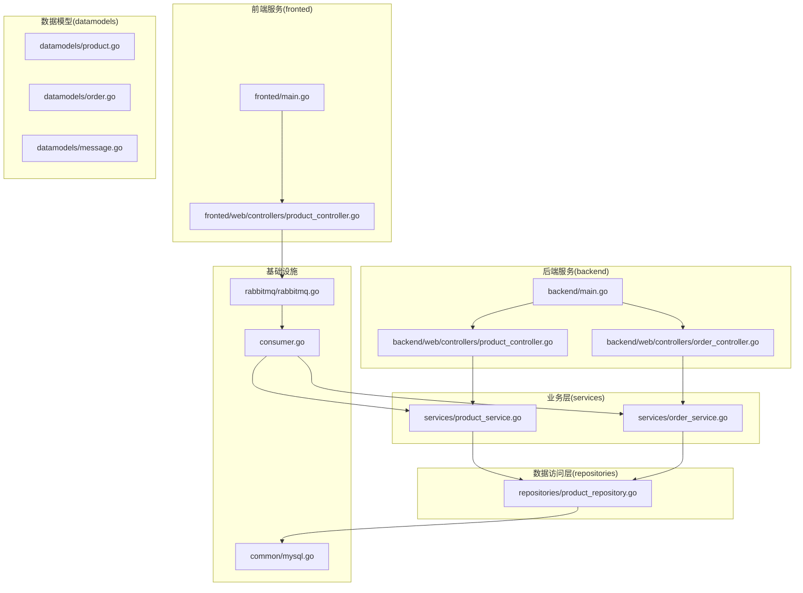
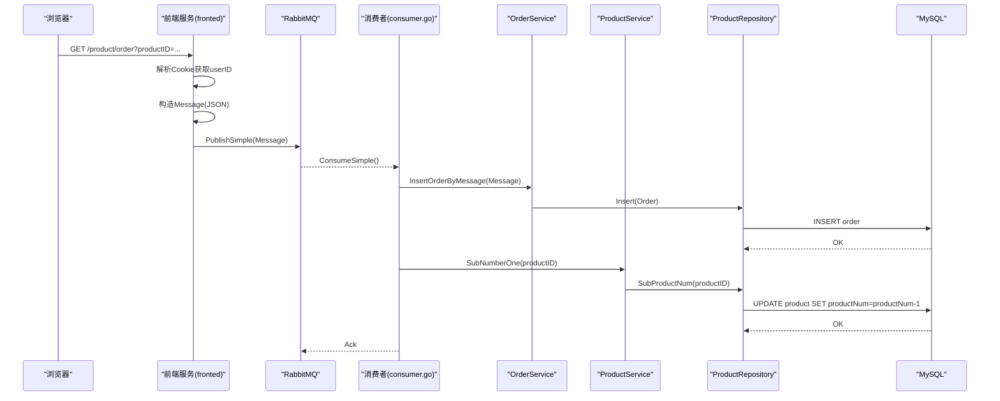
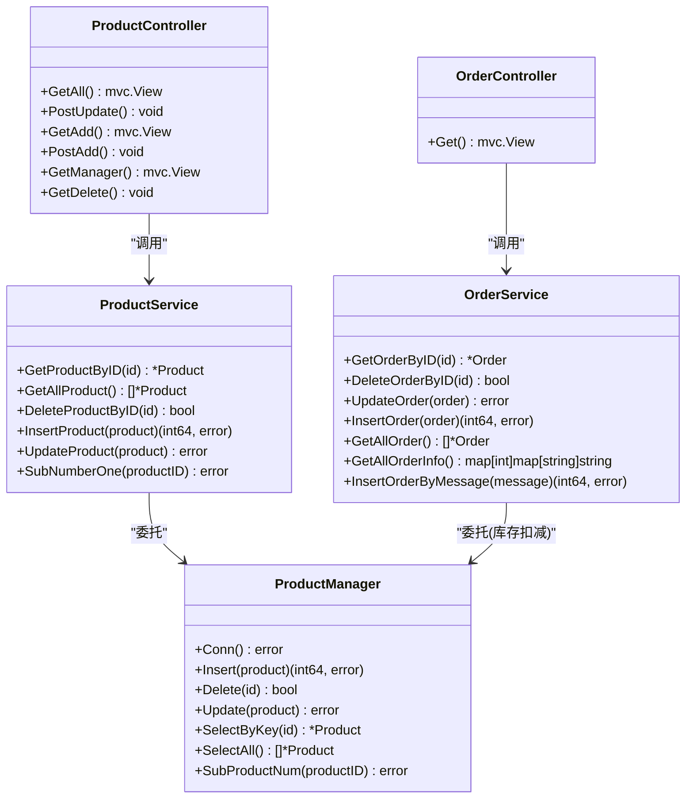
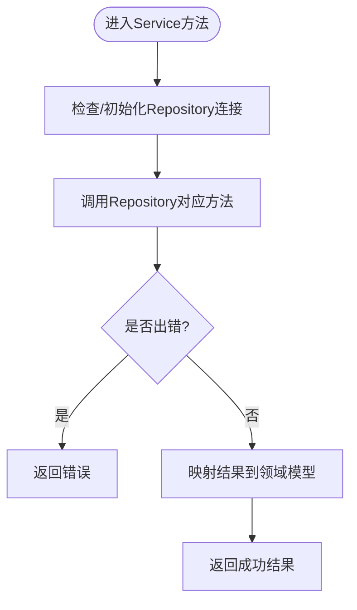
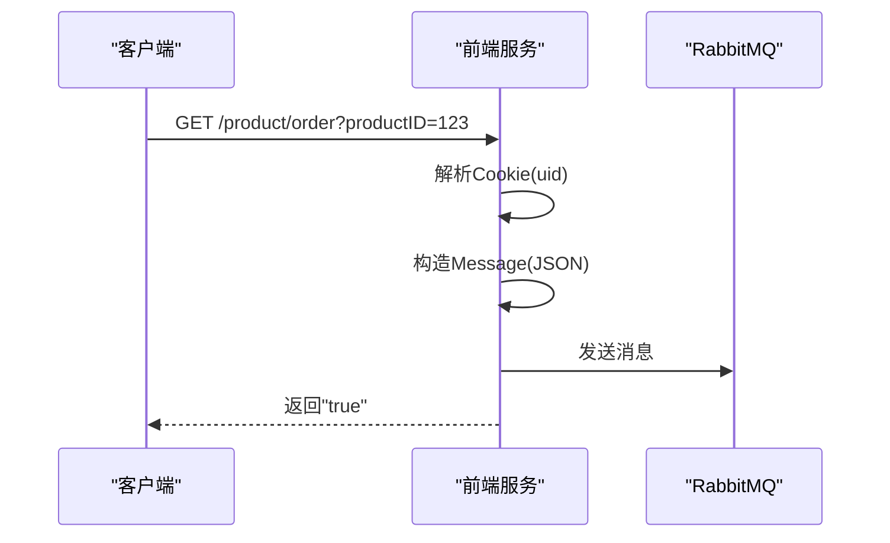
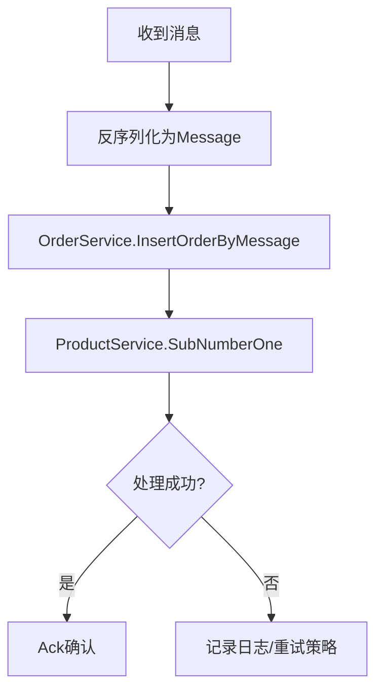
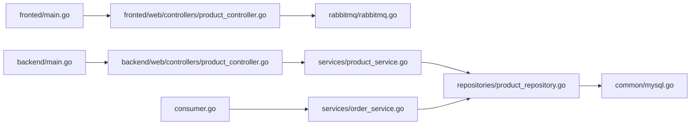

# 系统架构设计

<cite>
**本文引用的文件**   
- [backend/main.go](file://backend/main.go)
- [fronted/main.go](file://fronted/main.go)
- [rabbitmq/rabbitmq.go](file://rabbitmq/rabbitmq.go)
- [consumer.go](file://consumer.go)
- [backend/web/controllers/product_controller.go](file://backend/web/controllers/product_controller.go)
- [backend/web/controllers/order_controller.go](file://backend/web/controllers/order_controller.go)
- [fronted/web/controllers/product_controller.go](file://fronted/web/controllers/product_controller.go)
- [services/product_service.go](file://services/product_service.go)
- [services/order_service.go](file://services/order_service.go)
- [repositories/product_repository.go](file://repositories/product_repository.go)
- [datamodels/product.go](file://datamodels/product.go)
- [datamodels/order.go](file://datamodels/order.go)
- [datamodels/message.go](file://datamodels/message.go)
- [common/mysql.go](file://common/mysql.go)
</cite>

## 目录
1. [引言](#引言)
2. [项目结构](#项目结构)
3. [核心组件](#核心组件)
4. [架构总览](#架构总览)
5. [详细组件分析](#详细组件分析)
6. [依赖关系分析](#依赖关系分析)
7. [性能与高并发](#性能与高并发)
8. [故障排查指南](#故障排查指南)
9. [结论](#结论)
10. [附录](#附录)

## 引言
本仓库实现了一个面向电商场景的后台管理与前端展示系统，采用前后端分离、MVC分层与Repository/Service模式组织代码，并通过RabbitMQ消息队列解耦下单流程，以支撑高并发抢购场景。后端服务使用Iris框架提供Web能力，数据持久化通过MySQL完成；前端服务同样基于Iris，负责页面渲染与静态HTML生成，并将下单请求异步投递至消息队列，由独立消费者进程处理订单创建与库存扣减。

## 项目结构
整体工程按“前后端分离 + 分层架构”组织：
- 后端服务（backend）：管理端页面与接口，包含控制器、视图与模板资源。
- 前端服务（fronted）：用户端页面、静态HTML生成与下单入口。
- 公共层（common）：数据库连接与通用工具。
- 数据模型（datamodels）：领域实体与消息体定义。
- 数据访问层（repositories）：封装SQL操作，实现Repository模式。
- 业务层（services）：编排业务逻辑，实现Service模式。
- 消息队列（rabbitmq）：RabbitMQ客户端封装，支持简单模式生产与消费。
- 消费者（consumer.go）：独立进程，订阅队列并执行订单落库与库存扣减。

图表来源
- [backend/main.go:14-59](file://backend/main.go#L14-L59)
- [fronted/main.go:16-66](file://fronted/main.go#L16-L66)
- [rabbitmq/rabbitmq.go:18-31](file://rabbitmq/rabbitmq.go#L18-L31)
- [consumer.go:11-27](file://consumer.go#L11-L27)

章节来源
- [backend/main.go:14-59](file://backend/main.go#L14-L59)
- [fronted/main.go:16-66](file://fronted/main.go#L16-L66)

## 核心组件
- 控制器层（Controller）
  - 后端产品与管理控制器：负责表单解析、参数校验、调用服务层并返回视图或重定向。
  - 前端产品控制器：负责静态HTML生成、用户登录态读取、构造消息并投递到RabbitMQ。
- 服务层（Service）
  - ProductService：商品CRUD与库存扣减的业务编排。
  - OrderService：订单CRUD、查询聚合信息、从消息构建订单。
- 数据访问层（Repository）
  - ProductManager：商品表SQL封装，含插入、删除、更新、查询与库存扣减。
- 数据模型（Model）
  - Product、Order、Message：领域实体与消息体定义。
- 基础设施
  - MySQL连接与行转结构工具。
  - RabbitMQ简单模式封装（生产者/消费者）。
  - 独立消费者进程。

章节来源
- [backend/web/controllers/product_controller.go:12-94](file://backend/web/controllers/product_controller.go#L12-L94)
- [backend/web/controllers/order_controller.go:9-27](file://backend/web/controllers/order_controller.go#L9-L27)
- [fronted/web/controllers/product_controller.go:17-120](file://fronted/web/controllers/product_controller.go#L17-L120)
- [services/product_service.go:8-48](file://services/product_service.go#L8-L48)
- [services/order_service.go:8-61](file://services/order_service.go#L8-L61)
- [repositories/product_repository.go:12-165](file://repositories/product_repository.go#L12-L165)
- [datamodels/product.go:1-10](file://datamodels/product.go#L1-L10)
- [datamodels/order.go:1-15](file://datamodels/order.go#L1-L15)
- [datamodels/message.go:1-13](file://datamodels/message.go#L1-L13)
- [common/mysql.go:8-67](file://common/mysql.go#L8-L67)
- [rabbitmq/rabbitmq.go:18-182](file://rabbitmq/rabbitmq.go#L18-L182)
- [consumer.go:11-27](file://consumer.go#L11-L27)

## 架构总览
系统采用前后端分离与MVC分层：
- 前端服务（fronted）：提供用户界面、静态HTML生成与下单入口，将下单请求异步投递至RabbitMQ。
- 后端服务（backend）：提供管理端页面与数据查询接口，直接访问数据库。
- 消费者（consumer.go）：独立进程，消费RabbitMQ消息，执行业务编排（创建订单、扣减库存）。

图表来源
- [fronted/web/controllers/product_controller.go:95-120](file://fronted/web/controllers/product_controller.go#L95-L120)
- [rabbitmq/rabbitmq.go:67-101](file://rabbitmq/rabbitmq.go#L67-L101)
- [rabbitmq/rabbitmq.go:103-182](file://rabbitmq/rabbitmq.go#L103-L182)
- [consumer.go:11-27](file://consumer.go#L11-L27)
- [services/order_service.go:51-61](file://services/order_service.go#L51-L61)
- [services/product_service.go:46-48](file://services/product_service.go#L46-L48)
- [repositories/product_repository.go:154-165](file://repositories/product_repository.go#L154-L165)

## 详细组件分析

### MVC分层与职责划分
- 控制器层
  - 后端产品控制器：列表展示、新增、编辑、删除、详情跳转等，统一调用ProductService。
  - 后端订单控制器：订单列表展示，调用OrderService聚合查询。
  - 前端产品控制器：静态HTML生成、订单下单入口（消息投递）。
- 服务层
  - ProductService：商品CRUD与库存扣减，屏蔽Repository细节。
  - OrderService：订单CRUD、聚合查询、从消息构建订单。
- 数据访问层
  - ProductManager：封装商品表SQL，提供Conn、Insert、Delete、Update、SelectByKey、SelectAll、SubProductNum。

图表来源
- [backend/web/controllers/product_controller.go:12-94](file://backend/web/controllers/product_controller.go#L12-L94)
- [backend/web/controllers/order_controller.go:9-27](file://backend/web/controllers/order_controller.go#L9-L27)
- [services/product_service.go:8-48](file://services/product_service.go#L8-L48)
- [services/order_service.go:8-61](file://services/order_service.go#L8-L61)
- [repositories/product_repository.go:12-165](file://repositories/product_repository.go#L12-L165)

章节来源
- [backend/web/controllers/product_controller.go:12-94](file://backend/web/controllers/product_controller.go#L12-L94)
- [backend/web/controllers/order_controller.go:9-27](file://backend/web/controllers/order_controller.go#L9-L27)
- [services/product_service.go:8-48](file://services/product_service.go#L8-L48)
- [services/order_service.go:8-61](file://services/order_service.go#L8-L61)
- [repositories/product_repository.go:12-165](file://repositories/product_repository.go#L12-L165)

### Repository模式与Service模式
- Repository模式
  - 通过IProduct接口抽象商品数据访问，ProductManager实现具体SQL逻辑，便于替换存储实现与单元测试。
- Service模式
  - IProductService与IOrderService定义业务能力边界，ProductService与OrderService组合Repository，编排业务流程（如从消息创建订单、扣减库存）。

图表来源
- [repositories/product_repository.go:32-45](file://repositories/product_repository.go#L32-L45)
- [services/product_service.go:26-48](file://services/product_service.go#L26-L48)
- [services/order_service.go:26-61](file://services/order_service.go#L26-L61)

章节来源
- [repositories/product_repository.go:12-165](file://repositories/product_repository.go#L12-L165)
- [services/product_service.go:8-48](file://services/product_service.go#L8-L48)
- [services/order_service.go:8-61](file://services/order_service.go#L8-L61)

### 前后端分离与API规范
- 前端服务（fronted）
  - 提供页面渲染与静态HTML生成，静态资源路径/public，生成的HTML位于/html。
  - 下单接口：GET /product/order?productID={id}，从Cookie中读取用户ID，构造Message(JSON)投递到RabbitMQ，返回固定响应。
- 后端服务（backend）
  - 提供管理端页面与数据查询接口，例如/product/all、/order等，返回视图。
- 数据传输格式
  - 消息体Message为JSON，包含UserID与ProductID字段。
  - 控制器间传递的数据多为视图模型或领域模型对象。

图表来源
- [fronted/main.go:22-28](file://fronted/main.go#L22-L28)
- [fronted/web/controllers/product_controller.go:95-120](file://fronted/web/controllers/product_controller.go#L95-L120)
- [datamodels/message.go:1-13](file://datamodels/message.go#L1-L13)

章节来源
- [fronted/main.go:16-66](file://fronted/main.go#L16-L66)
- [fronted/web/controllers/product_controller.go:95-120](file://fronted/web/controllers/product_controller.go#L95-L120)
- [datamodels/message.go:1-13](file://datamodels/message.go#L1-L13)

### 高并发处理机制（RabbitMQ集成与异步流程）
- 生产者（前端服务）
  - 使用NewRabbitMQSimple创建连接与Channel，调用PublishSimple将消息投递到队列。
- 消费者（consumer.go）
  - 启动ConsumeSimple监听队列，手动Ack确认，顺序消费消息。
  - 对每条消息：调用OrderService.InsertOrderByMessage创建订单，再调用ProductService.SubNumberOne扣减库存。
- 流控与可靠性
  - 使用Qos限制单条预取数量，避免消费者过载。
  - 手动Ack确保处理成功后才确认消息。

图表来源
- [rabbitmq/rabbitmq.go:67-101](file://rabbitmq/rabbitmq.go#L67-L101)
- [rabbitmq/rabbitmq.go:103-182](file://rabbitmq/rabbitmq.go#L103-L182)
- [consumer.go:11-27](file://consumer.go#L11-L27)
- [services/order_service.go:51-61](file://services/order_service.go#L51-L61)
- [services/product_service.go:46-48](file://services/product_service.go#L46-L48)

章节来源
- [rabbitmq/rabbitmq.go:67-182](file://rabbitmq/rabbitmq.go#L67-L182)
- [consumer.go:11-27](file://consumer.go#L11-L27)
- [services/order_service.go:51-61](file://services/order_service.go#L51-L61)
- [services/product_service.go:46-48](file://services/product_service.go#L46-L48)

## 依赖关系分析
- 前端服务依赖：
  - repositories/services用于页面数据展示（可选），rabbitmq用于下单消息投递。
- 后端服务依赖：
  - repositories/services用于管理端数据查询与展示。
- 消费者依赖：
  - services/repositories/common用于订单创建与库存扣减。

图表来源
- [fronted/main.go:16-66](file://fronted/main.go#L16-L66)
- [fronted/web/controllers/product_controller.go:17-120](file://fronted/web/controllers/product_controller.go#L17-L120)
- [rabbitmq/rabbitmq.go:18-182](file://rabbitmq/rabbitmq.go#L18-L182)
- [backend/main.go:14-59](file://backend/main.go#L14-L59)
- [backend/web/controllers/product_controller.go:12-94](file://backend/web/controllers/product_controller.go#L12-L94)
- [services/product_service.go:8-48](file://services/product_service.go#L8-L48)
- [repositories/product_repository.go:12-165](file://repositories/product_repository.go#L12-L165)
- [common/mysql.go:8-67](file://common/mysql.go#L8-L67)
- [consumer.go:11-27](file://consumer.go#L11-L27)
- [services/order_service.go:8-61](file://services/order_service.go#L8-L61)

章节来源
- [fronted/main.go:16-66](file://fronted/main.go#L16-L66)
- [backend/main.go:14-59](file://backend/main.go#L14-L59)
- [consumer.go:11-27](file://consumer.go#L11-L27)

## 性能与高并发
- 异步解耦
  - 下单请求不直接写库，而是投递消息，降低请求链路时延，提升吞吐。
- 消费者限流
  - 使用Qos限制每次预取消息数，防止消费者被压垮。
- 手动确认
  - 消费完成后手动Ack，保证消息至少一次语义，结合重试策略可提升可靠性。
- 库存扣减
  - 在数据库层面原子递减库存，避免超卖风险。
- 建议优化
  - 引入连接池与批量写入（如订单批量落库）。
  - 增加幂等性控制（如基于用户+商品的唯一键）。
  - 监控与告警（消息堆积、消费失败率）。

[本节为通用指导，不涉及具体文件分析]

## 故障排查指南
- RabbitMQ连接失败
  - 检查MQURL配置与网络连通性，查看failOnErr抛出的错误信息。
- 消息未消费
  - 确认消费者进程已启动，队列名称一致，且消费者已绑定队列。
- 订单未落库或库存未扣减
  - 检查消费者日志，确认InsertOrderByMessage与SubNumberOne是否报错。
- 数据库连接异常
  - 检查common.NewMysqlConn的连接字符串与MySQL服务状态。

章节来源
- [rabbitmq/rabbitmq.go:44-50](file://rabbitmq/rabbitmq.go#L44-L50)
- [rabbitmq/rabbitmq.go:103-182](file://rabbitmq/rabbitmq.go#L103-L182)
- [consumer.go:11-27](file://consumer.go#L11-L27)
- [common/mysql.go:8-12](file://common/mysql.go#L8-L12)

## 结论
本项目通过前后端分离与MVC分层清晰划分职责，借助Repository与Service模式实现关注点分离与可扩展性；通过RabbitMQ实现下单流程的异步化与削峰填谷，有效应对高并发场景。建议在后续迭代中增强幂等性、批量化与可观测性，进一步提升系统的稳定性与可维护性。

[本节为总结性内容，不涉及具体文件分析]

## 附录
- 关键数据模型
  - Product：商品实体，包含ID、名称、数量、图片与链接。
  - Order：订单实体，包含ID、用户ID、商品ID与订单状态。
  - Message：消息体，包含UserID与ProductID，用于跨进程传递下单意图。

章节来源
- [datamodels/product.go:1-10](file://datamodels/product.go#L1-L10)
- [datamodels/order.go:1-15](file://datamodels/order.go#L1-L15)
- [datamodels/message.go:1-13](file://datamodels/message.go#L1-L13)