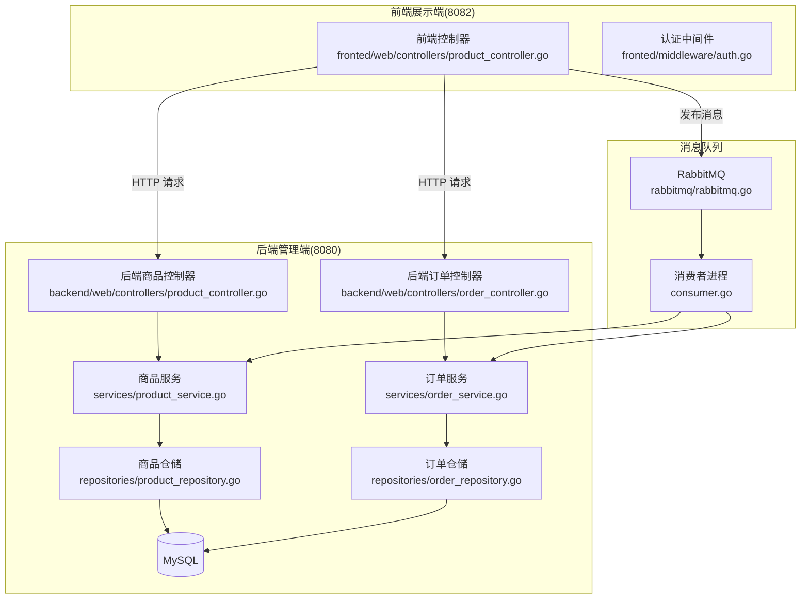
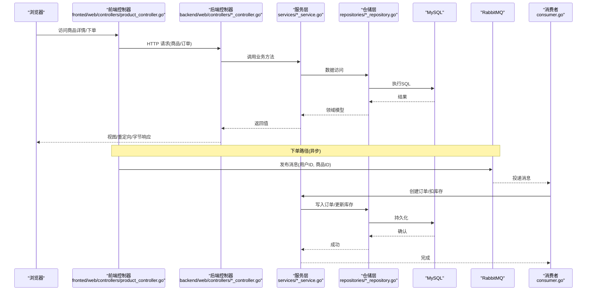
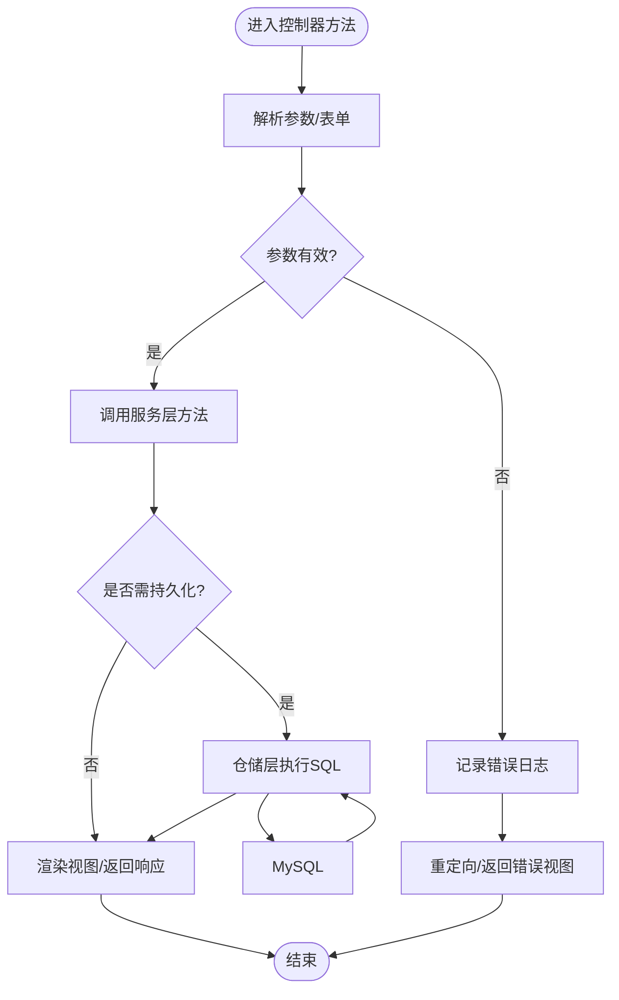
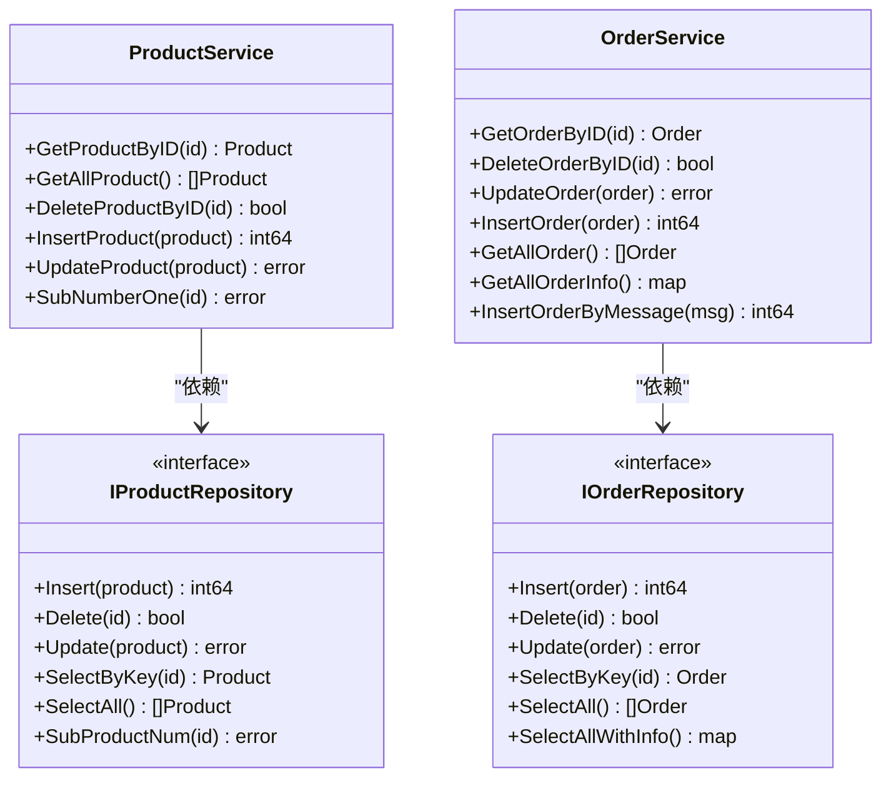
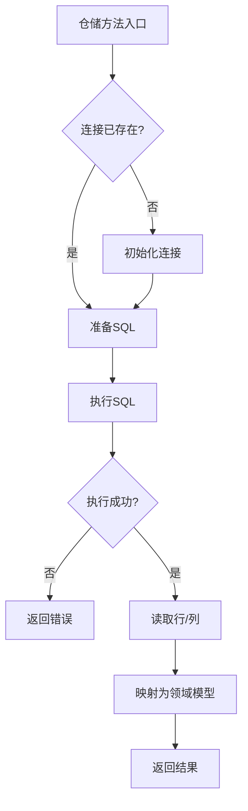
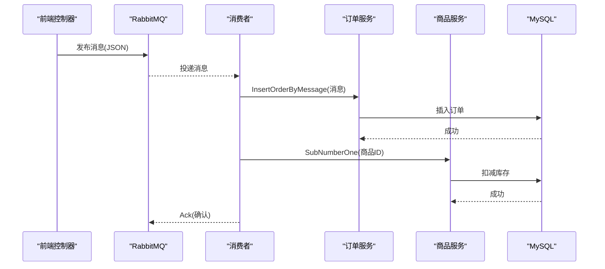
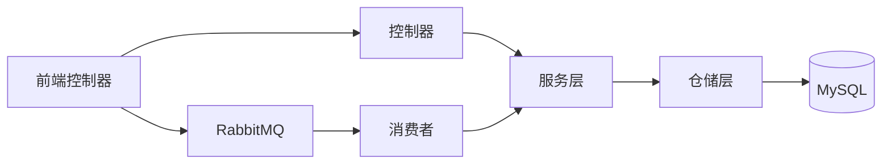

# 组件交互设计

<cite>
**本文引用的文件**
- [backend/main.go](file://backend/main.go)
- [fronted/main.go](file://fronted/main.go)
- [backend/web/controllers/product_controller.go](file://backend/web/controllers/product_controller.go)
- [backend/web/controllers/order_controller.go](file://backend/web/controllers/order_controller.go)
- [services/product_service.go](file://services/product_service.go)
- [services/order_service.go](file://services/order_service.go)
- [repositories/product_repository.go](file://repositories/product_repository.go)
- [repositories/order_repository.go](file://repositories/order_repository.go)
- [datamodels/product.go](file://datamodels/product.go)
- [datamodels/order.go](file://datamodels/order.go)
- [datamodels/message.go](file://datamodels/message.go)
- [common/mysql.go](file://common/mysql.go)
- [fronted/web/controllers/product_controller.go](file://fronted/web/controllers/product_controller.go)
- [rabbitmq/rabbitmq.go](file://rabbitmq/rabbitmq.go)
- [consumer.go](file://consumer.go)
- [fronted/middleware/auth.go](file://fronted/middleware/auth.go)
</cite>

## 目录
1. [简介](#简介)
2. [项目结构](#项目结构)
3. [核心组件](#核心组件)
4. [架构总览](#架构总览)
5. [详细组件分析](#详细组件分析)
6. [依赖关系分析](#依赖关系分析)
7. [性能考虑](#性能考虑)
8. [故障排查指南](#故障排查指南)
9. [结论](#结论)
10. [附录](#附录)

## 简介
本文件面向前后端分离的电商系统，系统性说明组件交互设计：控制器层如何协调服务层与数据访问层；请求响应周期中的参数验证、业务处理、数据持久化与响应生成；以及通过消息队列实现的异步解耦流程。文档包含架构图、数据流转图与关键调用时序图，帮助开发者快速理解组件协作关系与异常传播机制。

## 项目结构
系统由两个 Iris 应用组成：
- 后端管理端（端口 8080）：提供商品与订单的管理能力，采用 MVC + 分层架构（Controller → Service → Repository → DB）。
- 前端展示端（端口 8082）：提供商品详情渲染、静态 HTML 生成、用户登录校验与下单入口，并通过 RabbitMQ 将下单请求异步投递到消费者。

图表来源
- [backend/main.go:14-59](file://backend/main.go#L14-L59)
- [fronted/main.go:16-66](file://fronted/main.go#L16-L66)
- [fronted/web/controllers/product_controller.go:95-120](file://fronted/web/controllers/product_controller.go#L95-L120)
- [rabbitmq/rabbitmq.go:68-101](file://rabbitmq/rabbitmq.go#L68-L101)
- [consumer.go:11-27](file://consumer.go#L11-L27)

章节来源
- [backend/main.go:14-59](file://backend/main.go#L14-L59)
- [fronted/main.go:16-66](file://fronted/main.go#L16-L66)

## 核心组件
- 控制器层
  - 后端商品控制器：负责表单解析、参数提取、调用服务并返回视图或重定向。
  - 后端订单控制器：查询订单信息并渲染视图。
  - 前端商品控制器：生成静态 HTML、获取商品详情、发起下单（发布消息）。
- 服务层
  - 商品服务：封装商品增删改查与库存扣减等业务能力。
  - 订单服务：封装订单创建、查询、更新及从消息构建订单的能力。
- 数据访问层
  - 商品仓储：基于 sql.DB 执行 SQL，映射为领域模型。
  - 订单仓储：基于 sql.DB 执行 SQL，支持关联查询。
- 基础设施
  - MySQL 连接与结果集工具：统一数据库连接与行/列读取。
  - RabbitMQ 客户端：简单模式下的消息发布与消费。
  - 认证中间件：检查 Cookie 中用户标识，未登录则跳转。

章节来源
- [backend/web/controllers/product_controller.go:12-95](file://backend/web/controllers/product_controller.go#L12-L95)
- [backend/web/controllers/order_controller.go:9-27](file://backend/web/controllers/order_controller.go#L9-L27)
- [services/product_service.go:8-48](file://services/product_service.go#L8-L48)
- [services/order_service.go:8-64](file://services/order_service.go#L8-L64)
- [repositories/product_repository.go:10-165](file://repositories/product_repository.go#L10-L165)
- [repositories/order_repository.go:10-146](file://repositories/order_repository.go#L10-L146)
- [common/mysql.go:8-67](file://common/mysql.go#L8-L67)
- [rabbitmq/rabbitmq.go:18-182](file://rabbitmq/rabbitmq.go#L18-L182)
- [fronted/middleware/auth.go:5-15](file://fronted/middleware/auth.go#L5-L15)

## 架构总览
系统采用前后端分离与分层架构：
- 前端展示端负责页面渲染、静态资源与用户交互，通过 HTTP 调用后端管理端接口，或通过 RabbitMQ 异步下单。
- 后端管理端提供 RESTful 风格的 MVC 接口，按 Controller → Service → Repository → DB 的分层组织代码。
- 消息队列用于削峰填谷与解耦下单流程，消费者独立进程处理订单创建与库存扣减。

图表来源
- [fronted/web/controllers/product_controller.go:95-120](file://fronted/web/controllers/product_controller.go#L95-L120)
- [backend/web/controllers/product_controller.go:17-95](file://backend/web/controllers/product_controller.go#L17-L95)
- [backend/web/controllers/order_controller.go:14-27](file://backend/web/controllers/order_controller.go#L14-L27)
- [services/product_service.go:26-48](file://services/product_service.go#L26-L48)
- [services/order_service.go:26-64](file://services/order_service.go#L26-L64)
- [repositories/product_repository.go:47-165](file://repositories/product_repository.go#L47-L165)
- [repositories/order_repository.go:43-146](file://repositories/order_repository.go#L43-L146)
- [rabbitmq/rabbitmq.go:68-101](file://rabbitmq/rabbitmq.go#L68-L101)
- [consumer.go:11-27](file://consumer.go#L11-L27)

## 详细组件分析

### 控制器层职责与请求处理
- 后端商品控制器
  - 列表页：调用服务获取商品集合，渲染模板。
  - 新增/修改：解析表单，使用解码器将表单字段映射到领域模型，调用服务进行插入/更新，完成后重定向。
  - 删除/详情：解析 URL 参数，调用服务操作后重定向或渲染。
- 后端订单控制器
  - 列表页：调用服务获取订单信息（含关联商品名），渲染模板。
- 前端商品控制器
  - 静态 HTML 生成：根据模板与商品数据生成静态文件，便于后续直接访问。
  - 下单：构造消息体，序列化后通过 RabbitMQ 发布，返回简单响应。

图表来源
- [backend/web/controllers/product_controller.go:27-60](file://backend/web/controllers/product_controller.go#L27-L60)
- [backend/web/controllers/product_controller.go:62-95](file://backend/web/controllers/product_controller.go#L62-L95)
- [backend/web/controllers/order_controller.go:14-27](file://backend/web/controllers/order_controller.go#L14-L27)
- [fronted/web/controllers/product_controller.go:32-54](file://fronted/web/controllers/product_controller.go#L32-L54)
- [fronted/web/controllers/product_controller.go:95-120](file://fronted/web/controllers/product_controller.go#L95-L120)

章节来源
- [backend/web/controllers/product_controller.go:17-95](file://backend/web/controllers/product_controller.go#L17-L95)
- [backend/web/controllers/order_controller.go:14-27](file://backend/web/controllers/order_controller.go#L14-L27)
- [fronted/web/controllers/product_controller.go:32-54](file://fronted/web/controllers/product_controller.go#L32-L54)
- [fronted/web/controllers/product_controller.go:95-120](file://fronted/web/controllers/product_controller.go#L95-L120)

### 服务层编排与领域逻辑
- 商品服务
  - 提供按 ID 查询、全量查询、删除、插入、更新与库存扣减等方法，委托给商品仓储实现。
- 订单服务
  - 提供订单 CRUD、复杂查询（含商品信息）、以及从消息对象创建订单的方法。
- 数据模型
  - 商品与订单结构体定义，配合仓储层的标签映射进行数据转换。

图表来源
- [services/product_service.go:8-48](file://services/product_service.go#L8-L48)
- [services/order_service.go:8-64](file://services/order_service.go#L8-L64)
- [repositories/product_repository.go:10-21](file://repositories/product_repository.go#L10-L21)
- [repositories/order_repository.go:10-18](file://repositories/order_repository.go#L10-L18)
- [datamodels/product.go:1-10](file://datamodels/product.go#L1-L10)
- [datamodels/order.go:1-15](file://datamodels/order.go#L1-L15)

章节来源
- [services/product_service.go:8-48](file://services/product_service.go#L8-L48)
- [services/order_service.go:8-64](file://services/order_service.go#L8-L64)
- [datamodels/product.go:1-10](file://datamodels/product.go#L1-L10)
- [datamodels/order.go:1-15](file://datamodels/order.go#L1-L15)

### 数据访问层与数据库交互
- 商品仓储
  - 负责建立数据库连接、准备语句、执行插入/更新/删除/查询，并将结果映射为商品模型。
  - 提供库存扣减方法，原子减少商品数量。
- 订单仓储
  - 负责订单的 CRUD 与带商品名的关联查询，返回键值映射供上层组装。
- 通用工具
  - 统一 MySQL 连接与行列读取工具，简化仓储层重复代码。

图表来源
- [repositories/product_repository.go:47-165](file://repositories/product_repository.go#L47-L165)
- [repositories/order_repository.go:43-146](file://repositories/order_repository.go#L43-L146)
- [common/mysql.go:8-67](file://common/mysql.go#L8-L67)

章节来源
- [repositories/product_repository.go:47-165](file://repositories/product_repository.go#L47-L165)
- [repositories/order_repository.go:43-146](file://repositories/order_repository.go#L43-L146)
- [common/mysql.go:8-67](file://common/mysql.go#L8-L67)

### 异步下单与消息队列
- 前端控制器在收到下单请求时，构造消息体（用户ID、商品ID），序列化为字符串并通过 RabbitMQ 发布到指定队列。
- 消费者进程启动后订阅队列，收到消息后反序列化为消息对象，调用订单服务创建订单，再调用商品服务扣减库存，最后手动确认消息。

图表来源
- [fronted/web/controllers/product_controller.go:95-120](file://fronted/web/controllers/product_controller.go#L95-L120)
- [rabbitmq/rabbitmq.go:68-101](file://rabbitmq/rabbitmq.go#L68-L101)
- [rabbitmq/rabbitmq.go:104-182](file://rabbitmq/rabbitmq.go#L104-L182)
- [consumer.go:11-27](file://consumer.go#L11-L27)
- [services/order_service.go:52-64](file://services/order_service.go#L52-L64)
- [services/product_service.go:46-48](file://services/product_service.go#L46-L48)

章节来源
- [fronted/web/controllers/product_controller.go:95-120](file://fronted/web/controllers/product_controller.go#L95-L120)
- [rabbitmq/rabbitmq.go:68-101](file://rabbitmq/rabbitmq.go#L68-L101)
- [rabbitmq/rabbitmq.go:104-182](file://rabbitmq/rabbitmq.go#L104-L182)
- [consumer.go:11-27](file://consumer.go#L11-L27)
- [services/order_service.go:52-64](file://services/order_service.go#L52-L64)
- [services/product_service.go:46-48](file://services/product_service.go#L46-L48)

### 认证与中间件
- 前端路由注册了认证中间件，拦截对商品相关接口的访问，检查 Cookie 中的用户标识，未登录则重定向至登录页。
- 该机制确保只有已登录用户才能触发下单流程。

章节来源
- [fronted/main.go:55-59](file://fronted/main.go#L55-L59)
- [fronted/middleware/auth.go:5-15](file://fronted/middleware/auth.go#L5-L15)

## 依赖关系分析
- 控制器依赖服务接口，服务依赖仓储接口，仓储依赖数据库连接与工具函数，形成清晰的单向依赖链。
- 前端与后端通过 HTTP 与消息队列两种通道交互：同步接口用于管理与查询，异步消息用于高并发下单场景。
- 全局错误处理：Iris 框架在任意错误码时统一跳转到错误视图，便于集中处理异常页面。

图表来源
- [backend/main.go:38-51](file://backend/main.go#L38-L51)
- [fronted/main.go:42-59](file://fronted/main.go#L42-L59)
- [rabbitmq/rabbitmq.go:68-101](file://rabbitmq/rabbitmq.go#L68-L101)
- [consumer.go:11-27](file://consumer.go#L11-L27)

章节来源
- [backend/main.go:38-51](file://backend/main.go#L38-L51)
- [fronted/main.go:42-59](file://fronted/main.go#L42-L59)

## 性能考虑
- 连接复用：仓储层在首次使用时建立数据库连接，避免频繁创建销毁连接带来的开销。
- 预编译语句：仓储层普遍使用 Prepare/Exec 模式，提升 SQL 执行效率并降低注入风险。
- 异步解耦：下单流程通过消息队列异步处理，降低主线程阻塞时间，提高吞吐。
- 流控与确认：消费者启用 QoS 限制单次接收消息数，并使用手动确认保证可靠性。
- 静态资源：前端可生成静态 HTML 文件，减轻动态渲染压力。

[本节为通用性能建议，不直接分析具体文件]

## 故障排查指南
- 数据库连接失败
  - 现象：仓储层 Conn 初始化报错。
  - 排查：检查数据库地址、账号密码与网络连通性；查看日志输出。
  - 参考位置：[common/mysql.go:8-12](file://common/mysql.go#L8-L12)、[repositories/product_repository.go:32-45](file://repositories/product_repository.go#L32-L45)、[repositories/order_repository.go:29-41](file://repositories/order_repository.go#L29-L41)
- 表单解析与映射错误
  - 现象：控制器解析表单后字段为空或类型不匹配。
  - 排查：确认表单字段名与模型 tag 一致；检查解码器配置。
  - 参考位置：[backend/web/controllers/product_controller.go:27-60](file://backend/web/controllers/product_controller.go#L27-L60)
- 消息发送失败
  - 现象：前端发布消息时报错。
  - 排查：检查 RabbitMQ 地址、队列是否存在、权限设置；查看日志。
  - 参考位置：[fronted/web/controllers/product_controller.go:107-120](file://fronted/web/controllers/product_controller.go#L107-L120)、[rabbitmq/rabbitmq.go:68-101](file://rabbitmq/rabbitmq.go#L68-L101)
- 消费者处理异常
  - 现象：消费者收到消息但订单未创建或库存未扣减。
  - 排查：检查 JSON 反序列化、服务调用返回值、手动确认逻辑。
  - 参考位置：[rabbitmq/rabbitmq.go:104-182](file://rabbitmq/rabbitmq.go#L104-L182)、[consumer.go:11-27](file://consumer.go#L11-L27)
- 认证拦截导致无法下单
  - 现象：访问商品下单接口被重定向到登录页。
  - 排查：确认 Cookie uid 是否正确设置；检查中间件逻辑。
  - 参考位置：[fronted/middleware/auth.go:5-15](file://fronted/middleware/auth.go#L5-L15)、[fronted/main.go:55-59](file://fronted/main.go#L55-L59)

章节来源
- [common/mysql.go:8-12](file://common/mysql.go#L8-L12)
- [repositories/product_repository.go:32-45](file://repositories/product_repository.go#L32-L45)
- [repositories/order_repository.go:29-41](file://repositories/order_repository.go#L29-L41)
- [backend/web/controllers/product_controller.go:27-60](file://backend/web/controllers/product_controller.go#L27-L60)
- [fronted/web/controllers/product_controller.go:107-120](file://fronted/web/controllers/product_controller.go#L107-L120)
- [rabbitmq/rabbitmq.go:68-101](file://rabbitmq/rabbitmq.go#L68-L101)
- [rabbitmq/rabbitmq.go:104-182](file://rabbitmq/rabbitmq.go#L104-L182)
- [consumer.go:11-27](file://consumer.go#L11-L27)
- [fronted/middleware/auth.go:5-15](file://fronted/middleware/auth.go#L5-L15)
- [fronted/main.go:55-59](file://fronted/main.go#L55-L59)

## 结论
本系统通过清晰的分层与前后端分离架构，实现了商品与订单管理的完整闭环，并利用消息队列将高并发下单流程解耦，提升了系统的可扩展性与稳定性。控制器聚焦于请求处理与响应生成，服务层承载业务编排，仓储层专注数据访问，配合统一的数据库工具与错误处理机制，使组件间职责明确、耦合度低、易于维护与扩展。

## 附录
- 关键数据模型
  - 商品模型：包含 ID、名称、数量、图片、链接等字段，用于仓储映射与视图渲染。
  - 订单模型：包含 ID、用户ID、商品ID、订单状态等字段，支持状态枚举。
  - 消息模型：用于跨进程传递下单上下文（用户ID、商品ID）。

章节来源
- [datamodels/product.go:1-10](file://datamodels/product.go#L1-L10)
- [datamodels/order.go:1-15](file://datamodels/order.go#L1-L15)
- [datamodels/message.go:1-13](file://datamodels/message.go#L1-L13)