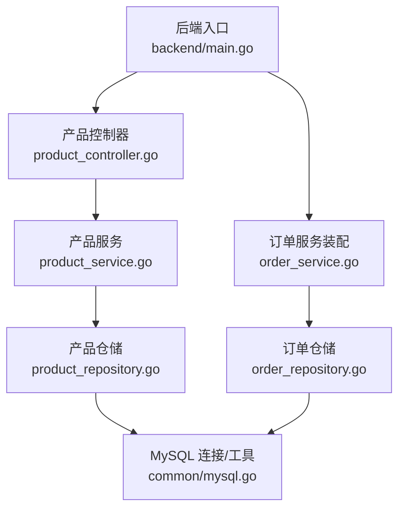
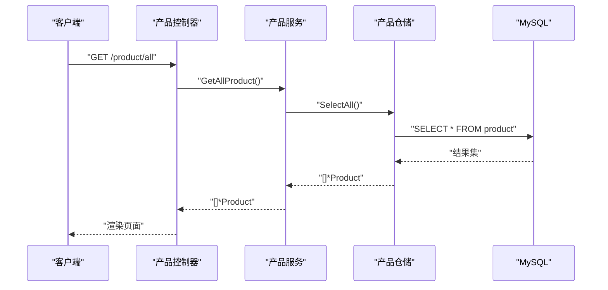
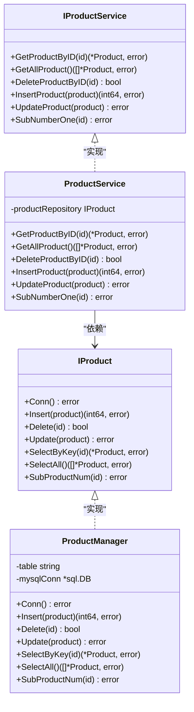
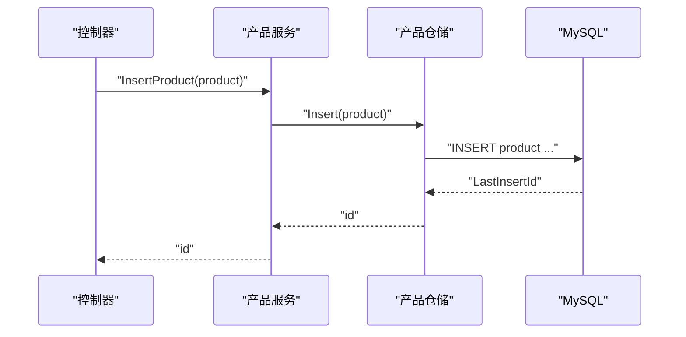
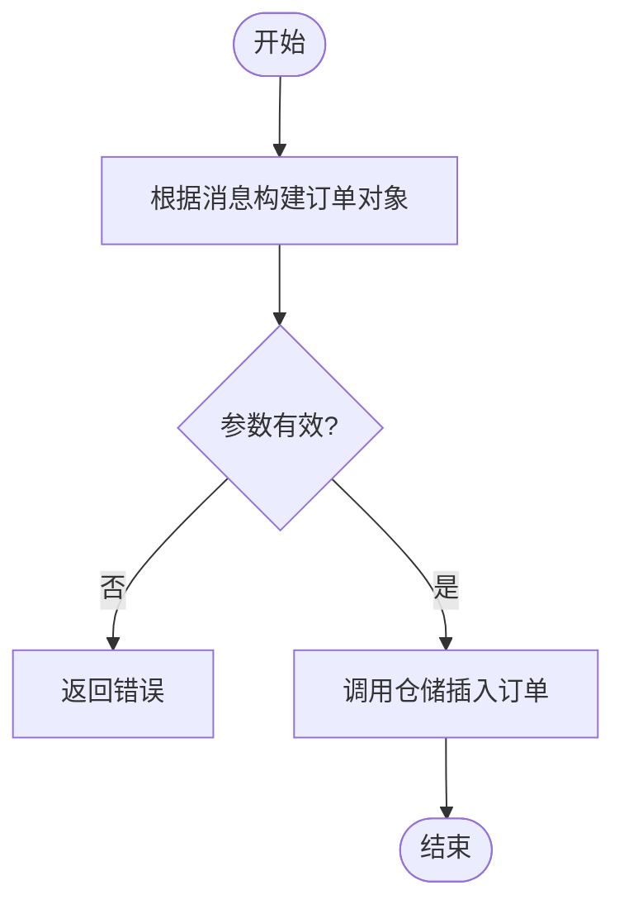
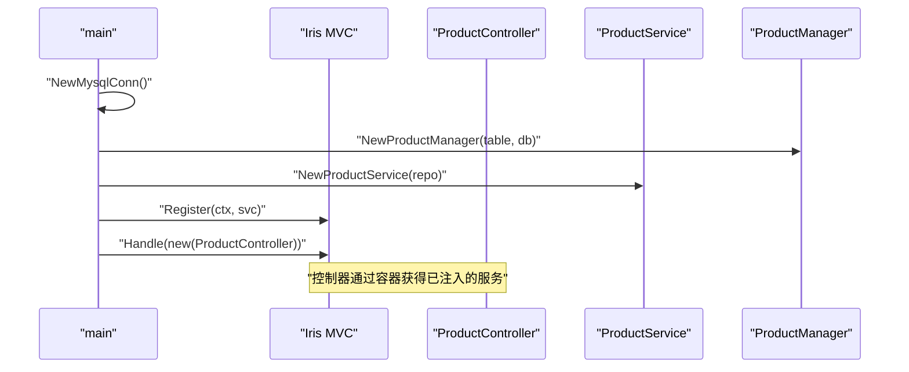
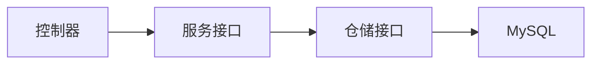

# 设计模式应用

<cite>
**本文引用的文件**
- [backend/main.go](file://backend/main.go)
- [repositories/product_repository.go](file://repositories/product_repository.go)
- [services/product_service.go](file://services/product_service.go)
- [repositories/order_repository.go](file://repositories/order_repository.go)
- [services/order_service.go](file://services/order_service.go)
- [datamodels/product.go](file://datamodels/product.go)
- [datamodels/order.go](file://datamodels/order.go)
- [common/mysql.go](file://common/mysql.go)
- [backend/web/controllers/product_controller.go](file://backend/web/controllers/product_controller.go)
</cite>

## 目录
1. [简介](#简介)
2. [项目结构](#项目结构)
3. [核心组件](#核心组件)
4. [架构总览](#架构总览)
5. [详细组件分析](#详细组件分析)
6. [依赖关系分析](#依赖关系分析)
7. [性能考量](#性能考量)
8. [故障排查指南](#故障排查指南)
9. [结论](#结论)
10. [附录](#附录)

## 简介
本仓库是一个电商示例后端，采用分层架构与多种经典设计模式：Repository 模式、Service 模式、接口抽象与依赖注入。通过接口定义实现松耦合，使控制器仅依赖服务接口，服务仅依赖仓储接口，仓储封装数据库访问细节。启动时完成服务装配，运行时由 MVC 框架将请求路由到控制器，再调用服务层进行业务编排，最终持久化到数据库。

## 项目结构
- 入口与装配：后端主程序负责创建 Web 框架实例、注册视图、初始化数据库连接，并组装各模块的 Service 与 Repository。
- 数据模型：位于 datamodels，定义领域对象（如商品、订单）。
- 仓储层：repositories 提供对数据库的增删改查能力，并通过接口暴露。
- 服务层：services 聚合多个仓储能力，对外暴露业务级方法。
- 控制层：controllers 处理 HTTP 请求，调用服务层完成业务逻辑。
- 通用工具：common 提供数据库连接与结果集转换等基础能力。

图表来源
- [backend/main.go:14-51](file://backend/main.go#L14-L51)
- [backend/web/controllers/product_controller.go:12-15](file://backend/web/controllers/product_controller.go#L12-L15)
- [services/product_service.go:17-24](file://services/product_service.go#L17-L24)
- [repositories/product_repository.go:23-30](file://repositories/product_repository.go#L23-L30)
- [repositories/order_repository.go:20-27](file://repositories/order_repository.go#L20-L27)
- [common/mysql.go:8-12](file://common/mysql.go#L8-L12)

章节来源
- [backend/main.go:14-51](file://backend/main.go#L14-L51)
- [common/mysql.go:8-12](file://common/mysql.go#L8-L12)

## 核心组件
- 接口抽象
  - 产品仓储接口 IProduct，定义连接、插入、删除、更新、查询等方法。
  - 产品服务接口 IProductService，定义面向业务的查询、新增、更新、扣减库存等方法。
  - 订单仓储接口 IOrderRepository，定义订单的 CRUD 及关联查询。
  - 订单服务接口 IOrderService，定义订单的业务方法，包括从消息创建订单。
- 实现类
  - ProductManager 实现 IProduct，封装 product 表的 SQL 操作。
  - ProductService 实现 IProductService，委托 ProductManager 完成数据访问。
  - OrderMangerRepository 实现 IOrderRepository，封装 order 表及相关联查询。
  - OrderService 实现 IOrderService，封装订单业务逻辑（如根据消息创建订单）。
- 数据模型
  - Product、Order 等结构体用于承载领域数据，配合标签映射数据库字段。
- 数据库工具
  - NewMysqlConn 建立 MySQL 连接；GetResultRow/GetResultRows 将行数据转换为 map。

章节来源
- [repositories/product_repository.go:10-30](file://repositories/product_repository.go#L10-L30)
- [services/product_service.go:8-24](file://services/product_service.go#L8-L24)
- [repositories/order_repository.go:10-27](file://repositories/order_repository.go#L10-L27)
- [services/order_service.go:8-24](file://services/order_service.go#L8-L24)
- [datamodels/product.go:3-9](file://datamodels/product.go#L3-L9)
- [datamodels/order.go:3-8](file://datamodels/order.go#L3-L8)
- [common/mysql.go:8-12](file://common/mysql.go#L8-L12)

## 架构总览
系统采用“控制器 -> 服务 -> 仓储 -> 数据库”的分层结构，结合接口与依赖注入，达到以下目标：
- 解耦：控制器不直接依赖具体仓储或服务实现，只依赖接口。
- 可替换：仓储与服务均可被替换或扩展（例如切换存储介质、增加缓存）。
- 可测试：可通过 Mock 接口实现单元测试。
- 清晰职责：每层专注自身职责，便于维护与演进。

图表来源
- [backend/web/controllers/product_controller.go:17-25](file://backend/web/controllers/product_controller.go#L17-L25)
- [services/product_service.go:30-32](file://services/product_service.go#L30-L32)
- [repositories/product_repository.go:128-152](file://repositories/product_repository.go#L128-L152)
- [common/mysql.go:36-66](file://common/mysql.go#L36-L66)

## 详细组件分析

### 产品模块（Repository + Service）
- 接口与实现
  - IProduct：定义 Conn、Insert、Delete、Update、SelectByKey、SelectAll、SubProductNum。
  - ProductManager：基于 sql.DB 执行 SQL，使用 common 工具读取行数据并映射为 Product。
  - IProductService：定义 GetProductByID、GetAllProduct、DeleteProductByID、InsertProduct、UpdateProduct、SubNumberOne。
  - ProductService：持有 IProduct 依赖，将业务方法委托给仓储。
- 依赖注入与装配
  - 在 main 中创建数据库连接，构造 ProductManager，再构造 ProductService，最后注册到 MVC 容器。
- 典型流程
  - 新增商品：控制器解析表单 -> 调用 InsertProduct -> 仓储插入 -> 返回 ID。
  - 查询商品：控制器调用 GetAllProduct -> 仓储 SelectAll -> 返回列表。
  - 扣减库存：控制器触发 SubNumberOne -> 仓储执行减法更新。

图表来源
- [repositories/product_repository.go:10-30](file://repositories/product_repository.go#L10-L30)
- [services/product_service.go:8-24](file://services/product_service.go#L8-L24)

图表来源
- [backend/web/controllers/product_controller.go:48-60](file://backend/web/controllers/product_controller.go#L48-L60)
- [services/product_service.go:38-40](file://services/product_service.go#L38-L40)
- [repositories/product_repository.go:47-65](file://repositories/product_repository.go#L47-L65)

章节来源
- [repositories/product_repository.go:10-165](file://repositories/product_repository.go#L10-L165)
- [services/product_service.go:8-48](file://services/product_service.go#L8-L48)
- [backend/web/controllers/product_controller.go:17-60](file://backend/web/controllers/product_controller.go#L17-L60)
- [backend/main.go:38-44](file://backend/main.go#L38-L44)

### 订单模块（Repository + Service）
- 接口与实现
  - IOrderRepository：定义 Conn、CRUD、SelectAllWithInfo（含关联查询）。
  - OrderMangerRepository：实现上述接口，包含 join 查询以获取订单与商品信息。
  - IOrderService：定义订单业务方法，包括 InsertOrderByMessage。
  - OrderService：实现业务编排，如根据消息构建订单并写入。
- 典型流程
  - 根据消息创建订单：接收消息 -> 构造 Order -> 调用 InsertOrder -> 返回订单 ID。

图表来源
- [services/order_service.go:51-59](file://services/order_service.go#L51-L59)
- [repositories/order_repository.go:43-60](file://repositories/order_repository.go#L43-L60)

章节来源
- [repositories/order_repository.go:10-146](file://repositories/order_repository.go#L10-L146)
- [services/order_service.go:8-64](file://services/order_service.go#L8-L64)

### 控制器与依赖注入
- 控制器通过构造函数注入服务接口（如 ProductController 持有 IProductService），避免直接依赖具体实现。
- 启动时在 main 中完成服务装配：创建仓储 -> 创建服务 -> 注册到 MVC 容器。
- 好处：
  - 松耦合：控制器只关心服务契约。
  - 易替换：可替换不同服务实现（如加入缓存、事务包装）。
  - 易测试：可注入 Mock 服务进行单元测试。

图表来源
- [backend/main.go:31-44](file://backend/main.go#L31-L44)
- [backend/web/controllers/product_controller.go:12-15](file://backend/web/controllers/product_controller.go#L12-L15)
- [services/product_service.go:17-24](file://services/product_service.go#L17-L24)
- [repositories/product_repository.go:23-30](file://repositories/product_repository.go#L23-L30)

章节来源
- [backend/main.go:31-44](file://backend/main.go#L31-L44)
- [backend/web/controllers/product_controller.go:12-15](file://backend/web/controllers/product_controller.go#L12-L15)

## 依赖关系分析
- 低耦合
  - 控制器依赖服务接口，服务依赖仓储接口，仓储依赖数据库工具。
- 内聚性
  - 每层职责单一：控制器处理请求、服务编排业务、仓储管理数据访问。
- 外部依赖
  - MySQL 驱动与连接池由 common 统一管理。
- 可能的循环依赖
  - 当前分层清晰，未见循环引用。

图表来源
- [backend/web/controllers/product_controller.go:12-15](file://backend/web/controllers/product_controller.go#L12-L15)
- [services/product_service.go:17-24](file://services/product_service.go#L17-L24)
- [repositories/product_repository.go:23-30](file://repositories/product_repository.go#L23-L30)
- [common/mysql.go:8-12](file://common/mysql.go#L8-L12)

章节来源
- [backend/web/controllers/product_controller.go:12-15](file://backend/web/controllers/product_controller.go#L12-L15)
- [services/product_service.go:17-24](file://services/product_service.go#L17-L24)
- [repositories/product_repository.go:23-30](file://repositories/product_repository.go#L23-L30)
- [common/mysql.go:8-12](file://common/mysql.go#L8-L12)

## 性能考量
- 连接复用
  - 仓储层在 Conn 中懒加载数据库连接，建议在生产环境使用全局连接池并合理配置最大连接数。
- SQL 安全
  - 使用 Prepare 语句减少拼接风险；注意字符串拼接场景（如表名、条件）需做白名单校验。
- 查询优化
  - 批量查询尽量使用分页；复杂查询考虑索引与覆盖索引。
- 资源释放
  - 确保 Rows 关闭，避免连接泄漏。
- 可扩展点
  - 在服务层引入缓存（如 Redis）降低读压力。
  - 在仓储层引入读写分离或分库分表策略。

[本节为通用指导，不直接分析具体文件]

## 故障排查指南
- 数据库连接失败
  - 检查 NewMysqlConn 的连接串与网络可达性。
  - 确认数据库服务运行且权限正确。
- 查询结果为空
  - 检查 SQL 条件与表名；确认数据存在。
- 更新失败
  - 检查 Prepare 与 Exec 的错误返回；确认字段类型匹配。
- 模板渲染异常
  - 检查视图路径与布局设置；确认 OnAnyErrorCode 中的错误页渲染。

章节来源
- [common/mysql.go:8-12](file://common/mysql.go#L8-L12)
- [repositories/product_repository.go:47-165](file://repositories/product_repository.go#L47-L165)
- [repositories/order_repository.go:43-146](file://repositories/order_repository.go#L43-L146)
- [backend/main.go:19-29](file://backend/main.go#L19-L29)

## 结论
本项目通过 Repository 与 Service 模式、接口抽象与依赖注入，实现了清晰的层次划分与松耦合设计。控制器专注于请求处理，服务层负责业务编排，仓储层屏蔽数据访问细节。该设计提升了系统的可扩展性与可维护性，便于后续引入缓存、事务、消息队列等能力，同时支持单元测试与灰度发布。

[本节为总结，不直接分析具体文件]

## 附录
- 关键代码片段路径（不含代码内容）
  - 产品仓储接口与实现：[repositories/product_repository.go:10-165](file://repositories/product_repository.go#L10-L165)
  - 产品服务接口与实现：[services/product_service.go:8-48](file://services/product_service.go#L8-L48)
  - 订单仓储接口与实现：[repositories/order_repository.go:10-146](file://repositories/order_repository.go#L10-L146)
  - 订单服务接口与实现：[services/order_service.go:8-64](file://services/order_service.go#L8-L64)
  - 数据模型：[datamodels/product.go:3-9](file://datamodels/product.go#L3-L9)、[datamodels/order.go:3-8](file://datamodels/order.go#L3-L8)
  - 数据库工具：[common/mysql.go:8-66](file://common/mysql.go#L8-L66)
  - 控制器与依赖注入：[backend/web/controllers/product_controller.go:12-95](file://backend/web/controllers/product_controller.go#L12-L95)、[backend/main.go:31-44](file://backend/main.go#L31-L44)