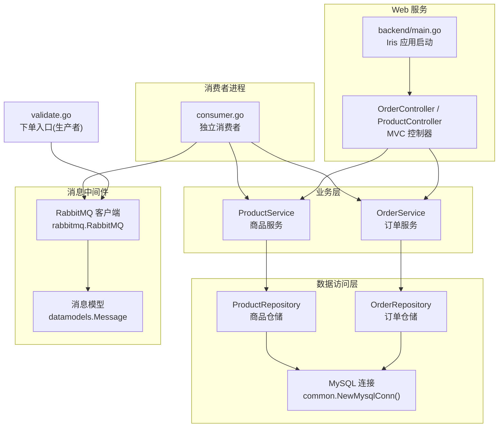
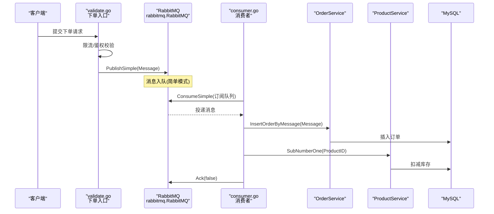
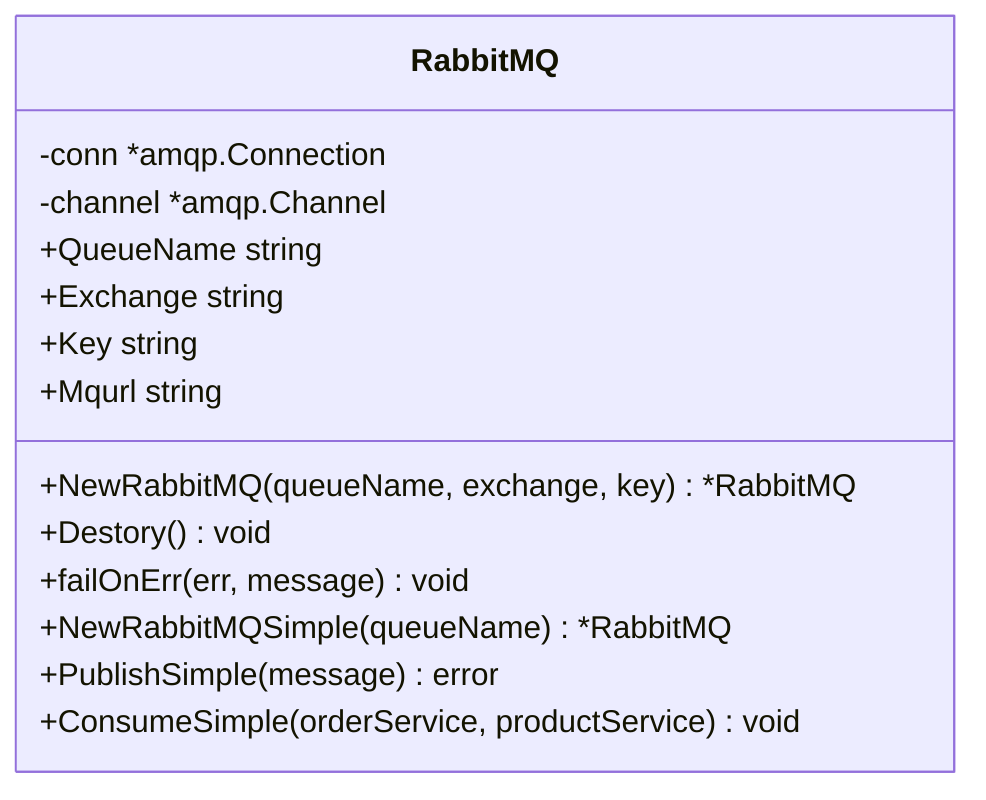
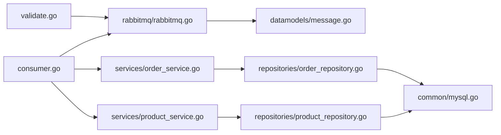

# 高并发处理机制

<cite>
**本文引用的文件**   
- [rabbitmq/rabbitmq.go](file://rabbitmq/rabbitmq.go)
- [consumer.go](file://consumer.go)
- [backend/main.go](file://backend/main.go)
- [services/order_service.go](file://services/order_service.go)
- [services/product_service.go](file://services/product_service.go)
- [repositories/order_repository.go](file://repositories/order_repository.go)
- [repositories/product_repository.go](file://repositories/product_repository.go)
- [datamodels/message.go](file://datamodels/message.go)
- [datamodels/order.go](file://datamodels/order.go)
- [common/mysql.go](file://common/mysql.go)
- [validate.go](file://validate.go)
</cite>

## 目录
1. [引言](#引言)
2. [项目结构](#项目结构)
3. [核心组件](#核心组件)
4. [架构总览](#架构总览)
5. [详细组件分析](#详细组件分析)
6. [依赖关系分析](#依赖关系分析)
7. [性能与优化建议](#性能与优化建议)
8. [故障排查指南](#故障排查指南)
9. [结论](#结论)

## 引言
本文件围绕电商系统的高并发处理机制展开，重点解析 RabbitMQ 消息队列的集成方案、异步消息处理流程（生产/消费/错误处理）、限流与防抖策略、流量削峰填谷的实现方式，以及在高并发场景下的连接池配置、批量处理与重试机制等优化建议。文档同时提供代码级引用路径，便于读者快速定位实现细节。

## 项目结构
本项目采用分层架构：Web 层（Iris MVC）负责请求接入；Service 层封装业务逻辑；Repository 层对接数据库；RabbitMQ 模块负责消息收发；Consumer 独立进程作为消费者；Validate 入口用于演示下单到消息队列的生产流程。

图表来源
- [backend/main.go:14-59](file://backend/main.go#L14-L59)
- [consumer.go:11-27](file://consumer.go#L11-L27)
- [rabbitmq/rabbitmq.go:18-36](file://rabbitmq/rabbitmq.go#L18-L36)
- [services/order_service.go:8-24](file://services/order_service.go#L8-L24)
- [services/product_service.go:8-24](file://services/product_service.go#L8-L24)
- [repositories/order_repository.go:10-27](file://repositories/order_repository.go#L10-L27)
- [repositories/product_repository.go:12-30](file://repositories/product_repository.go#L12-L30)
- [common/mysql.go:9-12](file://common/mysql.go#L9-L12)
- [datamodels/message.go:4-12](file://datamodels/message.go#L4-L12)

章节来源
- [backend/main.go:14-59](file://backend/main.go#L14-L59)
- [consumer.go:11-27](file://consumer.go#L11-L27)

## 核心组件
- RabbitMQ 客户端：封装连接、通道、队列声明、发布与消费，支持简单模式直连队列。
- 消费者进程：独立运行，订阅队列，反序列化消息，调用 OrderService 创建订单，调用 ProductService 扣减库存，手动 ACK。
- Web 服务：基于 Iris MVC，注册产品与订单路由，注入 Service 与 Repository。
- 下单入口（validate.go）：在限流校验通过后，将下单信息序列化为 Message 并发送到 RabbitMQ。
- 数据模型：Message（用户ID、商品ID），Order（订单状态枚举）。

章节来源
- [rabbitmq/rabbitmq.go:18-36](file://rabbitmq/rabbitmq.go#L18-L36)
- [consumer.go:11-27](file://consumer.go#L11-L27)
- [backend/main.go:38-51](file://backend/main.go#L38-L51)
- [validate.go:217-231](file://validate.go#L217-L231)
- [datamodels/message.go:4-12](file://datamodels/message.go#L4-L12)
- [datamodels/order.go:3-14](file://datamodels/order.go#L3-L14)

## 架构总览
下图展示从下单请求到消息落库的端到端流程，包括限流校验、消息生产、消费者处理与数据库持久化。

图表来源
- [validate.go:217-231](file://validate.go#L217-L231)
- [rabbitmq/rabbitmq.go:67-101](file://rabbitmq/rabbitmq.go#L67-L101)
- [rabbitmq/rabbitmq.go:104-181](file://rabbitmq/rabbitmq.go#L104-L181)
- [consumer.go:25-27](file://consumer.go#L25-L27)
- [services/order_service.go:51-61](file://services/order_service.go#L51-L61)
- [services/product_service.go:46-48](file://services/product_service.go#L46-L48)

## 详细组件分析

### RabbitMQ 客户端（rabbitmq/rabbitmq.go）
- 连接与通道管理：通过 NewRabbitMQSimple 建立连接与 Channel，使用 failOnErr 统一错误处理。
- 简单模式发布：PublishSimple 声明队列并发送消息，未开启持久化，适合测试环境。
- 简单模式消费：ConsumeSimple 设置 QoS 为 1（单条预取），手动 ACK；在协程中消费消息，反序列化为 Message，调用 OrderService 创建订单，调用 ProductService 扣减库存。
- 线程安全：对发布操作加锁，避免并发写 Channel 导致竞争。

图表来源
- [rabbitmq/rabbitmq.go:18-36](file://rabbitmq/rabbitmq.go#L18-L36)
- [rabbitmq/rabbitmq.go:38-65](file://rabbitmq/rabbitmq.go#L38-L65)
- [rabbitmq/rabbitmq.go:67-101](file://rabbitmq/rabbitmq.go#L67-L101)
- [rabbitmq/rabbitmq.go:104-181](file://rabbitmq/rabbitmq.go#L104-L181)

章节来源
- [rabbitmq/rabbitmq.go:18-36](file://rabbitmq/rabbitmq.go#L18-L36)
- [rabbitmq/rabbitmq.go:67-101](file://rabbitmq/rabbitmq.go#L67-L101)
- [rabbitmq/rabbitmq.go:104-181](file://rabbitmq/rabbitmq.go#L104-L181)

### 消费者进程（consumer.go）
- 初始化 MySQL 连接，构建 ProductRepository 与 ProductService、OrderRepository 与 OrderService。
- 创建 RabbitMQ 实例并启动 ConsumeSimple，持续监听队列。

章节来源
- [consumer.go:11-27](file://consumer.go#L11-L27)

### Web 服务（backend/main.go）
- 使用 Iris 框架启动 HTTP 服务，注册模板与静态资源。
- 注入 OrderService 与 ProductService，注册 /product 与 /order 路由。
- 使用 context.WithCancel 管理生命周期。

章节来源
- [backend/main.go:14-59](file://backend/main.go#L14-L59)

### 下单入口（validate.go）
- 在限流校验通过后，构造 datamodels.Message，JSON 序列化后通过 rabbitmq.RabbitMQ.PublishSimple 发送消息。
- 该入口体现了“先限流，再异步下单”的设计，有效削峰。

章节来源
- [validate.go:217-231](file://validate.go#L217-L231)

### 订单服务（services/order_service.go）
- 定义 IOrderService 接口，包含根据消息创建订单的方法 InsertOrderByMessage。
- 实现中将 Message 映射为 Order 对象并调用仓库层插入。

章节来源
- [services/order_service.go:8-24](file://services/order_service.go#L8-L24)
- [services/order_service.go:51-61](file://services/order_service.go#L51-L61)

### 商品服务（services/product_service.go）
- 定义 IProductService 接口，包含扣减库存方法 SubNumberOne。
- 实现委托给 ProductRepository.SubProductNum。

章节来源
- [services/product_service.go:8-24](file://services/product_service.go#L8-L24)
- [services/product_service.go:46-48](file://services/product_service.go#L46-L48)

### 订单仓储（repositories/order_repository.go）
- 实现 IOrderRepository 接口，提供 Insert、SelectByKey、SelectAllWithInfo 等方法。
- 使用 sql.Prepare 执行 SQL，返回自增 ID。

章节来源
- [repositories/order_repository.go:10-27](file://repositories/order_repository.go#L10-L27)
- [repositories/order_repository.go:43-60](file://repositories/order_repository.go#L43-L60)

### 商品仓储（repositories/product_repository.go）
- 实现 IProduct 接口，提供 SubProductNum 原子扣减库存（productNum=productNum-1）。
- 其他 CRUD 方法与查询方法。

章节来源
- [repositories/product_repository.go:12-30](file://repositories/product_repository.go#L12-L30)
- [repositories/product_repository.go:154-165](file://repositories/product_repository.go#L154-L165)

### 数据模型（datamodels/message.go, datamodels/order.go）
- Message：承载用户ID与商品ID，配合 JSON 序列化传输。
- Order：订单实体，包含状态枚举（等待、成功、失败）。

章节来源
- [datamodels/message.go:4-12](file://datamodels/message.go#L4-L12)
- [datamodels/order.go:3-14](file://datamodels/order.go#L3-L14)

### 数据库连接（common/mysql.go）
- 提供 NewMysqlConn 工厂函数，返回全局共享的 *sql.DB 连接池。
- 提供 GetResultRow/GetResultRows 工具方法，简化结果集读取。

章节来源
- [common/mysql.go:9-12](file://common/mysql.go#L9-L12)
- [common/mysql.go:14-66](file://common/mysql.go#L14-L66)

## 依赖关系分析
- Web 层依赖 Service 层，Service 层依赖 Repository 层，Repository 层依赖 common.mysql 连接池。
- validate.go 作为生产者，依赖 rabbitmq.RabbitMQ 与 datamodels.Message。
- consumer.go 作为消费者，依赖 rabbitmq.RabbitMQ、OrderService、ProductService。

图表来源
- [validate.go:217-231](file://validate.go#L217-L231)
- [rabbitmq/rabbitmq.go:67-101](file://rabbitmq/rabbitmq.go#L67-L101)
- [consumer.go:25-27](file://consumer.go#L25-L27)
- [services/order_service.go:51-61](file://services/order_service.go#L51-L61)
- [services/product_service.go:46-48](file://services/product_service.go#L46-L48)
- [repositories/order_repository.go:43-60](file://repositories/order_repository.go#L43-L60)
- [repositories/product_repository.go:154-165](file://repositories/product_repository.go#L154-L165)
- [common/mysql.go:9-12](file://common/mysql.go#L9-L12)

## 性能与优化建议

### 限流与防抖
- 当前 validate.go 在下单前进行分布式权限与数量控制校验，通过后才将消息入队，起到“前置限流”的作用，避免瞬时洪峰直接冲击下游。
- 建议在入口处增加令牌桶或漏桶算法，限制单位时间内的最大请求数，防止恶意刷单与异常流量。

章节来源
- [validate.go:185-231](file://validate.go#L185-L231)

### 流量削峰填谷
- 通过 RabbitMQ 将同步下单转为异步处理，消费者以可控速率消费消息，从而平滑后端压力。
- 消费者侧已设置 QoS(1)，确保一次只处理一条消息，避免突发积压导致内存暴涨。

章节来源
- [rabbitmq/rabbitmq.go:123-128](file://rabbitmq/rabbitmq.go#L123-L128)

### 连接池配置
- 使用 common.NewMysqlConn 返回的 *sql.DB 是连接池，建议在生产环境显式设置 MaxOpenConns、MaxIdleConns、ConnMaxLifetime 等参数，避免连接泄漏与过度占用。
- RabbitMQ 连接建议使用连接池或长连接复用，避免频繁 Dial/Channel 创建开销。

章节来源
- [common/mysql.go:9-12](file://common/mysql.go#L9-L12)

### 批量处理
- 当前消费者逐条处理消息，可考虑引入批处理器：累积 N 条消息后批量写入数据库，减少 IO 次数。
- 注意批处理的幂等性与事务边界，确保失败时能回滚或补偿。

### 重试机制
- 当前消费者未实现重试逻辑，建议在消费逻辑外层增加指数退避重试，结合死信队列（DLQ）记录失败消息以便人工干预。
- 对于网络抖动或临时性错误，应区分可重试与不可重试错误，避免无限重试。

### 可靠性与持久化
- 当前队列未启用持久化，重启可能丢失消息。生产环境建议开启队列与消息持久化，并合理设置 Exchange/Queue 属性。
- 消费者手动 ACK 已在实现中，但需确保业务逻辑成功后再 ACK，避免重复消费。

### 监控与观测
- 建议接入链路追踪与指标采集（如 Prometheus），监控消息堆积、消费延迟、错误率等关键指标。
- 对 RabbitMQ 的连接数、Channel 数、队列长度进行告警。

## 故障排查指南
- 连接失败：检查 RabbitMQ 地址与凭据是否正确，确认防火墙与端口可达。
- 消息未消费：确认消费者是否启动，队列名称一致，且消费者未被阻塞。
- 订单未落库：检查 OrderService.InsertOrderByMessage 与 OrderRepository.Insert 的错误日志。
- 库存扣减异常：检查 ProductRepository.SubProductNum 的 SQL 与并发冲突情况。
- 重复消费：确认消费者是否在业务成功后执行 d.Ack(false)。

章节来源
- [rabbitmq/rabbitmq.go:44-50](file://rabbitmq/rabbitmq.go#L44-L50)
- [rabbitmq/rabbitmq.go:152-175](file://rabbitmq/rabbitmq.go#L152-L175)
- [services/order_service.go:51-61](file://services/order_service.go#L51-L61)
- [repositories/product_repository.go:154-165](file://repositories/product_repository.go#L154-L165)

## 结论
本项目通过 RabbitMQ 将下单流程异步化，结合前置限流与消费者 QoS 控制，实现了高并发场景下的流量削峰与稳定处理。后续可在连接池调优、批量处理、重试与持久化等方面进一步增强系统的可靠性与吞吐能力。