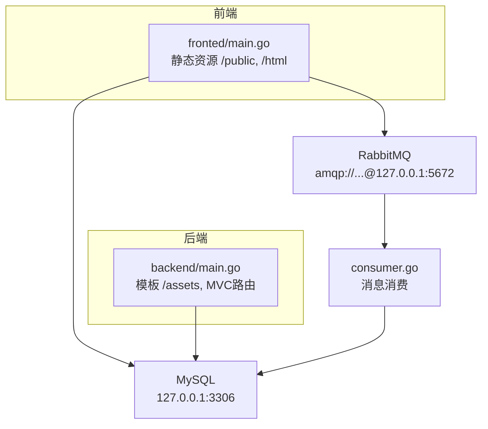
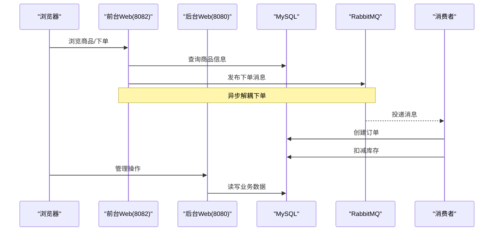
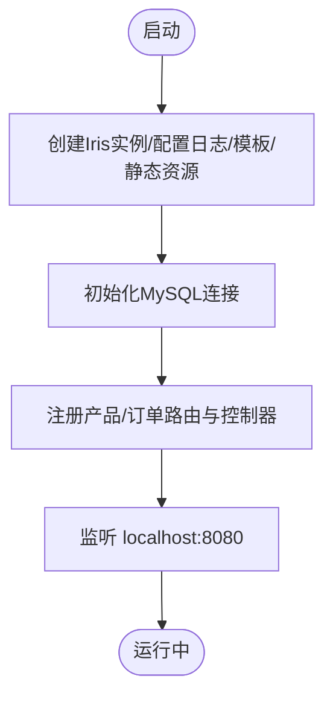
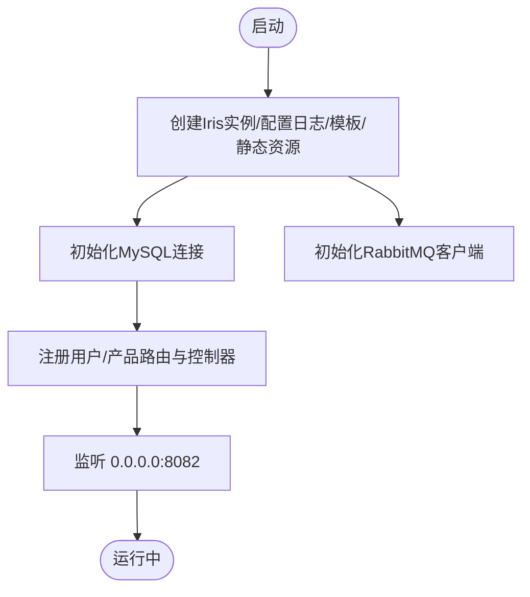
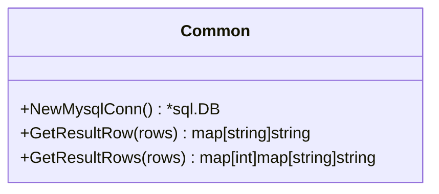
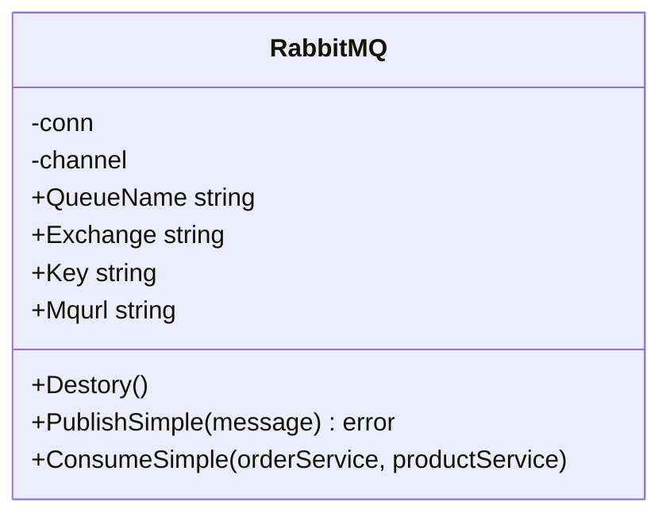
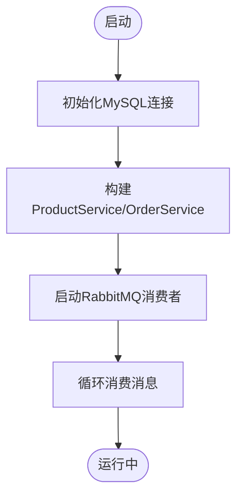
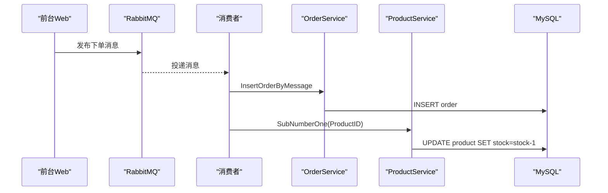
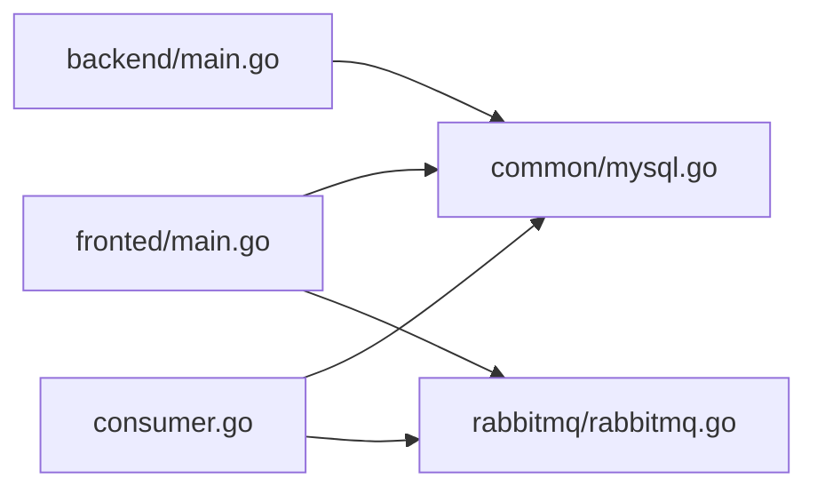

# 部署与运维

<cite>
**本文引用的文件**   
- [README.md](file://README.md)
- [backend/main.go](file://backend/main.go)
- [fronted/main.go](file://fronted/main.go)
- [common/mysql.go](file://common/mysql.go)
- [rabbitmq/rabbitmq.go](file://rabbitmq/rabbitmq.go)
- [consumer.go](file://consumer.go)
- [datamodels/order.go](file://datamodels/order.go)
- [services/order_service.go](file://services/order_service.go)
- [repositories/order_repository.go](file://repositories/order_repository.go)
</cite>

## 目录
1. [引言](#引言)
2. [项目结构](#项目结构)
3. [核心组件](#核心组件)
4. [架构总览](#架构总览)
5. [详细组件分析](#详细组件分析)
6. [依赖关系分析](#依赖关系分析)
7. [性能考虑](#性能考虑)
8. [故障排查指南](#故障排查指南)
9. [结论](#结论)
10. [附录：生产部署清单与自动化示例](#附录生产部署清单与自动化示例)

## 引言
本指南面向生产环境的部署与运维，覆盖服务器环境准备、应用打包、服务部署、域名配置、监控与日志、性能调优、备份恢复与灾难恢复、常见问题排查以及自动化部署与CI/CD流水线。项目为电商高并发场景，包含前后端两个Web服务（基于Iris）、MySQL数据库、RabbitMQ消息队列及消费者进程。

## 项目结构
仓库采用多模块组织：
- backend：后台管理Web服务（端口默认8080）
- fronted：前台展示Web服务（端口默认8082）
- common：通用工具（如MySQL连接）
- rabbitmq：消息队列客户端封装
- consumer：独立的消息消费者进程
- datamodels/services/repositories：数据模型、业务服务与数据访问层
- README：项目简介

图表来源
- [fronted/main.go:16-66](file://fronted/main.go#L16-L66)
- [backend/main.go:14-59](file://backend/main.go#L14-L59)
- [common/mysql.go:9-12](file://common/mysql.go#L9-L12)
- [rabbitmq/rabbitmq.go:14-35](file://rabbitmq/rabbitmq.go#L14-L35)
- [consumer.go:11-27](file://consumer.go#L11-L27)

章节来源
- [README.md:1-3](file://README.md#L1-L3)
- [fronted/main.go:16-66](file://fronted/main.go#L16-L66)
- [backend/main.go:14-59](file://backend/main.go#L14-L59)

## 核心组件
- Web服务
  - 后台服务：注册视图、静态资源、错误页、MVC控制器（产品、订单），监听localhost:8080
  - 前台服务：注册视图、静态资源、错误页、用户与产品控制器，监听0.0.0.0:8082
- 数据访问
  - MySQL连接初始化，提供行/列结果解析工具
- 消息队列
  - RabbitMQ简单模式封装：生产者发送消息到队列，消费者拉取并处理订单与库存扣减
- 消费者进程
  - 独立进程订阅队列，调用订单与产品服务完成下单与库存更新

章节来源
- [backend/main.go:14-59](file://backend/main.go#L14-L59)
- [fronted/main.go:16-66](file://fronted/main.go#L16-L66)
- [common/mysql.go:9-12](file://common/mysql.go#L9-L12)
- [rabbitmq/rabbitmq.go:52-101](file://rabbitmq/rabbitmq.go#L52-L101)
- [consumer.go:11-27](file://consumer.go#L11-L27)

## 架构总览
系统由前台Web、后台Web、MySQL、RabbitMQ与消费者组成。前台负责用户交互与页面渲染，后台提供管理接口；两者均直连MySQL；下单流程通过RabbitMQ异步解耦，消费者负责持久化订单与扣减库存。

图表来源
- [fronted/main.go:48-59](file://fronted/main.go#L48-L59)
- [rabbitmq/rabbitmq.go:67-101](file://rabbitmq/rabbitmq.go#L67-L101)
- [rabbitmq/rabbitmq.go:103-181](file://rabbitmq/rabbitmq.go#L103-L181)
- [consumer.go:11-27](file://consumer.go#L11-L27)
- [backend/main.go:38-51](file://backend/main.go#L38-L51)

## 详细组件分析

### 后台Web服务（backend）
- 启动与配置
  - 使用Iris框架，设置日志级别、HTML模板、静态资源路径、全局错误处理
  - 初始化MySQL连接，注册产品与订单的Service与Controller
  - 监听地址为localhost:8080
- 关键职责
  - 提供后台管理页面与API
  - 通过MVC模式组织控制器与服务

图表来源
- [backend/main.go:14-59](file://backend/main.go#L14-L59)

章节来源
- [backend/main.go:14-59](file://backend/main.go#L14-L59)

### 前台Web服务（fronted）
- 启动与配置
  - 使用Iris框架，设置日志级别、HTML模板、静态资源路径、全局错误处理
  - 初始化MySQL连接，注册用户与产品相关路由，启用认证中间件
  - 初始化RabbitMQ客户端，用于下单时发送消息
  - 监听地址为0.0.0.0:8082
- 关键职责
  - 对外暴露用户与商品页面
  - 将下单请求异步发送到RabbitMQ

图表来源
- [fronted/main.go:16-66](file://fronted/main.go#L16-L66)

章节来源
- [fronted/main.go:16-66](file://fronted/main.go#L16-L66)

### 数据库连接与工具（common）
- MySQL连接
  - 提供NewMysqlConn函数，默认连接本地MySQL
- 结果解析
  - GetResultRow/GetResultRows将sql.Rows转换为map结构，便于动态映射

图表来源
- [common/mysql.go:9-12](file://common/mysql.go#L9-L12)
- [common/mysql.go:15-66](file://common/mysql.go#L15-L66)

章节来源
- [common/mysql.go:9-66](file://common/mysql.go#L9-L66)

### 消息队列（rabbitmq）
- 连接与通道
  - 定义RabbitMQ结构体，维护connection/channel、队列名、交换机、Key等
  - NewRabbitMQSimple建立连接与channel
- 生产者
  - PublishSimple声明队列并发布消息
- 消费者
  - ConsumeSimple声明队列、设置QoS、消费消息、手动Ack
  - 在消费逻辑中调用OrderService插入订单、ProductService扣减库存

图表来源
- [rabbitmq/rabbitmq.go:14-35](file://rabbitmq/rabbitmq.go#L14-L35)
- [rabbitmq/rabbitmq.go:52-65](file://rabbitmq/rabbitmq.go#L52-L65)
- [rabbitmq/rabbitmq.go:67-101](file://rabbitmq/rabbitmq.go#L67-L101)
- [rabbitmq/rabbitmq.go:103-181](file://rabbitmq/rabbitmq.go#L103-L181)

章节来源
- [rabbitmq/rabbitmq.go:14-181](file://rabbitmq/rabbitmq.go#L14-L181)

### 消费者进程（consumer）
- 功能
  - 初始化MySQL连接
  - 构造ProductService与OrderService
  - 启动RabbitMQ消费者，持续消费消息并执行业务逻辑

图表来源
- [consumer.go:11-27](file://consumer.go#L11-L27)

章节来源
- [consumer.go:11-27](file://consumer.go#L11-L27)

### 订单数据流（下单链路）
- 前台发起下单，发布消息到RabbitMQ
- 消费者接收消息，调用OrderService插入订单，调用ProductService扣减库存
- 订单状态设置为成功

图表来源
- [rabbitmq/rabbitmq.go:152-175](file://rabbitmq/rabbitmq.go#L152-L175)
- [services/order_service.go:51-58](file://services/order_service.go#L51-L58)
- [datamodels/order.go:3-14](file://datamodels/order.go#L3-L14)

章节来源
- [rabbitmq/rabbitmq.go:152-175](file://rabbitmq/rabbitmq.go#L152-L175)
- [services/order_service.go:51-58](file://services/order_service.go#L51-L58)
- [datamodels/order.go:3-14](file://datamodels/order.go#L3-L14)

## 依赖关系分析
- 服务间耦合
  - 前台与后台均依赖MySQL
  - 前台依赖RabbitMQ进行下单
  - 消费者依赖OrderService与ProductService
- 外部依赖
  - Iris框架、Go SQL驱动、RabbitMQ AMQP库

图表来源
- [fronted/main.go:34-59](file://fronted/main.go#L34-L59)
- [backend/main.go:30-51](file://backend/main.go#L30-L51)
- [consumer.go:11-27](file://consumer.go#L11-L27)
- [common/mysql.go:9-12](file://common/mysql.go#L9-L12)
- [rabbitmq/rabbitmq.go:52-65](file://rabbitmq/rabbitmq.go#L52-L65)

章节来源
- [fronted/main.go:34-59](file://fronted/main.go#L34-L59)
- [backend/main.go:30-51](file://backend/main.go#L30-L51)
- [consumer.go:11-27](file://consumer.go#L11-L27)
- [common/mysql.go:9-12](file://common/mysql.go#L9-L12)
- [rabbitmq/rabbitmq.go:52-65](file://rabbitmq/rabbitmq.go#L52-L65)

## 性能考虑
- 数据库优化
  - 合理索引：对高频查询字段（如productID、userID）建立索引
  - 连接池参数：根据并发调整MaxOpenConns、MaxIdleConns、ConnMaxLifetime
  - 慢查询分析：开启慢查询日志，定期优化SQL
- 缓存策略
  - 热点商品缓存：引入Redis缓存商品详情与库存快照，降低DB压力
  - 读多写少场景：使用缓存+失效策略（TTL或事件通知）
- CDN配置
  - 静态资源（CSS/JS/图片）上CDN，减少源站带宽与延迟
  - 配合浏览器缓存头与版本化文件名提升命中率
- 队列与消费者
  - 消费者水平扩展：多实例消费同一队列，提高吞吐
  - QoS与批量处理：根据业务特性调整预取数量与批处理大小
- Web服务
  - 启用Gzip压缩、Keep-Alive
  - 分离静态资源与动态请求，反向代理静态内容

[本节为通用建议，不直接分析具体文件]

## 故障排查指南
- 服务无法启动
  - 检查端口占用（8080/8082）与防火墙规则
  - 确认MySQL/RabbitMQ可达性与凭据正确
- 数据库连接失败
  - 核对host/port/用户名/密码/数据库名
  - 检查MySQL权限与网络连通性
- 消息未消费
  - 确认RabbitMQ连接与队列存在
  - 查看消费者日志与Ack机制是否生效
  - 检查业务逻辑异常导致消费中断
- 下单后库存未扣减
  - 检查消费者是否正常运行
  - 验证ProductService扣减逻辑与事务一致性
- 页面报错
  - 查看Iris日志级别与OnAnyErrorCode返回的错误页信息
  - 检查模板路径与静态资源路径是否正确

章节来源
- [backend/main.go:18-29](file://backend/main.go#L18-L29)
- [fronted/main.go:20-33](file://fronted/main.go#L20-L33)
- [common/mysql.go:9-12](file://common/mysql.go#L9-L12)
- [rabbitmq/rabbitmq.go:44-50](file://rabbitmq/rabbitmq.go#L44-L50)
- [rabbitmq/rabbitmq.go:152-175](file://rabbitmq/rabbitmq.go#L152-L175)

## 结论
本项目采用前后端分离、异步解耦的电商架构。生产部署需重点关注数据库连接、消息队列连通性、消费者稳定性与可观测性。通过合理的缓存、CDN与队列扩缩容策略，可有效提升系统吞吐与可用性。

[本节为总结性内容，不直接分析具体文件]

## 附录：生产部署清单与自动化示例

### 服务器环境准备
- 操作系统：Linux发行版（推荐Ubuntu/CentOS）
- 运行时：Go编译产物（二进制）
- 依赖服务：
  - MySQL：安装并创建数据库imooc，授权账号root/imooc
  - RabbitMQ：安装并创建虚拟主机/用户/权限，确保AMQP端口开放
- 安全组/防火墙：放行80/443（反向代理）、8080（可选内网）、8082（可选内网）、3306（仅内网）、5672（仅内网）

### 应用打包
- 后端与前台分别编译为独立二进制
- 静态资源与模板随二进制一起部署或通过反向代理指向静态目录

### 服务部署
- 后台服务
  - 监听地址：localhost:8080
  - 模板目录：./backend/web/views
  - 静态资源：/assets -> ./backend/web/assets
- 前台服务
  - 监听地址：0.0.0.0:8082
  - 模板目录：./fronted/web/views
  - 静态资源：/public -> ./fronted/web/public，/html -> ./fronted/web/htmlProductShow
- 消费者进程
  - 独立进程，连接RabbitMQ与MySQL，持续消费消息

章节来源
- [backend/main.go:19-24](file://backend/main.go#L19-L24)
- [backend/main.go:54-59](file://backend/main.go#L54-L59)
- [fronted/main.go:22-27](file://fronted/main.go#L22-L27)
- [fronted/main.go:61-66](file://fronted/main.go#L61-L66)
- [consumer.go:11-27](file://consumer.go#L11-L27)

### 域名与反向代理
- 使用Nginx/Traefik作为反向代理
- 将域名解析至公网IP，配置HTTPS证书
- 将/api/*转发至后台服务（8080），将前端页面请求转发至前台服务（8082）
- 静态资源可直接由Nginx托管以提升性能

[本节为通用实践，不直接分析具体文件]

### 监控与日志收集
- 应用性能监控
  - 接入APM（如Prometheus+Grafana或商业方案），采集HTTP请求量、延迟、错误率
  - 暴露健康检查端点，供负载均衡与健康探针使用
- 错误日志收集
  - 统一输出结构化日志（JSON），集中收集至ELK/ Loki
  - 记录关键业务事件（下单、支付、库存变更）
- 业务指标统计
  - 统计订单量、转化率、库存水位、队列积压长度
  - 告警阈值：错误率、响应时间、队列堆积、消费者滞后

[本节为通用实践，不直接分析具体文件]

### 备份恢复与灾难恢复
- 数据库备份
  - 全量+增量备份策略，保留周期符合合规要求
  - 异地备份与加密存储
- 恢复演练
  - 定期演练恢复流程，验证RTO/RPO目标
- 灾难恢复
  - 多可用区部署，自动故障转移
  - 消息队列与数据库主从/集群高可用

[本节为通用实践，不直接分析具体文件]

### 自动化部署脚本与CI/CD流水线示例
- CI阶段
  - 代码提交触发构建
  - 单元测试与静态检查
  - 构建前后端二进制与镜像
- CD阶段
  - 灰度发布/蓝绿部署
  - 滚动重启服务与消费者
  - 回滚策略与自动回滚
- 示例要点
  - 环境变量注入（数据库、RabbitMQ连接串）
  - 健康检查与就绪探针
  - 资源限制与弹性伸缩

[本节为通用实践，不直接分析具体文件]