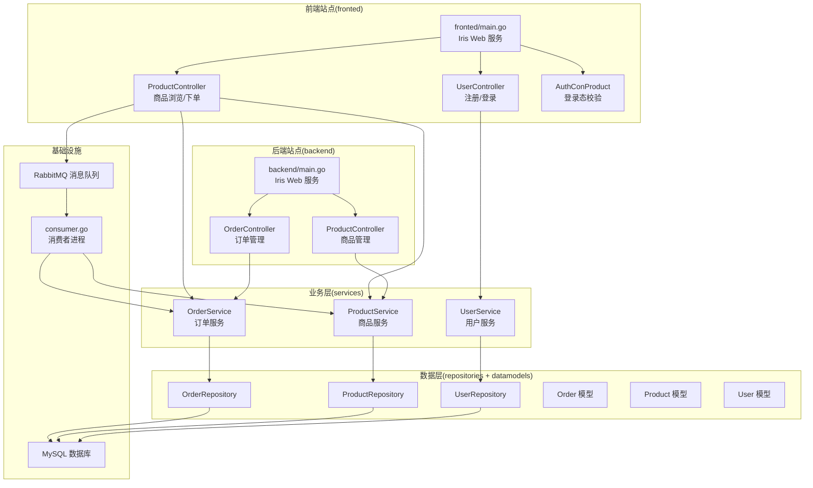
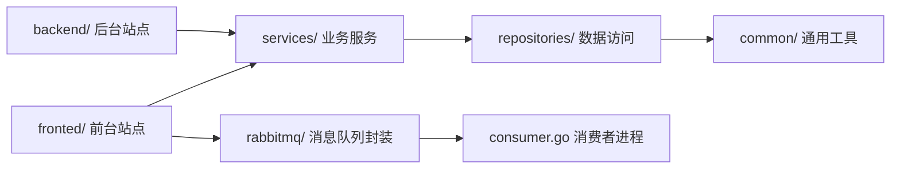
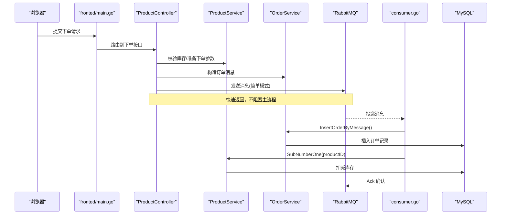
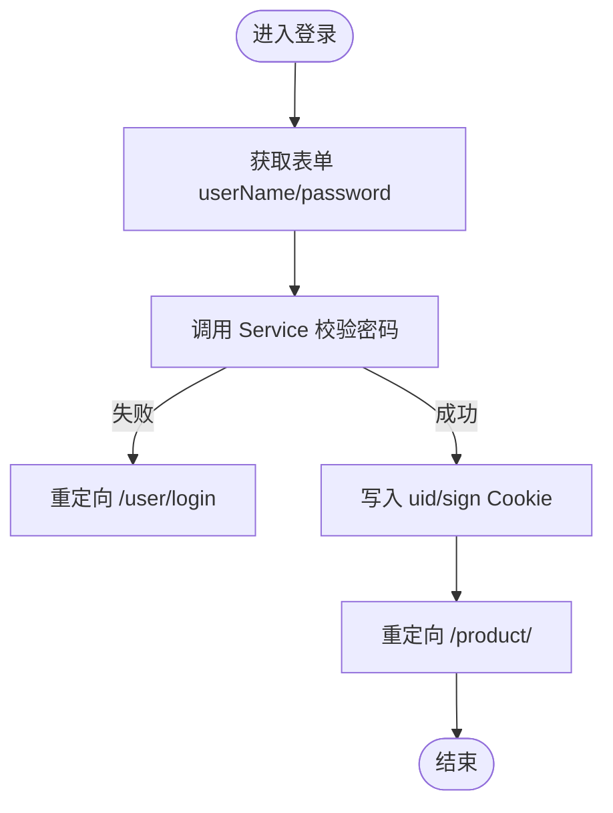
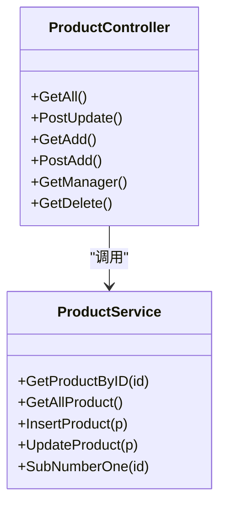
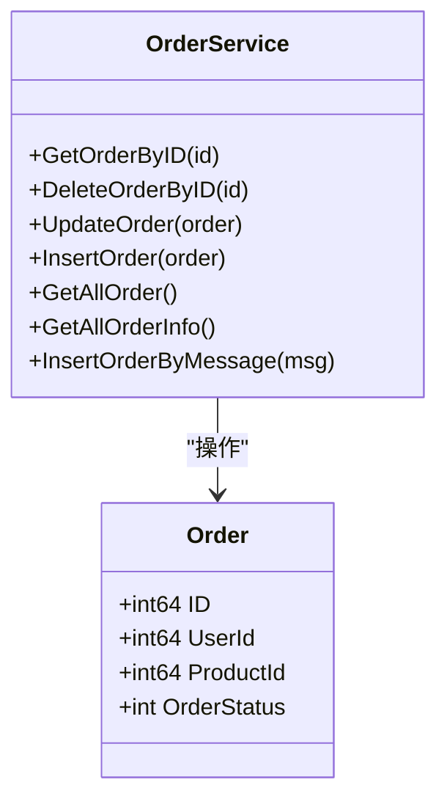
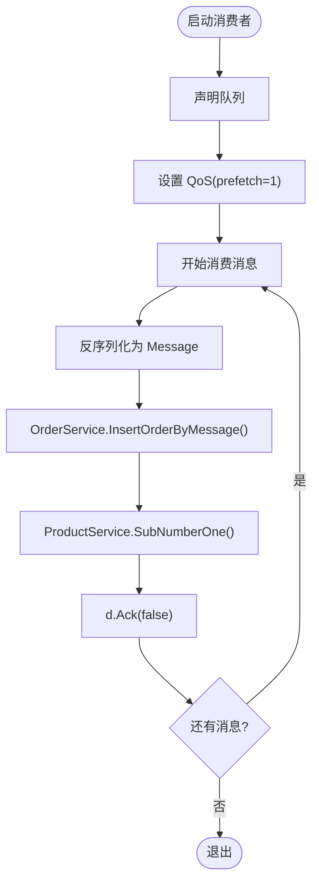
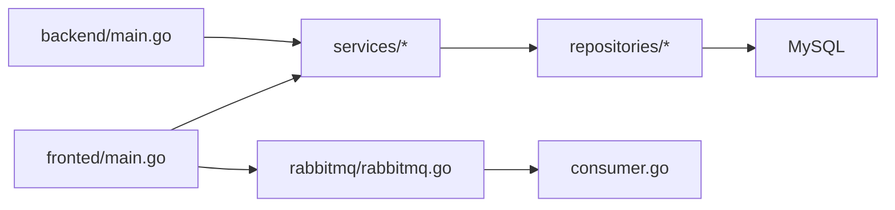

# 项目概述

<cite>
**本文引用的文件**   
- [README.md](file://README.md)
- [backend/main.go](file://backend/main.go)
- [fronted/main.go](file://fronted/main.go)
- [rabbitmq/rabbitmq.go](file://rabbitmq/rabbitmq.go)
- [consumer.go](file://consumer.go)
- [datamodels/order.go](file://datamodels/order.go)
- [datamodels/product.go](file://datamodels/product.go)
- [datamodels/user.go](file://datamodels/user.go)
- [services/order_service.go](file://services/order_service.go)
- [services/product_service.go](file://services/product_service.go)
- [backend/web/controllers/product_controller.go](file://backend/web/controllers/product_controller.go)
- [fronted/web/controllers/user_controller.go](file://fronted/web/controllers/user_controller.go)
- [fronted/middleware/auth.go](file://fronted/middleware/auth.go)
- [common/mysql.go](file://common/mysql.go)
</cite>

## 目录
1. [简介](#简介)
2. [项目结构](#项目结构)
3. [核心组件](#核心组件)
4. [架构总览](#架构总览)
5. [详细组件分析](#详细组件分析)
6. [依赖关系分析](#依赖关系分析)
7. [性能与高并发特性](#性能与高并发特性)
8. [故障排查指南](#故障排查指南)
9. [结论](#结论)

## 简介
本项目是一个面向电商场景的高并发全栈系统，采用前后端分离架构：前端站点与后端管理站点分别独立部署，通过统一的业务服务层访问数据库与消息队列。系统以 Go 语言实现，Web 框架选用 Iris（kataras/iris），数据持久化使用 MySQL，异步处理与削峰填谷通过 RabbitMQ 完成。主要业务模块包括用户管理、商品管理、订单系统与异步消息处理。

图表来源
- [fronted/main.go:16-66](file://fronted/main.go#L16-L66)
- [backend/main.go:14-59](file://backend/main.go#L14-L59)
- [rabbitmq/rabbitmq.go:18-31](file://rabbitmq/rabbitmq.go#L18-L31)
- [consumer.go:11-27](file://consumer.go#L11-L27)
- [services/order_service.go:8-16](file://services/order_service.go#L8-L16)
- [services/product_service.go:8-15](file://services/product_service.go#L8-L15)
- [datamodels/order.go:3-8](file://datamodels/order.go#L3-L8)
- [datamodels/product.go:3-9](file://datamodels/product.go#L3-L9)
- [datamodels/user.go:3-8](file://datamodels/user.go#L3-L8)

章节来源
- [README.md:1-3](file://README.md#L1-L3)

## 项目结构
仓库按“前后端分离 + 分层架构”组织：
- fronted：前台站点入口与控制器，提供用户注册登录、商品浏览与下单等能力，集成 RabbitMQ 生产者。
- backend：后台站点入口与控制器，提供商品管理与订单管理等能力。
- services：领域服务层，封装业务逻辑，调用 repositories 进行数据访问。
- repositories：数据访问层，封装对 MySQL 的 CRUD 操作。
- datamodels：数据模型定义（Order、Product、User）。
- rabbitmq：RabbitMQ 客户端封装，提供简单模式的生产与消费。
- consumer：独立的消费者进程，订阅队列并执行订单落库与库存扣减。
- common：通用工具（如 MySQL 连接、结果集解析等）。

图表来源
- [fronted/main.go:16-66](file://fronted/main.go#L16-L66)
- [backend/main.go:14-59](file://backend/main.go#L14-L59)
- [rabbitmq/rabbitmq.go:18-31](file://rabbitmq/rabbitmq.go#L18-L31)
- [consumer.go:11-27](file://consumer.go#L11-L27)

章节来源
- [fronted/main.go:16-66](file://fronted/main.go#L16-L66)
- [backend/main.go:14-59](file://backend/main.go#L14-L59)

## 核心组件
- 用户管理：负责用户注册、登录与会话标识写入 Cookie，配合中间件完成鉴权。
- 商品管理：提供商品的增删改查与库存扣减能力。
- 订单系统：支持订单创建、查询、更新与删除；同时支持从消息中创建订单。
- 异步消息处理：基于 RabbitMQ 的简单模式，生产者在下单时发送消息，消费者异步落库并扣减库存。

章节来源
- [fronted/web/controllers/user_controller.go:17-88](file://fronted/web/controllers/user_controller.go#L17-L88)
- [backend/web/controllers/product_controller.go:12-95](file://backend/web/controllers/product_controller.go#L12-L95)
- [services/order_service.go:8-64](file://services/order_service.go#L8-L64)
- [services/product_service.go:8-48](file://services/product_service.go#L8-L48)
- [rabbitmq/rabbitmq.go:18-182](file://rabbitmq/rabbitmq.go#L18-L182)

## 架构总览
系统采用前后端分离的双站点架构，共享同一套业务服务与数据模型，并通过 RabbitMQ 解耦下单流程中的写热点（订单落库与库存扣减）。

图表来源
- [fronted/main.go:48-59](file://fronted/main.go#L48-L59)
- [rabbitmq/rabbitmq.go:67-101](file://rabbitmq/rabbitmq.go#L67-L101)
- [rabbitmq/rabbitmq.go:103-181](file://rabbitmq/rabbitmq.go#L103-L181)
- [consumer.go:11-27](file://consumer.go#L11-L27)
- [services/order_service.go:51-61](file://services/order_service.go#L51-L61)
- [services/product_service.go:46-48](file://services/product_service.go#L46-L48)

## 详细组件分析

### 用户管理模块
- 功能要点
  - 注册：接收表单字段，调用 UserService 新增用户。
  - 登录：校验用户名密码，成功后将用户 ID 写入 Cookie，并生成签名用于后续鉴权。
  - 鉴权：通过中间件 AuthConProduct 检查 Cookie 是否存在，未登录则重定向至登录页。
- 关键路径
  - 注册/登录控制器：[fronted/web/controllers/user_controller.go:23-88](file://fronted/web/controllers/user_controller.go#L23-L88)
  - 鉴权中间件：[fronted/middleware/auth.go:5-15](file://fronted/middleware/auth.go#L5-L15)

图表来源
- [fronted/web/controllers/user_controller.go:59-88](file://fronted/web/controllers/user_controller.go#L59-L88)

章节来源
- [fronted/web/controllers/user_controller.go:17-88](file://fronted/web/controllers/user_controller.go#L17-L88)
- [fronted/middleware/auth.go:5-15](file://fronted/middleware/auth.go#L5-L15)

### 商品管理模块
- 功能要点
  - 列表展示：获取全部商品并渲染视图。
  - 新增/编辑：解析表单数据，调用 ProductService 插入或更新。
  - 删除：根据 ID 删除商品。
  - 库存扣减：在下单后由消费者异步扣减库存。
- 关键路径
  - 后台商品控制器：[backend/web/controllers/product_controller.go:17-95](file://backend/web/controllers/product_controller.go#L17-L95)
  - 商品服务：[services/product_service.go:8-48](file://services/product_service.go#L8-L48)

图表来源
- [backend/web/controllers/product_controller.go:12-95](file://backend/web/controllers/product_controller.go#L12-L95)
- [services/product_service.go:8-48](file://services/product_service.go#L8-L48)

章节来源
- [backend/web/controllers/product_controller.go:12-95](file://backend/web/controllers/product_controller.go#L12-L95)
- [services/product_service.go:8-48](file://services/product_service.go#L8-L48)

### 订单系统模块
- 功能要点
  - 基础 CRUD：按 ID 查询、删除、更新、批量查询。
  - 消息驱动下单：从消息体构造 Order 并落库。
- 关键路径
  - 订单服务：[services/order_service.go:8-64](file://services/order_service.go#L8-L64)
  - 订单模型：[datamodels/order.go:3-14](file://datamodels/order.go#L3-L14)

图表来源
- [services/order_service.go:8-64](file://services/order_service.go#L8-L64)
- [datamodels/order.go:3-14](file://datamodels/order.go#L3-L14)

章节来源
- [services/order_service.go:8-64](file://services/order_service.go#L8-L64)
- [datamodels/order.go:3-14](file://datamodels/order.go#L3-L14)

### 异步消息处理（RabbitMQ）
- 功能要点
  - 生产者：在下单流程中向简单队列投递消息。
  - 消费者：独立进程消费消息，调用 OrderService 落库，再调用 ProductService 扣减库存，最后手动 ACK。
  - QoS 限流：设置 prefetch=1，避免消费者过载。
- 关键路径
  - 生产者封装：[rabbitmq/rabbitmq.go:67-101](file://rabbitmq/rabbitmq.go#L67-L101)
  - 消费者封装：[rabbitmq/rabbitmq.go:103-181](file://rabbitmq/rabbitmq.go#L103-L181)
  - 消费者进程：[consumer.go:11-27](file://consumer.go#L11-L27)

图表来源
- [rabbitmq/rabbitmq.go:103-181](file://rabbitmq/rabbitmq.go#L103-L181)
- [consumer.go:11-27](file://consumer.go#L11-L27)

章节来源
- [rabbitmq/rabbitmq.go:18-182](file://rabbitmq/rabbitmq.go#L18-L182)
- [consumer.go:11-27](file://consumer.go#L11-L27)

## 依赖关系分析
- 服务层依赖数据访问层，数据访问层依赖 MySQL 连接。
- 前端站点依赖业务服务与 RabbitMQ 生产者；后台站点依赖业务服务。
- 消费者进程依赖业务服务与 RabbitMQ 消费者封装。

图表来源
- [fronted/main.go:42-59](file://fronted/main.go#L42-L59)
- [backend/main.go:39-51](file://backend/main.go#L39-L51)
- [common/mysql.go:9-12](file://common/mysql.go#L9-L12)
- [rabbitmq/rabbitmq.go:18-31](file://rabbitmq/rabbitmq.go#L18-L31)
- [consumer.go:11-27](file://consumer.go#L11-L27)

章节来源
- [fronted/main.go:42-59](file://fronted/main.go#L42-L59)
- [backend/main.go:39-51](file://backend/main.go#L39-L51)
- [common/mysql.go:9-12](file://common/mysql.go#L9-L12)

## 性能与高并发特性
- 前后端分离：降低耦合，便于独立扩展与部署。
- 异步削峰：下单流程通过 RabbitMQ 将写热点（订单落库、库存扣减）异步化，提升吞吐与稳定性。
- 消费者限流：通过 QoS(prefetch=1) 控制单消费者并行度，避免内存与数据库压力突增。
- 模板与静态资源：Iris 内置模板引擎与静态资源托管，减少额外依赖。

[本节为通用指导，不涉及具体代码片段]

## 故障排查指南
- 无法连接数据库
  - 检查 MySQL 连接配置与网络连通性。
  - 参考连接初始化位置：[common/mysql.go:9-12](file://common/mysql.go#L9-L12)
- RabbitMQ 连接失败
  - 检查 MQURL 与认证信息是否正确。
  - 参考连接与错误处理：[rabbitmq/rabbitmq.go:33-65](file://rabbitmq/rabbitmq.go#L33-L65)
- 消费者未消费消息
  - 确认队列是否已声明且名称一致。
  - 检查消费者是否启动并监听队列。
  - 参考消费者流程：[rabbitmq/rabbitmq.go:103-181](file://rabbitmq/rabbitmq.go#L103-L181), [consumer.go:11-27](file://consumer.go#L11-L27)
- 登录状态异常
  - 检查 Cookie 是否写入成功以及中间件是否生效。
  - 参考登录与鉴权：[fronted/web/controllers/user_controller.go:59-88](file://fronted/web/controllers/user_controller.go#L59-L88), [fronted/middleware/auth.go:5-15](file://fronted/middleware/auth.go#L5-L15)

章节来源
- [common/mysql.go:9-12](file://common/mysql.go#L9-L12)
- [rabbitmq/rabbitmq.go:33-65](file://rabbitmq/rabbitmq.go#L33-L65)
- [rabbitmq/rabbitmq.go:103-181](file://rabbitmq/rabbitmq.go#L103-L181)
- [consumer.go:11-27](file://consumer.go#L11-L27)
- [fronted/web/controllers/user_controller.go:59-88](file://fronted/web/controllers/user_controller.go#L59-L88)
- [fronted/middleware/auth.go:5-15](file://fronted/middleware/auth.go#L5-L15)

## 结论
本项目以 Go + Iris 构建前后端分离的电商平台，通过 RabbitMQ 实现下单流程的异步化与削峰，结合 MySQL 作为持久化存储，形成清晰的分层架构。用户管理、商品管理与订单系统职责明确，消费者进程保障高并发下的稳定性与可扩展性。整体设计有助于快速迭代与水平扩展，适合在高并发电商场景中落地。