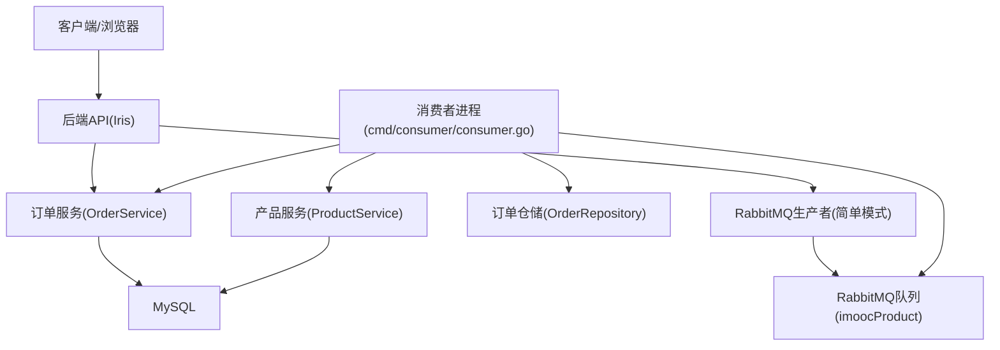
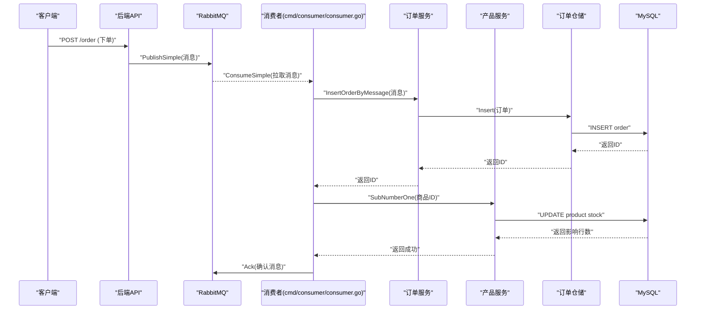
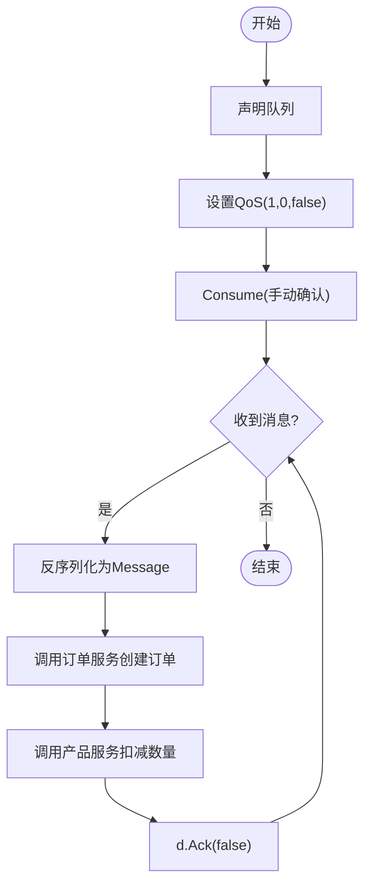
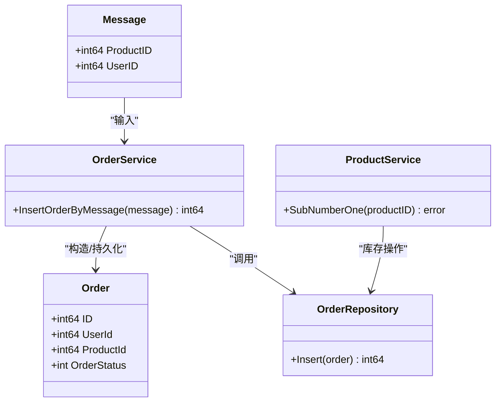
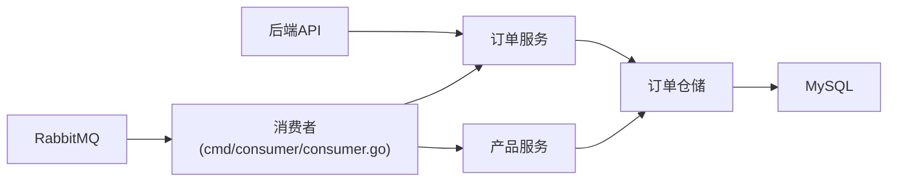

# 高并发处理

<cite>
**本文引用的文件**
- [rabbitmq/rabbitmq.go](file://rabbitmq/rabbitmq.go)
- [cmd/consumer/consumer.go](file://cmd/consumer/consumer.go)
- [backend/main.go](file://backend/main.go)
- [fronted/main.go](file://fronted/main.go)
- [cmd/productmain/productMain.go](file://cmd/productmain/productMain.go)
- [backend/web/controllers/order_controller.go](file://backend/web/controllers/order_controller.go)
- [services/order_service.go](file://services/order_service.go)
- [repositories/order_repository.go](file://repositories/order_repository.go)
- [datamodels/message.go](file://datamodels/message.go)
- [datamodels/order.go](file://datamodels/order.go)
- [common/mysql.go](file://common/mysql.go)
</cite>

## 更新摘要
**已完成的变更**
- 更新了消费者入口点路径引用，从 `consumer.go` 改为 `cmd/consumer/consumer.go`
- 更新了Iris框架静态文件服务方法的说明，确认使用 `HandleDir()` 而非 `StaticWeb()`
- 修正了相关代码示例和架构图中的文件路径引用

## 目录
1. [简介](#简介)
2. [项目结构](#项目结构)
3. [核心组件](#核心组件)
4. [架构总览](#架构总览)
5. [详细组件分析](#详细组件分析)
6. [依赖关系分析](#依赖关系分析)
7. [性能考虑](#性能考虑)
8. [故障恢复与可靠性](#故障恢复与可靠性)
9. [结论](#结论)
10. [附录：限流与防抖建议](#附录：限流与防抖建议)

## 简介
本仓库围绕电商场景的高并发处理，采用"Web服务 + RabbitMQ消息队列 + 异步消费者"的架构。订单创建请求进入后端服务后，通过RabbitMQ将下单事件投递到消息队列；独立的消费者进程订阅队列，完成订单落库与库存扣减等耗时操作，从而削峰填谷、提升吞吐并降低主链路延迟。本文档从系统架构、数据流、关键实现、性能优化、可靠性保障等方面展开说明，并提供可操作的改进建议。

## 项目结构
- Web服务（后端）：基于Iris框架提供HTTP接口，注册产品与订单控制器，初始化数据库连接与业务服务。
- 消息层：封装RabbitMQ连接、通道、队列声明、发布与消费流程。
- 领域模型：订单、消息体等数据结构定义。
- 仓储层：MySQL访问封装，包含订单相关CRUD。
- 服务层：订单服务聚合仓储能力，暴露业务方法。
- 消费者：独立进程，位于 `cmd/consumer/` 目录下，订阅RabbitMQ队列，执行订单入库与库存扣减。

图表来源
- [backend/main.go:14-59](file://backend/main.go#L14-L59)
- [cmd/consumer/consumer.go:11-27](file://cmd/consumer/consumer.go#L11-L27)
- [rabbitmq/rabbitmq.go:67-101](file://rabbitmq/rabbitmq.go#L67-L101)
- [services/order_service.go:18-24](file://services/order_service.go#L18-L24)
- [repositories/order_repository.go:20-27](file://repositories/order_repository.go#L20-L27)
- [common/mysql.go:8-12](file://common/mysql.go#L8-L12)

章节来源
- [backend/main.go:14-59](file://backend/main.go#L14-L59)
- [cmd/consumer/consumer.go:11-27](file://cmd/consumer/consumer.go#L11-L27)
- [rabbitmq/rabbitmq.go:18-36](file://rabbitmq/rabbitmq.go#L18-L36)

## 核心组件
- RabbitMQ封装：提供简单模式下的队列声明、消息发布与消费，支持手动确认与QoS限流。
- 订单服务：封装订单创建逻辑，包括从消息构造订单对象并持久化。
- 产品服务：封装商品库存管理逻辑，支持数量扣减等操作。
- 订单仓储：封装MySQL插入、查询等操作，使用预编译语句与结果集映射。
- 消费者：独立进程，位于 `cmd/consumer/consumer.go`，订阅队列，解析消息、调用订单服务与产品服务，完成业务处理并确认消息。
- Web服务：启动Iris应用，注册路由与控制器，注入服务与仓储实例，使用 `HandleDir()` 方法提供静态文件服务。

章节来源
- [rabbitmq/rabbitmq.go:67-182](file://rabbitmq/rabbitmq.go#L67-L182)
- [services/order_service.go:8-64](file://services/order_service.go#L8-L64)
- [cmd/consumer/consumer.go:11-27](file://cmd/consumer/consumer.go#L11-L27)
- [backend/main.go:14-59](file://backend/main.go#L14-L59)

## 架构总览
订单下单的高并发处理流程如下：
1. 客户端发起下单请求至后端API。
2. 后端服务将下单事件序列化为消息，通过RabbitMQ简单模式发布到指定队列。
3. 消费者进程（位于 `cmd/consumer/consumer.go`）持续订阅队列，按QoS限制逐条拉取消息。
4. 消费者解析消息，调用订单服务创建订单，并调用产品服务扣减商品数量。
5. 处理成功后向RabbitMQ发送ACK确认，保证消息不丢失。

图表来源
- [rabbitmq/rabbitmq.go:67-101](file://rabbitmq/rabbitmq.go#L67-L101)
- [rabbitmq/rabbitmq.go:103-182](file://rabbitmq/rabbitmq.go#L103-L182)
- [cmd/consumer/consumer.go:11-27](file://cmd/consumer/consumer.go#L11-L27)
- [services/order_service.go:51-61](file://services/order_service.go#L51-L61)
- [repositories/order_repository.go:43-60](file://repositories/order_repository.go#L43-L60)
- [common/mysql.go:8-12](file://common/mysql.go#L8-L12)

## 详细组件分析

### RabbitMQ集成（生产者与消费者）
- 生产者：
  - 使用简单模式，声明队列并发送消息，ContentType为纯文本。
  - 通过互斥锁保护并发写入，避免channel竞争。
- 消费者：
  - 位于 `cmd/consumer/consumer.go`，声明队列，设置QoS为每次仅推送一条未确认消息，防止背压。
  - 手动确认机制：处理成功才ACK，失败则不确认以便重试或死信。
  - 解析消息体为领域模型，调用订单服务与产品服务。
  - 使用协程处理消息流，阻塞等待退出信号。

图表来源
- [rabbitmq/rabbitmq.go:67-101](file://rabbitmq/rabbitmq.go#L67-L101)
- [rabbitmq/rabbitmq.go:103-182](file://rabbitmq/rabbitmq.go#L103-L182)
- [cmd/consumer/consumer.go:11-27](file://cmd/consumer/consumer.go#L11-L27)

章节来源
- [rabbitmq/rabbitmq.go:18-36](file://rabbitmq/rabbitmq.go#L18-L36)
- [rabbitmq/rabbitmq.go:67-101](file://rabbitmq/rabbitmq.go#L67-L101)
- [rabbitmq/rabbitmq.go:103-182](file://rabbitmq/rabbitmq.go#L103-L182)
- [cmd/consumer/consumer.go:11-27](file://cmd/consumer/consumer.go#L11-L27)

### 订单处理的异步化
- 入口：后端服务在订单创建时，将下单事件发送到RabbitMQ队列，快速响应客户端。
- 异步处理：消费者进程（`cmd/consumer/consumer.go`）解耦订单落库与库存扣减，提高吞吐并隔离热点资源。
- 数据模型：消息体包含用户ID与商品ID，用于构造订单对象。

图表来源
- [datamodels/message.go:4-12](file://datamodels/message.go#L4-L12)
- [datamodels/order.go:3-14](file://datamodels/order.go#L3-L14)
- [services/order_service.go:51-61](file://services/order_service.go#L51-L61)
- [cmd/consumer/consumer.go:11-27](file://cmd/consumer/consumer.go#L11-L27)

章节来源
- [datamodels/message.go:4-12](file://datamodels/message.go#L4-L12)
- [datamodels/order.go:3-14](file://datamodels/order.go#L3-L14)
- [services/order_service.go:51-61](file://services/order_service.go#L51-L61)
- [cmd/consumer/consumer.go:11-27](file://cmd/consumer/consumer.go#L11-L27)

### 库存扣减的并发控制
- 当前实现：消费者在处理消息时调用产品服务进行扣减，并通过QoS限制单条处理，避免瞬时过载。
- 并发风险：若同一商品被多订单同时扣减，需确保原子性与一致性。
- 建议方案：
  - 在仓储层对库存更新使用数据库行级锁或乐观锁（版本号）。
  - 引入分布式锁（如Redis SETNX）针对商品维度加锁，串行化同一商品的扣减。
  - 结合幂等键（订单ID）避免重复扣减。

章节来源
- [rabbitmq/rabbitmq.go:123-128](file://rabbitmq/rabbitmq.go#L123-L128)
- [rabbitmq/rabbitmq.go:167-171](file://rabbitmq/rabbitmq.go#L167-L171)
- [cmd/consumer/consumer.go:11-27](file://cmd/consumer/consumer.go#L11-L27)

### Iris框架静态文件服务配置
- 所有Web服务均使用 `HandleDir()` 方法提供静态文件服务，替代了旧的 `StaticWeb()` 方法。
- 后端服务：`app.HandleDir("/assets", "./backend/web/assets")`
- 前端服务：`app.HandleDir("/public", "./fronted/web/public")` 和 `app.HandleDir("/html", "./fronted/web/htmlProductShow")`
- 产品主服务：`app.HandleDir("/public", "./fronted/web/public")` 和 `app.HandleDir("/html", "./fronted/web/htmlProductShow")`

章节来源
- [backend/main.go:23](file://backend/main.go#L23)
- [fronted/main.go:25-27](file://fronted/main.go#L25-L27)
- [cmd/productmain/productMain.go:12-14](file://cmd/productmain/productMain.go#L12-L14)

### 限流与防抖机制
- 消费者限流：通过QoS(1,0,false)限制一次仅处理一条未确认消息，防止消费者过载。
- 生产端限流：可在发布前增加令牌桶或滑动窗口限流器，控制单位时间内的消息量。
- 防抖与去重：
  - 幂等性：以订单ID作为唯一键，仓储层检测重复提交。
  - 前端防抖：对重复点击进行节流，减少无效请求。
  - 中间件：在API层记录最近请求指纹，短时间忽略重复请求。

章节来源
- [rabbitmq/rabbitmq.go:123-128](file://rabbitmq/rabbitmq.go#L123-L128)

### 连接池管理
- MySQL连接池：使用sql.DB默认连接池，建议配置最大空闲连接数与最大连接数，匹配并发度与数据库容量。
- RabbitMQ连接：当前每个实例持有单一connection与channel，建议在多生产者/消费者场景下复用连接与通道，减少握手开销。

章节来源
- [common/mysql.go:8-12](file://common/mysql.go#L8-L12)
- [rabbitmq/rabbitmq.go:18-36](file://rabbitmq/rabbitmq.go#L18-L36)

### CPU利用率提升
- 消费者并行：在消费者内部维护固定数量的工作协程，从消息通道批量拉取并分发处理，平衡CPU与IO。
- 批处理：将多个订单合并为批次写入数据库，减少往返次数。
- 预热与缓存：热点商品信息可缓存至内存，降低数据库压力。

章节来源
- [rabbitmq/rabbitmq.go:150-176](file://rabbitmq/rabbitmq.go#L150-L176)

## 依赖关系分析
- Web服务依赖服务层，服务层依赖仓储层，仓储层依赖数据库。
- 消费者依赖服务层与仓储层，通过RabbitMQ与Web服务解耦。
- 消息体与订单模型贯穿服务与仓储，保证数据一致性。
- 消费者入口点位于 `cmd/consumer/consumer.go`，负责初始化所有依赖组件。

图表来源
- [backend/main.go:38-51](file://backend/main.go#L38-L51)
- [cmd/consumer/consumer.go:11-27](file://cmd/consumer/consumer.go#L11-L27)
- [services/order_service.go:18-24](file://services/order_service.go#L18-L24)
- [repositories/order_repository.go:20-27](file://repositories/order_repository.go#L20-L27)
- [rabbitmq/rabbitmq.go:103-182](file://rabbitmq/rabbitmq.go#L103-L182)

章节来源
- [backend/main.go:38-51](file://backend/main.go#L38-L51)
- [cmd/consumer/consumer.go:11-27](file://cmd/consumer/consumer.go#L11-L27)
- [services/order_service.go:18-24](file://services/order_service.go#L18-L24)
- [repositories/order_repository.go:20-27](file://repositories/order_repository.go#L20-L27)
- [rabbitmq/rabbitmq.go:103-182](file://rabbitmq/rabbitmq.go#L103-L182)

## 性能考虑
- 削峰填谷：通过RabbitMQ缓冲突发流量，消费者按自身处理能力消费。
- QoS与手动确认：避免消费者过载与消息丢失。
- 连接复用：复用数据库与RabbitMQ连接，减少握手与上下文切换。
- 批处理与索引：对高频查询建立合适索引，批量写入减少IO。
- 监控与告警：关注队列长度、消费延迟、错误率，及时扩容或调优。

[本节为通用指导，无需特定文件引用]

## 故障恢复与可靠性
- 消息可靠性：
  - 手动确认：仅在业务处理成功后ACK，失败不确认以便重试。
  - 队列持久化：当前队列非持久化，建议开启持久化以应对重启。
  - 交换器与绑定：当前使用简单模式，无路由键；如需复杂路由可扩展为Direct/Fanout/Topic。
- 幂等性：
  - 以订单ID为幂等键，仓储层检测重复插入。
- 重试与死信：
  - 对失败消息进行有限次重试，超过阈值转入死信队列人工处理。
- 连接异常：
  - 捕获连接错误并重试建立连接，避免单点故障。

章节来源
- [rabbitmq/rabbitmq.go:103-182](file://rabbitmq/rabbitmq.go#L103-L182)
- [repositories/order_repository.go:43-60](file://repositories/order_repository.go#L43-L60)

## 结论
本项目通过RabbitMQ实现了订单处理的异步化与解耦，利用QoS与手动确认提升稳定性与吞吐。消费者进程独立部署于 `cmd/consumer/consumer.go`，与Web服务完全解耦。为进一步支撑高并发，建议完善连接池配置、引入分布式锁与幂等机制、启用队列持久化与死信队列，并结合监控指标持续优化。

[本节为总结，无需特定文件引用]

## 附录：限流与防抖建议
- 生产端限流：在API层或消息发布前加入令牌桶/漏桶算法，限制单位时间内的消息量。
- 消费端限流：调整QoS参数与工作协程数量，匹配下游处理能力。
- 防抖与去重：
  - 前端对按钮点击进行节流，避免重复提交。
  - 后端记录请求指纹（IP+用户+商品），短时间忽略重复请求。
  - 仓储层基于订单ID实现幂等插入。

[本节为通用建议，无需特定文件引用]